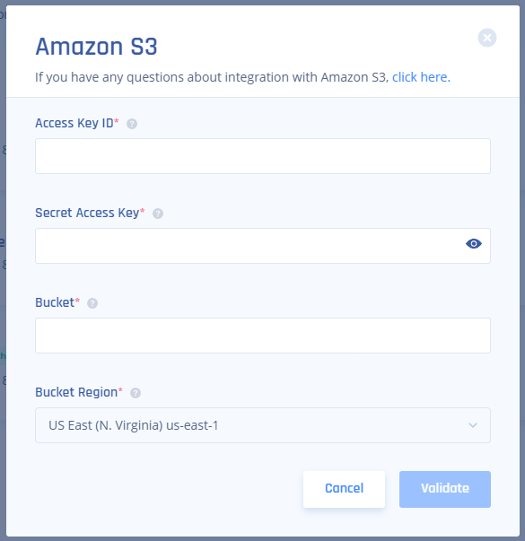

[Perimeter 81](https://www.perimeter81.com/?accountid=2597329217&utm_source=google&utm_medium=cpc&utm_campaign=17080259894&utm_adgroup=133966891657&utm_target=kwd-487070564061&utm_matchtype=p&utm_network=g&utm_device=c&utm_creative=595193427580&utm_term=perimeter%2081&utm_adposition=&utm_content&utm_placement&utm_campaigntype=performance&funnel=2&gclid=CjwKCAjw_MqgBhAGEiwAnYOAemn4WOvaCTFSvgBMGnG-EQBK-SN6i2fNy8hQbNbYol6n33KGGVuv4RoCtMoQAvD_BwE) is an Israeli cloud and network security company that develops secure remote networks for organizations based on zero-trust architecture. Its technology replaces legacy security appliances like VPNs and firewalls.

Configure your Perimeter 81 data stream to an S3 bucket to have full visibility of your Perimeter 81 activity.

## Prerequisites

1\. AWS account with an S3 bucket for the Perimeter 81 logs destination

2\. AWS access with the ability to create and modify IAM resources

3\. Perimeter 81 account

## Deployment

**STEP 1**. In AWS, create a new IAM policy with the following permissions:

```
{
    "Version": "2012-10-17",
    "Statement": [
        {
            "Effect": "Allow",
            "Action": [
               "s3:ListBucket",
               "s3:GetBucketLocation",
               "s3:PutObject",
               "s3:GetObject",
               "s3:DeleteObject"
            ],
            "Resource": [
              "arn:aws:s3:::<your_bucket_name>", 
              "arn:aws:s3:::<your_bucket_name>/*"
            ]
        }
    ]
}
```

**STEP 2**. Create an IAM user with programmatic access and attach the policy created in **STEP 1**.

**STEP 3**. In the Perimeter 81 platform, navigate to **Settings > Integrations**.

- Add a SIEM integration for S3.

- Paste the **Access Key**, **Secret Access** Key, and **Bucket** name.

- Click **Validate**.



**STEP 4**. After the logs reach your S3 bucket, follow [these instructions](https://coralogixstg.wpengine.com/docs/data-collection-s3/) for AWS S3 Lambda log collection. Once the deployment is complete, every new gzipped log file placed in the Lambda is sent to Coralogix.

# **Support**

**Need help?**

Our world-class customer success team is available 24/7 to walk you through your setup and answer any questions that may come up.

Feel free to reach out to us **via our in-app chat** or by sending us an email at **[support@coralogixstg.wpengine.com](mailto:support@coralogixstg.wpengine.com)**.
