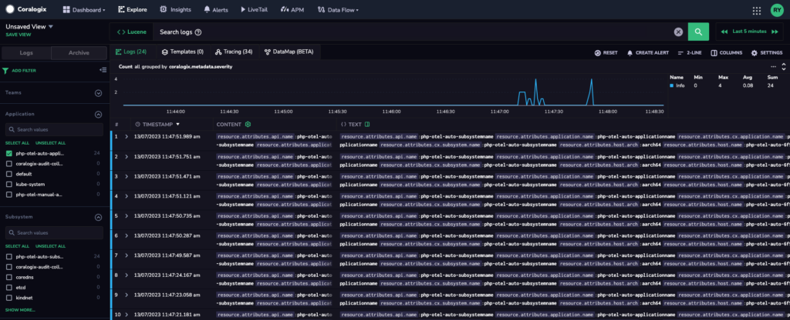
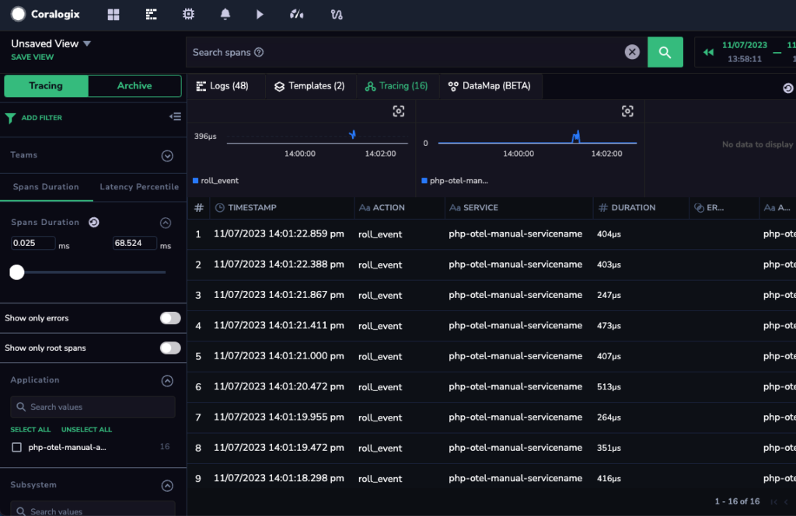
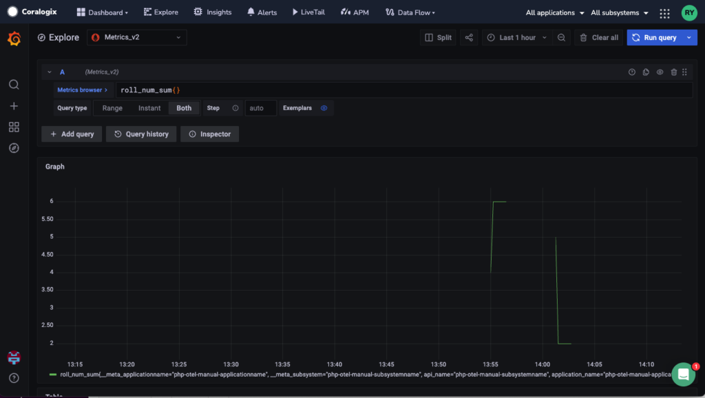
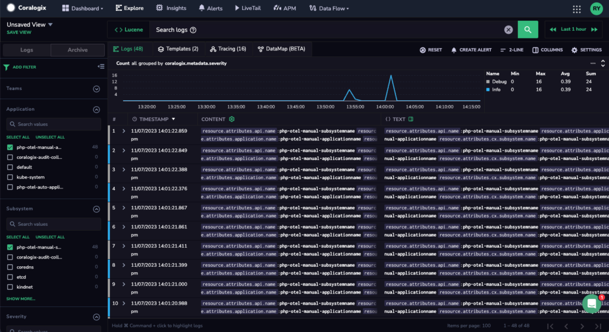

This tutorial demonstrates how to instrument PHP applications to capture logs, metrics, and traces using [OpenTelemetry](https://coralogixstg.wpengine.com/docs/opentelemetry/) and send them to Coralogix. It relies on a [Slim micro framework](https://www.slimframework.com/) application, but other web frameworks – such as WordPress, Symfony, or Laravel – can also be used.

Instrumentation can be accomplished automatically or manually. **Automatic instrumentation** is the most efficient way to add instrumentation to PHP applications, injecting bytecode via an agent to capture telemetry. **Manual instrumentation** involves adding observability code to an app yourself. While this is more labor intensive, it provides the most control over the SDK configuration.

## **Prerequisites**

- A Coralogix [account](https://signup.coralogixstg.wpengine.com/#/), set up on the Coralogix [domain](https://coralogixstg.wpengine.com/docs/coralogix-domain/) corresponding to the region where your data is stored

- PHP 8.0+ for auto-instrumentation, and at least PHP 7.4 for manual-instrumentation.

- [PECL](https://pecl.php.net/) - a repository for PHP Extensions.

- [Composer](https://getcomposer.org/) - a dependency manager for PHP packages.

## **Extension and Package Installation**

**STEP 1**. As the extension needs to be built from source, certain build tools are needed.

```shell
sudo apt-get install gcc make autoconf

```

**STEP 2**. Install the OpenTelemetry extension with `PECL`.

```shell
pecl install opentelemetry

```

**STEP 3**. Add the extension to your `php.ini` file (e.g. /etc/php.in).

```shell
[opentelemetry]
extension=opentelemetry.so

```

**STEP 4**. Verify that the extension is installed and enabled.

```shell
php --ri opentelemetry

```

**STEP 5**. Add the following packages to your application.

```shell
composer init \
  --no-interaction \
  --stability beta \
	--require slim/slim:"^4" \
  --require slim/psr7:"^1"
composer config allow-plugins.php-http/discovery false
composer update

```

**Notes**:

- If requested to “Do you trust "php-http/discovery" to execute code…”, select **No.**

## Send Data to Coralogix

Coralogix provides [OTLP endpoints](https://coralogixstg.wpengine.com/docs/coralogix-endpoints/) for various regions. Using the gRPC exporter can improve data transmission performance. Install the additional extensions via terminal.

**STEP 1**. Install gRPC.

```shell
pecl install grpc

```

**Notes:**

- Installing gRPC make take several minutes, as the extension builds from source.

**STEP 2**. Add the following extension to your `php.ini` file (e.g. /etc/php.in).

```shell
[grpc]
extension=grpc.so

```

**Notes:**

- gRPC is a code generator for a remote procedure call (RPC) framework.

**STEP 3**. Install the following packages.

```shell
composer require \
  open-telemetry/transport-grpc \
  open-telemetry/exporter-otlp \
  php-http/guzzle7-adapter

```

## Automatic Instrumentation

Out of the box, zero-code instrumentation injects an OpenTelemetry PHP agent into the application and generates traces\*\*.\*\*

**STEP 1.** Install Slim framework’s auto-instrumentation library.

```shell
composer require \
	open-telemetry/sdk \
  open-telemetry/opentelemetry-auto-slim

```

**Notes**:

- `open-telemetry/sdk` provides an implementation of the OpenTelemetry API, and can be set up and configured in a number of ways.

- `open-telemetry/opentelemetry-auto-slim` is required to auto-instrument the [Slim micro framework](https://www.slimframework.com/).

**STEP 2**. The dependencies should be described in the `composer.json` file as shown below.

```php
{
    "require": {
        "slim/slim": "^4",
        "slim/psr7": "^1",
				"open-telemetry/transport-grpc": "^1.0",
        "open-telemetry/exporter-otlp": "^1.0",
        "php-http/guzzle7-adapter": "^1.0"
				"open-telemetry/sdk": "^1.0"
				"open-telemetry/opentelemetry-auto-slim": "^1.0@beta",
    },
    "minimum-stability": "beta",
    "config": {
        "allow-plugins": {
            "php-http/discovery": false
        }
    }
}

```

**Notes:**

- To enable automatic instrumentation of other popular PHP frameworks, you need to install the respective "auto" packages via `composer`:
    - Laravel Framework - [Contrib Repo](https://github.com/open-telemetry/opentelemetry-php-contrib/tree/main/src/Instrumentation/Laravel) `composer require open-telemetry/opentelemetry-auto-laravel`
    
    - Symfony Framework - [Contrib Repo](https://github.com/open-telemetry/opentelemetry-php-contrib/tree/main/src/Instrumentation/Symfony) `composer require open-telemetry/opentelemetry-auto-symfony`
    
    - Wordpress Framework - [Contrib Repo](https://github.com/open-telemetry/opentelemetry-php-contrib/tree/main/src/Instrumentation/Wordpress) `composer require open-telemetry/opentelemetry-auto-wordpress`

- For more information about the various PHP library instrumentations, refer to the [OpenTelemetry PHP Registry](https://opentelemetry.io/ecosystem/registry/?component=instrumentation&language=php).

**STEP 3.** Once you have installed the necessary extensions and packages, configure the instrumentation as environment variables to enable it. This follows the [OpenTelemetry SDK Environment Variable Specification](https://opentelemetry.io/docs/specs/otel/configuration/sdk-environment-variables/).

```shell
export OTEL_PHP_AUTOLOAD_ENABLED=true
export OTEL_TRACES_EXPORTER=otlp
export OTEL_METRICS_EXPORTER=none
export OTEL_LOGS_EXPORTER=none
export OTEL_EXPORTER_OTLP_PROTOCOL=grpc
export OTEL_EXPORTER_OTLP_ENDPOINT="https://<coralogix_otel_endpoint>"
export OTEL_EXPORTER_OTLP_HEADERS="Authorization=Bearer <CXPrivateKey>"
export OTEL_RESOURCE_ATTRIBUTES=service.name=<ServiceName>,application.name=<CXApplicationName>,api.name=<CXSubsystemName>,cx.application.name=<CXApplicationName>,cx.subsystem.name=<CXSubsystemName>

```

- `OTEL_PHP_AUTOLOAD_ENABLED`: For OpenTelemetry PHP, set to `true` to enable automatic instrumentation and globally register the SDK.

- `OTEL_TRACES_EXPORTER`: As auto-instrumentation currently works on traces only, set the traces exporter to `otlp` to send it.

- `OTEL_EXPORTER_OTLP_ENDPOINT`: Select the [OpenTelemetry Endpoint](https://coralogixstg.wpengine.com/docs/coralogix-endpoints/) associated with your Coralogix domain. Endpoint must have a protocol and fully qualified name (e.g. `https://ingress.coralogixstg.wpengine.com:443`).

- `OTEL_EXPORTER_OTLP_HEADERS`: Input your Coralogix [Send-Your-Data API key](https://coralogixstg.wpengine.com/docs/send-your-data-api-key/) in the Authorization header for authentication.

- `OTEL_RESOURCE_ATTRIBUTES`: Input the names of your [application](https://coralogixstg.wpengine.com/docs/application-and-subsystem-names/) and [subsystem](https://coralogixstg.wpengine.com/docs/application-and-subsystem-names/). The `service.name` is used to name your service. These will be added to resource attributes:
    - `service.name=<ServiceName>`
    
    - `application.name=<CXApplicationName>`
    
    - `api.name=<CXSubSystemName>`
    
    - `cx.application.name=<CXApplicationName>`
    
    - `cx.subsystem.name=<CXSubSystemName>`

**STEP 4**. Run the instrumentation.

The `index.php` script below is a simple demo of a dice roll. It does not contain any code from the OpenTelemetry SDK.

```php
<?php
use Psr\Http\Message\ResponseInterface as Response;
use Psr\Http\Message\ServerRequestInterface as Request;
use Slim\Factory\AppFactory;

require __DIR__ . '/vendor/autoload.php';

$app = AppFactory::create();

$app->get('/rolldice', function (Request $request, Response $response) {
    $result = random_int(1,6);
    $response->getBody()->write(strval($result));
    return $response;
});

$app->run();

```

**STEP 5**. Open a terminal window and run the instrumentation as a web server. Once the server is running, make HTTP calls to the application route using a browser or the `curl` command-line tool.

```bash
php -S localhost:8080
curl <http://localhost:8080/rolldice>

```

**STEP 6.** Explore your traces in the Coralogix app.

In your Coralogix dashboard, click **Explore** > **Tracing.** You should now see traces generated by your application.

**STEP 7.** To add logging capabilities, the instrumentation code needs to be configured with a logger such as `monolog`. To do this, add the required dependencies.

```shell
composer require \
  monolog/monolog \
  open-telemetry/opentelemetry-logger-monolog

```

**STEP 8**. Replace `index.php` script as follows. The command manually deploys the OpenTelemetry loggerProvider and attaches it to the OpenTelemetry Monolog Handler.

```php
<?php
use Monolog\Logger;
use OpenTelemetry\API\Common\Instrumentation\Globals;
use OpenTelemetry\Contrib\Logs\Monolog\Handler;
use Psr\Http\Message\ResponseInterface as Response;
use Psr\Http\Message\ServerRequestInterface as Request;
use Psr\Log\LogLevel;
use Slim\Factory\AppFactory;

require __DIR__ . '/vendor/autoload.php';

$loggerProvider = Globals::loggerProvider();
$handler = new Handler(
    $loggerProvider,
    LogLevel::INFO
);
$monolog = new Logger('otel-php-monolog', [$handler]);

$app = AppFactory::create();

$app->get('/rolldice', function (Request $request, Response $response) use ($monolog) {
    $result = random_int(1,6);
    $response->getBody()->write(strval($result));
    $monolog->info('dice rolled', ['result' => $result]);
    return $response;
});

$app->run();

```

**STEP 9**. To enable traces and logs, configure the environment variables and set the respective telemetry exporters to use the `otlp` protocol.

```shell
export OTEL_PHP_AUTOLOAD_ENABLED=true
export OTEL_TRACES_EXPORTER=otlp
export OTEL_METRICS_EXPORTER=none
export OTEL_LOGS_EXPORTER=otlp
export OTEL_EXPORTER_OTLP_PROTOCOL=grpc
export OTEL_EXPORTER_OTLP_ENDPOINT="https://<coralogix_otel_endpoint>"
export OTEL_EXPORTER_OTLP_HEADERS="Authorization=Bearer <CXPrivateKey>"
export OTEL_RESOURCE_ATTRIBUTES=service.name=<ServiceName>,application.name=<CXApplicationName>,api.name=<CXSubsystemName>,cx.application.name=<CXApplicationName>,cx.subsystem.name=<CXSubsystemName>

```

**STEP 10.** Start the built-in web server and call the "rolldice" route.

```shell
php -S localhost:8080
curl <http://localhost:8080/rolldice>

```

**STEP 11.** To view logs, click on the **Explore > Logs** tab. The generated logs will be displayed.



## Manual Instrumentation

By adding observability code to an application using the OpenTelemetry PHP SDK, you gain greater control over which telemetry to provision and send. This approach also enables you to integrate OpenTelemetry with popular PHP libraries available in the [community repository](https://github.com/opentelemetry-php).

### **Common Configuration**

Before creating the respective providers for each type of observability, configure the Instrumentation SDK as environment variables using system `export` commands or within the PHP code using `putenv`. Set all observability exporters to `none` initially until manual instrumentation for each type is completed.

```shell
export OTEL_EXPORTER_OTLP_ENDPOINT="<coralogix_otel_endpoint>"
export OTEL_TRACES_EXPORTER=none
export OTEL_METRICS_EXPORTER=none
export OTEL_LOGS_EXPORTER=none
export OTEL_EXPORTER_OTLP_PROTOCOL=grpc
export OTEL_EXPORTER_OTLP_HEADERS="Authorization=Bearer <CXPrivateKey>"
export OTEL_RESOURCE_ATTRIBUTES=service.name=<ServiceName>,application.name=<CXApplicationName>,api.name=<CXSubsystemName>,cx.application.name=<CXApplicationName>,cx.subsystem.name=<CXSubsystemName>

```

- Set all traces, metrics and logs (e.g. `OTEL_<OBSERVABILITY>_EXPORTER` ) to `none` first.

### Traces

**STEP 1:** Set the `otlp` exporter for traces

```shell
export OTEL_TRACES_EXPORTER=otlp

```

**STEP 2:** Replace the `index.php` script with the following code. This code manually creates spans with additional information that provides insights to the trace telemetry.

```php
<?php
use OpenTelemetry\SDK\Trace\TracerProviderFactory;
use Psr\Http\Message\ResponseInterface as Response;
use Psr\Http\\Message\ServerRequestInterface as Request;
use Psr\Log\LogLevel;
use Slim\Factory\AppFactory;

require __DIR__ . '/vendor/autoload.php';

//Initialize TraceProvider and Tracer
$tracerFactory = new TracerProviderFactory();
$tracerProvider = $tracerFactory->create();
$tracer = $tracerProvider->getTracer('demo_trace');

$app = AppFactory::create();

$app->get('/rolldice', function (Request $request, Response $response) use ($tracer) {
    //create spans
    $span = $tracer->spanBuilder("roll_event")->startSpan();    

    $result = random_int(1,6);
    $response->getBody()->write(strval($result));

    //set attributes and events to span
    $span->setAttribute("dice_roll", $result);
    $span->addEvent('rolled_event', [
        /key:value
				'roll_value' => $result,
    ]);

    //end span to send
    $span->end();
    return $response;
});

$app->run();

//shutdown providers 
$tracerProvider->shutdown();

```

**Notes:**

- The `TracerProviderFactory` class from the SDK provides a way to create the necessary `TracerProvider` by using system environment variables as the default.

- `getTracer()` creates instances of `$tracer` with a required name (and other attributes) to propagate [Context](https://opentelemetry.io/docs/instrumentation/php/propagation/) information about the system.

- You can add information to spans using `setAttribute` and `addEvent` to provide additional details to the trace. Span Attributes store specific operation properties, while Span Events can carry zero or more Span Attributes, which are themselves key:value maps.

- It is necessary to call `end()` at the end of a any code logic to ensure that it gets sent.

- It is important to call `shutdown()` at the end of the instrumentation to allow the `TracerProvider` to do any necessary cleanup and export telemetry.

**STEP 3:** To generate traces, run the PHP web-server in the directory. Once the server is running, make HTTP calls to the application route using a browser or the `curl` command-line tool.

```bash
php -S localhost:8080
curl <http://localhost:8080/rolldice>

```

**STEP 4:** To view the traces generated by your demo rolldice application, go to your Coralogix dashboard and click on **Explore > Traces**.



### Metrics

**STEP 1:** Set the `otlp` exporter for metrics.

```shell
export OTEL_METRICS_EXPORTER=otlp

```

**STEP 2:** Replace the `index.php` script with the following code to add meter and metrics instrument. Instrumenting metrics via the OpenTelemetry SDK.

```php
<?php
use OpenTelemetry\SDK\Metrics\MeterProviderFactory;
use Psr\Http\Message\ResponseInterface as Response;
use Psr\Http\Message\ServerRequestInterface as Request;
use Slim\Factory\AppFactory;

require __DIR__ . '/vendor/autoload.php';

//Initialize Meters
$meterFactory = new MeterProviderFactory();
$meterProvider = $meterFactory->create();
$meter = $meterProvider->getMeter('demo_meter');

//Initialise Histogram
$histogram = $meter->createHistogram('roll', 'num', 'The output of roll result');

$app = AppFactory::create();

$app->get('/rolldice', function (Request $request, Response $response) use ($histogram) {
    
    $result = random_int(1,6);
    $response->getBody()->write(strval($result));

    //add to the metric counter
    $histogram->record($result);

    return $response;
});

$app->run();

//shutdown providers
$meterProvider->shutdown();

```

- The `MeterProviderFactory` class in the SDK provides a way to create the necessary `MeterProvider` by using system environment variables as the default.

- Calling `getMeter()` creates instances of `$meter` with a required name, and other optional attributes such as `version` and `schema_url`, to define the instrumentation scope of emitted telemetry. Meters are identified by these fields, and are considered identical if **all** identifying fields are equal.

- To create a histogram instrument, use the `createHistogram` function. Other types of instruments can also be created; see [Meter Operations](https://opentelemetry.io/docs/specs/otel/metrics/api/#meter-operations) for details.

- Use `record()` to store data related to the meter instrument.

- Metrics are exported when either `forceFlush()` or `shutdown()` is called on the meter provider. It is important to call `shutdown()` at the end of the instrumentation to allow the `MeterProvider` to do any necessary cleanup and export telemetry.

**STEP 3:** To generate metrics, run the PHP web-server in the directory. Once the server is running, make HTTP calls to the application route using a browser or the `curl` command-line tool.

```bash
php -S localhost:8080
curl <http://localhost:8080/rolldice>

```

**STEP 4:** To view the metrics, access the [Grafana Dashboard](https://coralogixstg.wpengine.com/blog/getting-started-with-grafana-dashboards-using-coralogix/) on Coralogix. Click on **Explore**, then select “**roll\_num\_sum**” in the metrics browser. Next, use the **roll\_num\_sum{}** or any other relevant “**roll\_num**” metric and click on **Run query**.



### Logs

**STEP 1:** Set the `otlp` exporter for logs.

```shell
export OTEL_LOGS_EXPORTER=otlp

```

**STEP 2:** Install the following packages:

As logging is a mature and well-established function, OpenTelemetry's Logger approach is not intended to be used directly but rather to be integrated into existing loggers, such as Monolog.

```shell
composer require \
  monolog/monolog \
  open-telemetry/opentelemetry-logger-monolog

```

- The Monolog package and OpenTelemetry's logger integration with Monolog are required.

- The [OpenTelemetry handler](https://github.com/opentelemetry-php/contrib-logger-monolog), configured with an OpenTelemetry `LoggerProvider`, is used to send Monolog `LogRecord`s to OpenTelemetry.

**STEP 3:** Add logs via Monolog:

Replace the `index.php` script with the following code.

```php
<?php
use Monolog\Logger;
use OpenTelemetry\Contrib\Logs\Monolog\Handler as MonologHandler;
use OpenTelemetry\SDK\Logs\LoggerProviderFactory;

use Psr\Http\Message\ResponseInterface as Response;
use Psr\Http\Message\ServerRequestInterface as Request;
use Psr\Log\LogLevel;
use Slim\Factory\AppFactory;

require __DIR__ . '/vendor/autoload.php';

//Initialize Logger
$loggerFactory = new LoggerProviderFactory();
$loggerProvider = $loggerFactory->create();
$handler = new MonologHandler(
    $loggerProvider,
    LogLevel::DEBUG,
);

//Initialize Monolog
$monolog = new Logger('logger', [$handler]);
$monolog->info('hello world');

$app = AppFactory::create();

$app->get('/rolldice', function (Request $request, Response $response) use ($monolog) {
    
    $result = random_int(1,6);
    $response->getBody()->write(strval($result));

    //log results
    $monolog->debug('result rolled ' . strval($result));

    return $response;
});

$app->run();

//shutdown providers
$loggerProvider->shutdown();

```

- The `LoggerProviderFactory` class in the SDK provides a way to create the necessary `LoggerProvider` by using system environment variables as the default.

- Thus `MonologHandler` is configured with the OpenTelemetry `LoggerProvider` to send log records from Monolog to OpenTelemetry by setting as the default handler for `$monolog`.

- Send logs at different levels (e.g. debug, info, error) with the `$monolog` logger.

- It is important to call `shutdown()` at the end of the instrumentation to allow the `LoggerProvider` to do any necessary cleanup and export telemetry.

**STEP 3:** To generate logs, run the PHP web-server in the directory. Once the server is running, make HTTP calls to the application route using a browser or the `curl` command-line tool.

```bash
php -S localhost:8080
curl <http://localhost:8080/rolldice>

```

**STEP 4:** To view the logs generated by your demo rolldice application, go to your Coralogix dashboard and click on **Explore > Logs** and search logs.



## Troubleshooting

### PHP Extensions

- To ensure that the `opentelemetry-beta`, `grpc`, and `protobuf` modules are installed and declared correctly in the `php.ini` file, run the command `php -m` to list all the loaded PHP modules.

- If the `grpc` module takes too long to install, it is because it compiles from source. However, building on Docker and using the [docker-php-extension-installer](https://github.com/mlocati/docker-php-extension-installer) can help create a base layer or image, so that all the modules do not need to be re-installed.

### Telemetry Not Sending

If traces, metrics or logs are not appearing in Coralogix, use the following to check your instrumentation:

- To verify that all OpenTelemetry environment variables are configured properly, use the `printenv` command in the terminal.

- Check that all dependencies are properly included in the `composer.json` file. You can run `composer show --installed` to see the list of installed packages.

- Check that telemetry is getting generated via the console by changing the respective exporters to `console`.

```shell
export OTEL_LOGS_EXPORTER=console
export OTEL_TRACES_EXPORTER=console
export OTEL_METRICS_EXPORTER=console
```

#### Expected Output of Traces

```shell
[
  {
    "name": "GET /rolldice",
    "context": {
      "trace_id": "16d7c6da7c021c574205736527816eb7",
      "span_id": "268e52331de62e33",
      "trace_state": ""
    },
    "resource": {
      "service.name": "__root__",
      "service.version": "1.0.0+no-version-set",
      "telemetry.sdk.name": "opentelemetry",
      "telemetry.sdk.language": "php",
      "telemetry.sdk.version": "1.0.0beta10",
      "telemetry.auto.version": "1.0.0beta5",
      "process.runtime.name": "cli-server",
      "process.runtime.version": "8.2.6",
      "process.pid": 24435,
      "process.executable.path": "/bin/php",
      "process.owner": "php",
      "os.type": "darwin",
      "os.description": "22.4.0",
      "os.name": "Darwin",
      "os.version": "Darwin Kernel Version 22.4.0: Mon Mar  6 20:59:28 PST 2023; root:xnu-8796.101.5~3/RELEASE_ARM64_T6000",
      "host.name": "OPENTELEMETRY-PHP",
      "host.arch": "arm64"
    },
    "parent_span_id": "",
    "kind": "KIND_SERVER",
    "start": 1684749478068582482,
    "end": 1684749478072715774,
    "attributes": {
      "code.function": "handle",
      "code.namespace": "Slim\App",
      "code.filepath": "/vendor/slim/slim/Slim/App.php",
      "code.lineno": 197,
      "http.url": "http://localhost:8080/rolldice",
      "http.method": "GET",
      "http.request_content_length": "",
      "http.scheme": "http",
      "http.status_code": 200,
      "http.flavor": "1.1",
      "http.response_content_length": ""
    },
    "status": {
      "code": "Unset",
      "description": ""
    },
    "events": [],
    "links": []
  }
]
```

For more information, please refer to the [SDK Specification for Environment Variables](https://opentelemetry.io/docs/specs/otel/configuration/sdk-environment-variables/) and the [OpenTelemetry PHP Documentation](https://opentelemetry.io/docs/instrumentation/php/).

## Additional Resources

<table><tbody><tr><td>External</td><td><a href="https://opentelemetry.io/docs/specs/otel/configuration/sdk-environment-variables/">SDK Specification for Environment Variables</a><br><a href="https://opentelemetry.io/docs/instrumentation/php/">OpenTelemetry PHP Documentation</a></td></tr></tbody></table>

## Support

**Need help?**

Our world-class customer success team is available 24/7 to walk you through your setup and answer any questions that may come up.

Feel free to reach out to us **via our in-app chat** or by sending us an email at [support@coralogixstg.wpengine.com](mailto:support@coralogixstg.wpengine.com).
