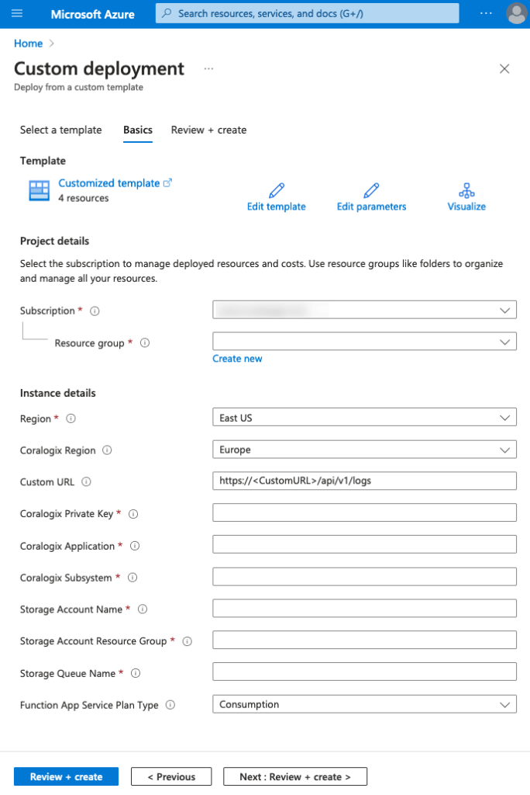

Coralogix provides seamless integration with Azure cloud, allowing you to send your logs from anywhere and parse them according to your needs.

Deploy the Azure Queue Storage integration to send Coralogix your JSON-formatted queue messages using the ARM template below.

## Prerequisites

- Azure account with an active subscription

## Azure Resource Manager Template Deployment

Sign into your Azure account and deploy the Queue Storage integration by clicking [here](https://portal.azure.com/#create/Microsoft.Template/uri/https%3A%2F%2Fraw.githubusercontent.com%2Fcoralogix%2Fcoralogix-azure-serverless%2Fmaster%2FStorageQueue%2FARM%2FStorageQueue.json).

**Notes**:

- The Azure Queue Storage integration allows parsing of queue messages in JSON format.

- Other format messages will **not** be processed and submitted to the Coralogix platform.

### Fields

<table><tbody><tr><td><strong>Field</strong></td><td><strong>Description</strong></td></tr><tr><td><strong>Subscription</strong></td><td>Azure subscription for which you wish to deploy the integration. Must be the same as the monitored storage account.</td></tr><tr><td><strong>Resource Group</strong></td><td>Resource group for which you wish to deploy the integration</td></tr><tr><td><strong>Coralogix Region</strong></td><td>Region associated with your <a href="https://coralogixstg.wpengine.com/docs/coralogix-domain/"><strong>Coralogix domain</strong></a></td></tr><tr><td><strong>Custom URL</strong></td><td>Custom URL associated with your Coralogix account. Ignore if you do not have a custom URL.</td></tr><tr><td><strong>Coralogix Private Key</strong></td><td>Coralogix <a href="https://coralogixstg.wpengine.com/docs/send-your-data-API-key/"><strong>Send-Your-Data API key</strong></a></td></tr><tr><td><strong>Coralogix Application</strong></td><td>Mandatory <a href="https://coralogixstg.wpengine.com/docs/application-and-subsystem-names/"><strong>metadata</strong> <strong>field</strong></a> sent with each log and helps to classify it</td></tr><tr><td><strong>Coralogix Subsystem</strong></td><td>Mandatory <a href="https://coralogixstg.wpengine.com/docs/application-and-subsystem-names/"><strong>metadata</strong> <strong>field</strong></a> sent with each log and helps to classify it</td></tr><tr><td><strong>Storage Account Name</strong></td><td>Name of the storage account containing the storage queue. Must be of StorageV2 (general purpose V2) type.</td></tr><tr><td><strong>Storage Account Resource Group</strong></td><td>Name of the storage account resource group containing the storage queue to be monitored</td></tr><tr><td><strong>Storage Queue Name</strong></td><td>Name of the Storage Queue to be monitored</td></tr><tr><td><strong>Function App Service Plan Type</strong></td><td>Type of the function app service plan. Choose 'Premium' if you need VNet support.</td></tr></tbody></table>

## Optional Configuration Options

If your Storage Queue belongs to a restricted storage account, review this [optional configuration documentation](https://coralogixstg.wpengine.com/docs/optional-configurations-microsoft-azure/) to learn about VNet support options.

## Additional Resources

<table><tbody><tr><td><strong>Github</strong></td><td><a href="https://github.com/coralogix/coralogix-azure-serverless/blob/master/StorageQueue"><strong>Queue Storage Documentation</strong></a></td></tr><tr><td><strong>Microsoft Azure Functions</strong> <strong>Manual Integrations</strong></td><td><strong><a href="https://coralogixstg.wpengine.com/docs/blobstorage-microsoft-azure-functions/">Blob Storage</a> </strong><a href="https://coralogixstg.wpengine.com/docs/azure-eventhub-trigger-function/"><strong>Event Hub</strong></a></td></tr></tbody></table>

## **Support**

**Need help?**

Our world-class customer success team is available 24/7 to walk you through your setup and answer any questions that may come up.

Feel free to reach out to us **via our in-app chat** or by sending us an email at **[support@coralogixstg.wpengine.com](mailto:support@coralogixstg.wpengine.com)**.
