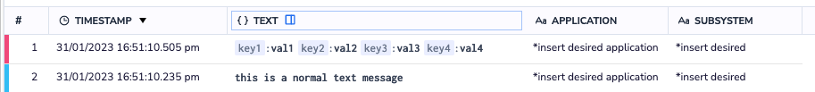

Send your logs using the Coralogix REST API /singles.

## Endpoint URL

Input your Coralogix [domain](https://coralogixstg.wpengine.com/docs/coralogix-domain/) into the following endpoint URL: `https://ingress.<domain>/logs/v1/singles`.

## Schema

### **Endpoint Details**

<table><tbody><tr><td><strong><span style="font-family: helvetica, arial, sans-serif;">URL</span></strong></td><td>https://ingress.&lt;domain&gt;/logs/v1/singles</td></tr><tr><td><strong><span style="font-family: helvetica, arial, sans-serif;">HTTP Method</span></strong></td><td><span style="font-family: helvetica, arial, sans-serif;">POST</span></td></tr><tr><td><strong>Content-Type</strong></td><td>application/json</td></tr><tr><td><strong>Header</strong></td><td>Authorization: Bearer &lt;<a href="https://coralogixstg.wpengine.com/docs/send-your-data-api-key/">Send-Your-Data API key</a>&gt;</td></tr></tbody></table>

- We **recommend** sending logs in batches to minimize network calls.

- The API is limited to a message size of 2MB which is approximately 3,000 medium-sized logs.

- If you are using Ajax or a similar technology, you may need to send the data with JSON.stringify()).

### **POST Body**

An array of JSON objects which contain:

<table><tbody><tr><td><strong>Required</strong></td><td><strong>Property Name</strong></td><td><strong>Property Type</strong></td><td><strong>Note</strong></td></tr><tr><td></td><td>timestamp</td><td>number</td><td>UTC milliseconds since 1970 (supports sub-millisecond via a floating point)</td></tr><tr><td>Yes</td><td>applicationName</td><td>string</td><td>usually used to separate environments</td></tr><tr><td>Yes</td><td>subsystemName</td><td>string</td><td>usually used to separate components</td></tr><tr><td></td><td>computerName</td><td>string</td><td></td></tr><tr><td></td><td>severity</td><td>number</td><td>1 – Debug, 2 – Verbose, 3 – Info, 4 – Warn, 5 – Error, 6 – Critical</td></tr><tr><td></td><td>category</td><td>string</td><td>Category field</td></tr><tr><td></td><td>className</td><td>string</td><td>Class field</td></tr><tr><td></td><td>methodName</td><td>string</td><td>Method field</td></tr><tr><td></td><td>threadId</td><td>string</td><td>Thread ID field</td></tr><tr><td></td><td>hiResTimestamp</td><td>string</td><td>UTC nanoseconds since 1970(supports millisecond, microsecond and nanosecond)</td></tr><tr><td>Yes</td><td>text</td><td>string/json</td><td>event log</td></tr></tbody></table>

## Example

```
curl --location --request POST 'https://ingress.<domain>/logs/v1/singles' \
  --header 'Content-Type: application/json' \
  --header 'Authorization: Bearer <Send-Your-Data API key>' \
  --data-raw '[{
      "applicationName": "*insert desired application name*",
      "subsystemName": "*insert desired subsystem name*",
      "computerName": "*insert computer name*",
      "severity": 3,
      "text": "this is a normal text message",
      "category": "cat-1",
      "className": "class-1",
      "methodName": "method-1",
      "threadId": "thread-1",
      "timestamp": 1675148539123.342
    }, {
      "applicationName": "*insert desired application name*",
      "subsystemName": "*insert desired subsystem name*",
      "computerName": "*insert computer name*",
      "hiResTimestamp": "1675148539789123123",
      "severity": 5,
      "text": "{\"key1\":\"val1\",\"key2\":\"val2\",\"key3\":\"val3\",\"key4\":\"val4\"}",
      "category": "DAL",
      "className": "UserManager",
      "methodName": "RegisterUser",
      "threadId": "a-352"
    }]'
```

**Note**:

- If you are sending a JSON payload note, **we suggest** escaping it and then inserting it into the text field, which should be sent as a string.

- If `timestamp` is present, use milliseconds or microseconds. If not, we will inject the UTC time at the time the request is received.

## Coralogix Dashboard

View your logs, with all metadata fields, in your Coralogix dashboard.



## Support

**Need help?**

Our world-class customer success team is available 24/7 to walk you through your setup and answer any questions that may come up.

Feel free to reach out to us **via our in-app chat** or by sending us an email at [support@coralogixstg.wpengine.com](mailto:support@coralogixstg.wpengine.com).
