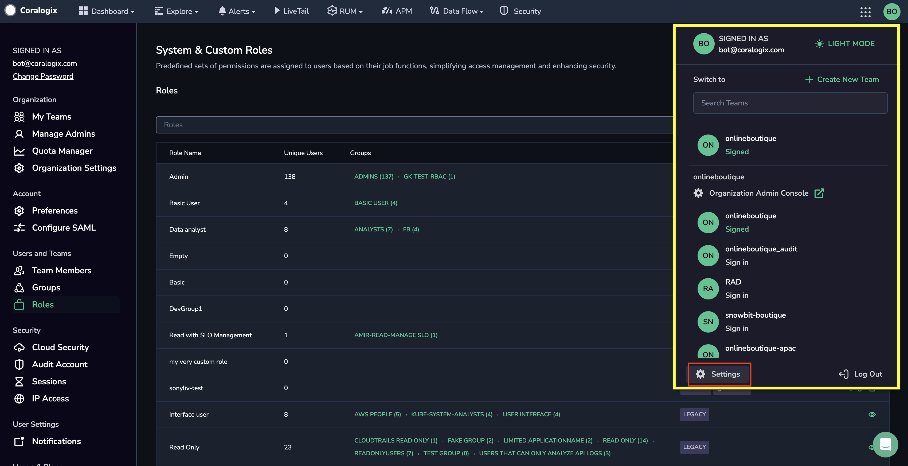
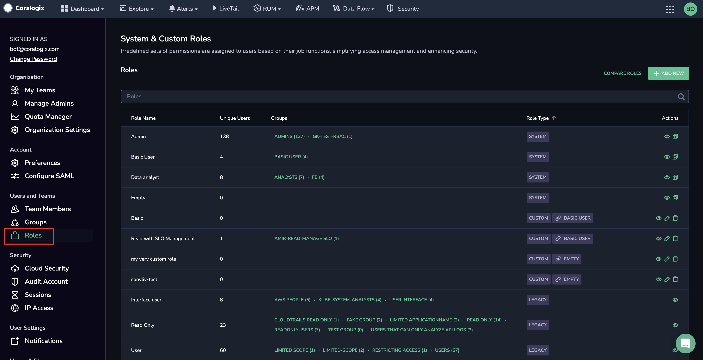
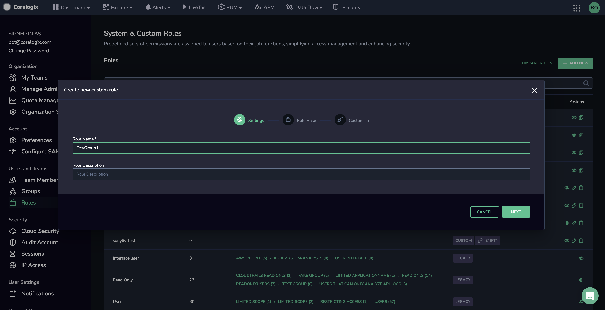
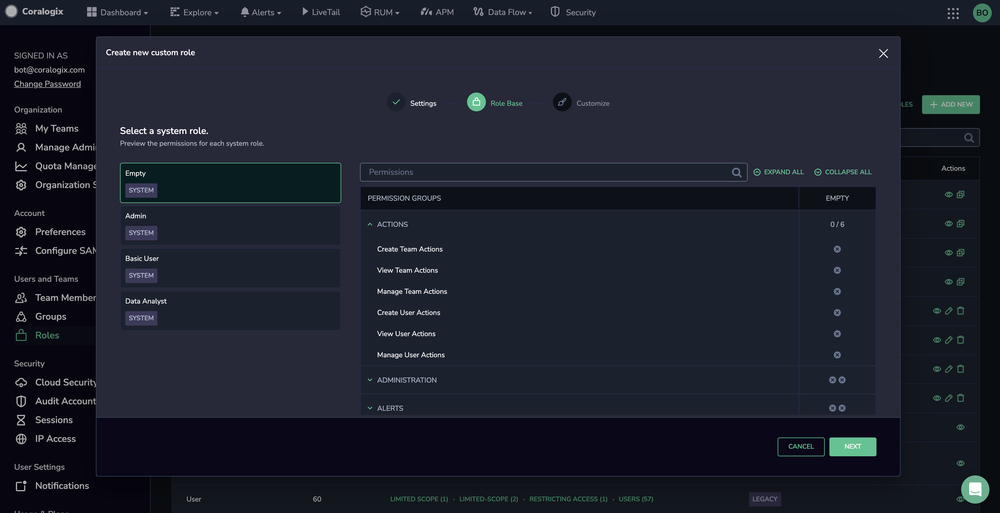
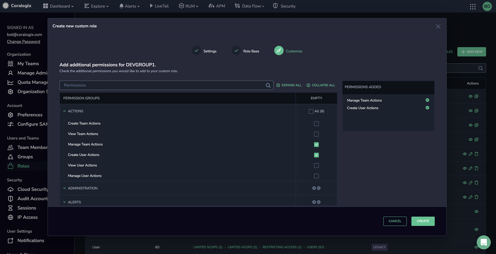
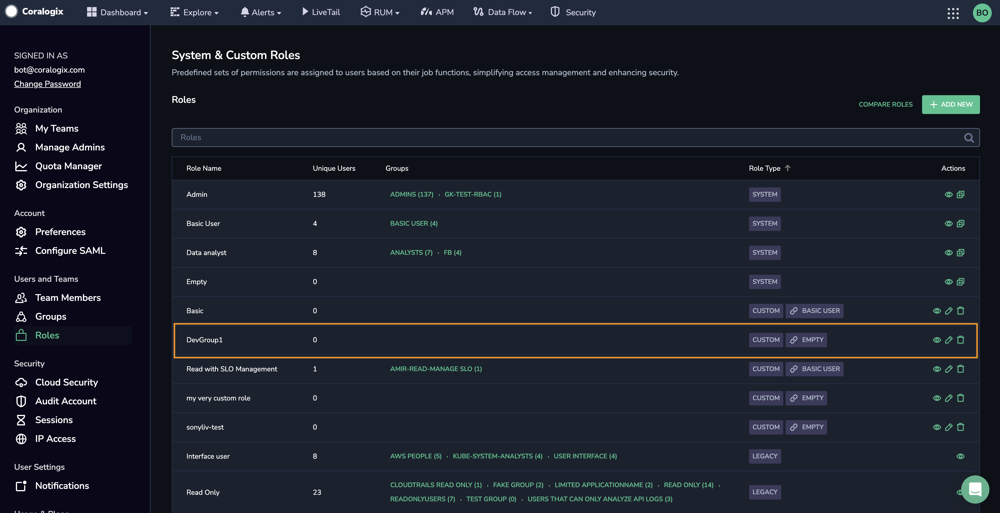
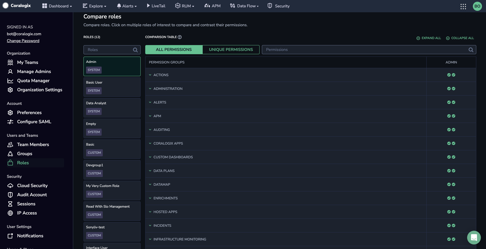

## Overview

Coralogix offers a flexible access management system that allows you to customize the level at which you control your users' access to Coralogix resources and associated actions.

Organizations can access system roles with predefined permissions assigned to users based on their job functions. Create custom roles to combine permissions into new ones while maintaining security and compliance standards for flexibility. Permissions attached to a custom role apply to all resources of a particular resource type.

Organizations and users that need maximum flexibility can control user data scope by limiting access to particular applications and subsystems.

## Role-Based Access Control

### RBAC Model

Roles categorize users and define their account permissions, determining which actions they may perform and on which resources.

By default, Coralogix offers seven predefined system roles. You can create custom roles to customize between your users and their permissions by adding permissions to existing system roles.

By granting permissions to roles, any user who is associated with that role receives that permission. When users are associated with multiple roles, they receive all the permissions granted to each of their roles. The more roles a user is associated with, the more access they have within a Coralogix account.

### Group Membership

Users enjoy role-based access based on their membership in one or more [groups](https://coralogixstg.wpengine.com/docs/groups/), each assigned particular roles. Find out more [here](https://coralogixstg.wpengine.com/docs/groups/).

## Role Types

### System Roles

Coralogix offers seven predefined system roles.

| System Role | Description |
| --- | --- |
| Platform Admin | Platform admins manage all teams, user access, and settings. They can also manage and configure all Coralogix resources. They have full access to billing information and can revoke API keys. They have management and read-only access to organization settings. |
| Data Admin | Data admins can view and modify all Coralogix monitoring features. They may not view and manage organization settings and are limited in their access to team settings. |
| Observability Lead | Observability leads can view all Coralogix monitoring features but are limited in their management and configuration permissions. They may not view and manage organization settings and are limited in their access to team settings. |
| Standard User | Read-only users do not have access to make changes within Coralogix. This comes in handy when you'd like to share specific read-only views with a client or when a member of one team needs to share a dashboard or other resource with someone outside their team. |
| Read-Only User | Read-only users do not have access to make changes within Coralogix. This comes in handy when you’d like to share specific read-only views with a client, or when a member of one team needs to share a dashboard or other resource with someone outside their team. |
| No Access User | Users have no permissions. Use this system role as a baseline to create custom roles with limited permissions. |
| Security User | Security users can perform daily security tasks and manage related configurations, such as incident investigation, alert configuration, security posture visibility, and extension deployment. |

### Custom Roles

Custom roles allow you to specify and control the permissions, privileges, and access levels of different user [groups](https://coralogixstg.wpengine.com/docs/groups/) within the platform. Rooted in our predefined system roles, custom roles enable you to tailor access and responsibilities to your team members' specific needs and responsibilities.

When creating custom roles, one may exclusively **add** permissions to system roles.

A complete list of permissions available for custom roles can be found below.

### Legacy Roles

Legacy roles are predefined system roles from our sunsetted role management system. Existing customers must migrate the legacy roles assigned to their users to system and custom roles to prevent role loss. Full instructions can be found [here](https://coralogixstg.wpengine.com/docs/groups/).

## Create a Custom Role

**STEP 1.** From the Coralogix toolbar, click on the user icon in the top right-hand corner.

**STEP 2.** Click **Settings**.

**STEP 3.** In the left-hand menu, select **Roles**.

**STEP 4.** Click **\+ ADD NEW**.

**STEP 5.** Enter a name and description for the new role.

**STEP 6.** Select an existing system role upon which to base the new custom role. The list of permissions associated with the system role will be displayed.

**STEP 7.** Mark the checkboxes next to the permissions you want to add to your custom role. **PERMISSIONS ADDED** will appear to the right of the **PERMISSION GROUPS** list.

**STEP 8.** Click **CREATE**.

**STEP 9**. Your new custom role will appear in the list of roles, along with additional contextual information:

- **Users.** The number of users with this role.

- **Groups.** The [groups](https://coralogixstg.wpengine.com/docs/groups/) that have been assigned this role.

- **Role Type**. Specifies whether the role is **SYSTEM**, **CUSTOM,** or **LEGACY**. If it is a Custom Role, the system role upon which it has been modeled will also be displayed.

View, edit, or delete the custom role from the **Actions** column anytime.

## Compare Roles

Scroll down to compare between system roles in the **Compare Roles** section.

Click on multiple roles of interest to compare and contrast their permissions. Compare all permissions for all roles you would like to compare or exclusively between those unique to one or more roles.

## Additional Resources

<table><tbody><tr><td>Documentation</td><td><strong><strong><a href="https://coralogixstg.wpengine.com/docs/user-team-management/">Teams</a></strong></strong> <a href="https://coralogixstg.wpengine.com/docs/groups/"><strong>Groups</strong></a></td></tr></tbody></table>

## Support

**Need help?**

Our world-class customer success team is available 24/7 to walk you through your setup and answer any questions that may come up.

Feel free to contact us **via our in-app chat** or by emailing [support@coralogixstg.wpengine.com](mailto:support@coralogixstg.wpengine.com).
