When you install the Coralogix Security Traffic Analyzer (STA) for the first time (and optionally in subsequent installations too) the following dashboards will be automatically added to your account:

## **Baby Domains**

Displays young domains that were created in the last three months that were accessed by the monitored servers. Normally, this dashboard should be empty, for the purpose of this example we have changed the condition to show connection to domains that were created in the past 30 years just so that you'll get a feeling of what it looks like:

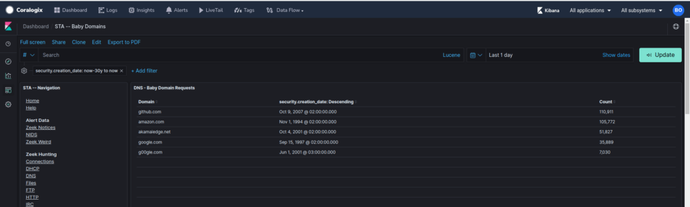

## **Zeek**

### **Connections**

Displays information about connections observed by the STA. Includes information such as protocols (e.g. TCP, UDP, ICMP), ports, connection states (e.g. SYN, ACK, PSH, FIN), geographic locations and more.

### DNS

Displays information about DNS queries and answers detected in the monitored traffic. Includes information such as queries, DNS servers, response codes, geographic locations, protocols, domain names, domains creation date, domains expiration dates, domains NLP scores (help determine if a domain name is machine generated) and more.

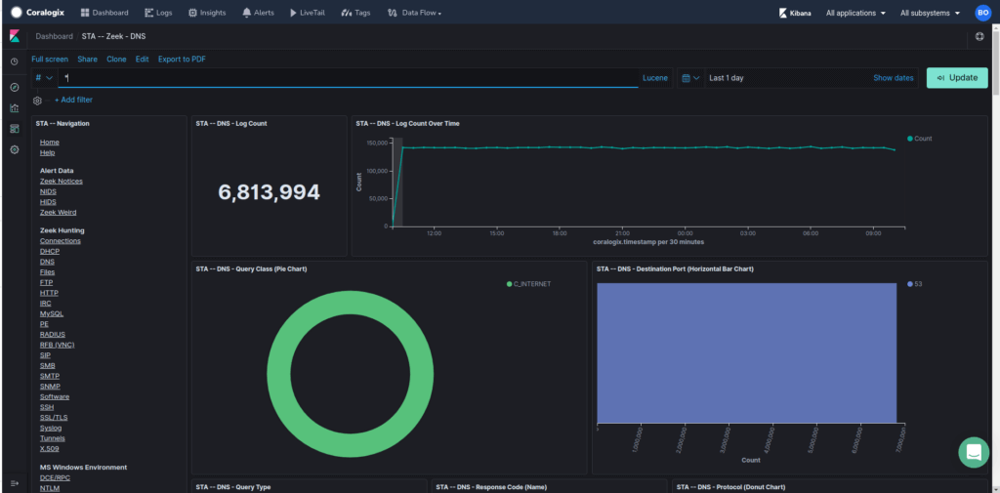

### FTP

Displays information about FTP connections detected in the monitored traffic. Includes information such as FTP commands, file paths.

### Files

Displays information about files that were detected in the network traffic in any protocol. Includes information such as file hashes, MIME types, source IPs.

### HTTP

Displays information about HTTP connections, includes information such as hostnames, web methods, URIs, amount of bytes transferred, HTTP referrers, user-agents, MIME types.

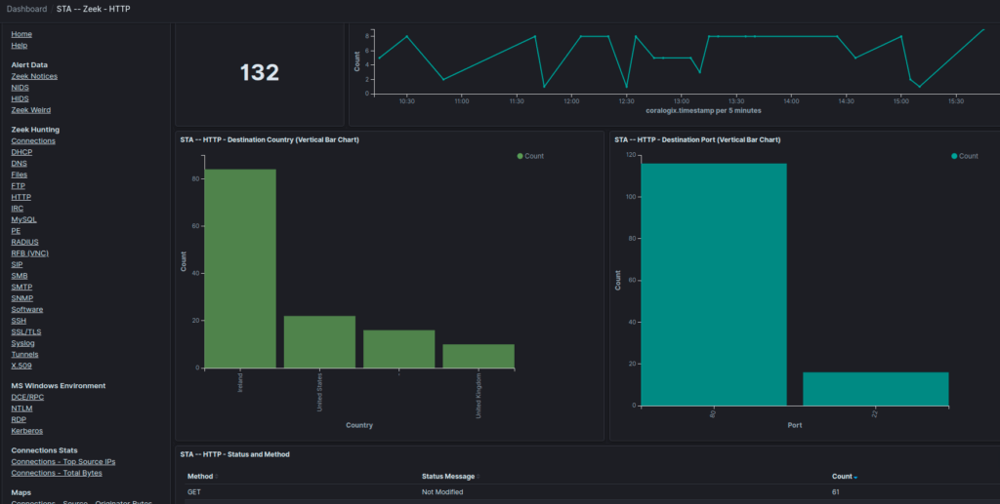

### DHCP

Displays information about DHCP connections observed in the traffic.

### IRC

Displays information about IRC connections observed in the traffic.

### MySQL

Displays information about MySQL connections found in the traffic. Includes information such as database names, queries, user names, tables and more.

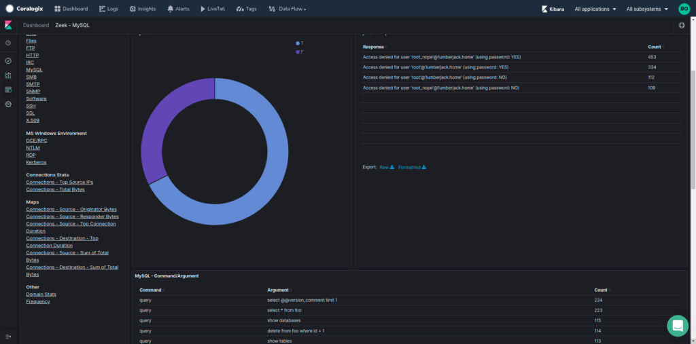

### RDP

Displays information about Remote Desktop Protocol (RDP) connections found in the monitored traffic.

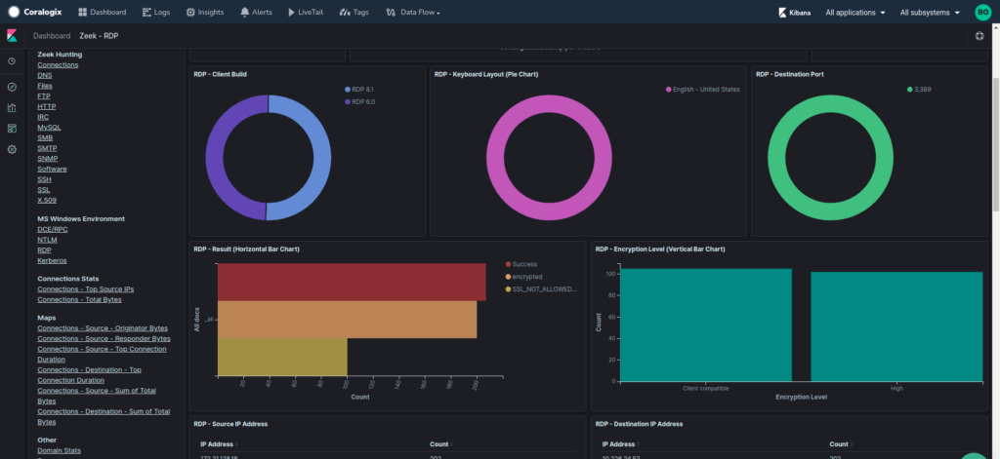

### SIP

Displays information about SIP connections (VOIP) found in the monitored traffic.

### SMB

Displays information about SMB connections found in the monitored traffic.

### SMTP

Displays information about Simple Mail Transmission Protocol (SMTP) connections found in the monitored traffic.

### SNMP

Displays information about SNMP connections found in the monitored traffic.

### SSH

Displays information about SSH connections found in the monitored traffic.

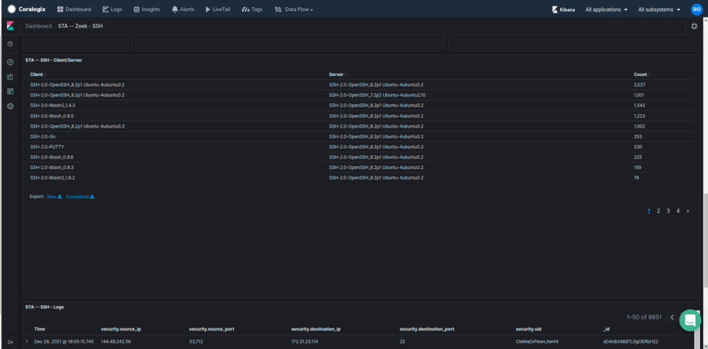

### SSL/TLS

Displays information about SSL/TLS certificates detected in the traffic. Includes information such as certificates details (issuer, CN, validation status)

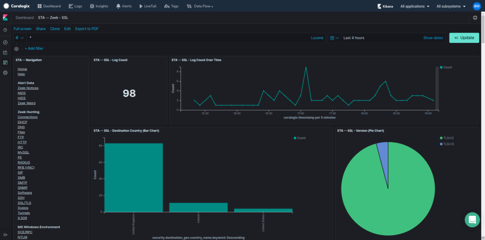

### Software

Displays information about software types of servers and clients as detected in the observed traffic by specific protocol analyzers. Includes information such as user agents, SSH clients and servers, database servers.

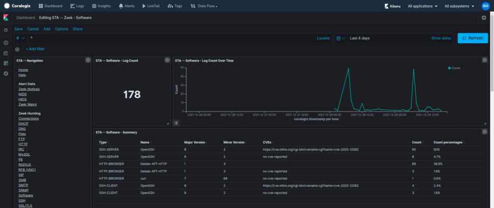

### Tunnels

Displays information about tunnelled connections as detected in the monitored traffic.

### X.509

Displays information about X.509 certificates that have traversed the network.

### Notices

Displays security issues that were detected by Zeek.

### Weird

Displays possible security issues that were detected by Zeek. Issues presented here not necessarily mean that there’s a security issue with your network but it is an indication that something might need to be investigated.

## NIDS (Network Intrusion Detection System)

Displays security issues that were detected by Suricata.

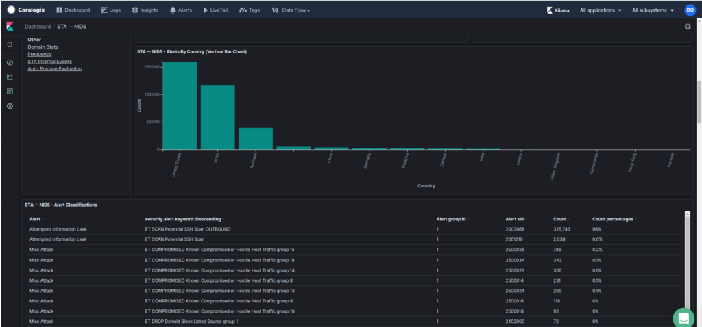

## HIDS (Host Intrusion Detection System)

Displays information from Wazuh agents (if installed). This information includes actions performed on the monitored instance and their related MITRE ATT&CK framework correlated tactics, Vulnerabilities detected and more.

## Connections

### Destination - Sum of Total Bytes

Displays a world map with colored dots that their size represents the sum of total bytes transferred to that geographic region.

### Destination - Top Connection Duration

Displays a world map with colored dots that their size represents the top connection duration to that geographic region.

### Source - Originator Bytes

Displays a world map with colored dots that their size represents the sum of originator bytes transferred from that geographic region.

### Source - Responder Bytes

Displays a world map with colored dots that their size represents the sum of responder bytes transferred from that geographic region.

### Source - Sum of Total Bytes

Displays a world map with colored dots that their size represents the sum of total bytes transferred from that geographic region.

### Source - Top Connection Duration

Displays a world map with colored dots that their size represents the top connection duration from that geographic region.

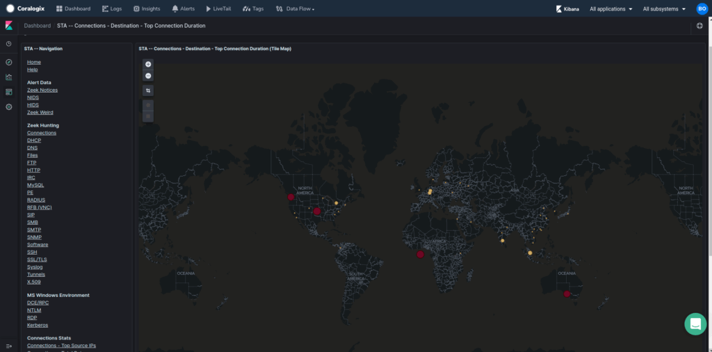

### Top Source IPs

Displays a pie chart of the top source IP addresses with some details.

### Total Bytes

Displays total number of bytes transferred by some aggregations such as: by source IP, by destination IP, by Connection, by destination port.

## Frequency Analysis

Displays statistics regarding the NLP based score on all domains observed in the traffic.

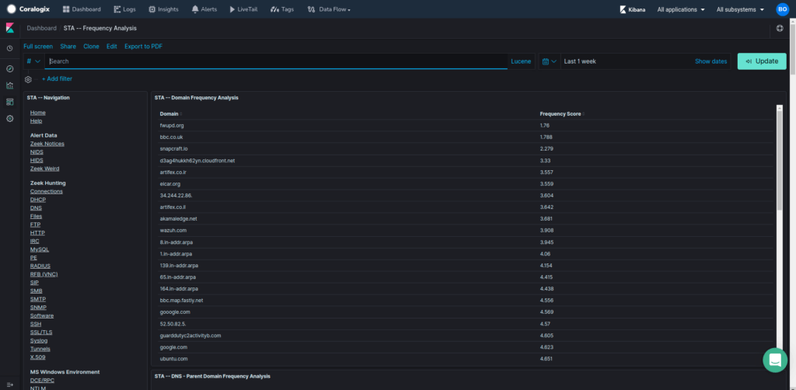
