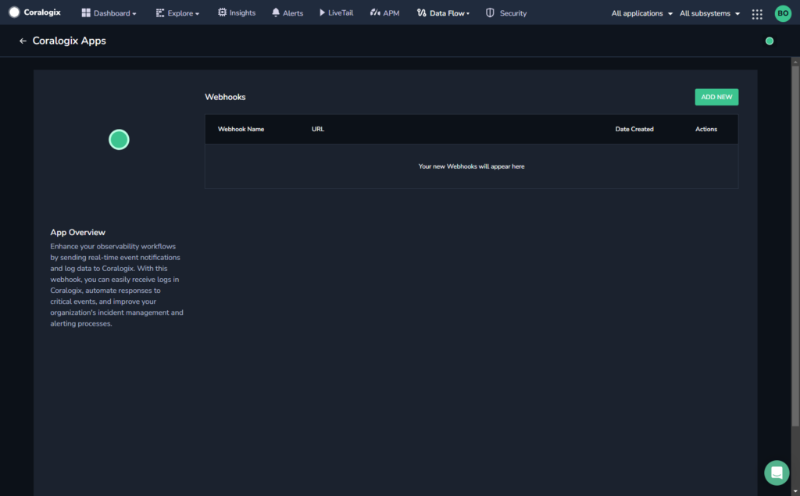
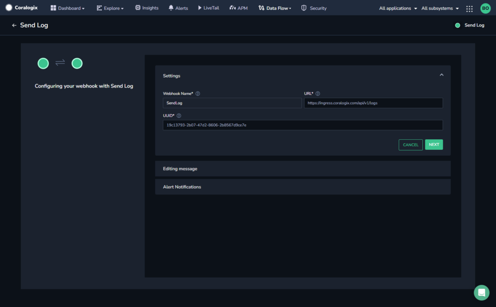
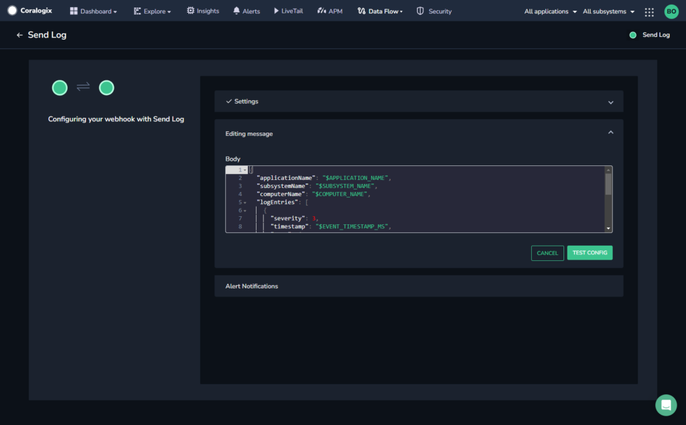

Enhance your observability workflows by sending real-time event notifications and log data to Coralogix. With this webhook, you can easily receive logs in Coralogix, automate responses to critical events, and improve your organization's incident management and alerting processes.

## Create a Send Log Webhook

**STEP 1.** From the Coralogix toolbar, navigate to **Data Flow** > **Outbound Webhooks.**

**STEP 2.** In the **Outbound Webhooks** section, click **SEND LOG WEBHOOK**.

**STEP 3.** Click **\+ ADD NEW**.

**STEP 4.** Enter a memorable name for your webhook that will enable you to easily identify this webhook later when attaching it to one of your alerts.

**Note:** The **URL** and **UUID** fields are auto-populated.

**STEP 5.** Click **NEXT**.

**STEP 6.** \[Optional\] Edit the message body that will be sent with the webhook message. The fields contained within the `logEntries` key will be displayed in the log.

**STEP 7.** Click **TEST & SAVE**.

The system creates a log on the Coralogix Explore page in the dashboard to check that your configuration is valid. If the log is created successfully, a confirmation message is displayed.

**STEP 8.** [Configure your alert notifications](https://coralogixstg.wpengine.com/docs/alert-notifications-outbound-webhooks/) once the configuration is confirmed and the webhook is in place.

## Additional Resources

<table><tbody><tr><td>Documentation</td><td><strong><a href="https://coralogixstg.wpengine.com/docs/alert-notifications-outbound-webhooks/">Configure Alert Notifications for Outbound Webhooks</a></strong></td></tr></tbody></table>

## Support

**Need help?**

Our world-class customer success team is available 24/7 to walk you through your setup and answer any questions that may come up.

Feel free to reach out to us **via our in-app chat** or by sending us an email at [support@coralogixstg.wpengine.com](mailto:support@coralogixstg.wpengine.com).
