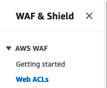
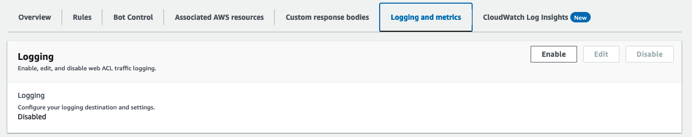
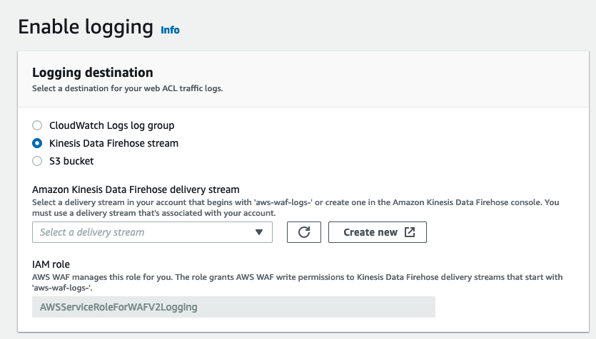
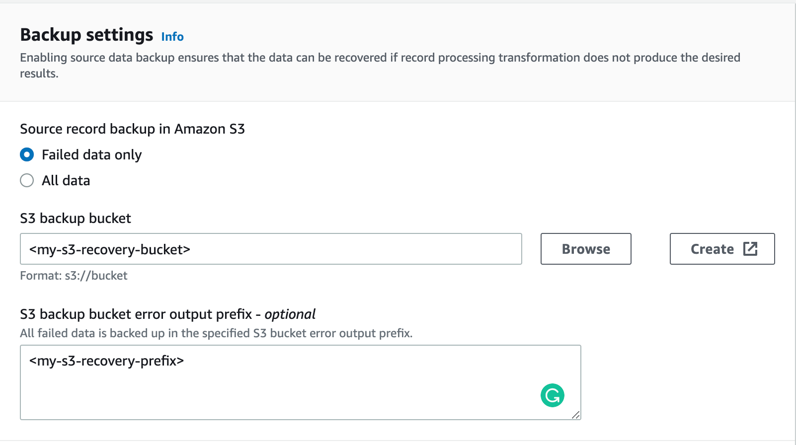

[Amazon Kinesis Data Firehose](https://aws.amazon.com/kinesis/data-firehose/) delivers real-time streaming data to destinations like Amazon Simple Storage Service (Amazon S3), Amazon Redshift, or Amazon OpenSearch Service (successor to Amazon Elasticsearch Service), and now supports delivering streaming data to Coralogix. There is no limit on the number of delivery streams, so it can be used for retrieving data from multiple AWS services.

Coralogix is an AWS Partner Network (APN) Advanced Technology Partner with AWS  Competencies in DevOps. The platform enables you to easily explore and analyze logs to gain deeper insights into the state of your applications and AWS infrastructure. Analyze all of your AWS service logs while storing only those you need. Generate metrics from aggregated logs to uncover and alert on trends in your AWS services.

## Setup Options

- **Automated Integration Package (Recommended).** Streamline ingesting and analyzing logs from your AWS resources using our automated integration packages.

- **Manual Integration.** Alternatively, use our manual integration below.

- **Terraform**. Install and manage the Firehose Logs integration with AWS services as modules in your infrastructure code.

- **CloudFormation**. Install our [AWS Kinesis Firehose Logs with CloudFormation Template](https://github.com/coralogix/cloudformation-coralogix-aws/tree/master/aws-integrations/firehose-logs) and incorporate the configurations and settings via CloudFormation to automate your Firehose logs collection setup and management.

## Automated Integration Packages

Streamline your setup process using our automated integration depending on the integration type (e.g. CloudWatch, WAF). The selected package lets you preconfigure and deploy a template, replicating the manual setup

### Integration Options

Choose one of the integration types based on the format of the logs that are being sent:

- **AWS CloudWatch (JSON)** - CloudWatch logs store records of events and data generated by various AWS resources, applications, and services. These logs provide insights into system behavior, errors, and operational performance.

- **AWS CloudTrail (CloudWatch)** - CloudTrail provides comprehensive records of actions performed within your Amazon Web Services (AWS) account. This includes API calls, configuration changes, and user activities.

- **Web Application Firewall (WAF)** - WAF logs are detailed records of web traffic and security events generated by AWS Web Application Firewall. These logs contain critical information about incoming requests, such as IP addresses, request types, response codes, and potential security threats or attacks.

- **Amazon Elastic Kubernetes Service (EKS) Fargate** - EKS Fargate logs are the records of events, activities, and information generated by containers running within the EKS Fargate environment. These logs provide essential insights into the operation and performance of your containerized applications.

- **Generic Logs** - This integration provides a wider array of data sources, including `Default` and `RawText` types. Its generic nature allows you to select the source of your logs flexibly. You can also define the [application](https://coralogix.com/docs/application-and-subsystem-names/) and [subsystem](https://coralogix.com/docs/application-and-subsystem-names/) names as dynamic extractions during the setup, accommodating various AWS resources and services.

## Configuration

**STEP 1.** From your Coralogix toolbar, navigate to **Data Flow** > **Integrations**.

**STEP 2.** In the Integrations section, search “Firehose” and select one of the following:

- **AWS CloudWatch Logs via Firehose**

- **AWS CloudTrail Logs via Firehose**

- **AWS EKS Fargate Logs via Firehose**

- **AWS WAF Logs via Firehose**

- **AWS Generic Logs via Firehose**

**STEP 3.** Click **ADD NEW**.

**STEP 4.** Input your integration details.

- **Integration Name.** Enter a name for your integration. This will be used as a stack name in CloudFormation.

- **API Key**. Enter your [Send-Your-Data API key](https://coralogix.com/docs/send-your-data-api-key/) or click **CREATE A NEW KEY** to create a new API key for the integration.

- **Application Name.** Enter an [application name](https://coralogix.com/docs/application-and-subsystem-names/). The default name is AWS.

- **Subsystem Name.** Enter a [subsystem name](https://coralogix.com/docs/application-and-subsystem-names/). The default name

- **Kineses Stream ARN**. \[**Optional**\] Enter the ARN of the Kinesis stream if using Amazon Kinesis Data Streams as a source for logs.

- **Input Source** \[for **Generic Logs** Integration\]. The data source in AWS Kinesis Data Firehose determines the `integrationType` parameter value. For extracting the `applicationName` and `subsystemName` values dynamically, an explanation is in the **Manual Setup: Step 4** and a reference table in the **Dynamic Values Table** section of this document.

- **AWS Region.** Select your AWS region from the dropdown menu.

- **AWS PrivateLink (Advanced Settings)**. \[**Optional**\] Enabling AWS PrivateLink is **recommended** to ensure a secure and private connection between your VPCs and AWS services. Find out more [here](https://coralogix.com/docs/coralogix-amazon-web-services-aws-privatelink-endpoints/).

**STEP 6.** Click **NEXT**.

**STEP 7.** Review the instructions for your integration. Click **CREATE CLOUDFORMATION**.

**STEP 8.** You will be rerouted to the AWS website. Verify that all of the auto pre-populated values are correct. Click **Create Stack**.

**STEP 9.** Return to the Coralogix application, where you will find instructions on configuring the log delivery from the selected input source to AWS Kinesis Data Firehose (if relevant).

**Notes**:

If you provide a Kinesis Stream ARN, Coralogix assumes that the data is in the stream and does not provide any additional instructions. It is the user’s responsibility to deliver data to the stream. In place of the instructions, you will see a message that prompts the user to confirm the integration.

**STEP 10**. Click **COMPLETE** to close the module.

**STEP 11.** \[**Optional**\] Deploy the [extension package](https://coralogix.com/docs/extension-packages/) of your choice to complement your integration needs. We offer the following extensions for data originating from CloudTrail and WAF:

- AWS CloudTrail

- AWS WAF

**STEP 12.** View the logs by navigating to **Explore** > **Logs** in your Coralogix toolbar. Find out more [here](https://coralogix.com/docs/logs-screen/).

## Manual Setup

### Configuration

**STEP 1**. Navigate to the Kinesis Data Firehose console and choose ‘Create delivery stream’.

**STEP 2**. Under ‘Choose source and destination’:

- Source: Choose Direct PUT

- Destination: Choose Coralogix

- Delivery stream name: Fill in the desired stream name.

**STEP 3**. Scroll down to ‘Destination settings’:

- HTTP endpoint URL: Choose a URL based on your Coralogix [domain and region](https://coralogix.com/docs/coralogix-domain/).

- Private key: Enter your Coralogix [Send Your Data – API key](https://coralogix.com/docs/send-your-data-api-key/).

- Content encoding: Select GZIP.

- Retry duration: Choose 300 seconds.

**STEP 4**. Scroll down to ‘Parameters’. This section allows you to add and configure additional parameters surrounding the Coralogix platform.

The following parameters are available:

| Parameter | Description |
| --- | --- |
| applicationName | A comma-separated list of application name sources |
| applicationNameDefault | Deprecated |
| subsystemName | A comma-separated list of subsystem name sources |
| subsystemNameDefault | Deprecated |
| integrationType | Data structure:  
\- CloudWatch\_JSON: Data from CloudWatch log groups  
\- WAF: CloudWatch\_CloudTrail  
\- EksFargate  
\- Default  
\- RawText: Use for VPC flow logs |
| dynamicMetadata | Deprecated |

A name source can be a literal string (something), a quoted string (“something”), or a field reference (e.g. `${logGroup}`). Sources in a list are evaluated in order, variables without a value are skipped. For example, `${applicationName}, MyApp` for a Default integration will use `applicationName` field if available, otherwise it will default to MyApp.

The **Dynamic Values Table** section in this document serves as a reference for setting the **applicationName** and **subsystemName** dynamically.

**Notes**:

- By default, your delivery stream name will be used as ‘applicationName’ and ARN as ‘subsystemName’.

- To override the associated ‘applicationName’ or ‘subsystemName’, add a new parameter with the desired value.
    - Key: ‘applicationName’ , value – ‘new-app-name’
    
    - Key: ‘subsystemName’ , value – ‘new-subsystem-name’

- The source of the data in Firehose determines the ‘integrationType’ parameter value:
    - For CloudWatch logs, use `CloudWatch_JSON`.
    
    - For CloudTrail logs in CloudWatch, use `CloudWatch_CloudTrail`.
    
    - For logs coming from EKS Fargate using our guide, use `EksFargate`.
    
    - For data sources matching the Coralogix [log ingestion format](https://coralogix.com/docs/coralogix-rest-api-logs/), use `Default` .
    
    - For other data sources, use `RawText`. This moves all the text to `text` field of log, adds severity of `Info`, and generates a current timestamp. All further parsing of these logs should be done using parsing rules.
    
    - For logs coming from AWS WAF, use `WAF`. This **requires** configuration on **[WAF](https://aws.amazon.com/waf/)** as follows:







- Without adding the ‘integrationType’ parameter, the `Default` integration type is selected.

- For integration of type `Default`, the logs should be structured according to our [REST API rules](https://coralogix.com/docs/coralogix-rest-api-logs/).

**STEP 5**. Set up a recovery bucket (**recommended**). Enabling source data backup ensures that the data can be recovered if the record processing transformation does not produce the desired results.



**STEP 6**. Scroll down to ‘Backup settings’:

- Source record backup in Amazon S3: We suggest selecting **Failed data only**.

- S3 backup bucket: Choose an existing bucket or create a new one.

- Buffer hints, compression, encryption: Leave these fields as is.

**STEP 7**. Review your settings and select **Create delivery stream**.

Logs subscribed to your delivery stream will be immediately sent and available for analysis within Coralogix.

## Data Source Configuration

Below are a couple of ways to connect your data source to Firehose.

### CloudWatch Logs

To send your logs to Coralogix, create a subscription filter inside your CloudWatch log group.

First, create a new role in IAM for your Cloudwatch log group to allow sending data to Firehose.

Go to the IAM console and choose ‘Roles’ under ‘Access management’.

Click on ‘Create role’ on the right.

Under ‘Trusted entity type’ choose ‘Custom trust policy’ and insert this policy.

```
{
    "Version": "2012-10-17",
    "Statement": [
        {
            "Effect": "Allow",
            "Principal": {
                "Service": "logs.<region_code>.amazonaws.com"
            },
            "Action": "sts:AssumeRole"
        }
    ]
}

```

**Note**: Change `<region_code>` into your AWS region. e.g `us-east-1`

In ‘Add permissions’, click ‘Create policy’.

On the opened window, click on the ‘JSON’ tab and insert this policy:

```
{
    "Version": "2012-10-17",
    "Statement": [
        {
            "Effect": "Allow",
            "Action": [
                "firehose:PutRecord",
                "firehose:PutRecordBatch"
            ],
            "Resource": [
                "<firehose_ARN>"
            ]
        }
    ]
}

```

**Note**: Change `<firehose_ARN>` to your Firehose Amazon Resource Name (ARN).

After creating the policy, go back to the role creation page and click on the refresh button.

Pick the newly created policy.

Give your role a name and create it.

After creating the role, go to the Cloudwatch console and choose ‘Logs groups’ under the ‘Logs’ side menu.

Create a new subscription filter for the relevant log group – `<Your_log_group>` -> ‘Subscription filters’ -> ‘Create Kinesis Firehose subscription filter’.

Under ‘Choose destination’:

- For ‘Destination account’ choose ‘Current account’

- For ‘Kinesis Firehose delivery stream’ choose the created firehose delivery stream

Scroll down to ‘Grant permission’:

- For ‘Select an existing role’ choose the role created above

Scroll down and click on ‘Start streaming’.

Logs coming to your Cloudwatch log group will also be directed to Firehose.

**Note: Use** the correct integration type inside your Firehose configuration.

### Kinesis Data Stream

To start sending your Kinesis data stream logs to Coralogix, connect the Data stream to Firehose.

Go to the Kinesis Data Stream console and choose ‘Create data stream’.

Under ‘Data stream configuration’:

- Data stream name: Enter the name of the data stream

Scroll down to ‘Data stream capacity’:

- Capacity mode: Choose ‘On-demand’

After that scroll down and click on ‘Create data stream’.

Note: to connect a kinesis data stream to a firehose delivery stream the delivery stream must use `Amazon kinesis data streams` as its source instead of `Direct PUT` .

## Terraform Module Setup

Using Coralogix Terraform modules, you can easily install and manage Coralogix integrations with AWS services as modules in your infrastructure code. Our open-source modules are available on our [GitHub](https://github.com/coralogix/terraform-coralogix-aws/) and in the [Terraform Registry](https://registry.terraform.io/modules/coralogix/aws/coralogix/latest). Visit our full [AWS Kinesis Firehose Terraform Module](https://coralogix.com/docs/aws-kinesis-data-firehose-terraform-module/) documentation for more info.

For logs, install **AWS Kinesis Data Firehose** by adding this declaration to your Terraform project:

```
module "cloudwatch_firehose_coralogix_logs" {
  source                         = "coralogix/aws/coralogix//modules/firehose-logs"
  private_key                    = "XXXXXXXX-XXXX-XXXX-XXXX-XXXXXXX"
  firehose_stream                = "coralogix-firehose-logs"
  coralogix_region               = "Europe"
  integration_type_logs          = "Default"
  source_type_logs               = "DirectPut"
}

```

## Dynamic Values Table

For application name and/or subsystem name to be set dynamically in relation to their `integrationType`'s resource fields (e.g. CloudWatch\_JSON's loggroup name, EksFargate's k8s namespace). The source's variable can be mapped as a string literal with pre-defined values:

| Field | Source `Var` | Expected Parameter | Integration Type | Notes |
| --- | --- | --- | --- | --- |
| applicationName field in logs | applicationName | ${applicationName} | Default | Needs to be supplied in the log to be used |
| subsystemName field in logs | subsystemName | ${subsystemName} | Default | Needs to be supplied in the log to be used |
| CloudWatch LogGroup name | logGroup | ${logGroup} | CloudWatch\_JSONCloudWatch\_CloudTrail | Supplied by AWS |
| `kubernetes.namespace_name` field | kubernetesNamespaceName | ${kubernetesNamespaceName} | EksFargate | Supplied by the default configuration |
| `kubernetes.container_name` field | kubernetesContainerName | ${kubernetesContainerName} | EksFargate | Supplied by the default configuration |
| name part of the log.webaclId field | webAclName | ${webAclName} | WAF | Supplied by AWS |

The expected parameter for the field must be exact with no extra characters. Characters may, however, be exchanged - for instance, `subsystemName` parameter with value `${applicationName}` or )

**Note**: `RawText` integrationType does not support dynamic values.

## Support

**Need help?**

Our world-class customer success team is available 24/7 to walk you through your setup and answer any questions that may come up.

Contact us **via our in-app chat** or by emailing [support@coralogix.com](mailto:support@coralogix.com).
