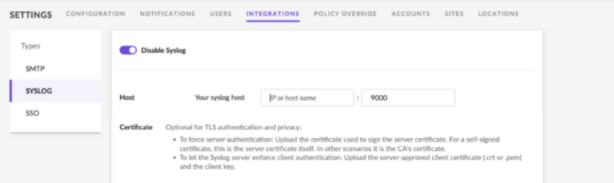
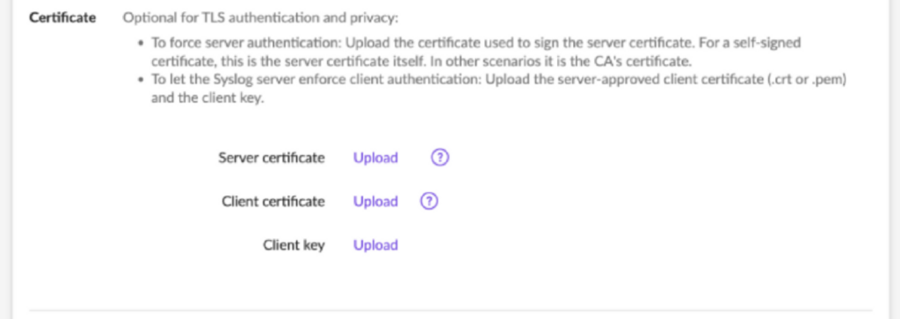

[SentinelOne](https://www.sentinelone.com/?utm_source=google-paid&utm_medium=paid-search&utm_campaign=seur-bau-trademark&utm_term=Sentinelone&campaign_id=20327707813&ad_id=664148010182&gclid=CjwKCAjwlJimBhAsEiwA1hrp5pIJDKc3awPoWWbTUiIYJc7ZvC6XHhGM5TVmshmp8PDXb-z_soT7bhoC42UQAvD_BwE) protects computers, endpoints, and data with anti-malware and anti-exploit protection. The SentinelOne agent continually receives intelligence updates from SentinelOne servers with a lightweight agent and offers minimal to no impact on your work.

This tutorial demonstrates how to seamlessly send SentinelOne logs to Coralogix. The integration requires sending your logs to an interceptive server and then forwarding them from the server to Coralogix.

## **Prerequisites**

- [Admin access](https://coralogixstg.wpengine.com/docs/user-team-management/) to your Coralogix account

- Admin access to your SentinelOne account

- Server (e.g. EC2 machine) that will host the OpenTelemetry log shipper

- OpenTelemetry [installed](https://opentelemetry.io/docs/collector/getting-started/)

## **Create TLS Certificates**

**STEP 1**. On the EC2 server, create a folder to hold all certificates.

```
sudo mkdir /etc/certificates && cd /etc/certificates

```

**STEP 2**. Create your CA certificate. For FQDN, input the server’s public IP address.

```
openssl genrsa -out RootCA.key 2048
openssl req -x509 -new -nodes -key RootCA.key -sha256 -days 1024 -out RootCA.pem

```

**STEP 3**. Create a custom OpenSSL configuration file.

```
sudo vim custom_ssl.conf

```

**STEP 4**. Replace CN and alt\_names with your server IP/domain name.

```
[req]
distinguished_name = req_distinguished_name
x509_extensions = v3_req
prompt = no
[req_distinguished_name]
CN=<SERVER_IP>
[v3_req]
keyUsage = keyEncipherment, dataEncipherment
extendedKeyUsage = serverAuth
subjectAltName = @alt_names
[alt_names]
DNS.1 = <SERVER_IP>
```

**STEP 5**. Generate a SentinelOne key & certificate signing request.

```
openssl genrsa -out SentinelOne.key 2048
openssl req -new -key SentinelOne.key -out SentinelOne.csr -config custom_ssl.conf

```

**STEP 6**. Generate SentinelOne certificate based on our own CA certificate.

```
openssl x509 -req -in SentinelOne.csr -CA RootCA.pem -CAkey RootCA.key -CAcreateserial -out SentinelOne.pem -days 1024 -sha256

```

**STEP 7**. Add read permissions to all of the certificates.

```
sudo chmod +r /etc/certificates/*

```

**STEP 8**. Create a configuration file for OpenTelemetry, while modifying the following variables.

<table><tbody><tr><td><strong>Variable</strong></td><td><strong>Description</strong></td></tr><tr><td>domain</td><td><strong><a href="https://coralogixstg.wpengine.com/docs/coralogix-domain/">Coralogix Domain</a></strong>&nbsp;associated with your Coralogix account</td></tr><tr><td>private_key</td><td>Coralogix <a href="https://coralogixstg.wpengine.com/docs/send-your-data-api-key/"><strong>Send-Your-Data API key</strong></a></td></tr><tr><td>message_format</td><td>Syslog message format (rfc3164/rfc5424)</td></tr></tbody></table>

```
receivers:
  syslog:
    tcp:
      listen_address: "0.0.0.0:514"
      tls:
        cert_file: "/etc/certificates/RootCA.pem"
        key_file: "/etc/certificates/RootCA.key"
        ca_file: "/etc/certificates/RootCA.pem"
    protocol: rfc5424
    operators: 
      - type: syslog_parser
        protocol: <**message_format>**
        parse_from: body
        parse_to: body
			- type: remove
        field: attributes
exporters:
  coralogix:
    domain: "coralogixstg.wpengine.com"
    private_key: "your private key"
    application_name: "syslog-application"
    subsystem_name: "syslog-subsystem"
    timeout: 30s
service:
  pipelines:
    logs:
      receivers: [ syslog ]
      exporters: [ coralogix ]

```

**STEP 9**. Save and run the OpenTelemetry file.

## **Forward Logs to the Syslog Server**

Before proceeding, we **recommended** contacting SentinelOne to receive the IP addresses, specific to your SentinelOne Account, over which SentinelOne will be sending data, and to provide the relevant permissions to those IPs in your EC2 instance security group. This will ensure the [principle of least privilege](https://en.wikipedia.org/wiki/Principle_of_least_privilege).

**STEP 1**. Navigate to the **Integrations** panel under **Settings** in the SentinelOne platform.

- **Types**. Choose **SYSLOG**.

- **IP**. Insert the IP address of the server created previously.

- **Port**. Insert the desired port. The default port is the same port chosen in the Logstash configuration file.

- **Formatting**. Select **CEF2**.



- Check the **TLS** checkbox and upload the SentinelOne certificates previously created.



- Click **Test**.

**STEP 2**. Save the SYSLOG integration.

## **Support**

**Need help?**

Our world-class customer success team is available 24/7 to walk you through your setup and answer any questions that may come up.

Feel free to reach out to us **via our in-app chat** or by sending us an email at [support@coralogixstg.wpengine.com](mailto:support@coralogixstg.wpengine.com).
