The **Service Catalog** offers a centralized, data-rich resource for managing and optimizing the services within your system. It provides a holistic view of service health, enabling better decision-making and faster issue resolution, ultimately improving the performance and reliability of your entire system.

## Service Catalog Overview

The **Service Catalog** provides a complete list of services you have in your system, displaying the health of each service. The catalog shows service type, number of requests received by the service, and error rate and latency for received requests.

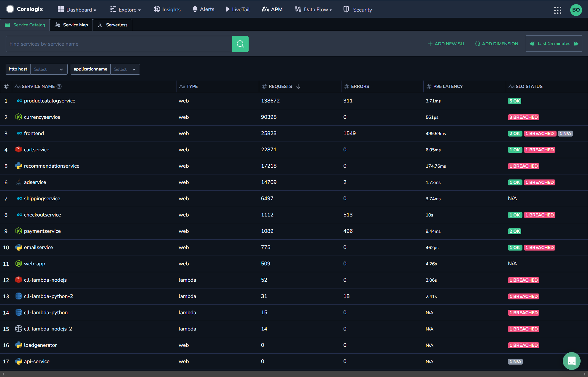

- Use the search bar, search by service, or any other parameter.

- Select the timeframe for which you want to view your services.

- Use [dimensions](https://coralogixstg.wpengine.com/docs/service-catalog/#filter-services-using-dimensions) to filter your services. Dimensions help you filter your services by adding new labels to a metric, allowing you to filter the services shown according to the tags you define.

## Prerequisites

- Coralogix Application Performance Monitoring (APM) [installed and configured](https://coralogixstg.wpengine.com/docs/apm/#installation--configuration)

## Access the Service Catalog

**STEP 1.** In your Coralogix toolbar, navigate to **APM**. Click on the **Service Catalog** tab.

**STEP 2.** Select the timeframe for which you want to view information.

**STEP 3.** Select a service to view the service drill-down.

## Filter Services using Dimensions

Creating a dimension involves adding a new label to a metric, allowing you to filter the services shown using the tags you define.

**STEP 1.** Click **{ } Add Dimension** on the upper right-hand corner of the Service Catalog tab.

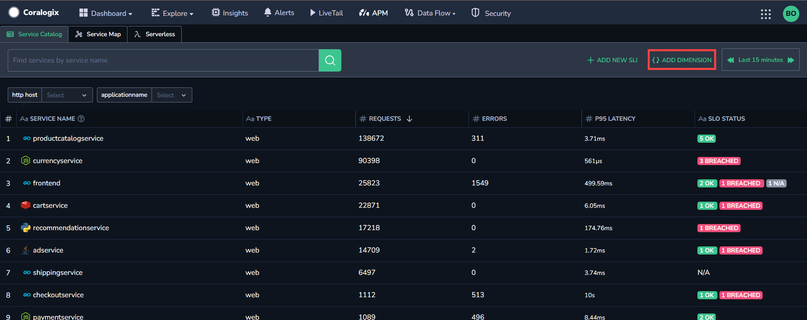

**STEP 2.** Enter a filter name and select a span tag from the dropdown menu to pair the data source with the dimension.

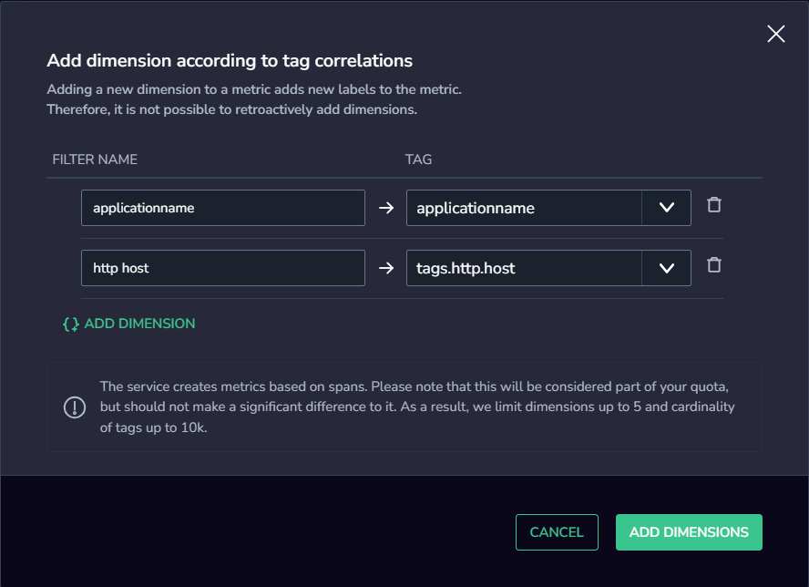

**STEP 3.** To add additional filters, click **{ } ADD DIMENSION** and repeat **STEP 2**.

**STEP 4.** Click **ADD DIMENSIONS**.

**STEP 5**. Once you have created one or more dimensions, the Dimensions toolbar will appear above the Service Catalog.

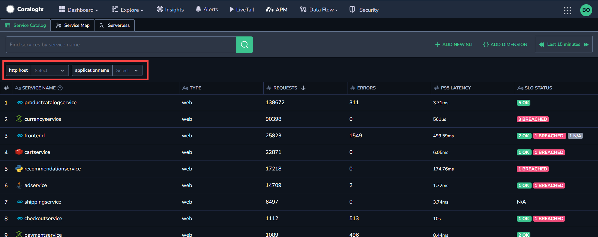

To filter the services using a specific dimension, choose from the dimensions bar at the top and select the results you wish to see.

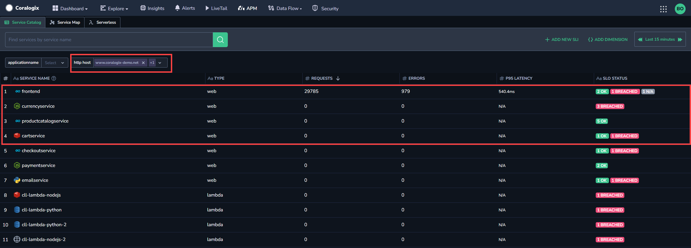

**Notes:**

- When you enter a specific service with dimensions selected, the service drill-down will remain filtered by the desired dimension.

### Limitations

- Dimensions create metrics from spans and are therefore considered part of your quota. Use a maximum of **5** dimensions, each of which can filter up to 10k labels (cardinality).

- Only [team admins](https://coralogixstg.wpengine.com/docs/managing-your-organization-my-teams/) have permission to create dimensions.

## Service Drill-Down

The Service Drill-Down displays more detailed information about the specific service selected.

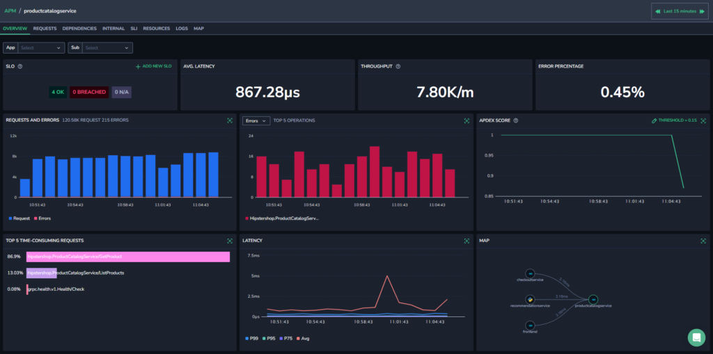

The drill-down includes details of which service you are viewing and all the details given on the main service catalog page. It includes visualizations and additional information that changes depending on your viewing tab.

The service drill-down includes the following tabs:

- Overview

- Flows

- Operations

- SLO

- Resources

- Logs

- Map

## Overview

The Overview tab gives a summary of the service.

The widgets in this tab give you a broad overview of the service for the timeframe selected in the top bar.

The Overview widgets include:

- **SLO.** An overview of the current SLOs, how many are okay, how many are breached, and how many are not available.

- **Average Latency.** Shows the average latency for the current service.

- **Throughput.** Shows the throughput for the current service.

- **Error Percentage.** Displays the percentage of errors in relation to the total number of requests.

- **Requests and Errors.** Shows a graph with the number of requests and errors for the service.

- **Error Percentage for Top 5 Requests.** Displays the percentage of errors in the top five incoming service requests.

- **Apdex Score.** Displays the Apdex (Application Performance Index) score over the selected timeframe. The Apdex score is a standardized metric used to measure and quantify user satisfaction with the response time of software applications. For more information about Apdex, including defining the threshold, view our **[Apdex Score tutorial](http://coralogixstg.wpengine.com/docs/apdex-score)**.

- **Highest Consumption.** Shows the five operations with the highest consumption.

- **Latency**. Shows a graph with the service’s P99, P75, P50, and Average latency.

- **Map.** Shows a mini version of the service map.

## Flows

The [Service Flows](https://coralogixstg.wpengine.com/docs/service-flows/) tab allows you to rapidly investigate the radius of the impact of different services in your system over time.

Use it to:

- Investigate the performance of each service flow by breaking it down into its constituent operations.

- Gain a granular understanding of how each sub-flow, a collection of related operations, affects the performance of the entire service flow over time.

- Rapidly identify and troubleshoot the subflows causing performance issues over time.

Find out more [here](https://coralogixstg.wpengine.com/docs/service-flows/).

## Operations

The Operations tab presents incoming, outgoing, and internal requests for your service through various spans. Select which request type you would like to view in the dropdown menu in the upper right-hand corner.

At the top of the page, three charts are shown displaying the displaying service operations for each of the following:

- Time Consumption

- Throughput

- Error Rate

### **Incoming Requests**

View the requests the service receives – in the form of server and consumer spans.

For each operation, view operation type, method, time consumed, percentage of errors caused by the operation, and what percentage of the operation comprised the total number of operations. These are all shown for the timeframe and dimensions selected.

View a deeper drill-down of each operation by clicking on an operation row or a series.

The deep drill-down shows the time when the operation occurred, the operation type, the service for which the operation was taken, the duration of the operation, and how many errors it generated. It also shows the Throughput, Error Rate, and Latency graphs for that specific operation.

### **Outgoing Requests**

View operations that the service requested from other services, in the form of client and producer spans.

For each operation, you can view the operation type, method, P95 latency, percentage of total requests, percentage of errors caused by the operation, and the time consumed by the operation. These are all shown for the timeframe selected in the top bar.

You can see a deeper drill-down of each operation by clicking on an operation row.

### **Internal Requests**

View operations internal to the service with internal spans.

For each internal operation, you can view the operation type, method, P95 latency, percentage of total requests, percentage of errors caused by the operation, and the time consumed by the operation. These are all shown for the timeframe selected in the top bar.

You can see a deeper drill-down of each operation by clicking on an operation row.

## SLO

The SLO tab provides a view of the service level objectives for the service.

For any service, the SLO presents error percentages, and if that amount is within the acceptable range of errors for the service. If the percentage of errors is higher than allowed, an SLO breach occurs.

**Notes:**

- Only [team admins](https://coralogixstg.wpengine.com/docs/managing-your-organization-my-teams/) can add new SLOs.

- New SLOs take at least seven days for their computation window to complete.

- Before it is complete, the SLO will show incomplete data.

To begin tracking SLOs, add a new SLO to the system.

**STEP 1.** From the SLO tab of a Service Catalog drill-down or the main Service Catalog tab, click **\+ ADD NEW SL**O.

**STEP 2.** Select the service or services to apply the SLO to, from the **Service** dropdown.

**STEP 3.** Select the SLO type: **Error** or **Latency**.

**STEP 4.** Enter a name and optional description for the SLO.

**STEP 5.** Select the filters and threshold for your SLO.

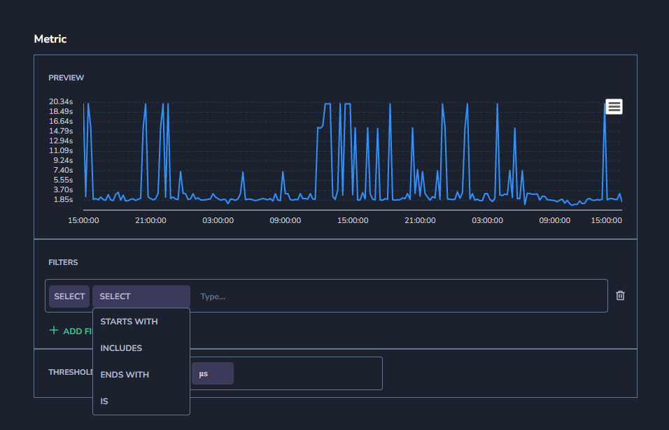

**STEP 6.** Select the percentage and the period for which the SLO is valid. For example, 90% for 7 days means that the SLO is valid as long as the error rate over seven days is no higher than 90%.

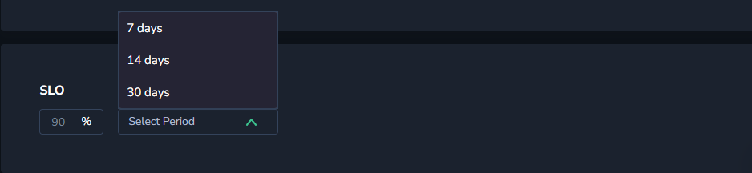

**STEP 7.** Click **ADD NEW.**

## Resources

The Resources tab presents resources used by the service.

The resources in this tab present CPU utilization, memory used (bytes), and network usage (bytes) for the timeframe selected in the top bar.

## Logs

The Logs tab presents all related logs for the selected service.

On the right-hand side of the logs tab, click **OPEN LOG QUERY** to open a new tab with the logs open in your Coralogix [Explore Screen](https://coralogixstg.wpengine.com/docs/explore-screen/).

Set up **Correlation Mapping** to allow your system to identify the fields in a log that are related to the service. The feature does this by mapping a single key to one or more replacement keys in the service’s logs.

**STEP 1.** Click **Setup Correlation** on the right-hand side of the logs tab.

**STEP 2.** Select the replacement logs key from the dropdown menu.

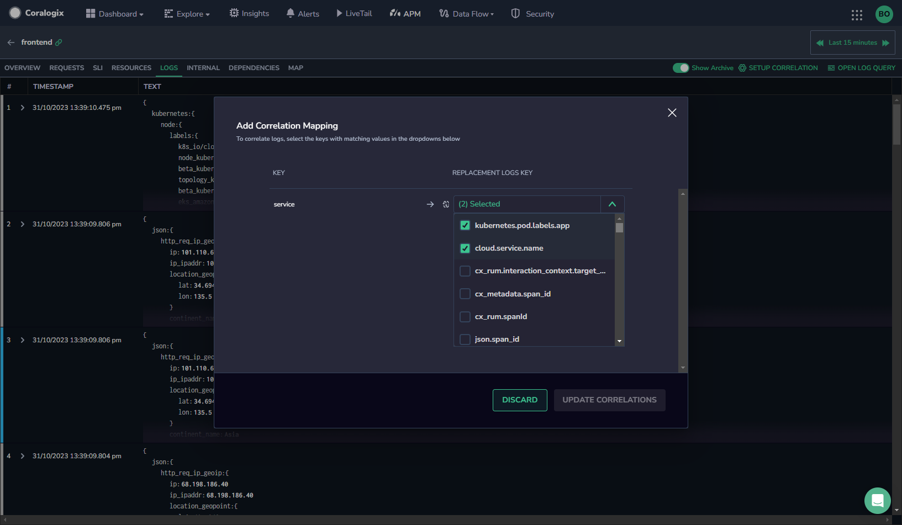

**STEP 3.** Click **UPDATE CORRELATIONS**.

You can see a deeper drill-down of each operation by clicking on an operation row.

## Map

The Map tab displays the service map centered on a selected service.

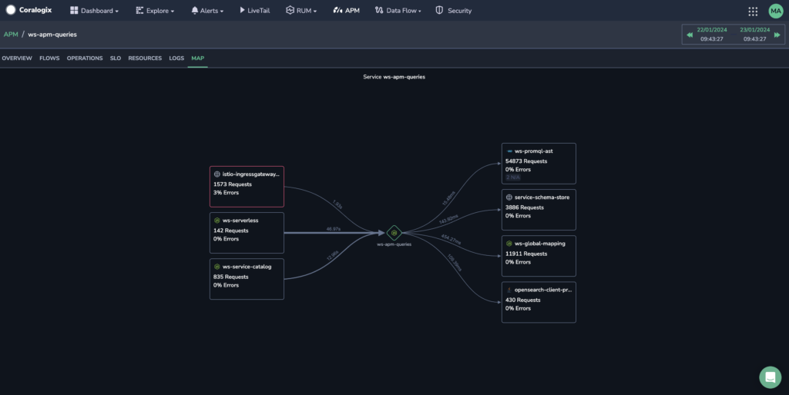

Services that **send** requests to the selected service are shown on the left.

Services that **receive** requests from the select service are displayed on the right.

The latency for each is presented on the line between the services, the thickness of which changes according to the latency. The thicker the line, the greater the latency.

Where multiple services have an error rate greater than 0%, the service with the highest error rate is encircled in red.

Hovering over a service shows a tooltip with the service's throughput, error rate, and average duration in relation to the central service.

Clicking on a service brings up a context menu with the option to view the Service Overview, its errors, traces, or related logs.

### Dynamic View

The Map view dynamically changes depending on the size of your screen. On larger screens, you can see the throughput, error rate, and SLO status in a box with the service name. All of the information presented relates to the central service, except for SLO status, which is provided for each service.

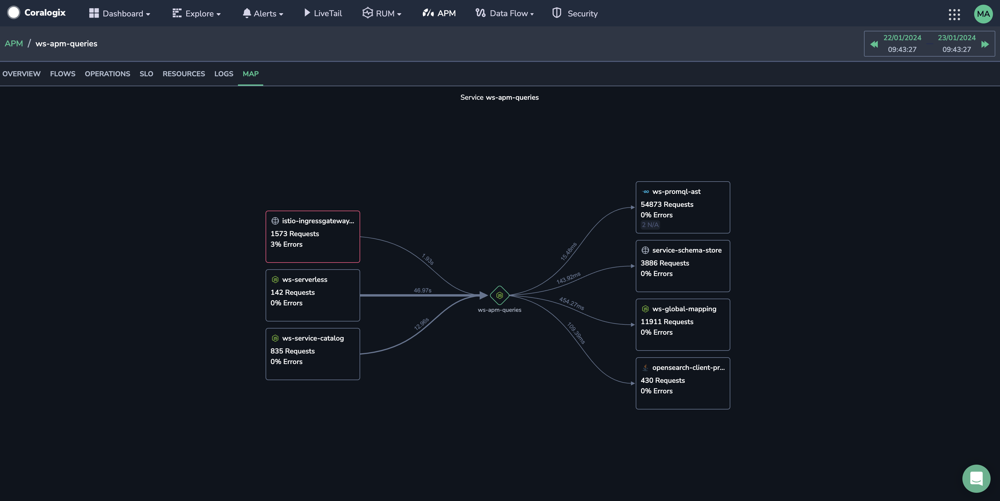

On smaller screens, the service name is shown to the side of a circular icon, and the rest of the information moves into a tooltip.

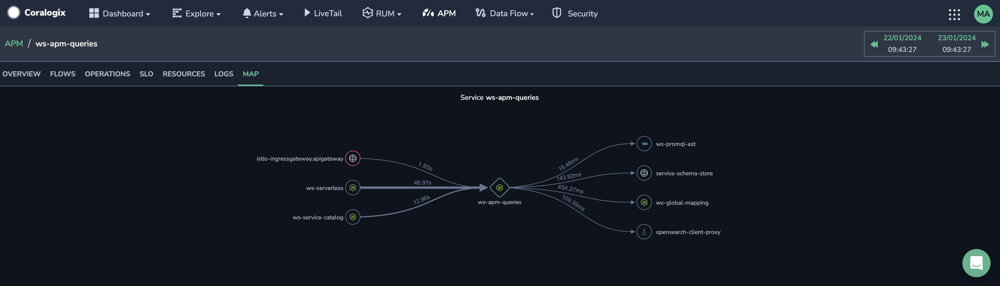

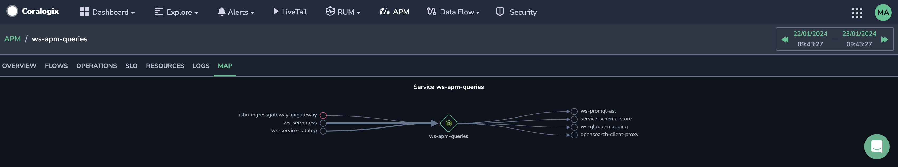

## Additional Resources

<table><tbody><tr><td>Documentation</td><td><strong><a href="https://coralogixstg.wpengine.com/docs/apm/">Application Performance Monitoring (APM)</a></strong> <strong><a href="https://coralogixstg.wpengine.com/docs/apdex-score/">Apdex Score</a></strong></td></tr></tbody></table>

## Support

**Need help?**

Our world-class customer success team is available 24/7 to walk you through your setup and answer any questions that may come up.

Feel free to reach out to us **via our in-app chat** or by sending us an email at [support@coralogixstg.wpengine.com](mailto:support@coralogixstg.wpengine.com).
