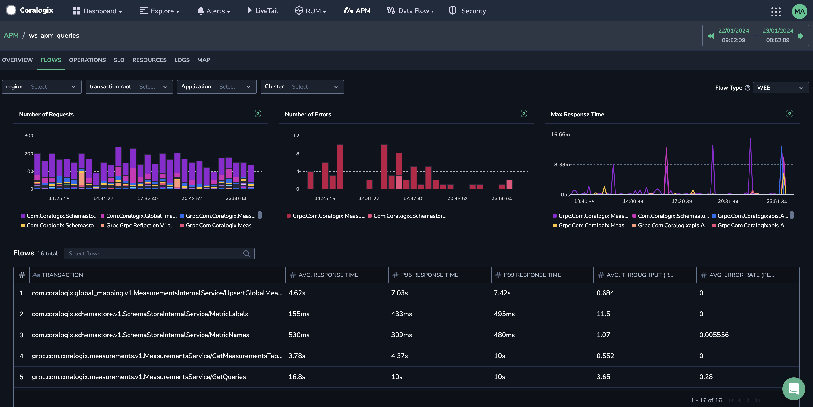
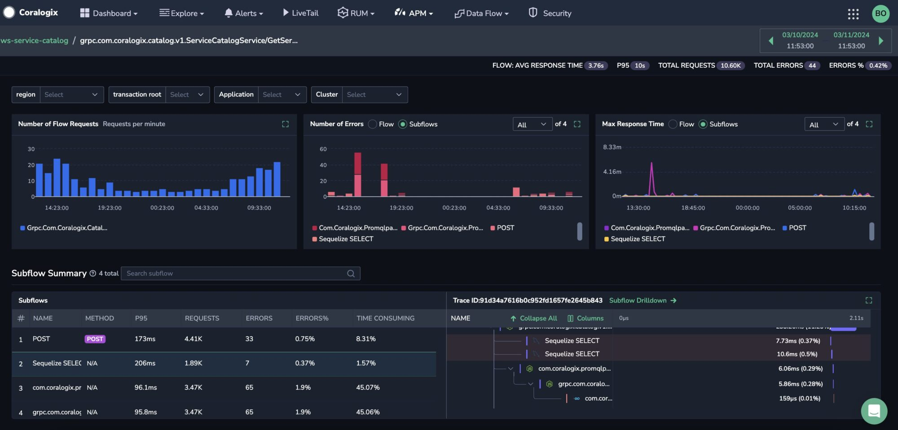
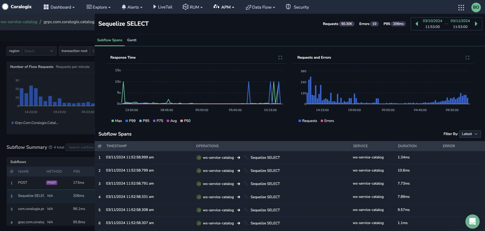
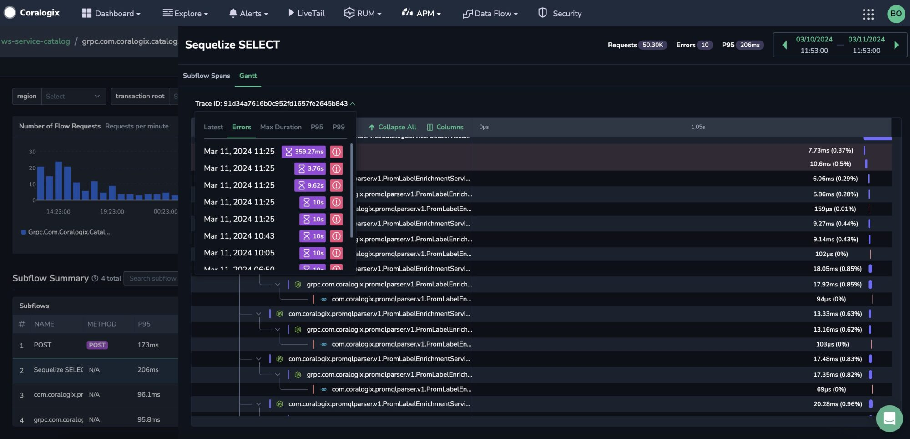

Purpose-built for microservices-based environments, the Coralogix **Service Flows** feature allows you to rapidly investigate the radius of the impact of different services over time and troubleshoot issues immediately as part of [Application Performance Monitoring](https://coralogixstg.wpengine.com/docs/apm/).

To enjoy the feature, contact us via our in-app chat or by emailing [support@coralogixstg.wpengine.com](mailto:support@coralogixstg.wpengine.com).

## Overview

Use Service Flows to:

- Investigate the performance of each service flow by breaking it down into its constituent operations.

- Gain a granular understanding of how each sub-flow, a collection of related operations, affects the performance of the entire service flow over time.

- Rapidly identify and troubleshoot the sub-flows causing performance issues over time.

## Concepts

A user visits an e-commerce website and clicks on a product to view its details. This action initiates a **service flow**. The flow begins when the user's request reaches a service and ends when the service sends back the product details as a response. During this flow, several operations occur: the service might query a database to retrieve the product information, call external services for current pricing, and execute internal logic to prepare the content for display. Each of these **operations** represents a **sub-flow**. The service flow breakdown shows how these sub-flows collectively contribute to the request's overall response time and performance.

### Service Flow

Simply put, a **service flow** denotes a singular logical unit of work in a software application. More precisely, it encompasses the function and method calls constituting that unit of work. Each flow consists of a root span, an operation that serves as its entry point and triggers all other related operations.

### Operation

Every service flow may contain hundreds, if not thousands of spans, grouped per operation name. An **operation** is a logical entity consolidating all spans with the same action type.

### Sub-Flow

A **sub-flow** is a collection of related operations, the constituent functions that break down the various **service operations** into a service flow and collectively structure its performance. Examples include external service calls and database calls. Each sub-flow provides insights into its performance and how it affects the flow over time.

Coralogix’s APM captures and monitors the performance metrics associated with each sub-flow, making up the service flow. This information helps identify bottlenecks, optimize code, and ensure a smooth and efficient user experience during the entire purchase process.

## Service Flows v. Distributed Tracing

What is the difference between Service Flows and [Distributed Tracing](https://coralogixstg.wpengine.com/docs/distributed-tracing/)?

The primary distinction between Service Flows and Distributed Tracing features is the analysis context and depth. Service Flows examine the entire sequence of events over time within a service. This method thoroughly explains how different parts of the flow interact and evolve, providing deep insights into the internal dynamics of service requests.

While Distributed Tracing is adept at capturing snapshots of individual operations at specific moments, it does not effectively identify long-term bottlenecks within the overall flow. Service Flows addresses this by delivering a detailed analysis that helps pinpoint and comprehend the underlying causes of performance issues across the entire service flow.

In essence, the Service Flows feature enhances the capabilities of Distributed Tracing by examining the collective impact of operations within a service flow, thus offering a more comprehensive view of their influence on the flow's performance over time.

## Instrumentation

Users must configure custom instrumentation to define, report, and monitor service flows. Doing so connects all sub-flows or service operations to a particular service flow.

To add sub-flows to a service flow, use custom instrumentation for any of the following languages:

- [Node.js](https://coralogixstg.wpengine.com/docs/node-js/#service-flows)

- [Java](https://coralogixstg.wpengine.com/docs/java-opentelemetry-instrumentation/#service-flows)

- [Python](https://coralogixstg.wpengine.com/docs/capture-opentelemetry-traces-from-your-python-applications/#service-flows)

- [Golang](https://coralogixstg.wpengine.com/docs/golang-open-telemetry-instrumentation/#service-flows)

## Monitoring Service Flows

The **Service Flow** **Screen** lets you identify service flows that may be good candidates for fine-tuning performance problems or resolving errors. It presents a high-level overview of the selected app's service flows, presented as operations.

**STEP 1**. To view information about your app's service flows, navigate to **APM** > **Service Flows** from your Coralogix toolbar.

**STEP 2**. Select the Flow Type and filter to view the service flows of interest.

- Flow types include:
    - **Web Flow**: Responds to external requests
    
    - **Pub-Sub Flow**: No expected responses (e.g., message queues)
    
    - **Internal Flow**: Self-triggered flows (e.g., shutdown operations)

- Once you have defined your view, the service flows' response time, throughput, and error rate will be displayed visually.

- A grid will display all of the service flows matching your filter specifications. For each, you will be presented with average response time, P95 response time, average throughput (RPM), and error rate (per minute).

**STEP 3**. Clicking on a service flow for further investigation will transfer you to the **Sub-Flow Screen.**

## Monitoring Sub-Flows

The **Sub-Flow Screen** summarizes the performance of the succeeding operations of the flow root operation, the entry point for your service flow.

### Visualize Sub-Flow Performance

View the number of flow requests, errors, and maximum response times for your service sub-flows. Performance is presented in bar and line charts for the time frame chosen.

### Contextualize Sub-Flows

Each row of the **Sub-Flow Summary** presents a sub-flow, a collection of related operations, with its performance over time.

Hover over a sub-flow to view the exact placement of its constituent spans within a trace in Gantt view. This allows you to pinpoint the sub-flow with the greatest impact on the flow behavior over a specific timeframe. As spans do not appear as part of a trace linearly, you can move between spans to investigate each span and its connections within the flow further.

Hover over a sub-flow and click on the diagonal arrow to access an action menu for each sub-flow: drill down, obtain a trace link, export to JSON, view the raw span, or see the entire trace map.

### Investigate Spans & Traces

Click on the **Sub-Flow Drill-Down** to investigate a sub-flow further.

Under the **Sub-flow Spans** tab, you will be presented with a full list of spans that comprise the particular sub-flow, each with contextual data.

To focus on particular spans, click on a point in time on the graphs at the top of the page, presenting average span response times, requests, and errors within a sub-flow.

Under the **Gantt** and **Map** tabs, select to view a trace from the dropdown menu. Sort traces using the following categories: most recent, max errors, max duration, above P95 and P99.

## Additional Resources

<table><tbody><tr><td>Documentation</td><td><strong><a href="https://coralogixstg.wpengine.com/docs/apm/">Introduction to Application Performance Monitoring</a></strong></td></tr></tbody></table>

## Support

**Need help?**

Our world-class customer success team is available 24/7 to walk you through your setup and answer any questions that may come up.

Contact us **via our in-app chat** or by emailing [support@coralogixstg.wpengine.com](mailto:support@coralogixstg.wpengine.com).
