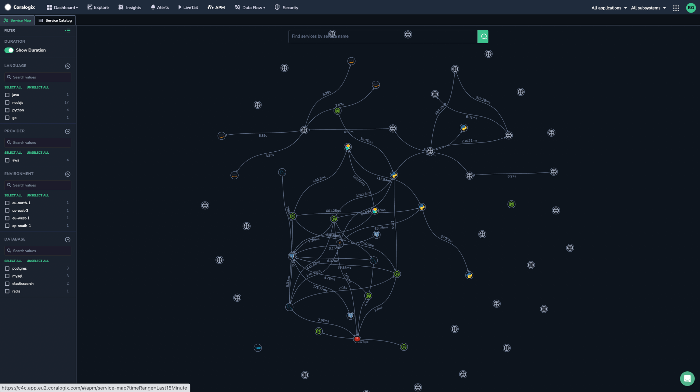
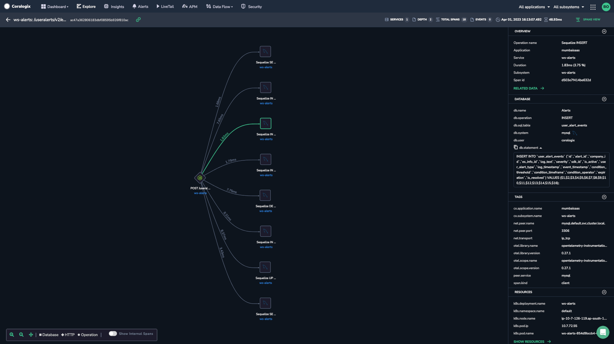

The **Service Map** fully visualizes your system architecture, breaking down your application into all its constituent services and drawing the observed dependencies between them in real-time based on your [distributed tracing](https://coralogixstg.wpengine.com/docs/distributed-tracing/).

## Setup

**Service Map** requires that Coralogix **Application Performance Monitoring (APM)** be [installed and configured](https://coralogixstg.wpengine.com/docs/apm/#installation--configuration).

## Span Attributes

Certain services require the following attributes to be defined for them to be identified in the **Service Map**.

### [AWS S3](https://opentelemetry.io/docs/specs/semconv/object-stores/s3/)

| Attribute | Type | Description |
| --- | --- | --- |
| `span.kind` | string | Set to `CLIENT`, as it's an external call |
| `rpc.system` | string | Set to `aws-api` |
| `rpc.service` | string | Contains S3 or tag with prefix `aws.s3` |
| `aws.s3.bucket` | string | The name of the S3 will be retrieved from this attribute. If missing, S3 will be used |

We also identify AWS S3 spans based on the specific S3 icon.

### [Kafka](https://opentelemetry.io/docs/specs/semconv/messaging/kafka/)

| Attribute | Type | Description |
| --- | --- | --- |
| `span.kind` | string | In one match (call), Kafka can be either a destination or source service.  
Set to `PRODUCER` if Kafka is the destination service.  
Set to `CONSUMER` if Kafka is the source service. |
| `messaging.system` | string | Set to `kafka` |
| `messaging.destination` or `messaging.destination.name` | string | Name of the topic and will represent the name in the Coralogix UI: “kafka topic <x>” |

We also identify Kafka spans based on the specific Kafka icon.

### [RabbitMQ](https://opentelemetry.io/docs/specs/semconv/messaging/rabbitmq/)

| Attribute | Type | Description |
| --- | --- | --- |
| `span.kind` | string | In one match (call), RabbitMQ can be either a destination or source service.  
Set to PRODUCER if Kafka is the destination service.  
Set to CONSUMER if Kafka is the source service. |
| `messaging.system` | string | Set to `rabbitmq` |
| `messaging.destination` or `messaging.destination.name` | string | Name of the topic and will represent the name in the UI: “RabbitMQ <x>” |

We also identify RabbitMQ spans based on the specific RabbitMQ icon.

### [Redis](https://opentelemetry.io/docs/specs/semconv/database/redis/)

| Attribute | Type | Description |
| --- | --- | --- |
| `span.kind` | string | Set to `CLIENT`, as it's an external call |
| `db.system` | string | Set to `redis` |
| `db.name` + `db.redis.database_index` | string | This will be the name of the database. If one of the attributes is missing, the one that is included will be used. |

## How It Works

The **Service Map** offers insights into your services and their well-being, effectively cutting through extraneous information to pinpoint problematic areas.

### Access the Service Map

To access this feature, navigate to **APM** > **Service Map** in your Coralogix toolbar.

### Visualize Traces

View a visualization of your traces, organized into clusters. In the left-hand sidebar, filter by LANGUAGE, PROVIDER, ENVIRONMENT, DATABASE, and/or ERROR TYPE.

### Identify Service Dependencies

The service map presents a comprehensive overview of a service's dependencies, encompassing connections in various environments. Hover over and click on a service point to view all of its associated information. Search for a service using the search function.

## **Additional Resources**

<table><tbody><tr><td><strong>Documentation</strong></td><td><a href="https://coralogixstg.wpengine.com/blog/application-performance-monitoring-visibility/"><strong>Application Performance Monitoring (APM)</strong></a> <strong><a href="https://coralogixstg.wpengine.com/docs/distributed-tracing/">Distributed Tracing</a></strong></td></tr><tr><td><strong>Blog</strong></td><td><strong><a href="https://coralogixstg.wpengine.com/blog/application-performance-monitoring-visibility/">One Click Visibility: Coralogix Expands APM Capabilities to Kubernetes</a></strong></td></tr></tbody></table>

## **Support**

**Need help?**

Our world-class customer success team is available 24/7 to walk you through your setup and answer any questions that may come up.

Feel free to reach out to us **via our in-app chat** or by sending us an email at **[support@coralogixstg.wpengine.com](mailto:support@coralogixstg.wpengine.com)**.
