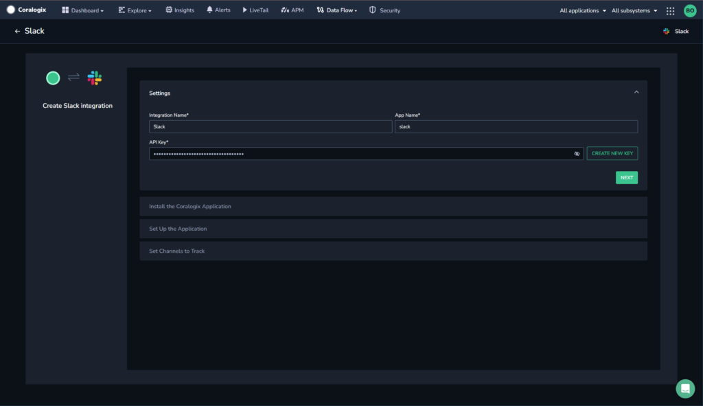
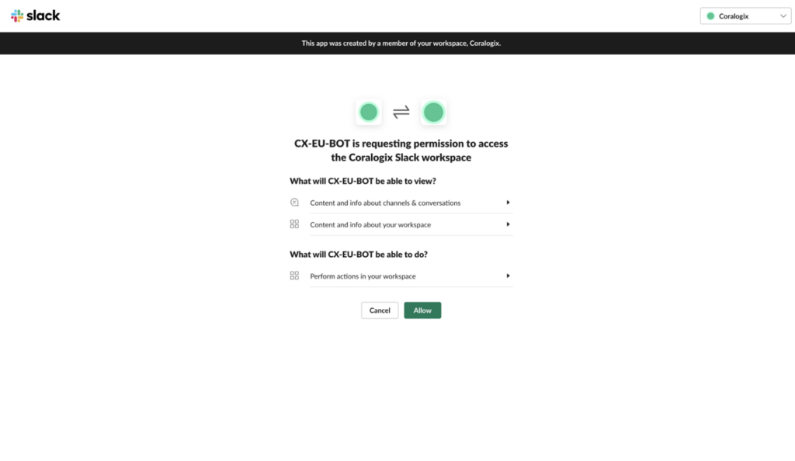

Collect your Slack messages in the Coralogix platform using our automatic **Contextual Data Integration Package**.

## Overview

Slack is a cloud-based collaboration platform designed to enhance communication and teamwork within organizations. It offers teams and individuals the ability to communicate in real time through channels organized by topics, projects, or teams, promoting efficient information sharing and reducing the reliance on email. Slack integrates various features such as instant messaging, file sharing, and third-party app integration, making it a versatile tool for remote and distributed teams to collaborate, coordinate tasks, and streamline workflows effectively.

Collecting your Slack messages in Coralogix offers several benefits. By collecting Slack messages in Coralogix’s log management platform, you can gain a deeper understanding of communication patterns, identify trends, and gain additional context for events. This integration allows for improved collaboration tracking, performance monitoring, and compliance auditing, enabling your teams to enhance communication strategies, optimize workflows, and maintain a more secure and organized digital environment.

For example, if you have a channel that is defined as contextual data, by looking at Slack messages in Coralogix from that channel surrounding a specific event, you can gain additional context to the investigation of that event.

## Get Started

**STEP 1.** In your navigation pane, click **Data Flow** > **Contextual Data**.

**STEP 2.** In the **Contextual Data** section, select **SLACK** and click **+** **ADD NEW**.

**STEP 3.** Enter an integration name and application name, then click **CREATE NEW KEY** to generate a new API key.

**STEP 4.** Click **NEXT**.

**STEP 5.** Click **INSTALL** to install the Coralogix application on Slack. You’ll be redirected to the Slack application to install the Coralogix app. If you already have the Coralogix application on Slack, click **ALREADY INSTALLED** and skip the next step.

**STEP 6.** When prompted to do so, ensure you are working in the correct workspace (via the selection in the top right corner), then click **ALLOW**.

**STEP 7.** Link the Coralogix application for Slack to your Coralogix account by executing the displayed command in Slack.

**STEP 8.** Once you have executed the command, click **NEXT**.

**STEP 9.** Invite the Coralogix app to the channels you would like to monitor in Coralogix. You can do this by executing the command shown on the screen in the message field in Slack. You must repeat this step for each channel you want to monitor.

Note that EU is used in this example, but depending on your Coralogix **[domain](https://coralogixstg.wpengine.com/docs/coralogix-domain/)**, the wizard will change the snippet accordingly.

**STEP 10.** Click **FINISH**.

## Support

**Need help?**

Our world-class customer success team is available 24/7 to walk you through your setup and answer any questions that may come up.

Feel free to reach out to us **via our in-app chat** or by sending us an email at [support@coralogixstg.wpengine.com](mailto:support@coralogixstg.wpengine.com).
