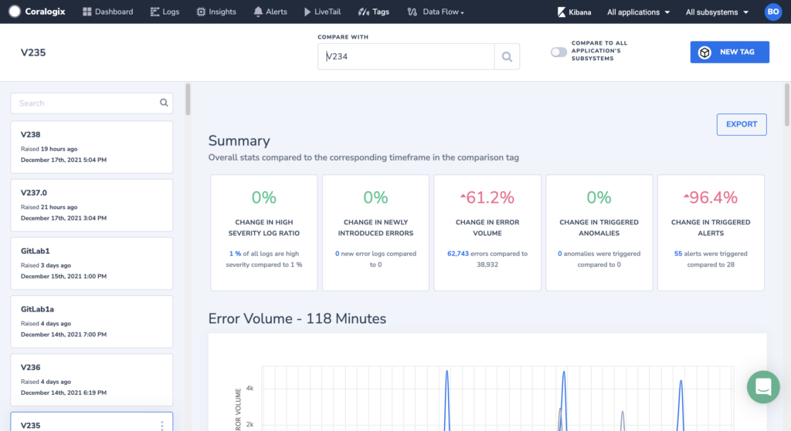
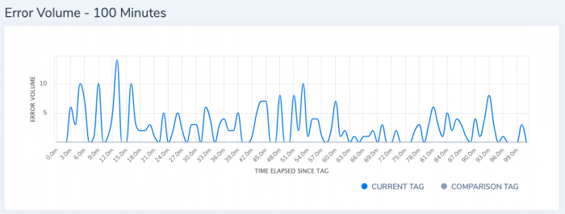
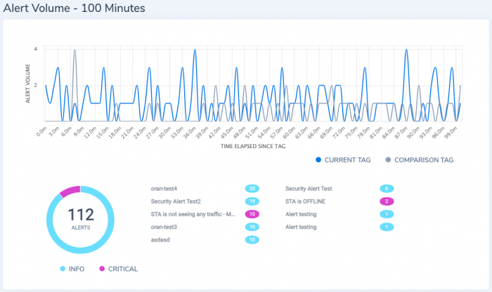
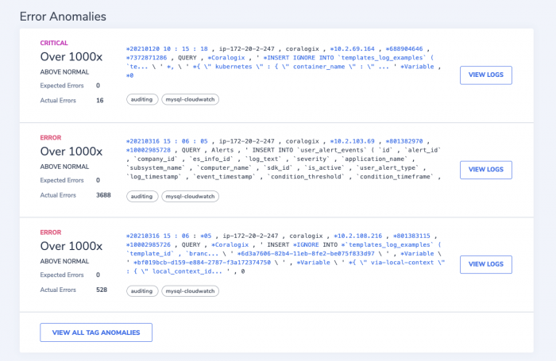
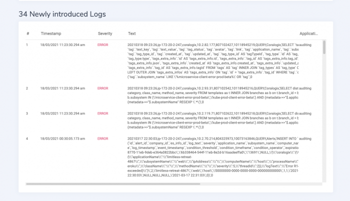
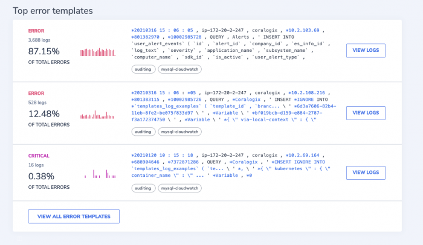

**Version Benchmarks** are the best way for you to understand your version status at a glance, integrate with your deployment pipeline, and get your latest build status. Whether it’s new exceptions, higher error ratios, or new broken flows - we've got you covered.

Version Benchmark tags can be used as a representation of any significant change or event that may impact your system. They can be received automatically from your CI/CD pipelines or inserted manually, they can be a new version, a new big customer, or a marker of the day when your dev team had sangria at lunch. 

## Dashboard

In your Coralogix UI, navigate to **Dashboard** \> **Version Benchmarks**. Integrate into your pipeline or manually add an event tag and get a full status in the context of your event.

### Overview

View the change in triggered anomalies, alerts, error volume, newly introduced errors, and high severity logs ratio since the tag time. Compare this to the corresponding timeframe in the comparison tag.

### Error Volume

View the number of errors since the tag in comparison to the period prior to the tag.

### Alert Volume

View the number of alerts since the tag, grouped by alert name and compared to the previous period.

### Error Anomalies

View the errors that arrived in numbers greater than their normal ratio since the tag.

### Newly Introduced Logs

Here you'll see logs that appeared on your system for the first time after the tag/build.

### Custom Widgets

View pre-defined Coralogix visualizations based on your own version quality criteria. Learn more about widgets here.

### Top Error Templates

View the top errors since the tag (maximum appearances).

## Deployment Pipelines

Integrate with any of the following deployment pipelines.

- [Bitbucket](https://coralogixstg.wpengine.com/docs/bitbucket-version-tags/)

- [Azure DevOps Server](https://coralogixstg.wpengine.com/docs/azure-devops-server-version-tags/)

- [GitLab](https://coralogixstg.wpengine.com/docs/gitlab-version-tags/)

- [Argo CD](https://coralogixstg.wpengine.com/docs/argo-cd-version-tags/)

- [Spinnaker](https://coralogixstg.wpengine.com/docs/spinnaker-version-tags/)

- [Heroku Pipelines](https://coralogixstg.wpengine.com/docs/heroku-logging/)

- [Version Tags using cURL](https://coralogixstg.wpengine.com/docs/version-tags-with-curl/)  
    

## Support

**Need help?**

Our world-class customer success team is available 24/7 to walk you through your setup and answer any questions that may come up.

Feel free to reach out to us **via our in-app chat** or by sending us an email at [support@coralogixstg.wpengine.com](mailto:support@coralogixstg.wpengine.com).
