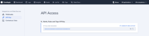
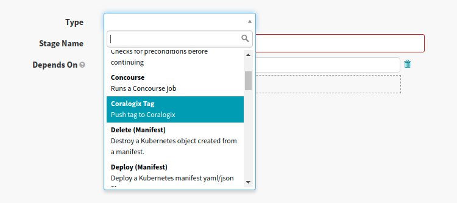
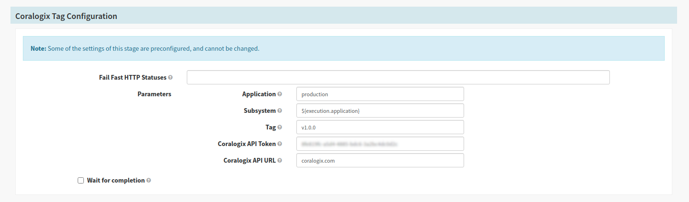

_Coralogix_ provides seamless integration with `Spinnaker` deployment pipelines so you can push tags to Coralogix automatically from your pipelines.

## Prerequisites

- Have `Spinnaker` deployed, for more information on how to deploy: [https://spinnaker.io/setup/](https://spinnaker.io/setup/)
- API Token - should be taken from _`Data Flow --> API Keys --> Alerts, Rules and Tags API Key`_



## [](https://github.com/coralogix/integrations-docs/blob/master/integrations/spinnaker/README.rst#configuration)Configuration

To create a custom webhook stage, you’ll need to add configuration for the stage in `orca-local.yml`.

Here is the content of **orca-local.yml**:

```
webhook:
  preconfigured:
    - label: Coralogix Tag
      type: coralogixTag
      enabled: true
      description: Push tag to Coralogix
      parameters:
        - label: Coralogix API URL
          name: url
          type: string
          description: Coralogix API endpoint
          defaultValue: coralogixstg.wpengine.com
        - label: Coralogix API Token
          name: token
          type: string
          description: Coralogix API Token
        - label: Tag
          name: tag
          type: string
          description: Tag Name
        - label: Application
          name: application
          type: string
          description: Application Name
        - label: Subsystem
          name: subsystem
          type: string
          description: Subsystem Name
      url: https://webapi.${parameterValues['url']}/api/v1/external/tags
      method: POST
      customHeaders:
      Authorization:
        - Bearer ${parameterValues['token']}
      Content-Type:
        - application/json
      payload: |-
        {
            "name": "${parameterValues['tag']}",
            "application": ["${parameterValues['application']}"],
            "subsystem": ["${parameterValues['subsystem']}"],
            "iconUrl": "https://raw.githubusercontent.com/coralogix/integrations-docs/master/integrations/spinnaker/images/spinnaker.png"
        }
```

After you create a custom configuration, redeploy your `Spinnaker` instance with `Halyard`:

```
$ hal deploy apply
```

## [](https://github.com/coralogix/integrations-docs/blob/master/integrations/spinnaker/README.rst#usage)Usage

Add a new stage to push the tag to _Coralogix_:

[](https://github.com/coralogix/integrations-docs/blob/master/integrations/spinnaker/images/1.png)

Configure stage to push tag to your account:

[](https://github.com/coralogix/integrations-docs/blob/master/integrations/spinnaker/images/2.png)

**Note:** You can use Spinnaker [pipeline expressions](https://spinnaker.io/reference/pipeline/expressions/) to define parameters for the tag.
