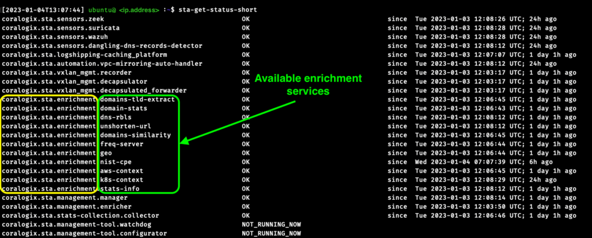
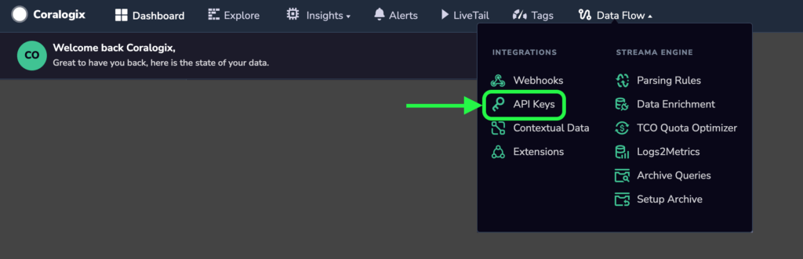
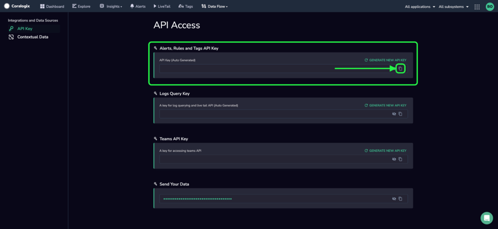

The Coralogix Security Traffic Analyzer (STA) collects data using internal enrichment services, including AWS, Kubernetes, and / or geographical information.

It sends those enrichments to Coralogix as CSV files per service, allowing you to enrich any of your logs with additional enriched fields, even if the source is not STA!

Connect all types of logs sent to Coralogix’s platform and improve readability, deepen your understanding of your environments, and reduce investigation time dramatically over large content of logs from different sources.

All custom enrichment files can be found on Coralogix’s platform under `Data Flow -> Data Enrichment` section.

## Enrichment Types

STA collects enrichments using several services which are running in the background.

To see the full list of STA’s enrichment modules, run the following command inside STA: `sta-get-status-short`

In the console, you’ll find all running services inside STA, and their current status. See the example below:



All rows with the prefix: `coralogix.sta.enrichment` represent different services that handle STA's enrichments.

Currently from the example above we can see the following services:

1. `domains-tld-extract`

3. `domain-stats`

5. `dns-rbls`

7. `unshorten-url`

9. `domains-similarity`

11. `freq-server`

13. `geo`

15. `nist-cpe`

17. `aws-context`

19. `k8s-context`

21. `stats-info`

**Note**: We are constantly improving and extending the STA, and more services might be added/modified.

## Configuration

In order to enable this service, an `Alerts API key` must be provided.  
To find the key, please head to `Data Flow -> API Keys`.



There you'll find the relevant key under the name `Alerts, Rules and Tags API Key`.

<figure>



<figcaption>

copy alerts API key

</figcaption>

</figure>

After you've copied the key, head to your `sta.conf` file that can be configured locally in STA or using Amazon S3 bucket, and search for `"coralogix"` JSON key (you'll see that you already provided there your `"private_key"`).  
Add the following:  

```
{
    "coralogix": {
        ...you will find here your private key specification and other params...,
        "coralogix_alerts_api_key": "<YOUR_COPIED_ALERTS_API_KEY>",
    }
}
```

### Structure

The service configuration is also located in `sta.conf` with the following structure:

```
{
    "sensors": {
        "custom_enrichment_producer": {
            "log_level": "TRACE" | "DEBUG" | "INFO" | "WARN" | "ERROR",
            "file_modification_minutes_threshold": int,
            "max_csv_rows": int,
            "enable": bool,
            "customized_services": [
                {
                    "name": str,
                    "headers": [str]
                }
            ],
            "disabled_for_services": [str],
            "other_services_enabled": bool,
        }
    }
}
```

### Default Values

```
log_level: INFO

file_modification_minutes_threshold: 10

max_csv_rows: 9000

enable: true

customized_services: []

disabled_for_services: []

other_services_enabled: true
```

### Variables explanation

<table><tbody><tr><td><strong>Name</strong></td><td><strong>Type</strong></td><td><strong>Constraints</strong></td><td><strong>Description</strong></td></tr><tr><td><code>log_level</code></td><td><code>Predefined string</code></td><td>Possible values:&nbsp; <code>"TRACE"</code>, <code>"DEBUG"</code>,&nbsp; <code>"INFO"</code>, <code>"WARN"</code>, <code>"ERROR"</code></td><td>The lowest log level to be shown in the console</td></tr><tr><td><code>file_modification_minutes_threshold</code></td><td><code>int</code></td><td><code>1 ≤ x ≤ 60</code></td><td>Number of minutes threshold of idleness before sending enrichments to Coralogix. This can happen when no new enrichments are found by the STA in a given period of time.</td></tr><tr><td><code>max_csv_rows</code></td><td><code>int</code></td><td><code>2 ≤ x ≤ 10000</code></td><td>Number of lines threshold per CSV file. if this threshold is reached, the file is sent to Coralogix, and a new file is created afterward.</td></tr><tr><td><code>enable</code></td><td><code>boolean</code></td><td></td><td>enable/disable service. By default set to true.</td></tr><tr><td><code>customized_services</code></td><td><code>Array of objects</code></td><td>Please see 2 rows below for object representation</td><td>Leave an empty array to include all services without specific configuration.</td></tr><tr><td><code>customized_services.name</code></td><td><code>str</code></td><td>Predefined service names. Please see the section “Enrichment Types”.</td><td>Names of the services to enable, if only the names are specified, only those services will be enabled. See “headers” below for additional configuration.</td></tr><tr><td><code>customized_services.headers</code></td><td><code>Array of strings</code></td><td>Be sure that you know what headers you want as once you specify, only those will be searched, and others will be dropped.</td><td>Representing the headers extracted into the service’s enrichment CSV - and only those. Leave an empty array to include all possible headers.</td></tr><tr><td><code>disabled_for_services</code></td><td><code>Array of strings</code></td><td>Predefined service names. Please see the section “Enrichment Types”.</td><td>Defines what services to exclude from CSV files.</td></tr><tr><td><code>other_services_enabled</code></td><td><code>boolean</code></td><td></td><td>Enable other services that are not specified in the variable: <code>customized_services</code>. Find additional information and use cases below.</td></tr></tbody></table>

### Use-Cases

For a better understanding of how those variables interact with STA, let’s see some use cases below.

Let’s assume that we want to disable `aws-cotext` enrichment service from sending CSVs to Coralogix. Our configuration should be as followed:

```
{
    "sensors": {
        "custom_enrichment_producer": {
            "disabled_for_services": ["aws-context"],
        }
    }
}
```

As mentioned, the other values will receive their default values and only the specified service will be disabled.

Now let's assume that we want to configure `geo` with specific headers: `country`, `zone`, `coordinate.x`, `coordinate.y`. In addition, we want to enable only `aws-context` and `k8s-context` services without configuration. Our configuration should be as followed:

```
{
    "sensors": {
        "custom_enrichment_producer": {
          "customized_services": [
            {
              "name":"geo",
              "headers": ["country","zone",".x", "coordinate.y"]
            },
            {
              "name":"aws-context",
              "headers": []
            },
            {
              "name":"k8s-context",
              "headers": []
            }
          ],
        "disabled_for_services": [],
        "other_services_enabled": false,
        }
    }
}
```

Finally, let's assume again that we want to configure `geo` with specific headers: `country`, `zone`, `coordinate.x`, `coordinate.y`. In addition, we want all other services to enrich without configuration except the service `nist-cpe` which should be disabled. Our configuration should be as followed:

```
{
   "sensors": {
       "custom_enrichment_producer": {
          "customized_services": [
            {
              "name":"geo",
              "headers": ["country","zone","coordinate.x", "coordinate.y"]
            }
          ],
          "disabled_for_services": ["nist-cpe"],
          "other_services_enabled": true,
       }
   }
}
```
