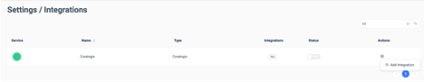
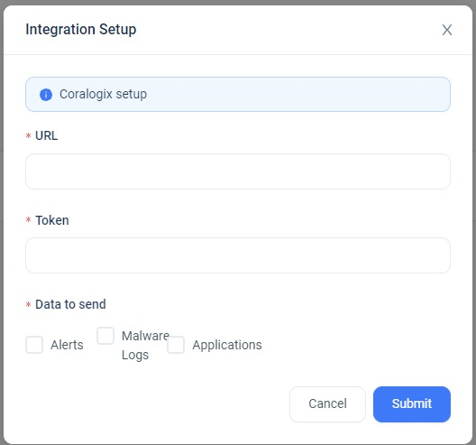
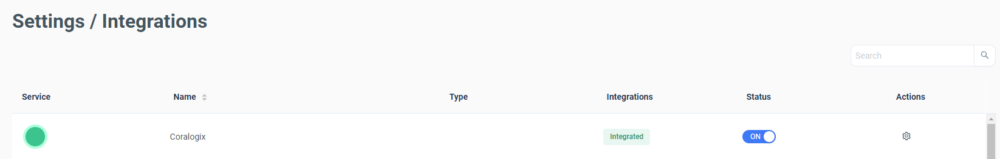
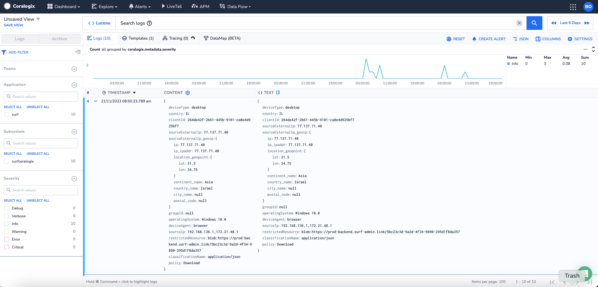

Seamlessly integrate your SURF logs with Coralogix.

## Overview

[SURF](https://www.surf.security/) empowers users with unparalleled flexibility in their work, allowing secure interaction with applications, data, and peers. Addressing a long-overlooked business asset, the browser, SURF Security transforms it into a robust security layer, ensuring complete end-user privacy with full compliance. Through an identity-first approach, SURF grants secure and seamless access to all SaaS and corporate assets via a centralized platform, enhancing security, performance, and productivity for end-users and applications.

The integration process involves configuring SURF to transmit events, logs, and application administrative changes to Coralogix.

## Prerequisites

- Admin access to your SURF account

## SURF Admin Configuration

**STEP 1**. Navigate to the SURF [admin console](https://admin.surf-admin.link/).

**STEP 2**. From your toolbar, navigate to **Settings** > **Integrations**.

**STEP 3**. Search for **Coralogix** and add the integration by clicking the gear icon on the right.

**STEP 4**. Update the Token with your Coralogix [Send-Your-Data-API-key](https://coralogixstg.wpengine.com/docs/send-your-data-api-key/?embedded=true) and the URL with your Coralogix [domain](https://coralogixstg.wpengine.com/docs/coralogix-domain/?embedded=true).

**STEP 5**. Select all the relevant checkboxes for the data to be sent. Click **Submit**.

**STEP 6**. Ensure that the integration is enabled and the status is "on".

**STEP 7**. View your logs in your Coralogix [Explore screen](https://coralogixstg.wpengine.com/docs/explore-screen/).

## Support

**Need help?**

Our world-class customer success team is available 24/7 to walk you through your setup and answer any questions that may come up.

Feel free to reach out to us **via our in-app chat** or by sending us an email at [support@coralogixstg.wpengine.com](mailto:support@coralogixstg.wpengine.com).
