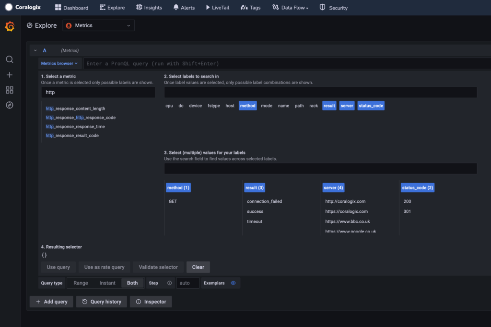
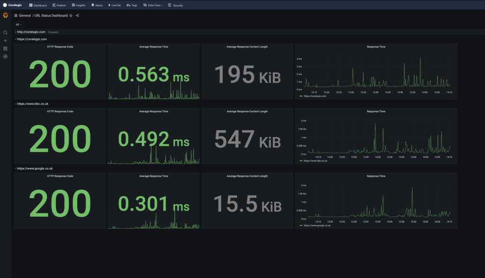

Synthetic monitoring is critical for identifying and resolving production events, as it allows companies to proactively monitor the availability and performance of their applications and websites. By simulating real user interactions with these systems, synthetic monitoring can help identify potential issues before they affect real users.

This guide outlines the steps required to use the [Coralogix Telegraf integration](https://coralogixstg.wpengine.com/docs/telegraf/) to monitor response codes and response times of URLs and ship the metrics to Coralogix.

This configuration makes use of the Telegraf plugin `inputs.http_response`. This plugin allows you to provide a list of URLs to Telegraf which will then attempt to connect to each URL and provide the following metrics:

- http\_response\_content\_length

- http\_response\_http\_response\_code

- http\_response\_response\_time

- http\_response\_result\_code

## Prerequisites

1\. [Sign up](https://signup.coralogixstg.wpengine.com/#/) for a Coralogix account. Set up your account on the Coralogix [domain](https://coralogixstg.wpengine.com/docs/coralogix-domain/) corresponding to the region within which you would like your data stored.

2\. [Install](https://docs.influxdata.com/telegraf/v1.21/introduction/installation/) and [configure](#configuration) Telegraf.

## Configuration

1\. Once you have [configured](#configuration) Telegraf, add the following code into your configuration file:

```
[[inputs.http_response]]
  ## Server address (default http://localhost)
  urls = ["https://coralogixstg.wpengine.com"]

  ## Set response_timeout (default 5 seconds)
  # response_timeout = "5s"

  ## Whether to follow redirects from the server (defaults to false)
  follow_redirects = true
```

You are **required** to input the following variables:

- `urls` (**line 3**): Change the values within this list to the URLs that you wish to monitor.

- `response_timeout` (**line 6**): If the URLs that are being monitored usually take longer than 5 seconds to respond, we **recommend** to uncomment this line and increase the timeout value.

- `follow_redirects` (**line 9**): This instructs Telegraf to follow redirects. Setting this to `false` will disable this feature. Any URL that returns a redirect response code (e.g. `301` or `302`) will not appear as ‘Up’.

Further information on the available values within this configuration block can be found [here](https://github.com/influxdata/telegraf/tree/master/plugins/inputs/http_response).

2\. Once you have input the variables above, save the file and restart Telegraf. Telegraf will now start testing connectivity to the URLs and shipping the metrics to Coralogix.



3\. To loop over all monitored URLs and display metric data for each URL, upload the following Grafana Dashboard file to Coralogix hosted Grafana.

```
{
  "__inputs": [
    {
      "name": "DS_METRICS",
      "label": "Metrics",
      "description": "",
      "type": "datasource",
      "pluginId": "prometheus",
      "pluginName": "Prometheus"
    }
  ],
  "__requires": [
    {
      "type": "grafana",
      "id": "grafana",
      "name": "Grafana",
      "version": "8.2.6"
    },
    {
      "type": "datasource",
      "id": "prometheus",
      "name": "Prometheus",
      "version": "1.0.0"
    },
    {
      "type": "panel",
      "id": "stat",
      "name": "Stat",
      "version": ""
    },
    {
      "type": "panel",
      "id": "timeseries",
      "name": "Time series",
      "version": ""
    }
  ],
  "annotations": {
    "list": [
      {
        "builtIn": 1,
        "datasource": "-- Grafana --",
        "enable": true,
        "hide": true,
        "iconColor": "rgba(0, 211, 255, 1)",
        "name": "Annotations & Alerts",
        "target": {
          "limit": 100,
          "matchAny": false,
          "tags": [],
          "type": "dashboard"
        },
        "type": "dashboard"
      }
    ]
  },
  "editable": true,
  "fiscalYearStartMonth": 0,
  "gnetId": null,
  "graphTooltip": 0,
  "id": null,
  "iteration": 1670940529980,
  "links": [],
  "liveNow": false,
  "panels": [
    {
      "collapsed": true,
      "datasource": null,
      "gridPos": {
        "h": 1,
        "w": 24,
        "x": 0,
        "y": 0
      },
      "id": 2,
      "panels": [
        {
          "datasource": null,
          "fieldConfig": {
            "defaults": {
              "color": {
                "mode": "thresholds"
              },
              "mappings": [],
              "thresholds": {
                "mode": "absolute",
                "steps": [
                  {
                    "color": "green",
                    "value": null
                  },
                  {
                    "color": "#EAB839",
                    "value": 300
                  },
                  {
                    "color": "red",
                    "value": 400
                  }
                ]
              }
            },
            "overrides": []
          },
          "gridPos": {
            "h": 8,
            "w": 4,
            "x": 0,
            "y": 1
          },
          "id": 4,
          "options": {
            "colorMode": "value",
            "graphMode": "none",
            "justifyMode": "auto",
            "orientation": "auto",
            "reduceOptions": {
              "calcs": [
                "lastNotNull"
              ],
              "fields": "",
              "values": false
            },
            "text": {},
            "textMode": "auto"
          },
          "pluginVersion": "8.2.6",
          "repeat": null,
          "targets": [
            {
              "exemplar": true,
              "expr": "http_response_http_response_code{}",
              "format": "table",
              "instant": false,
              "interval": "",
              "legendFormat": "$url",
              "refId": "A"
            }
          ],
          "title": "HTTP Response Code",
          "transformations": [],
          "type": "stat"
        },
        {
          "datasource": null,
          "fieldConfig": {
            "defaults": {
              "color": {
                "mode": "thresholds"
              },
              "mappings": [],
              "thresholds": {
                "mode": "absolute",
                "steps": [
                  {
                    "color": "green",
                    "value": null
                  },
                  {
                    "color": "red",
                    "value": 80
                  }
                ]
              },
              "unit": "ms"
            },
            "overrides": []
          },
          "gridPos": {
            "h": 8,
            "w": 4,
            "x": 4,
            "y": 1
          },
          "id": 25,
          "options": {
            "colorMode": "value",
            "graphMode": "area",
            "justifyMode": "auto",
            "orientation": "auto",
            "reduceOptions": {
              "calcs": [
                "lastNotNull"
              ],
              "fields": "",
              "values": false
            },
            "text": {},
            "textMode": "auto"
          },
          "pluginVersion": "8.2.6",
          "targets": [
            {
              "exemplar": true,
              "expr": "avg(http_response_response_time{server=~\"$url\"})",
              "interval": "",
              "legendFormat": "",
              "refId": "A"
            }
          ],
          "title": "Average Response Time",
          "type": "stat"
        },
        {
          "datasource": null,
          "fieldConfig": {
            "defaults": {
              "color": {
                "mode": "fixed"
              },
              "mappings": [],
              "thresholds": {
                "mode": "absolute",
                "steps": [
                  {
                    "color": "green",
                    "value": null
                  }
                ]
              },
              "unit": "bytes"
            },
            "overrides": []
          },
          "gridPos": {
            "h": 8,
            "w": 4,
            "x": 8,
            "y": 1
          },
          "id": 23,
          "options": {
            "colorMode": "value",
            "graphMode": "none",
            "justifyMode": "auto",
            "orientation": "auto",
            "reduceOptions": {
              "calcs": [
                "lastNotNull"
              ],
              "fields": "",
              "values": false
            },
            "text": {},
            "textMode": "auto"
          },
          "pluginVersion": "8.2.6",
          "targets": [
            {
              "exemplar": true,
              "expr": "avg( http_response_content_length{server=~\"$url\"})",
              "interval": "",
              "legendFormat": "$url",
              "refId": "A"
            }
          ],
          "title": "Average Response Content Length",
          "type": "stat"
        },
        {
          "datasource": null,
          "fieldConfig": {
            "defaults": {
              "color": {
                "mode": "palette-classic"
              },
              "custom": {
                "axisLabel": "",
                "axisPlacement": "auto",
                "barAlignment": 0,
                "drawStyle": "line",
                "fillOpacity": 0,
                "gradientMode": "none",
                "hideFrom": {
                  "legend": false,
                  "tooltip": false,
                  "viz": false
                },
                "lineInterpolation": "linear",
                "lineWidth": 1,
                "pointSize": 5,
                "scaleDistribution": {
                  "type": "linear"
                },
                "showPoints": "auto",
                "spanNulls": false,
                "stacking": {
                  "group": "A",
                  "mode": "none"
                },
                "thresholdsStyle": {
                  "mode": "off"
                }
              },
              "mappings": [],
              "thresholds": {
                "mode": "absolute",
                "steps": [
                  {
                    "color": "green",
                    "value": null
                  },
                  {
                    "color": "red",
                    "value": 80
                  }
                ]
              },
              "unit": "ms"
            },
            "overrides": []
          },
          "gridPos": {
            "h": 8,
            "w": 7,
            "x": 12,
            "y": 1
          },
          "id": 12,
          "options": {
            "legend": {
              "calcs": [],
              "displayMode": "list",
              "placement": "bottom"
            },
            "tooltip": {
              "mode": "single"
            }
          },
          "targets": [
            {
              "exemplar": true,
              "expr": "http_response_response_time{server=~\"$url\"}",
              "format": "time_series",
              "interval": "",
              "legendFormat": "$url",
              "refId": "A"
            }
          ],
          "title": "Response Time",
          "type": "timeseries"
        }
      ],
      "repeat": "url",
      "title": "$url",
      "type": "row"
    }
  ],
  "schemaVersion": 32,
  "style": "dark",
  "tags": [],
  "templating": {
    "list": [
      {
        "allValue": null,
        "current": {},
        "datasource": "${DS_METRICS}",
        "definition": "label_values(server)",
        "description": null,
        "error": null,
        "hide": 1,
        "includeAll": true,
        "label": null,
        "multi": false,
        "name": "url",
        "options": [],
        "query": {
          "query": "label_values(server)",
          "refId": "StandardVariableQuery"
        },
        "refresh": 2,
        "regex": "",
        "skipUrlSync": false,
        "sort": 0,
        "type": "query"
      }
    ]
  },
  "time": {
    "from": "now-1h",
    "to": "now"
  },
  "timepicker": {},
  "timezone": "",
  "title": "URL Status Dashboard",
  "uid": "49vJ1HcVz",
  "version": 5
}


```

Your dashboard should then appear as follows:



## Support

**Need help?**

Our world-class customer success team is available 24/7 to walk you through your setup and answer any questions that may come up.

Feel free to reach out to us **via our in-app chat** or by sending us an email to [support@coralogixstg.wpengine.com](mailto:support@coralogixstg.wpengine.com).
