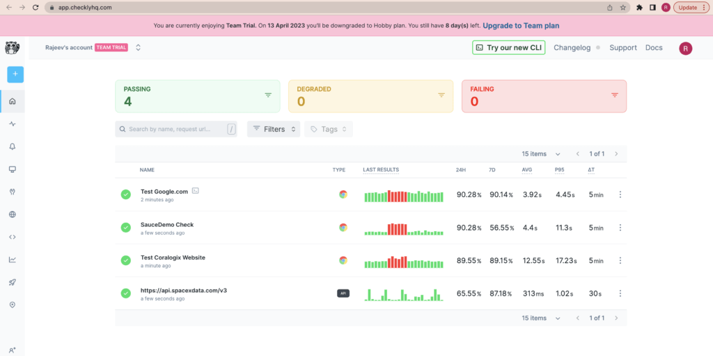
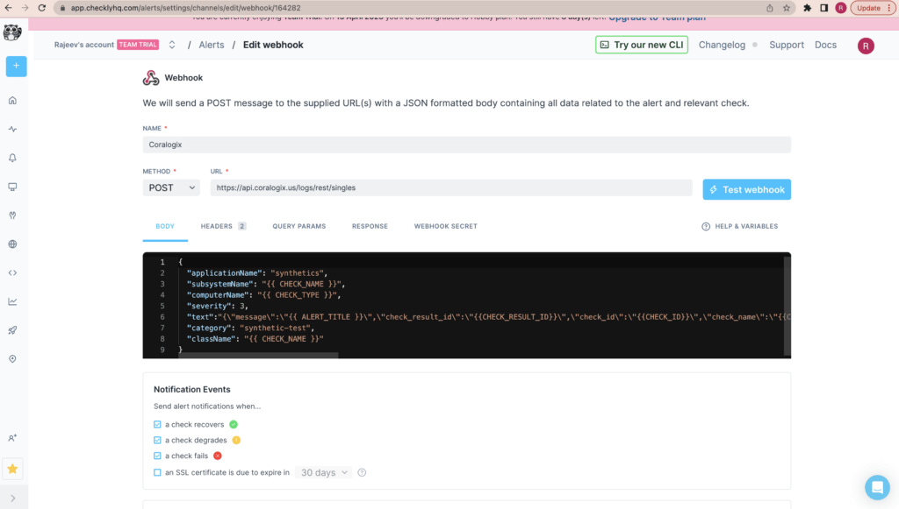
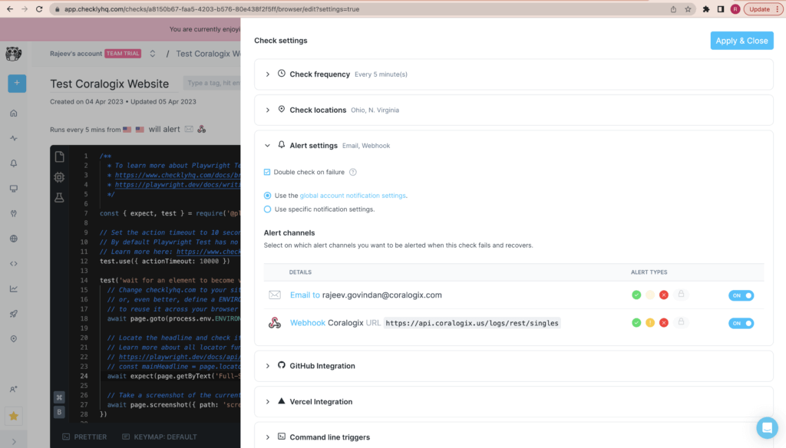
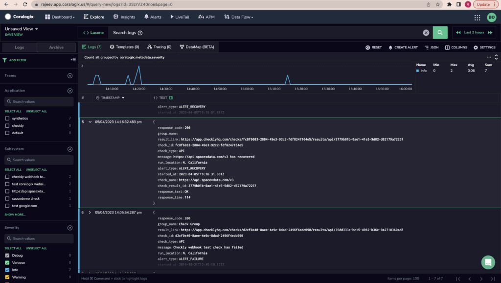
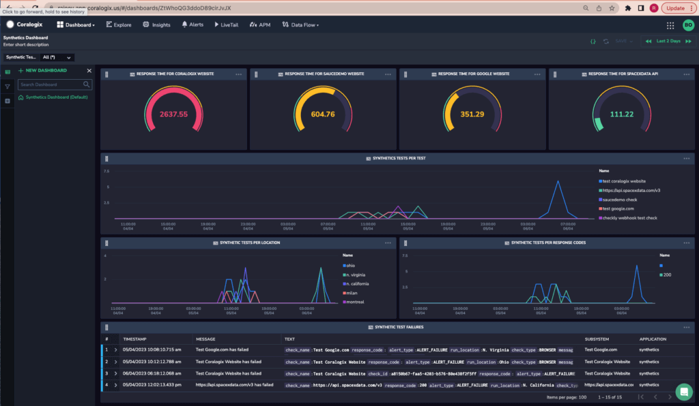
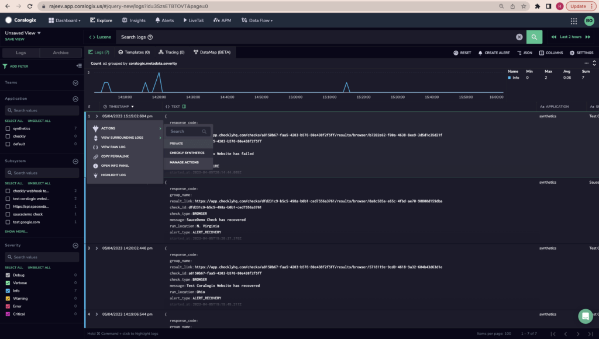
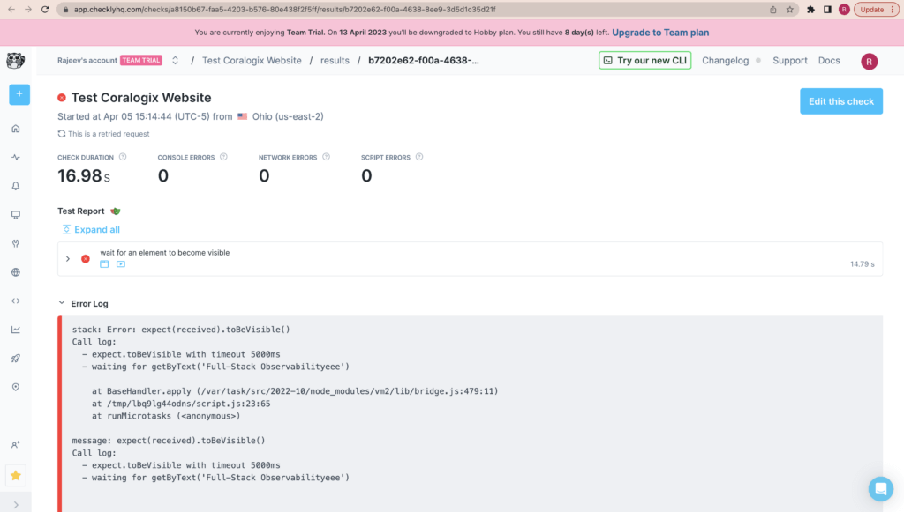

This tutorial demonstrates how to add synthetic capabilities to your Coralogix dashboard with [Checkly](https://www.checklyhq.com/), allowing you to view and query the results of your Checkly synthetic testing.

## Prerequisites

- Checky [account](https://auth.checklyhq.com/login?state=hKFo2SB1ZUhQNW9KeTV3c0ZOQ1BpMXZYVFFJNEFiUmZWNmpHRqFupWxvZ2luo3RpZNkgdS1FRGJhbFhVc3NuTnB4dzVhdUw2elliS2M5RHhKTDSjY2lk2SB4ZzZJTWFKWGY2UDNJWVBvT1pHOEd0cDZNWXZhSlBlVQ&client=xg6IMaJXf6P3IYPoOZG8Gtp6MYvaJPeU&protocol=oauth2&prompt=select_account&audience=https%3A%2F%2Fapi.checklyhq.com&redirect_uri=https%3A%2F%2Fapp.checklyhq.com&mode=signUp&scope=openid%20profile%20email&response_type=code&response_mode=query&nonce=enhIdjlRUmd%2BMXdnTHNqOGxyNjlOcmVEZGFJR0xWX3Ixa015dGFiTFFiMQ%3D%3D&code_challenge=tEyaXye6ORjk64plO5j6TMf2bcufhWGEGpmBx9-0KjQ&code_challenge_method=S256&auth0Client=eyJuYW1lIjoiYXV0aDAtc3BhLWpzIiwidmVyc2lvbiI6IjEuMjIuMyJ9)

## Setup

In your Checkly account, create [API](https://www.checklyhq.com/docs/api-checks) and / or [browser checks](https://www.checklyhq.com/docs/browser-checks) in your dashboard.



## Configuration

**STEP 1**. To integrate with Coralogix, define a webhook. In your Checkly navigation pane, select **Alerts** and define a new channel using the Coralogix [Rest API `/singles`](https://coralogixstg.wpengine.com/docs/coralogix-rest-api-singles/) using the endpoint associated with your Coralogix [domain](https://coralogixstg.wpengine.com/docs/coralogix-domain/).



The example above consists of the following JSON body. Note the importance of inputting [application and subsystem names](https://coralogixstg.wpengine.com/docs/application-and-subsystem-names/).

```
{ 
  "applicationName": "synthetics",
  "subsystemName": "{{ CHECK_NAME }}",
  "computerName": "{{ CHECK_TYPE }}",
  "severity": 3,
  "text":"{\\"message\\":\\"{{ ALERT_TITLE }}\\",\\"check_result_id\\":\\"{{CHECK_RESULT_ID}}\\",\\"check_id\\":\\"{{CHECK_ID}}\\",\\"check_name\\":\\"{{CHECK_NAME}}\\",\\"check_type\\":\\"{{CHECK_TYPE}}\\",\\"alert_type\\":\\"{{ALERT_TYPE}}\\",\\"response_time\\":\\"{{RESPONSE_TIME}}\\",\\"response_code\\":\\"{{API_CHECK_RESPONSE_STATUS_CODE}}\\",\\"response_text\\":\\"{{API_CHECK_RESPONSE_STATUS_TEXT}}\\",\\"run_location\\":\\"{{RUN_LOCATION}}\\",\\"result_link\\":\\"{{RESULT_LINK}}\\",\\"started_at\\":\\"{{STARTED_AT}}\\",\\"group_name\\":\\"{{GROUP_NAME}}\\"}",
  "category": "synthetic-test",
  "className": "{{ CHECK_NAME }}"
}

```

**STEP 2**. Connect your webhook to your checks by adding the webhook as an alert channel for each.



## Terraform

You have the option of deploying your Coralogix-Checkly integration as a code using Terraform. Follow these steps:

**STEP 1**. [Set up](https://www.checklyhq.com/docs/terraform-provider/) your Terraform Checkly provider.

**STEP 2**. Create the following terraform resource to deploy a Coralogix webhook within Checkly.

```
# A Coralogix alert channel webhook for Checkly

resource "checkly_alert_channel" "coralogix_ac" {
  webhook {
    name         = "coralogix_alert_channel"
    method       = "post"
    template     = <<EOT
{ 
  "applicationName": "synthetics",
  "subsystemName": "{{ CHECK_NAME }}",
  "computerName": "{{ CHECK_TYPE }}",
  "severity": 3,
  "text":"{\\"message\\":\\"{{ ALERT_TITLE }}\\",\\"check_result_id\\":\\"{{CHECK_RESULT_ID}}\\",\\"check_id\\":\\"{{CHECK_ID}}\\",\\"check_name\\":\\"{{CHECK_NAME}}\\",\\"check_type\\":\\"{{CHECK_TYPE}}\\",\\"alert_type\\":\\"{{ALERT_TYPE}}\\",\\"response_time\\":\\"{{RESPONSE_TIME}}\\",\\"response_code\\":\\"{{API_CHECK_RESPONSE_STATUS_CODE}}\\",\\"response_text\\":\\"{{API_CHECK_RESPONSE_STATUS_TEXT}}\\",\\"run_location\\":\\"{{RUN_LOCATION}}\\",\\"result_link\\":\\"{{RESULT_LINK}}\\",\\"started_at\\":\\"{{STARTED_AT}}\\",\\"group_name\\":\\"{{GROUP_NAME}}\\"}",
  "category": "synthetic-test",
  "className": "{{ CHECK_NAME }}"
},
    EOT
    url          = "<cx_rest_api_singles>"
  }
}

# A Checkly check to do a test on api.spacexdata.com. And connecting this check to the above Coralogix
# alert channel. 

resource "checkly_check" "spacexdata_check" {
  name                      = "SpacexData V2 Check"
  type                      = "API"
  activated                 = true
  should_fail               = false
  frequency                 = 1
  double_check              = true
  use_global_alert_settings = true

  locations = [
    "us-west-1"
  ]

  request {
    url              = "<https://api.spacexdata.com/v2>"
    follow_redirects = true
    skip_ssl         = false
    assertion {
      source     = "STATUS_CODE"
      comparison = "EQUALS"
      target     = "200"
    }
  }

  alert_channel_subscription {
    channel_id = checkly_alert_channel.coralogix_ac.id
    activated  = true
  }
}

```

**Notes**:

- **`cx_rest_api_singles`**: Input the **Coralogix Logs** **[endpoint](https://coralogixstg.wpengine.com/docs/coralogix-endpoints/)** associated with your Coralogix **[domain](https://coralogixstg.wpengine.com/docs/coralogix-rest-api-singles/)**.

- The example terraform script above acreates a new Checkly check entitled “SpacexData V2 Check”. It then associates the Coralogix alert channel to that check as well.

**STEP 3.** Once applied, view the Coralogix alert channel created within your Checkly account. Apply the above to view the Coralogix alert channel created within Checkly.

## Validation

Depending on the frequency with which your checks are being executed and are changing states, you should be able to view the checks in your Coralogix dashboard.

**Notes**:

- Checkly only invokes a webhook when the state of a check changes, either from pass to fail or fail to pass.

- A webhook will not be invoked for every browser check, meaning that you will not receive a message within your Coralogix dashboard for every check.

### Check

A check in your Coralogix dashboard should appear as follows:

```
/**
  * To learn more about Playwright Test visit:
  * <https://www.checklyhq.com/docs/browser-checks/playwright-test/>
  * <https://playwright.dev/docs/writing-tests>
  */

const { expect, test } = require('@playwright/test')

// Set the action timeout to 10 seconds to quickly identify failing actions.
// By default Playwright Test has no timeout for actions (e.g. clicking an element).
// Learn more here: <https://www.checklyhq.com/docs/browser-checks/timeouts/>
test.use({ actionTimeout: 10000 })

test('wait for an element to become visible', async ({ page }) => {
  // Change checklyhq.com to your site's URL,
  // or, even better, define a ENVIRONMENT_URL environment variable
  // to reuse it across your browser checks
  await page.goto(process.env.ENVIRONMENT_URL || 

  // Locate the headline and check if it's visible
  // Learn more about all locator functions in the Playwright docs
  // <https://playwright.dev/docs/api/class-locator>
  // const mainHeadline = page.locator('title')
  await expect(page.getByText('Full-Stack Observability')).toBeVisible();

  // Take a screenshot of the current page
  await page.screenshot({ path: 'screenshot.jpg' })
})

```

### Test

A multi-step synthetic test, which logs in to a website, should appear as follows:

```
/**
 * To learn more about Playwright Test visit:
 * <https://www.checklyhq.com/docs/browser-checks/playwright-test/>
 * <https://playwright.dev/docs/writing-tests>
 */
const { expect, test, selectors } = require("@playwright/test")

// Set the action timeout to 10 seconds to quickly identify failing actions.
// By default Playwright Test has no timeout for actions (e.g. clicking an element).
// Learn more here: <https://www.checklyhq.com/docs/browser-checks/timeouts/>
test.use({ actionTimeout: 10000 })

test("Login into Github", async ({ page }) => {
  // Go to login page
  page.goto('<https://www.saucedemo.com>')
  
  // Fill in credentials
  await page.getByPlaceholder('Username').type('standard_user')
  await page.getByPlaceholder('Password').type('secret_sauce')
  await page.click('input[value="Login"]')

  // Verify successful login
  // await selectors.setTestIdAttribute("  c sccsßtitle")
  // await expect(page.getByTestId("Products"))
  await expect(page.locator('.title')).toBeVisible();
  // await page.click('input[value="add-to-cart-sauce-labs-backpack"]')
})

```

If you simulate the test to change its state, the message should appear in your Coralogix dashboard as follows:



## Coralogix Dashboard

### Custom Dashboard

Below is a sample [custom dashboard](https://coralogixstg.wpengine.com/docs/custom-dashboards/) built with synthetic test data. Filter the view using your synthetic test.



### Coralogix Actions

Define a [Coralogix action](https://coralogixstg.wpengine.com/docs/coralogix-action-extension/), allowing you to navigate from the synthetic test message in your Coralogix dashboard to the status of that specific test within your Checkly account.





## Support

**Need help?**

Our world-class customer success team is available 24/7 to walk you through your setup and answer any questions that may come up.

Feel free to reach out to us **via our in-app chat** or by sending us an email at [support@coralogixstg.wpengine.com](mailto:support@coralogixstg.wpengine.com).
