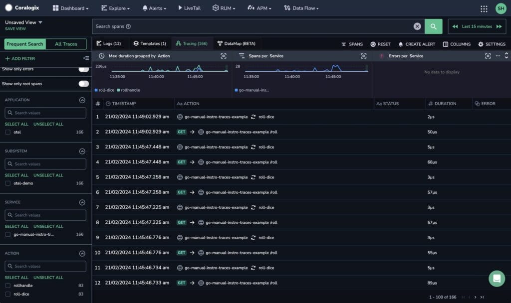

The following tutorial demonstrates how to configure a Docker Compose environment and deploy OpenTelemetry to collect traces, as well as enable trace sampling. We will cover an example of how to enable tail sample using the small trace generating application.

## Prerequisites

- Docker installed

- Docker Compose installed

- Coralogix [Send-Your-Data API key](https://coralogix.com/docs/send-your-data-api-key/)

## How it Works


1. Traces from the application are sent to an OpenTelemetry Collector.

3. The Collector, acting as a load balancer, forwards traces to one or more OpenTelemetry gateways. This ensures that traces with the same ID always go to the same gateway, irrespective of span or order.

5. The gateway uses the TraceID to group traces and applies tail sampling. It then forwards the traces to the Coralogix backend.

## Setup Demo Application

### 1\. Create an `.env` file

Create a file named `.env` and include the following content:

```
CORALOGIX_DOMAIN=<your-coralogix-domain>
CORALOGIX_APP_NAME=otel
CORALOGIX_SUBSYS_NAME=otel-demo
CORALOGIX_PRIVATE_KEY=<your-coralogix-private-key>
OTEL_IMAGE=otel/opentelemetry-collector-contrib:0.94.0
```

These values will configure the Coralogix backend and the OpenTelemetry Collector and Gateway.

### 2\. Create OpenTelemetry Collector Configuration

Create a file named `otel-collector-config.yaml` with the following content:

```
receivers:
  otlp:
    protocols:
      grpc:

exporters:
  loadbalancing:
    protocol:
      otlp:
        tls:
          insecure: true
        timeout: 1s
    resolver:
      static:
        hostnames:
        - otel-col-gateway-1:4317
        - otel-col-gateway-2:4317

processors:
  batch/traces:
    timeout: 1s
    send_batch_size: 50
  resourcedetection:
    detectors: [system, env]
    timeout: 5s
    override: true

connectors:
  spanmetrics:

service:
  pipelines:
    traces:
      receivers: [ otlp ]
      processors: [ batch/traces ]
      exporters: [ loadbalancing ]
```

This configuration sets up the OpenTelemetry Collector to receive traces and forward them to the OpenTelemetry Gateway, using a load balancing exporter.

### 3\. Create OpenTelemetry Gateway Configuration

Create a file named `otel-gateway-config.yaml` with the following content:

```
extensions:
  health_check:
receivers:
  otlp:
    protocols:
      grpc:
        endpoint: 0.0.0.0:4317

processors:
  batch/traces:
    timeout: 1s
    send_batch_size: 50
  resourcedetection:
    detectors: [system, env]
    timeout: 5s
    override: true
  tail_sampling:
    decision_wait: 10s 
    num_traces: 100
    expected_new_traces_per_sec: 10
    policies:
      [          
        {
          name: errors-policy,
          type: status_code,
          status_code: {status_codes: [ERROR]}
        },
        {
          name: randomized-policy,
          type: probabilistic,
          probabilistic: {sampling_percentage: 25}
        },
      ]
  attributes/shipper:
    actions:
      - key: shipper
        action: insert
        value: '${SHIPPER_NAME}'

exporters:
  logging:
  coralogix:    
    domain: "${CORALOGIX_DOMAIN}"
    private_key: "${CORALOGIX_PRIVATE_KEY}"
    application_name: "${CORALOGIX_APP_NAME}"
    subsystem_name: "${CORALOGIX_SUBSYS_NAME}"
    timeout: 30s

service:
  extensions: [health_check]
  pipelines:
    traces:
      receivers: [otlp]
      processors: [attributes/shipper, tail_sampling, batch/traces, resourcedetection]
      exporters: [coralogix, logging]
```

This configuration sets up the OpenTelemetry Gateway to receive traces from the OpenTelemetry Collector, apply tail sampling, and forward the traces to the Coralogix backend.

### 4\. Create a Docker Compose File

```
version: "3"
services:
  go-otel-traces-demo:
    container_name: go-otel-traces-demo
    image: public.ecr.aws/c1s3k2h4/go-otel-traces-demo:latest
    environment:
      - CX_ENDPOINT=otelcol:4317

  otelcol:
    image: otel/opentelemetry-collector-contrib:0.94.0
    container_name: otel-col
    deploy:
      resources:
        limits:
          memory: 100M
    restart: unless-stopped
    command: [ "--config=/etc/otelcol-config.yml" ]
    volumes:
      - ./otelcol-config.yml:/etc/otelcol-config.yml
    ports:
      - "4317"
      - "4318:4318"

    depends_on:
      - otelcol_gateway_1
      - otelcol_gateway_2

  otelcol_gateway_1:
    image: otel/opentelemetry-collector-contrib:0.94.0
    container_name: otel-col-gateway-1
    deploy:
      resources:
        limits:
          memory: 100M
    restart: unless-stopped
    command: [ "--config=/etc/otelcol-config.yml" ]
    volumes:
      - ./otel-gateway.yml:/etc/otelcol-config.yml
    ports:
      - "4317"
      - "4318"
    environment:
      - CORALOGIX_DOMAIN
      - CORALOGIX_APP_NAME
      - CORALOGIX_SUBSYS_NAME
      - CORALOGIX_PRIVATE_KEY
      - SHIPPER_NAME=gateway-1

  otelcol_gateway_2:
    image: otel/opentelemetry-collector-contrib:0.94.0
    container_name: otel-col-gateway-2
    deploy:
      resources:
        limits:
          memory: 100M
    restart: unless-stopped
    command: [ "--config=/etc/otelcol-config.yml" ]
    volumes:
      - ./otel-gateway.yml:/etc/otelcol-config.yml
    ports:
      - "4317"
      - "4318"

    environment:
      - CORALOGIX_DOMAIN
      - CORALOGIX_APP_NAME
      - CORALOGIX_SUBSYS_NAME
      - CORALOGIX_PRIVATE_KEY
      - SHIPPER_NAME=gateway-2
```

This Docker Compose file sets up the application, OpenTelemetry Collector, and OpenTelemetry Gateway. The application sends traces to the Collector, which forwards them to the Gateway. The Gateway applies tail sampling and forwards the traces to the Coralogix backend.

Note: The `otelcol` service mounts `otel-collector-config.yaml`, and the `otelcol_gateway_1` and `otelcol_gateway_2` services mount `otel-gateway-config.yaml`.

These files must be in the same directory as the Docker Compose file.

Also, `CORALOGIX_DOMAIN`, `CORALOGIX_APP_NAME`, `CORALOGIX_SUBSYS_NAME`, and `CORALOGIX_PRIVATE_KEY` environment variables configure the Coralogix backend.

### 5\. Start the Docker Compose Environment

Run the following command to start the Docker Compose environment:

```
docker-compose up -d
```

## Validation

Check your Coralogix dashboard for telemetry data. Traces should appear from the configured gateways.



## **Support**

**Need help?**

Our world-class customer success team is available 24/7 to walk you through your setup and answer any questions that may come up.

Contact us **via our in-app chat** or by emailing [support@coralogix.com](mailto:support@coralogix.com).
