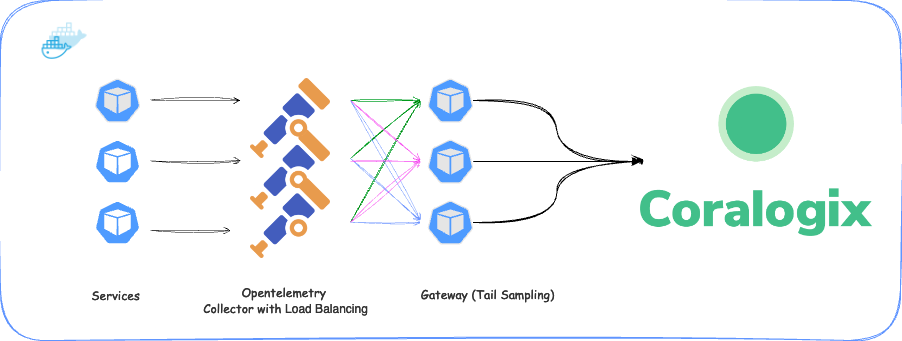
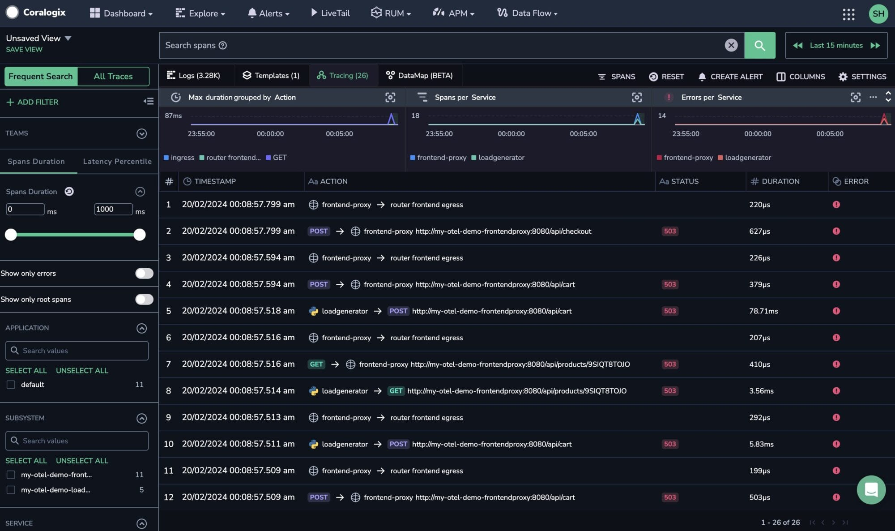

This tutorial demonstrates how to configure a Kubernetes cluster, deploy OpenTelemetry to collect logs, metrics, and traces, and enable trace sampling. We will cover an example of enabling a tail sample for the Opentelemetry Demo Application and a more precise example using the small trace-generating application.

## Prerequisites

- A Kubernetes cluster

- Helm installed

- Coralogix [Send-Your-Data API key](https://coralogix.com/docs/send-your-data-api-key/)

## How it Works



The Kubernetes OpenTelemetry Integration consists of the following components:

- **OpenTelemetry Agent**. The Agent is deployed to each node within the Cluster and collects telemetry data from the applications running on that node. The agent is configured to send the telemetry data to the OpenTelemetry Gateway. The agent ensures that traces with the same ID are sent to the same gateway. This allows tail sampling to be performed on the traces correctly, even if they span multiple applications and nodes.

- **OpenTelemetry Gateway**. The Gateway is responsible for receiving telemetry data from the agents and forwarding it to the Coralogix backend. The Gateway is also responsible for load balancing the telemetry data to the Coralogix backend.

## Install the Coralogix OpenTelemetry Integration

This integration uses the [Coralogix OpenTelemetry Helm Chart](https://github.com/coralogix/telemetry-shippers/tree/master/otel-integration/k8s-helm). While this document focuses on tail sampling for traces, deploying this chart also deploys the infrastructure to collect logs, metrics, and traces from your Kubernetes cluster and pods.

**STEP 1**. Add the Coralogix Helm repository.

```
helm repo add coralogix-charts-virtual https://cgx.jfrog.io/artifactory/coralogix-charts-virtual
```

**STEP 2**. Copy the `tail-sampling-values.yaml` file found [here](https://github.com/coralogix/telemetry-shippers/blob/master/otel-integration/k8s-helm/tail-sampling-values.yaml) and update the relevant fields with your values.

```
global:
  domain: "<your-coralogix-domain>"
  clusterName: ""
  defaultApplicationName: "otel"
  defaultSubsystemName: "integration"
  logLevel: "warn"
  collectionInterval: "30s"

opentelemetry-agent:
  enabled: true
  mode: daemonset
  presets:
    loadBalancing:
      enabled: true
      routingKey: "traceID"
      hostname: coralogix-opentelemetry-gateway

  config:
    service:
      pipelines:
        traces:
          exporters:
            - loadbalancing

opentelemetry-gateway:
  enabled: true
  replicaCount: 3

  config:
    processors:
      tail_sampling:
        decision_wait: 10s
        num_traces: 100
        expected_new_traces_per_sec: 10
        policies:
          [
            {
              name: errors-policy,
              type: status_code,
              status_code: {status_codes: [ERROR]}
            },
            {
              name: randomized-policy,
              type: probabilistic,
              probabilistic: {sampling_percentage: 10}
            },
          ]

opentelemetry-collector:
  enabled: false

```

**STEP 3**. Add your Coralogix [Send-Your-Data API key](https://coralogix.com/docs/send-your-data-api-key/) to the `tail-sampling-values.yaml` file.

```
kubectl create secret generic coralogix-keys --from-literal 'PRIVATE_KEY=<your-private-key>'
```

**STEP 4**. Install the Coralogix OpenTelemetry integration.

```
helm install coralogix-opentelemetry coralogix-charts-virtual/opentelemetry -f tail-sampling-values.yaml
```

```
$ kubectl get pods
NAME                                               READY   STATUS    RESTARTS   AGE
coralogix-opentelemetry-agent-86qdb                1/1     Running   0          7h59m
coralogix-opentelemetry-gateway-65dfbb5567-6rk4j   1/1     Running   0          7h59m
coralogix-opentelemetry-gateway-65dfbb5567-g7m5l   1/1     Running   0          7h59m
coralogix-opentelemetry-gateway-65dfbb5567-zbprd   1/1     Running   0          7h59m

```

You should end up with as many opentelemetry-agent pods as you have nodes in your cluster, and 3 opentelemetry-gateway pods.

## Install Test Application Environment

In the next section, we will describe the process for installing 2 application environments, the OpenTelemetry Demo Application and a Small Trace Generating. You do not need to install both these examples.

### Install OpenTelemetry Demo

**STEP 1**. Add the Hlem chart for the OpenTelemetry Demo Application.

```
helm repo add open-telemetry https://open-telemetry.github.io/opentelemetry-helm-charts
```

**STEP 2**. Create a `values.yaml` file and add the following:

```
default:
  env:
    - name: OTEL_SERVICE_NAME
      valueFrom:
        fieldRef:
          apiVersion: v1
          fieldPath: "metadata.labels['app.kubernetes.io/component']"
    - name: OTEL_COLLECTOR_NAME
      value: '{{ include "otel-demo.name" . }}-otelcol'
    - name: OTEL_EXPORTER_OTLP_ENDPOINT
      value: http://$(OTEL_COLLECTOR_NAME):4317
    - name: OTEL_EXPORTER_OTLP_METRICS_TEMPORALITY_PREFERENCE
      value: cumulative
    - name: OTEL_RESOURCE_ATTRIBUTES
      value: service.name=$(OTEL_SERVICE_NAME),service.namespace=opentelemetry-demo

  envOverrides:
    - name: OTEL_COLLECTOR_NAME
      valueFrom:
        fieldRef:
          apiVersion: v1
          fieldPath: spec.nodeName
    - name: OTEL_EXPORTER_OTLP_ENDPOINT
      value: http://$(OTEL_COLLECTOR_NAME):4317

serviceAccount:
  create: true
  annotations: {}
  name: ""

opentelemetry-collector:
  enabled: false

jaeger:
  enabled: false

prometheus:
  enabled: false

grafana:
  enabled: false

```

This will configure the OpenTelemetry Demo Application to send traces to the Coralogix OpenTelemetry Agent running on the node.

**STEP 3**. Install the Opentelemetry Demo Application.

```
$ helm install otel-demo open-telemetry/opentelemetry-demo -f values.yaml

NAME: my-otel-demo
LAST DEPLOYED: Mon Feb 19 23:29:16 2024
NAMESPACE: default
STATUS: deployed
REVISION: 1
TEST SUITE: None
NOTES:

```

### Install the Small Trace-Generating Application

This application is a small trace-generating application. We will demonstrate how to connect it to the Coralogix OpenTelemetry Agent to enable tail sampling.

**STEP 1**. Create a file `go-traces-demo.yaml` and add the following:

```
apiVersion: apps/v1        
kind: Deployment
metadata:
  name: go-otel-traces-demo
spec:
  selector:
    matchLabels:
      app: go-otel-traces-demo
  replicas: 1
  template:
    metadata:
      labels:
        app: go-otel-traces-demo
    spec:
      containers:
        - name: go-otel-traces-demo
          image: public.ecr.aws/c1s3k2h4/go-otel-traces-demo:latest  
          imagePullPolicy: Always        
          env:
            - name: NODE_IP
              valueFrom:
                fieldRef:
                  fieldPath: status.hostIP         
            - name: CX_ENDPOINT
              value: $(NODE_IP):4317

```

**STEP 2**. Apply the Kuberenetes deployment.

```
kubectl apply -f go-traces-demo.yaml
```

## Validation

View your telemetry data in your Coralogix dashboard. Traces should arrive from the tail-sampling load balancer.



## Additional Resources

<table><tbody><tr><td><strong>Documentation</strong></td><td><a href="https://coralogixstg.wpengine.com/docs/tail-sampling-with-coralogix-and-opentelemetry/"><strong>Introduction to Tail Sampling with Coralogix &amp; OpenTelemetry</strong></a></td></tr></tbody></table>

## **Support**

**Need help?**

Our world-class customer success team is available 24/7 to walk you through your setup and answer any questions that may come up.

Contact us **via our in-app chat** or by emailing [support@coralogixstg.wpengine.com](mailto:support@coralogixstg.wpengine.com).
