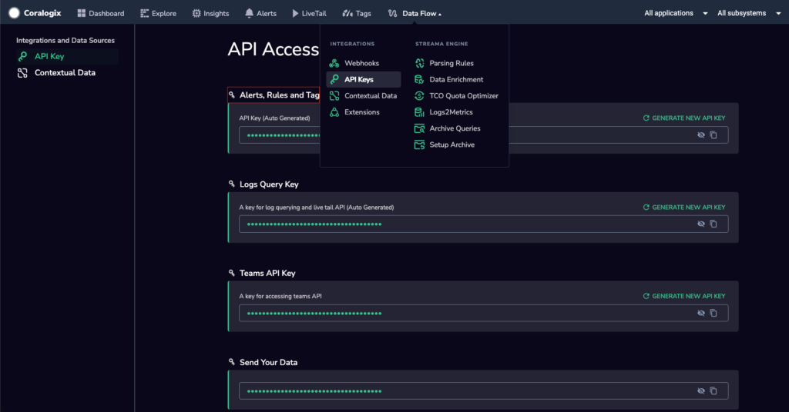

This tutorial demonstrates how to use our **TCO Tracing gPRC API** to define, query, and manage your [TCO policy criteria](https://coralogixstg.wpengine.com/docs/optimize-log-management-costs/#policy-criteria), used both for spans and logs.

View [this page](https://coralogixstg.wpengine.com/docs/tco-optimizer-api/) to learn how to use our **TCO Optimizer HTTP API** to define, query, and manage your [TCO policy overrides](https://coralogixstg.wpengine.com/docs/optimize-log-management-costs/#application-and-policy-overrides), used exclusively for logs.

## Overview

Tracing policies aim to match `spans`, which are the fundamental components of a `trace`. The matching process is carried out based on the rules you define. Those rules can be defined using `application/subsystem/operation/service` names or by `tag` names and values. There are various types of matching rules, explained in detail below.

### Matching Process

Spans that match all rules in a policy will be assigned the [priority](http://coralogixstg.wpengine.com/docs/tco-tracing-policy-grpc-api) level defined in that policy.

Every [rule](http://coralogixstg.wpengine.com/docs/tco-tracing-policy-grpc-api#Rule) targets a property (e.g. `Application`) by `RuleTypeId`.

[TagRule](http://coralogixstg.wpengine.com/docs/tco-tracing-policy-grpc-api#TagRule) targets a tag name and a tag value (e.g. tag name: `tags.http.method` and tag value: `GET`).

**Examples:**

- A rule on `Application` with the RuleTypeId `RULE_TYPE_ID_IS` and the name `default,app1` will match all spans with application name `default` or `app1`.

- A rule on `Subsystem` with RuleTypeId `RULE_TYPE_ID_START_WITH` and the name `authSer` will match all spans with subsystem names that start with `authSer`.

- A TagRule with the name `tags.http.target`, RuleTypeId `RULE_TYPE_ID_INCLUDES`, and the value `/api` will match all spans that have the tag `tags.http.target` and a value that contains `/api`.

## How to Send gRPC Requests

**STEP 1**. Install [grpcurl](https://github.com/fullstorydev/grpcurl).

**STEP 2**. Access your **Alerts, Rules and Tags API Key**. From your Coralogix toolbar, navigate to **Data Flow** \> **API Keys**.



**STEP 3**. Run grpcurl with this template:

```
grpcurl -H "Authorization: <API_KEY>" -d "<DATA JSON OBJECT>" <HOST_NAME> <GRPC_METHOD>

```

You can find the `HOST_NAME` [here](https://coralogixstg.wpengine.com/docs/management-api-endpoints/), depending on your Coralogix domain and region.

## Supported API Calls

The API supports the following gRPCs:

- Get Policy

- Create Policy

- Update Policy

- Get Company Policies

- Delete Policy

- Reorder Policies

- Toggle Policy

**Notes**:

- This API supports both log and tracing policies.

- In some requests, the field `source_type_rules` appears, containing unique fields for each. The field `source_type` may also appear, allowing you to decide which type of policies you want to receive or affect.

The API supports the following gRPCs:

## API Calls

### rpc GetPolicy(GetPolicyRequest) returns (GetPolicyResponse)

**GetPolicyRequest**

```
message GetPolicyRequest {
  google.protobuf.StringValue id = 1;
}

```

| Field | Type | Description |
| --- | --- | --- |
| id | google.protobuf.StringValue | ID for the requested policy |

**GetPolicyResponse**

```
message GetPolicyResponse {
  Policy policy = 1;
}

```

| Field | Type | Description |
| --- | --- | --- |
| policy | Policy | Policy returned |

**Example**

```
grpcurl -H "Authorization: abcd" -d '{
  "id": "abcd"
}' ng-api-grpc.eu2.coralogixstg.wpengine.com:443 com.coralogix.quota.v1.PoliciesService.GetPolicy
```

### rpc CreatePolicy(CreatePolicyRequest) returns (CreatePolicyResponse)

**CreatePolicyRequest**

```
message CreatePolicyRequest {
  google.protobuf.StringValue name = 1;
  google.protobuf.StringValue description = 2;
  Priority priority = 3;
  optional Rule application_rule = 4;
  optional Rule subsystem_rule = 5;
  optional ArchiveRetention archive_retention = 6;
  oneof source_type_rules {
    LogRules log_rules = 7;
    SpanRules span_rules = 8;
  };
}

```

| Field | Type | Description |
| --- | --- | --- |
| name | google.protobuf.StringValue | Name for the new policy |
| description | google.protobuf.StringValue | Description of the new policy. |
| priority | Priority | TCO pipelines (HIGH, MEDIUM, LOW) |
| application\_rule | Rule | \[Optional\] Rule that targets specific application names |
| subsystem\_rule | Rule | \[Optional\] Rule that targets specific subsystem names |
| archive\_retention | ArchiveRetention | \[Optional\] See [**Archive Retention Policy**](https://coralogixstg.wpengine.com/docs/archive-retention-policy/) |
| source\_type\_rules | oneof | Use only one of the following two fields |
| log\_rules | LogRules | Extra rules that can be defined for log policies |
| span\_rules | SpanRules | Extra rules that can be defined for span policies |

**CreatePolicyResponse**

```
message CreatePolicyResponse {
  Policy policy = 1;
}

```

| Field | Type | Description |
| --- | --- | --- |
| policy | Policy | Policy created |

**Example**

```
grpcurl -H "Authorization: abc" -d '{
  "name": "policy name",
  "priority": "PRIORITY_TYPE_HIGH",
  "applicationRule": {
    "ruleTypeId": "RULE_TYPE_ID_START_WITH",
    "name": "sdasdazxczxca"
  },
  "archiveRetention": {
    "id": "abcdid"
  },
  "spanRules": {
    "tagRules": [],
    "serviceRule": {
      "ruleTypeId": "RULE_TYPE_ID_IS",
      "name": "asdas"
    }
  }
}' ng-api-grpc.eu2.coralogixstg.wpengine.com:443 com.coralogix.quota.v1.PoliciesService.CreatePolicy
```

### rpc UpdatePolicy(UpdatePolicyRequest) returns (UpdatePolicyResponse)

**UpdatePolicyRequest**

```
message UpdatePolicyRequest {
  google.protobuf.StringValue id = 1;
  google.protobuf.StringValue name = 2;
  google.protobuf.StringValue description = 3;
  Priority priority = 4;
  optional Rule application_rule = 5;
  optional Rule subsystem_rule = 6;
  optional ArchiveRetention archive_retention = 7;
  oneof source_type_rules {
    LogRules log_rules = 8;
    SpanRules span_rules = 9;
  };
}

```

| Field | Type | Description |
| --- | --- | --- |
| id | google.protobuf.StringValue | ID of the policy to update |
| name | google.protobuf.StringValue | Name of the updated policy |
| description | google.protobuf.StringValue | Description of the updated policy |
| priority | Priority | TCO pipelines (HIGH, MEDIUM, LOW) |
| application\_rule | Rule | \[Optional\] Rule that targets specific application names |
| subsystem\_rule | Rule | \[Optional\] Rule that targets specific subsystem names |
| archive\_retention | ArchiveRetention | \[Optional\] See **[Archive Retention Policy](https://coralogixstg.wpengine.com/docs/archive-retention-policy/)** |
| source\_type\_rules | oneof | Use only one of the following two fields |
| log\_rules | LogRules | Extra rules that can be defined for log policies |
| span\_rules | SpanRules | Extra rules that can be defined for span policies |

**UpdatePolicyResponse**

```
message UpdatePolicyResponse {
  Policy policy = 1;
}

```

| Field | Type | Description |
| --- | --- | --- |
| policy | Policy | Policy updated |

**Example**

```
grpcurl -H "Authorization: abcd" -d '{
  "id": "asdf",
  "name": "same name",
  "priority": "PRIORITY_TYPE_MEDIUM",
  "logRules": {
    "severities": [
      "SEVERITY_VERBOSE",
      "SEVERITY_WARNING"
    ]
  }
}' ng-api-grpc.eu2.coralogixstg.wpengine.com:443 com.coralogix.quota.v1.PoliciesService.UpdatePolicy
```

### rpc GetCompanyPolicies(GetCompanyPoliciesRequest) returns (GetCompanyPoliciesResponse)

**GetCompanyPoliciesRequest**

```
message GetCompanyPoliciesRequest {
  google.protobuf.BoolValue enabled_only = 1;
  optional SourceType source_type = 2;
}

```

| Field | Type | Description |
| --- | --- | --- |
| enabled\_only | google.protobuf.BoolValue | Whether the policies returned should include only enabled policies or also disabled policies. True = only enabled policies |
| source\_type | SourceType | \[Optional\] Set the source type for policies to be returned. Possible values include SOURCE\_TYPE\_LOGS and SOURCE\_TYPE\_SPANS. If this field remains empty, you will receive all policies. |

**GetCompanyPoliciesResponse**

```
message GetCompanyPoliciesResponse {
  repeated Policy policies = 1;
}

```

| Field | Type | Description |
| --- | --- | --- |
| policies | Policy | List of the company policies |

**Example**

```
grpcurl -H "Authorization: abcd" -d '{
  "sourceType": "SOURCE_TYPE_SPANS",
  "enabledOnly": true
}' ng-api-grpc.eu2.coralogixstg.wpengine.com:443 com.coralogix.quota.v1.PoliciesService.GetCompanyPolicies
```

### rpc DeletePolicy(DeletePolicyRequest) returns (DeletePolicyResponse)

**DeletePolicyRequest**

```
message DeletePolicyRequest {
  google.protobuf.StringValue id = 1;
}

```

| Field | Type | Description |
| --- | --- | --- |
| id | google.protobuf.StringValue | ID of the policy to delete |

**DeletePolicyResponse**

```
message DeletePolicyResponse {
  google.protobuf.StringValue id = 1;
}

```

| Field | Type | Description |
| --- | --- | --- |
| id | google.protobuf.StringValue | ID of the policy to delete |

**Example**

```
grpcurl -H "Authorization: abcd" -d '{
  "id": "abcdid"
}' ng-api-grpc.eu2.coralogixstg.wpengine.com:443 com.coralogix.quota.v1.PoliciesService.DeletePolicy
```

### rpc ReorderPolicies(ReorderPoliciesRequest) returns (ReorderPoliciesResponse)

**ReorderPoliciesRequest**

```
message ReorderPoliciesRequest {
  repeated PolicyOrder orders = 1;
  SourceType source_type = 2;
}

```

| Field | Type | Description |
| --- | --- | --- |
| orders | PolicyOrder | \[Repeated\] New order in which to put the policies |
| source\_type | SourceType | Source type of the policies to reorder. See the SourceType enum below for possible values. |

**ReorderPoliciesResponse**

```
message ReorderPoliciesResponse {
  repeated PolicyOrder orders = 1;
}

```

| Field | Type | Description |
| --- | --- | --- |
| orders | PolicyOrder | \[Repeated\] New order of the policies |

**Example**

```
grpcurl -H "Authorization: abcd" -d '{
  "orders": [
    {
      "order": 0,
      "id": "abcd1"
    },
    {
      "order": 1,
      "id": "abcd2"
    }
  ],
  "sourceType": "SOURCE_TYPE_LOGS"
}' ng-api-grpc.eu2.coralogixstg.wpengine.com:443 com.coralogix.quota.v1.PoliciesService.ReorderPolicies
```

### rpc TogglePolicy(TogglePolicyRequest) returns (TogglePolicyResponse)

**TogglePolicyRequest**

```
message TogglePolicyRequest {
  google.protobuf.StringValue id = 1;
  google.protobuf.BoolValue enabled = 2;
}

```

| Field | Type | Description |
| --- | --- | --- |
| id | google.protobuf.StringValue | ID of the policy to enable or disable. |
| enabled | google.protobuf.BoolValue | Whether the policy is enabled or disabled. True = policy is enabled |

**TogglePolicyResponse**

```
message TogglePolicyResponse {
  google.protobuf.StringValue id = 1;
  google.protobuf.BoolValue enabled = 2;
}

```

| Field | Type | Description |
| --- | --- | --- |
| id | google.protobuf.StringValue | ID of the enabled or disabled policy. |
| enabled | google.protobuf.BoolValue | Whether the policy is enabled or disabled. True = policy is enabled |

**Example**

```
grpcurl -H "Authorization: abcd" -d '{
  "id": "abcd1",
  "enabled": true
}' ng-api-grpc.eu2.coralogixstg.wpengine.com:443 com.coralogix.quota.v1.PoliciesService.TogglePolicy
```

## Types

### Policy

```
message Policy {
  google.protobuf.StringValue id = 1;
  google.protobuf.Int32Value company_id = 2;
  google.protobuf.StringValue name = 3;
  google.protobuf.StringValue description = 4;
  Priority priority = 5;
  google.protobuf.BoolValue deleted = 6;
  google.protobuf.BoolValue enabled = 7;
  google.protobuf.Int32Value order = 8;
  optional Rule application_rule = 9;
  optional Rule subsystem_rule = 10;
  oneof source_type_rules {
    LogRules log_rules = 11;
    SpanRules span_rules = 12;
  };
  optional google.protobuf.StringValue created_at = 13;
  optional google.protobuf.StringValue updated_at = 14;
  optional ArchiveRetention archive_retention = 15;
}

```

| Field | Type | Description |
| --- | --- | --- |
| id | google.protobuf.StringValue | ID of the policy |
| company\_id | google.protobuf.Int32Value | Company ID of the company that owns the policy |
| name | google.protobuf.StringValue | Policy name |
| description | google.protobuf.StringValue | Policy description |
| priority | Priority | Policy priority |
| deleted | google.protobuf.BoolValue | Whether or not the policy is deleted. True = deleted |
| enabled | google.protobuf.BoolValue | Whether or not the policy is enabled. True = enabled |
| order | google.protobuf.Int32Value | What number the policy comes in the order of policies |
| application\_rule | Rule | \[Optional\] Rule that targets specific application names |
| subsystem\_rule | Rule | \[Optional\] Rule that targets specific subsystem names. |
| source\_type\_rules | oneof | Use one of the following two fields |
| log\_rules | LogRules | \[Optional\] Extra rules that can be defined for log policies |
| span\_rules | SpanRules | \[Optional\] Extra rules that can be defined for span policies |
| created\_at | google.protobuf.StringValue | \[Optional\] Time and date when a policy was created |
| updated\_at | google.protobuf.StringValue | \[Optional\] Time and date when a policy was updated. |
| archive\_retention | ArchiveRetention | \[Optional\] See **[Archive Retention Policy](https://coralogixstg.wpengine.com/docs/archive-retention-policy/)** |

### Rule

```
message Rule {
  RuleTypeId rule_type_id = 1;
  google.protobuf.StringValue name = 2;
}

```

| Field | Type | Description |
| --- | --- | --- |
| rule\_type\_id | RuleTypeID | Matching process is explained at the beginning of this page |
| name | google.protobuf.StringValue | Rule name |

**Notes:**

- For the values that need an exact match (e.g. `RULE_TYPE_ID_IS`, `RULE_TYPE_ID_IS_NOT`), the `name` property should be a list of values separated with a comma.

**Examples**

```
const rule1: Rule = {
  ruleTyleId: RuleTypeId.RULE_TYPE_ID_IS,
  name: 'service1,myService2,anotherService'
}

const rule2: Rule = {
  ruleTyleId: RuleTypeId.RULE_TYPE_ID_START_WITH,
  name: 'serv'
}

```

### ArchiveRetention

```
message ArchiveRetention {
  google.protobuf.StringValue id = 1;
}

```

| Field | Type | Description |
| --- | --- | --- |
| id | google.protobuf.StringValue | See [**Archive Retention Policy**](https://coralogixstg.wpengine.com/docs/archive-retention-policy/) |

### LogRules

```
message LogRules {
  repeated Severity severities = 1;
}

```

| Field | Type | Description |
| --- | --- | --- |
| severities | Severity | Every span is classified with a severity level. You can target spans with specific severity levels. |

### SpanRules

```
message SpanRules {
  optional Rule service_rule = 1;
  optional Rule action_rule = 2;
  repeated TagRule tag_rules = 3;
}

```

| Field | Type | Description |
| --- | --- | --- |
| service\_rule | Rule | \[Optional\] Rule that targets specific service names |
| action\_rule | Rule | \[Optional\] Rule that targets specific action (operation) names |
| tag\_rules | TagRule | \[Repeated\] Rule that targets a specific tag name and value |

### TagRule

```
message TagRule {
  RuleTypeId rule_type_id = 1;
  google.protobuf.StringValue tag_name = 2;
  google.protobuf.StringValue tag_value = 3;
}

```

**Notes**:

- Work the same way `Rule` works.

- `tag_value` is equivalent to `name`.

- `Rule`. `tag_name` refers to the name of the tag that the rule should impact.

### PolicyOrder

```
message PolicyOrder {
  google.protobuf.Int32Value order = 1;
  google.protobuf.StringValue id = 2;
}

```

| Field | Type | Description |
| --- | --- | --- |
| order | google.protobuf.Int32Value | Order for the policies to be in |
| id | google.protobuf.StringValue | IDs of the different policies |

## Enums

```
enum RuleTypeId {
  RULE_TYPE_ID_UNSPECIFIED = 0;
  reserved 1;
  RULE_TYPE_ID_IS = 2;
  RULE_TYPE_ID_IS_NOT = 3;
  RULE_TYPE_ID_START_WITH = 4;
  reserved 5;
  RULE_TYPE_ID_INCLUDES = 6;
  reserved 7;
}

```

```
enum Priority {
  PRIORITY_TYPE_UNSPECIFIED = 0;
  PRIORITY_TYPE_BLOCK = 1;
  PRIORITY_TYPE_LOW = 2;
  PRIORITY_TYPE_MEDIUM = 3;
  PRIORITY_TYPE_HIGH = 4;
}

```

```
enum Severity {
  SEVERITY_UNSPECIFIED = 0;
  SEVERITY_DEBUG = 1;
  SEVERITY_VERBOSE = 2;
  SEVERITY_INFO = 3;
  SEVERITY_WARNING = 4;
  SEVERITY_ERROR = 5;
  SEVERITY_CRITICAL = 6;
}

```

```
enum SourceType {
  SOURCE_TYPE_UNSPECIFIED = 0;
  SOURCE_TYPE_LOGS = 1;
  SOURCE_TYPE_SPANS = 2;
}

```

## Additional Resources

<table><tbody><tr><td><strong>Documentation</strong></td><td><strong><a href="https://coralogixstg.wpengine.com/docs/optimize-log-management-costs/">TCO Optimizer</a><br><a href="https://coralogixstg.wpengine.com/docs/tco-optimizer-api/">TCO Optimizer HTTP API</a></strong></td></tr></tbody></table>

## Support

**Need help?**

Our world-class customer success team is available 24/7 to walk you through your setup and answer any questions that may come up.

Feel free to reach out to us **via our in-app chat** or by sending us an email at [support@coralogixstg.wpengine.com](mailto:support@coralogixstg.wpengine.com).
