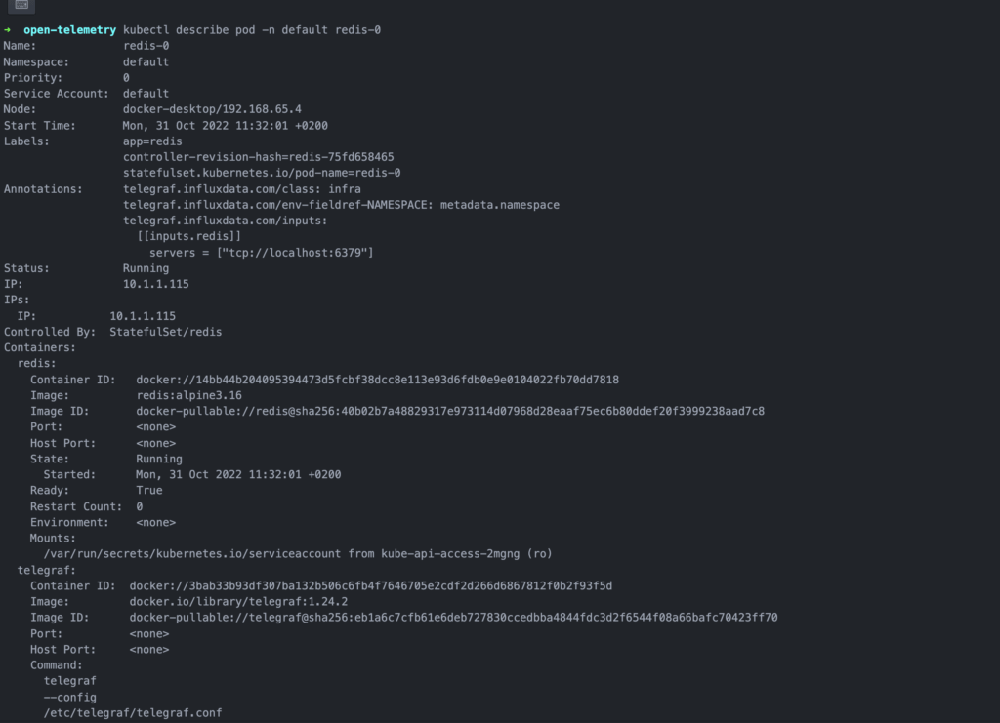
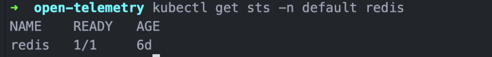
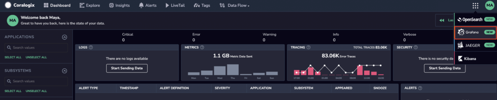
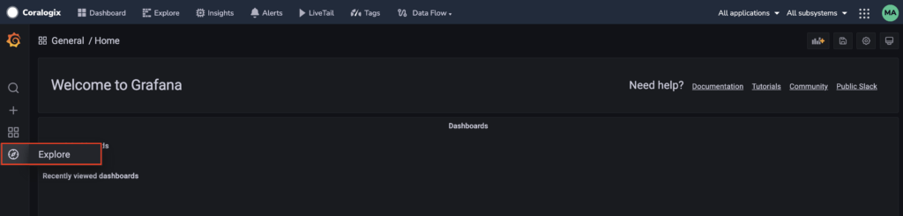
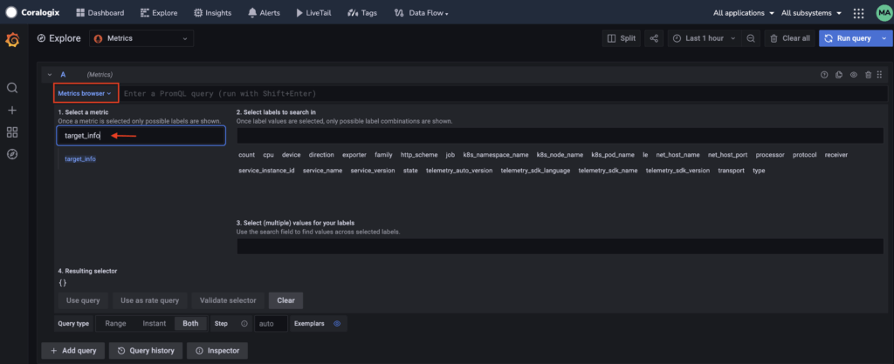

**Supported OS: linux | windows | macOS**

[Telegraf Operator](https://www.influxdata.com/blog/expand-kubernetes-monitoring-telegraf-operator/) is an application designed to create and manage individual Telegraf instances in Kubernetes clusters. Use it to collect, process, and aggregate metrics from applications in your Kubernetes cluster and send them to Coralogix.

Once installed, Telegraf Operator watches for pods deployed with a specific set of [pod annotations](https://github.com/influxdata/telegraf-operator#pod-level-annotations). The advantage of using Telegraf Operator is that you only have to define the input plugin configuration for Telegraf when creating the pod annotations. Telegraf Operator then sets the configuration for the entire cluster, avoiding the need to configure a metrics destination when deploying applications.

This tutorial demonstrates how to run Telegraf Operator in Kubernetes to export your telemetry data to Coralogix.

## Prerequisites

1\. [Sign up](https://signup.coralogixstg.wpengine.com/#/) for a Coralogix account. Set up your account on the Coralogix [domain](https://coralogixstg.wpengine.com/docs/coralogix-domain/) corresponding to the region within which you would like your data stored.

2\. Access your Coralogix [Send-Your-Data API key](https://coralogixstg.wpengine.com/docs/send-your-data-api-key/).

3\. Install [Kubernetes](https://kubernetes.io/). This should include installation of the command-line tool [kubectl](https://kubernetes.io/docs/tasks/tools/#kubectl), designed to operate on your Kubernetes cluster.

4\. Install and configure [Helm](https://helm.sh/). We suggest you use this [guide](https://helm.sh/docs/intro/using_helm/) to familiarize yourself with the basics of using Helm to manage packages on your Kubernetes cluster.

## Set Up

### Installation

**STEP 1: Add the Influxdata Helm Chart Repository**

Open a new terminal and install the Influxdata Helm chart repository:

```
helm repo add influxdata <https://helm.influxdata.com/>
```

```
helm repo update
```

**STEP 2: Install Telegraf Operator**

Update the Helm chart from the added repository:

```
export NAMESPACE=<namespace>
```

```
helm upgrade --install telegraf-operator influxdata/telegraf-operator -n $NAMESPACE
```

### Configuration

**STEP 1: Create YAML-Formatted Override File**

Telegraf Operator allows you to configure how Telegraf sidecars send data using [classes](https://github.com/influxdata/telegraf-operator/blob/fa5fa4baf88a5747ad7ecd61420ad3e793a65817/README.md#global-configuration---classes). Each class is a subset of the Telegraf configuration and defines where Telegraf Operator should be sending its outputs. You can create or modify existing classes using Helm values file, as shown in the example below.

In order to send your data to Coralogix, you are **required** to declare particular variables in your template:

- `service_address`: Coralogix [OpenTelemetry endpoint](https://coralogixstg.wpengine.com/docs/coralogix-endpoints/) associated with your Coralogix domain

- `private_key`: Coralogix [Send-Your-Data API key](https://coralogixstg.wpengine.com/docs/send-your-data-api-key/), recorded in the override file as a secret in order to ensure that it remains protected and unexposed

- `$HOSTNAME` & `$NODENAME` : Each Telegraf Operator [class](https://github.com/influxdata/telegraf-operator/blob/fa5fa4baf88a5747ad7ecd61420ad3e793a65817/README.md#global-configuration---classes) includes these global tags. `$HOSTNAME`, which will serve as your Coralogix [`subsystem` name](https://coralogixstg.wpengine.com/docs/application-and-subsystem-names/), is typically set to pod name. `$NODENAME` is typically set to node name. Find out more about defining environment variables for Kubernetes containers [here](https://kubernetes.io/docs/tasks/inject-data-application/define-environment-variable-container/#define-an-environment-variable-for-a-container)**.**

- `$NAMESPACE`: This variable is Telegraf Operator [pod annotation](https://github.com/influxdata/telegraf-operator/blob/fa5fa4baf88a5747ad7ecd61420ad3e793a65817/README.md#configuration-output) `telegraf.influxdata.com/env-fieldref-NAMESPACE: metadata.namespace` that can be used to configure the Telegraf sidecar. This variable will serve as your Coralogix [`application` name](https://coralogixstg.wpengine.com/docs/application-and-subsystem-names/).

```
image:
 sidecarImage: "docker.io/library/telegraf:1.24.2"
classes:
  secretName: "telegraf-operator-classes"
  default: "infra"
  data:
    infra: |
      [[outputs.opentelemetry]]
        service_address = "<coralogix_otel_endpoint>"
        compression = "gzip"
        [outputs.opentelemetry.coralogix]
          private_key = "<private_key>"
          application = "$NAMESPACE"
          subsystem = "$HOSTNAME"
      [global_tags]
        env = "ci"
        hostname = "$HOSTNAME"
        nodename = "$NODENAME"
        namespace = "$NAMESPACE"
        type = "infra"
        
```

Save this file as a coralogix-values.yaml file in a directory of your choice.

**STEP 2: Apply the Configuration**

Apply the configuration by running the following command:

```
helm upgrade --install telegraf-operator influxdata/telegraf-operator --values <path/to/coralogix-values.yaml> -n <namespace>

```

## Validation

To test your configuration, [deploy a Redis instance with Telegraf Operator annotations](https://github.com/influxdata/telegraf-operator#pod-level-annotations).

1\. Create a pod configuration redis.yaml file with the following data:

```
apiVersion: apps/v1
kind: StatefulSet
metadata:
  name: redis
spec:
  selector:
    matchLabels:
      app: redis
  serviceName: redis
  template:
    metadata:
      labels:
        app: redis
      annotations:
        telegraf.influxdata.com/inputs: |+
          [[inputs.redis]]
            servers = ["tcp://localhost:6379"]
        telegraf.influxdata.com/class: infra
        telegraf.influxdata.com/env-fieldref-NAMESPACE: metadata.namespace
    spec:
      containers:
      - name: redis
        image: redis:alpine3.16

```

2\. Run the pod by executing:

```
kubectl apply -f <path/to/redis.yaml> -n <redis-namespace>

```

3\. The pod should contain 2 running containers: redis and telegraf. Verify this by executing:

```
kubectl describe pod -n <redis-namespace> redis-0

```

Here is an output example:



4\. Verify that the pod is running:

```
kubectl get sts -n <redis-namespace> redis

```

Here is an output example:



5\. Access your Coralogix - Grafana dashboard to query the monitored targets.

- On the right-hand corner of your dashboard, click on the **Grafana** drop-down tab.



- Once you’ve accessed your Coralogix-Grafana dashboard, click on **Explore** tab in the left-hand browser.



- Click on the drop-down arrow of the Metrics browser and input `target_info` in the “Select a Metric” column.



- Click on the “Use Query” button in the bottom left-hand corner.

6\. The query above should return metrics similar to the following:

```
target_info{__meta_applicationname="<redis-namespace>", __meta_subsystem="redis-0"}

```

7\. To discover all Redis metrics, use the following PromQL:

```
{__meta_applicationname="<redis-namespace>", __meta_subsystem="redis-0"}

```

8\. This should result in:

```
...
redis_total_connections_received{__meta_applicationname="<redis-namespace>, __meta_subsystem="redis-0", cx_tenant_id="32680", env="ci", host="redis-0", hostname="redis-0", namespace="<redis-namespace>", nodename="rock64-1", port="6379", replication_role="master", server="localhost", type="infra"}

```

Here is a display of the expected result:


9\. Once you have tested and validated your configuration with the Redis instance, delete this service by running the following command:

```
kubectl delete -f <path/to/redis.yaml> -n <redis-namespace>

```

## Additional References

<table><tbody><tr><td><strong>Github</strong></td><td><a href="https://github.com/influxdata/telegraf-operator">Official Telegraf-Operator Documentation</a><br><a href="https://github.com/influxdata/helm-charts">Offical Influxdata Chart Repo</a></td></tr></tbody></table>

## Support

**Need help?**

Our world-class customer success team is available 24/7 to walk you through your setup and answer any questions that may come up.

Feel free to reach out to us **via our in-app chat** or by sending us an email at [support@coralogixstg.wpengine.com](mailto:support@coralogixstg.wpengine.com).
