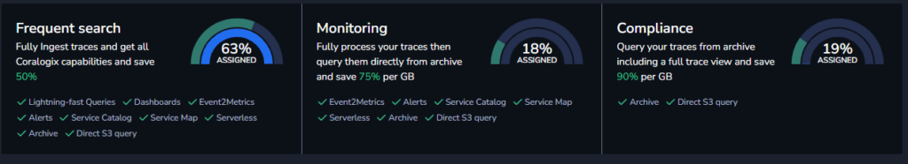
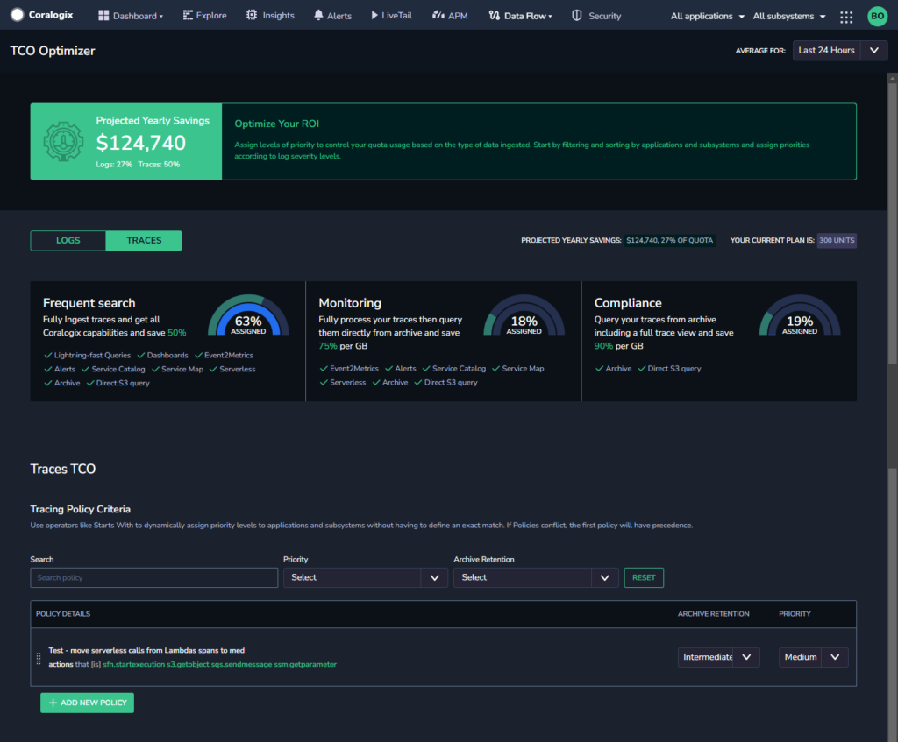
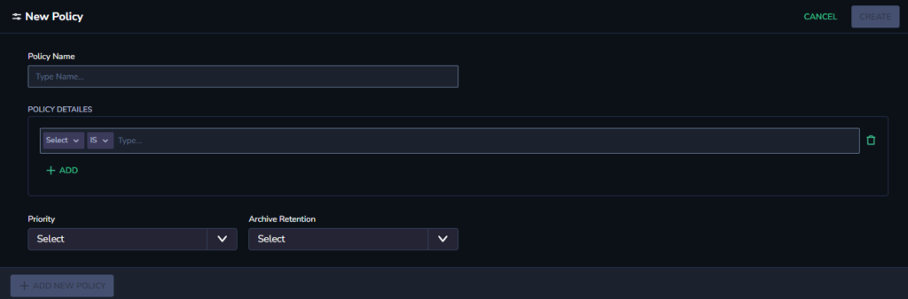

By allowing you to define the data pipeline for your traces based on the importance of that data to your business, our **Tracing** **TCO Optimizer** reduces your tracing costs by up to two-thirds and improves your real-time analysis and alerting capabilities.

## Overview

The Tracing TCO Optimizer allows you to assign different tracing pipelines for each application and subsystem pair and trace severity. In this way, it allows you to define the data pipeline for your traces based on the importance of that data to your business.

The feature enables you to get all of the benefits of an ML-powered tracing solution at only a third of the cost, with an improved ability to query, monitor, and manage your data.

## TCO Data Pipelines

The Tracing TCO Optimizer allows you to assign different roles for your data - high, medium, or low priority - and access each feature.

### High: Frequent Search

Traces will be fully ingested, and all Coralogix capabilities will be available.

Features available include:

- [Serverless Monitoring](https://coralogixstg.wpengine.com/docs/severless-monitoring/)

- [Rapid Query](https://coralogixstg.wpengine.com/docs/distributed-tracing/) (traces)

- [Custom Dashboards](https://coralogixstg.wpengine.com/docs/custom-dashboards/) (spans)

- [Service Catalog](https://coralogixstg.wpengine.com/docs/service-catalog/)

- [Service Map](https://coralogixstg.wpengine.com/docs/service-map/)

- [Alerting](https://coralogixstg.wpengine.com/docs/coralogix-user-defined-alerts/)

- [Events2Metrics](https://coralogixstg.wpengine.com/docs/event2metrics/)

- [Query Archive](https://coralogixstg.wpengine.com/docs/archive-query/) (traces)

- Viewing traces in your [Explore Screen](https://coralogixstg.wpengine.com/docs/explore-screen/)

### Medium: Monitoring

Traces will be processed and archived.

Features available include:

- [Service Catalog](https://coralogixstg.wpengine.com/docs/service-catalog/)

- [Service Map](https://coralogixstg.wpengine.com/docs/service-map/)

- [Alerting](https://coralogixstg.wpengine.com/docs/coralogix-user-defined-alerts/)

- [Events2Metrics](https://coralogixstg.wpengine.com/docs/event2metrics/)

- [Query Archive](https://coralogixstg.wpengine.com/docs/archive-query/) (traces)

- [Custom Dashboards](https://coralogixstg.wpengine.com/docs/custom-dashboards/)

- Viewing traces in your [Explore Screen](https://coralogixstg.wpengine.com/docs/explore-screen/)

### Low: Compliance

Traces will be archived.

Features available include:

- [Query Archive](https://coralogixstg.wpengine.com/docs/archive-query/) (traces)

- Viewing traces in your [Explore Screen](https://coralogixstg.wpengine.com/docs/explore-screen/)

## TCO Optimizer Screen

The TCO Optimizer screen includes a Tracing tab, split into two sections:

- Distribution

- Policy Criteria

## Distribution

The **Distribution** section presents high, medium, and low priorities.

## Policy Criteria

The **Policy Criteria** section includes current policies and allows for creating new ones. Policies will be applied on combinations of applications, subsystems, tags, service names, and actions as traces are ingested and will be assigned to the appropriate TCO pipeline based on the policy content. The default policy for all traces is high. Policies simplify assigning TCO pipelines and will capture any applicable future traces on ingestion. Each policy creates new default values for the traces for which the policy is applicable. If policies conflict, the first policy appearing on the screen will take precedence.

### Create a New Tracing Policy

**STEP 1.** Click **\+ ADD NEW POLICY.**

**STEP 2.** Enter a policy name.

**STEP 3.** Enter the policy details with the relevant applications, subsystems, and tags, adding additional criteria as needed.

**STEP 4.** Set the Priority and Archive Retention for the policy. Find more information [here](https://coralogixstg.wpengine.com/docs/archive-retention-policy/).

**STEP 5.** Click **APPLY**.

## Additional Resources

<table><tbody><tr><td>Documentation</td><td><strong><a href="https://coralogixstg.wpengine.com/docs/optimize-log-management-costs/">TCO Optimizer</a> <a href="https://coralogixstg.wpengine.com/docs/archive-retention-policy/">Archive Retention Policy</a></strong></td></tr><tr><td>API</td><td><strong><a href="https://coralogixstg.wpengine.com/docs/tco-optimizer-api/">TCO Optimizer API</a> <a href="https://coralogixstg.wpengine.com/docs/archive-setup-grpc-api/">Archive Setup gRPC API</a> <a href="https://coralogixstg.wpengine.com/docs/tco-tracing-policy-grpc-api/">TCO Tracing Policy gRPC API</a></strong></td></tr></tbody></table>

## Support

**Need help?**

Our world-class customer success team is available 24/7 to walk you through your setup and answer any questions that may come up.

Feel free to reach out to us **via our in-app chat** or by sending us an email at [support@coralogixstg.wpengine.com](mailto:support@coralogixstg.wpengine.com).
