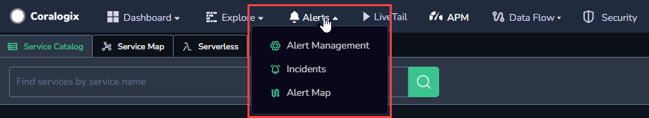
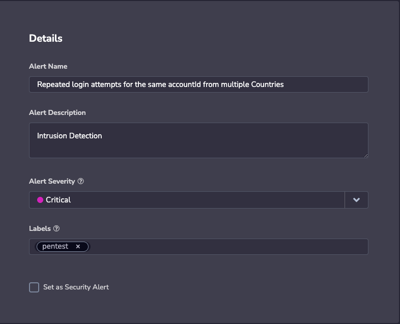
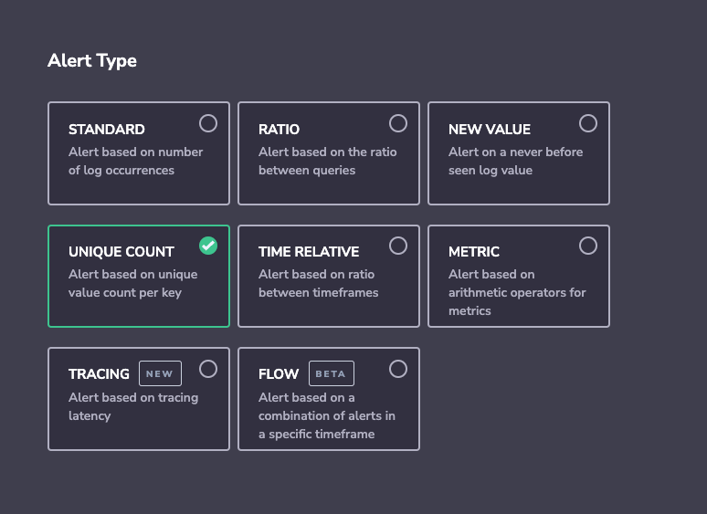
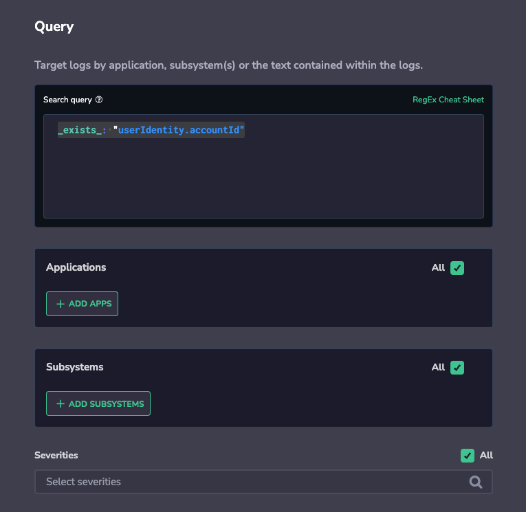
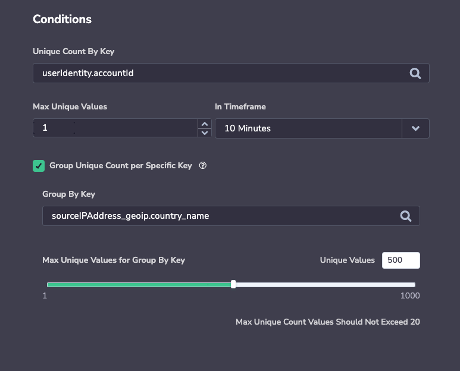
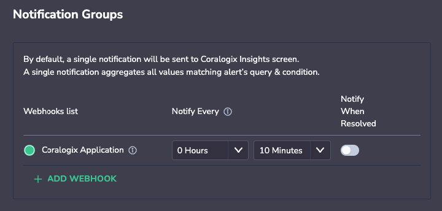
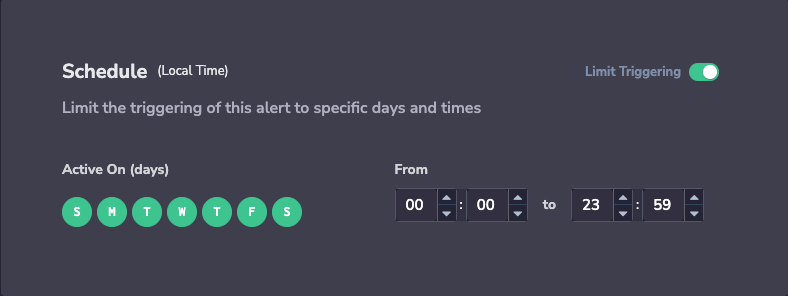

As data volumes grow and the number of alerts generated by logs, metrics, and security systems exponentially increases, one of the most powerful indicators of alert importance is the number of elements affected by it. Whether it’s the number of users who have encountered a 5XX error when calling an API, the number of Kafka consumer groups that returned errors, the number of CDN locations that are currently loading your site for more than 3 seconds, or the number of different passwords that a single user attempts to log in with to your cloud service console.

The problem with most alerts is that they describe the problem, though, in order to understand the severity or broadness of the issue, users need to drill into the data or rely on dashboards.

Unique Count alerts trigger on the number of unique values inside a selected key that matches a specific search criteria _(AKA - The Cardinality of a specific key matched to a search)._

## Create Alerts

**STEP 1.** Create an Alert.

- In the Coralogix toolbar, click **Alerts > Alert Management.**

- Click **NEW ALERT** on the top-right area of the UI.

**STEP 2.** Define Alert **Details.**

- Please enter:
    - **Alert Name.Alert Description**.**Alert Severity**. Choose from one of four options: **Info**, **Warning**, **Error**, **Critical**.**Labels**. Define a new label or choose from an existing one. Nest a label using `key:value`.**Set as Security Alert**. Check this option to create an alert related to [Coralogix Security solutions](https://coralogixstg.wpengine.com/docs/cloud-security-quick-start/).

**STEP 3.** Select **Alert Type: UNIQUE COUNT.**

**STEP 4.** Define your alert search criteria.

**STEP 5.** Define **Conditions**.

- Define the key to match to track its unique count.

- You can also choose to group by a specific log field to receive an alert if the unique count threshold was crossed per specific value of the group by field. (This is very useful with security use cases, i.e. send an alert if a specific user (grouped by key) logged in to my system from more than 1 country (Unique count key) at the same time).

- Once triggered, the alert will display the behavior of unique count per the selected key that matches the configured search criteria, and list all the unique values that were discovered within the tracked key.

**Note:** The total amount of permutations for the unique count by key and group by key should not exceed 10k for the alert timeframe.

**STEP 6.** Define **Notification Groups.**

- By default, a single notification, aggregating all values matching an alert query and conditions, will be sent to your Coralogix **Insights** screen.

- **\+ ADD WEBHOOK**. Click here to define notification recipient(s) and notification channels.

- **Notify Every**. Sets the alert cadence. After an alert is triggered and a notification is sent, the alert will continue to work, but notifications will be suppressed for the duration of the suppression period.
    - When an alert is triggered, it **won’t be triggered again** until one of two things happens: either the **Notify Every** period passes **or** it is resolved. In the latter case, the **Notify Every** parameter is reset.
    
    - Select **Notify when resolved** to receive an automatic update once an alert has ceased.

**STEP 7**. Set a **Schedule.** Limit triggering to specific days and times.

**STEP 8**. Define **Notification Content:**

- Choose a specific JSON key or keys to include in the alert notification.

- Leave blank to view the full log text.

**STEP 9**. **Create** your alert.

- Click **CREATE ALERT** on the upper-right side of the screen.

- After saving your alert, it may take up to 15 minutes for the alert to be active in the cluster.

## **Support**

**Need help?**

Our world-class customer success team is available 24/7 to walk you through your setup and answer any questions that may come up.

Feel free to reach out to us **via our in-app chat** or by sending us an email at **[support@coralogixstg.wpengine.com](mailto:support@coralogixstg.wpengine.com)**.
