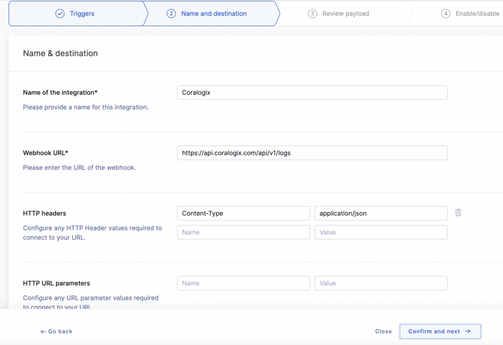
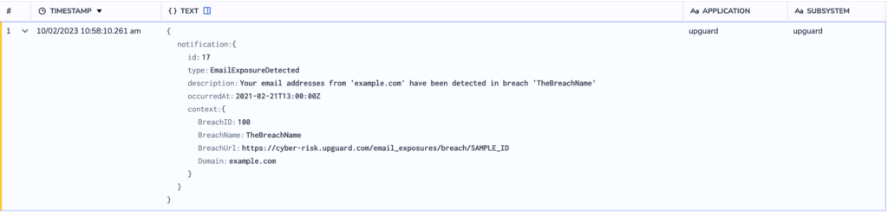
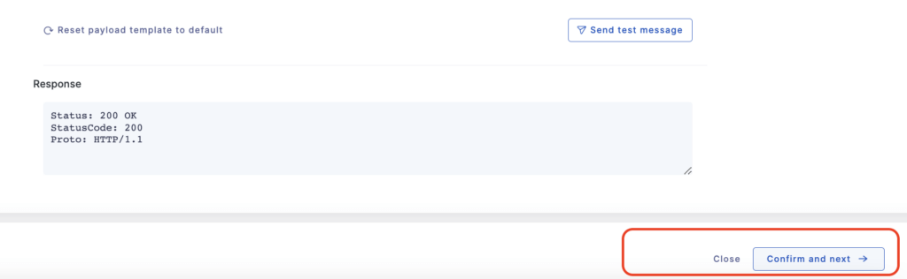

The following tutorial demonstrates how to send your logs to Coralogix using [UpGuard](https://www.upguard.com/). Follow this five-step guide for each notification that you would like to send us.

UpGuard uses webhooks to send notifications when an event happens in your UpGuard account. This could be when an identity breach or data leak is detected, the score of a watched vendor drops below a certain threshold, or when a user requests access to your shared profile.

## Configuration

**STEP 1**. **Create Integration.**

- Login to your Upguard account.

- Select **Settings** in your left-hand sidebar.


- Click on the **Integrations** tab.


- Click **\+ New Integration**.


- Select **Webhook**.


**STEP 2. Select Triggers**

- Select from a wide-range of pre-defined triggers to use as part of this integration. Examples include:
    - 'When my company's score drops below 600'
    
    - 'When a domain or IP's score drops below 600'
    
    - 'When a new identity breach is detected'
    
    - 'When a new identity breach for a VIP email is detected'

- Enable a trigger by clicking on the associated pill, which slides to the right.


- Click **Confirm and next**.

**STEP 3. Name and Destination**

- Provide the webhook URL corresponding to the Coralogix cluster URL associated with the [domain and region](https://coralogixstg.wpengine.com/docs/coralogix-domain/) where your data is stored.

<table><tbody><tr><td><strong>Coralogix</strong> <strong>Cluster URL</strong></td><td><strong>API</strong> <strong>Endpoint</strong></td></tr><tr><td>.com</td><td>https://api.coralogixstg.wpengine.com</td></tr><tr><td>.us</td><td>https://api.coralogix.us</td></tr><tr><td>.in</td><td>https://api.app.coralogix.in</td></tr><tr><td>.app.eu2.coralogixstg.wpengine.com</td><td>https://api.eu2.coralogixstg.wpengine.com</td></tr><tr><td>.app.coralogixsg.com</td><td>https://api.coralogixsg.com</td></tr></tbody></table>

<table><tbody><tr><td><strong>Schema</strong><br><strong>Endpoint Details</strong></td><td></td></tr><tr><td><strong>Webhook URL</strong></td><td>https://api.&lt;clusterURL&gt;/api/v1/logs</td></tr><tr><td><strong>Content-Type&nbsp;</strong></td><td>application/json</td></tr></tbody></table>

For **example**, if your Coralogix data is hosted in India, your webhook URL should appear as **https://api.app.coralogix.in/api/v1/logs**.

- Configure the **HTTP Header** values by inputting **Content-Type: application/json**. As webhook by default uses POST method to send requests, there is no need to define the method.


  
Example:



- Click **Confirm and next**.

**STEP 4. Define Payload Structure**

- For each trigger, UpGuard provides a default payload template as in the example below.


- Modify the payload template to comply with the Coralogix structure.

**POST Body**

<table><tbody><tr><td><strong>Required</strong></td><td><strong>Property Name</strong></td><td><strong>Property Type</strong></td><td><strong>Note</strong></td></tr><tr><td>Yes</td><td>privateKey</td><td>UUID</td><td></td></tr><tr><td>Yes</td><td>applicationName</td><td>string</td><td>usually used to separate environments</td></tr><tr><td>Yes</td><td>subsystemName</td><td>string</td><td>usually used to separate components</td></tr><tr><td></td><td>computerName</td><td>string</td><td></td></tr><tr><td>Yes</td><td>logEntries</td><td>array of logs</td><td></td></tr></tbody></table>

**Log**

<table><tbody><tr><td><strong>Required</strong></td><td><strong>Property Name</strong></td><td><strong>Property Type</strong></td><td><strong>Notes</strong></td></tr><tr><td>Yes</td><td>timestamp</td><td>number</td><td>UTC milliseconds since 1970 (supports sub millisecond via a floating point)</td></tr><tr><td>Yes</td><td>severity</td><td>number</td><td>1 – Debug, 2 – Verbose, 3 – Info, 4 – Warn, 5 – Error, 6 – Critical</td></tr><tr><td>Yes</td><td>text</td><td>string</td><td></td></tr></tbody></table>

- Wrap the payload template in JSON as follows. You will need to input your Coralogix [Send-Your-Data API key](https://coralogixstg.wpengine.com/docs/send-your-data-api-key/), [application and subsystem](https://coralogixstg.wpengine.com/docs/application-and-subsystem-names/) names, and computer name.

```
{
   "privateKey": "<Coralogix send your data api-key>",
   "applicationName": "<application name>",
   "subsystemName": "<subsytem name>",
   "computerName": "<computer name>",
   "logEntries": [
     {
       "severity": <default severity of event 1-6>,
       "text": {
   "notification": {
   }
 }
     }
   ]
 }
```

- The following is an **example** of a Coralogix-compatible payload template.

```
{ 
"privateKey": "xxxxxxx-xxxxxx-xxxxxx-xxxxxxx",
   "applicationName": "upguard",
   "subsystemName": "upguard",
   "computerName": "upguard01",
   "logEntries": [
     {
       "severity": 4,
       "text": {
   "notification": {
     "id": {{ notification.id }},
     "type": "{{ notification.type }}",
     "description": "{{ notification.description }}",
     "occurredAt": "{{ notification.occurredAt }}",
     "context":     {
       "PrevScore": {{ notification.context.PrevScore }},
       "PrevScoreOn": "{{ notification.context.PrevScoreOn }}",
       "Threshold": {{ notification.context.Threshold }},
       "LatestScore": {{ notification.context.LatestScore }},
       "LatestScoreOn": "{{ notification.context.LatestScoreOn }}"
     }
   }
 }
     }
   ]
 }
```

- Validate that your webhook is working properly by clicking **Send test message**. The value '200 OK' should appear as the **Response**.


Example:  


- Validate that Coralogix has received the test notification by searching the logs in your Coralogix dashboard.



- Click **Confirm and next**.



  
  

**STEP 5. Enable the Integration**

- Click the toggle to enable the integration and click **Finish**.


## A**dditional Resources**

<table><tbody><tr><td><strong>UpGuard</strong></td><td><a href="https://help.upguard.com/en/articles/4205928-how-to-integrate-upguard-with-other-services-using-webhooks">Webhook documentation for advanced modification of Webhook Payload</a></td></tr></tbody></table>

## **Support**

**Need help?**

Our world-class customer success team is available 24/7 to walk you through your setup and answer any questions that may come up.

Feel free to reach out to us **via our in-app chat** or by sending us an email at [support@coralogixstg.wpengine.com](mailto:support@coralogixstg.wpengine.com).
