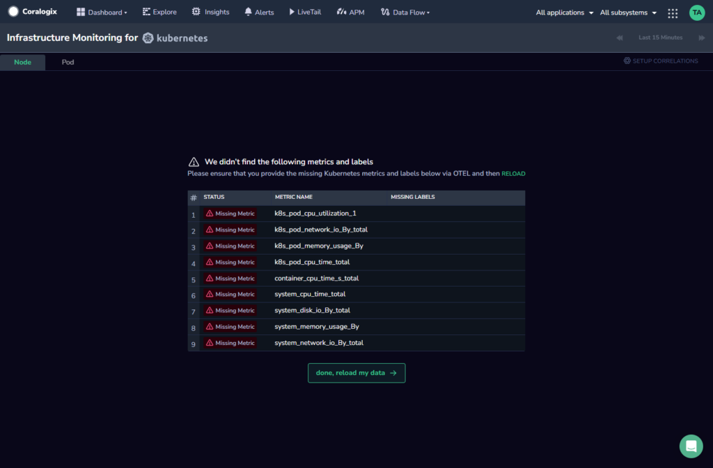

Validate that you have enabled [Kubernetes Observability using OpenTelemetry](https://coralogixstg.wpengine.com/docs/introduction-to-kubernetes-observability-using-opentelemetry/) and are sending cluster telemetry to Coralogix.

**STEP 1**. Check that the cluster collector are running in your cluster.

Search for pods in the deployed namespace with the following:

```
kubectl get pods -o wide -n $NAMESPACE

```

**OpenTelemetry Cluster Collector** pods named `coralogix-opentelemetry-collector-xxx` and **Kube State Metrics** pods named `otel-integration-kube-state-metrics-xxx` should appear with `Running` status.


**STEP 2**. Install the **Kubernetes OpenTelemetry** [extension packages](https://coralogixstg.wpengine.com/docs/extension-packages/) in your Coralogix account by navigating to **Data Flow** > **Extensions** in your toolbar. Use this to hit the ground running with predefined alerts, parsing rules, dashboards, saved views, and actions.

- Open the **Kubernetes OpenTelemetry** extension with the latest version.

- Select **Applications** and **Subsystems** for all related Kubernetes telemetry or select **All** for both.

- Click **+** **Deploy.**


**STEP 3**. The **Kubernetes OpenTelemetry** extension includes a set of Grafana K8s Otel dashboards when installed. It is a useful way to determine if the metrics being exported to Coralogix are satisfactory for your [Kubernetes Dashboard](https://coralogixstg.wpengine.com/docs/kubernetes-dashboard/) setup.

- In the [Kubernetes Dashboard](https://coralogixstg.wpengine.com/docs/kubernetes-dashboard/), select **I’ve Installed OpenTelemetry**. Click **→ GO**.


- If all the metrics and labels are present, the **Kubernetes Dashboard** is opened. If there are missing metrics or labels, a screen appears detailing the missing metrics and/or labels.



- Provide any missing metrics or labels.

- Click **DONE, RELOAD MY DATA →** to continue to the **Kubernetes Dashboard**.


## Next Steps

Troubleshoot your configuration [here](https://coralogixstg.wpengine.com/docs/troubleshooting/).

## Additional Resources

<table><tbody><tr><td>Documentation</td><td><a href="https://coralogixstg.wpengine.com/docs/kubernetes-dashboard/"><strong>Kubernetes Dashboard</strong></a></td></tr></tbody></table>

## Support

**Need help?**

Our world-class customer success team is available 24/7 to answer any questions that may come up.

Feel free to reach out to us **via our in-app chat** or by sending us an email at [support@coralogixstg.wpengine.com](mailto:support@coralogixstg.wpengine.com)
