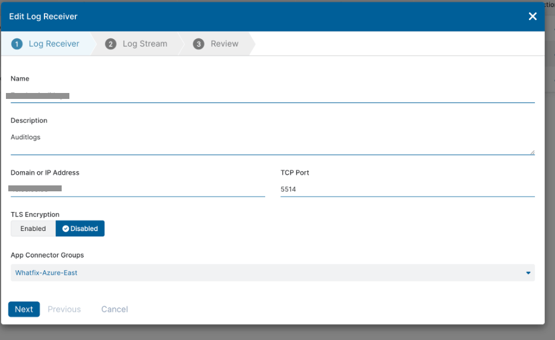
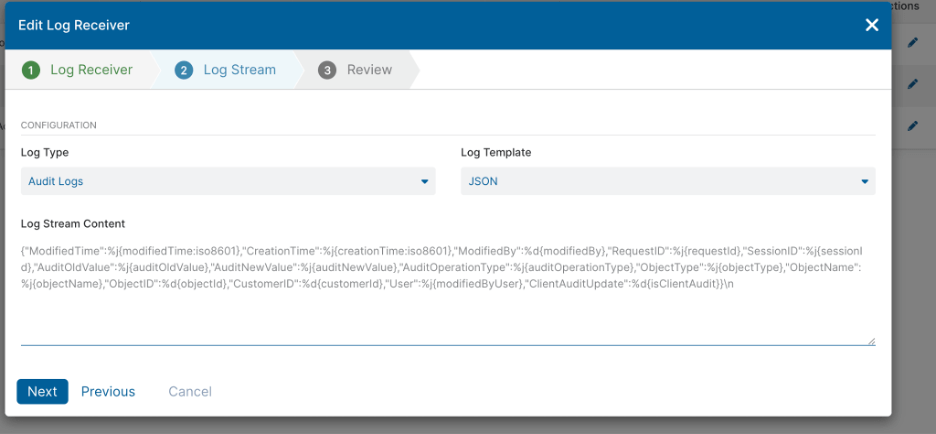

Configure [Zscaler Secure Private Access (ZPA)](https://www.zscaler.com/products/zscaler-private-access) to seamlessly send logs to Coralogix.

## Configuration

Configure Zscaler Secure Private Access (ZPA) to send logs in JSON format to a local server hosted on-premises or on-cloud on a custom port (for example, 5514).

**STEP 1**. Edit the Log Receiver. Click **Next**.



**STEP 2**. Configure the Log Stream. Select JSON **Log Template**. Click **Next**.



**STEP 3**. [Install](https://docs.fluentd.org/installation) Fluentd on a local server.

**STEP 4**. Use the configuration below to listen to Zscaler on the configured port, parse it to JSON format, and send it to Coralogix.

```
 <source>
 @type tcp #tcp input filter, in case you are sending it via UDP use udp input plugin and corresponding configuration
 @log_level debug
 tag zscaler-tcp # required
 <parse>
   @type json
 </parse>
 port 5514   #port on which you are sending zscaler logs
 bind 0.0.0.0
 delimiter "\n"
</source>

<filter **>
@type record_transformer
<record>
tag ${tag_parts[0]}
</record>
</filter>
<filter **>
@type record_transformer
@log_level warn
enable_ruby true
auto_typecast true
renew_record true
<record>
applicationName ${record['tag']} #this sets the application name same as tag specified, you can also set a static value
subsystemName ${record['tag']} #this sets the application name same as tag specified, you can also set a static value
computerName ${hostname}
text ${record.to_json}
</record>
</filter>

<match **>
@type http
@id out_http_coralogix
endpoint "https://api.app.coralogix.in/logs/rest/singles" #for india region, update this as per your Coralogix region
headers {"private_key":"<Coralogix send your data api-key>"}
error_response_as_unrecoverable false
<buffer tag>
@type memory
   compress gzip
   flush_thread_count 4
   chunk_limit_size 6MB
   flush_interval 1s
   overflow_action throw_exception
   retry_max_times 10
   retry_type periodic
   retry_wait 8
   total_limi_size 512MB
</buffer>
</match>

<label @FLUENT_LOG>
<match fluent.*>
@type stdout
</match>
</label>
```

## Parameters & Descriptions

Input the API endpoint associated with your Coralogix [domain](https://coralogixstg.wpengine.com/docs/coralogix-domain/) in the configuration above.

<table><tbody><tr><td><strong>Domain</strong></td><td><strong>API Endpoint</strong></td></tr><tr><td>.coralogixstg.wpengine.com</td><td>https://api.coralogixstg.wpengine.com/logs/rest/singles</td></tr><tr><td>.app.coralogix.us</td><td>https://api.coralogix.us/logs/rest/singles</td></tr><tr><td>.app.coralogix.in</td><td>https://api.app.coralogix.in/logs/rest/singles</td></tr><tr><td>.app.eu2.coralogixstg.wpengine.com</td><td>https://api.eu2.coralogixstg.wpengine.com/logs/rest/singles</td></tr><tr><td>.app.coralogixsg.com</td><td>https://api.coralogixsg.com/logs/rest/singles</td></tr></tbody></table>

## Additional Resources

Secure Private Access (ZPA) Help: [Configuring a Log Receiver](https://help.zscaler.com/zpa/configuring-log-receiver)

## Support

**Need help?**

Our world-class customer success team is available 24/7 to walk you through your setup and answer any questions that may come up.

Feel free to reach out to us **via our in-app chat** or by sending us an email at [support@coralogixstg.wpengine.com](mailto:support@coralogixstg.wpengine.com).
