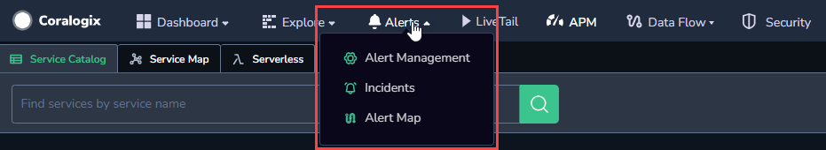

**Alerts Map** presents users with a visual representation of each alert status in real-time. Grouping all of your alerts in a scalable, information-dense manner, this feature ensures optimal system monitoring.

Use **Alerts Map** to visualize the following:

- [Standard Alerts](https://coralogixstg.wpengine.com/docs/coralogix-user-defined-alerts/) (for all alert conditions except `notify immediately`)

- [Ratio Alerts](https://coralogixstg.wpengine.com/docs/ratio-alerts/)

- [Metric Alerts](https://coralogixstg.wpengine.com/docs/metric-alerts-promql/)

- [Time Relative Alerts](https://coralogixstg.wpengine.com/docs/time-relative-alerts/)

- [Flow Alerts](https://coralogixstg.wpengine.com/docs/flow-alert/)

## Accessing Alerts Map

To access the **Alerts Map** feature, navigate to **Alerts** in your navigation pane > **Alerts Map**.  

## Alerts Map Visualization

### View Triggered Alerts

**Alerts Map** is divided into different visualizations based on the field or fields a user has grouped by in his / her alerts. Red hexagons represent values per key that have resulted in a triggered alert. Green hexagons represent all other conditions.

- Hexagon color is updated at intervals defined by `value:time-range` in the alert definition itself:
    - Every 2 min: When the less than\\more than condition is under 30min
    
    - Every 6 min: When the less than\\more than condition is between 30min to 12hrs
    
    - Every 12 min: When the less than\\more than condition is bigger than 12hr

- To view additional information about a triggered alert, hover over a hexagon of interest. You will see a list of all the alerts that were triggered for a specific value and how many of them have been resolved.

### Filter

Filter **Alters Map** in the left-hand sidebar. Filter by **Alert status, Alert name, and Alert Severity.**

## Support

**Need help?**

Our world-class customer success team is available 24/7 to walk you through your setup and answer any questions that may come up.

Feel free to reach out to us **via our in-app chat** or by sending us an email at [support@coralogixstg.wpengine.com](mailto:support@coralogixstg.wpengine.com).
