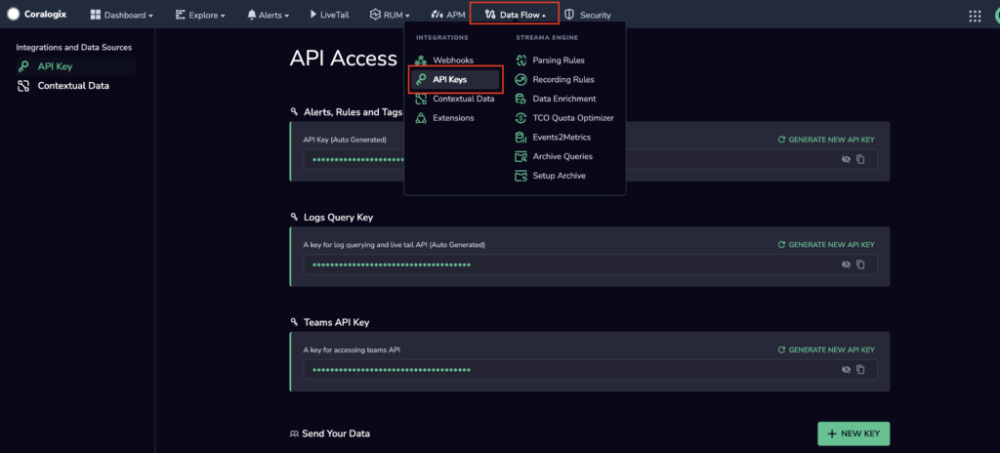

Retrieve and generate your **Alert, Rules, and Tags API key**.

## Permissions

To view, retrieve, or generate your **Alert, Rules, and Tags API key**, the following permissions are required.

### View & Retrieve

```
user-legacy-other-api-keys:ReadConfig 
```

### Generate

```
user-legacy-other-api-keys:Manage
```

## Accessing Your API Key

**STEP 1**. To access your **Alert, Rules, and Tags API key**, navigate to **Data Flow** > **API Keys** from your Coralogix toolbar.



**STEP 2**. View or copy your existing **Alerts, Rules, & Tags API key**, or generate a new one.

## **Support**

**Need help?**

Our world-class customer success team is available 24/7 to answer any questions that may come up.

Feel free to reach out to us **via our in-app chat** or by sending us an email at [support@coralogixstg.wpengine.com](mailto:support@coralogixstg.wpengine.com).
