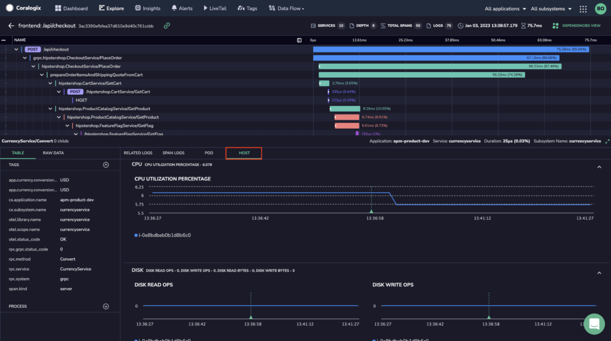
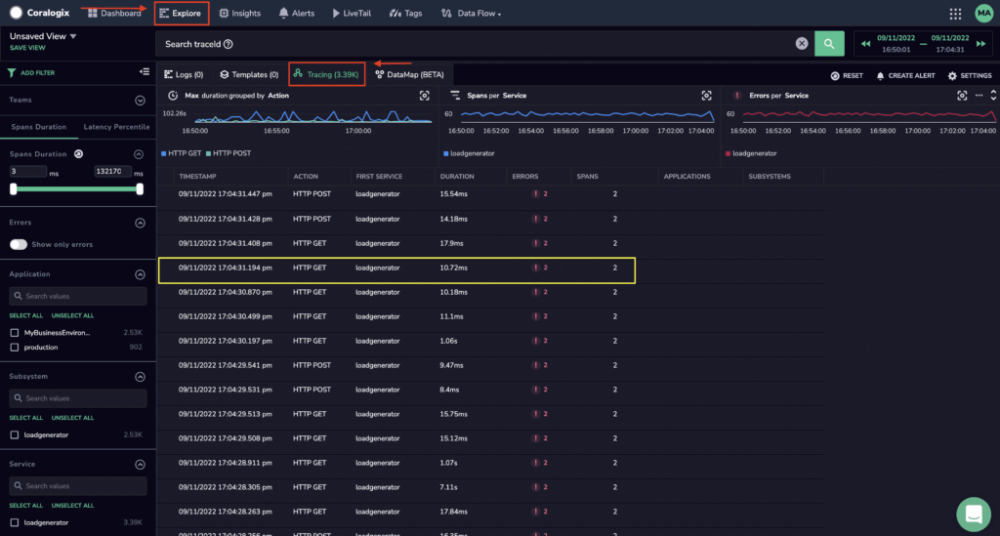
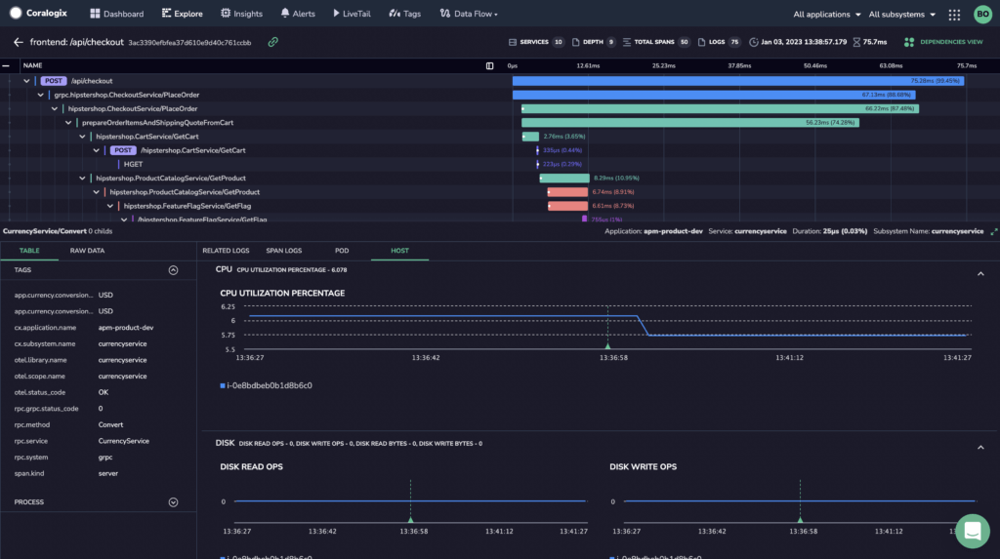

Using [Amazon Kinesis Data Firehose](https://coralogixstg.wpengine.com/docs/amazon-kinesis-data-firehose-metrics/), you can now send metrics to Coralogix from Amazon Elastic Compute Cloud (Amazon EC2) and view them on your Coralogix dashboard using our [application performance monitoring](https://coralogixstg.wpengine.com/blog/application-performance-monitoring-visibility/) features.



## Prerequisites

1\. [Sign up](https://signup.coralogixstg.wpengine.com/#/) for a Coralogix account. Set up your account on the Coralogix [domain](https://coralogixstg.wpengine.com/docs/coralogix-domain/) corresponding to the region within which you would like your data stored.

2\. Access your Coralogix [Send Your Data - API Key](https://coralogixstg.wpengine.com/docs/send-your-data-api-key/).

3\. Configure a metrics bucket in your Coralogix dashboard. **Data Flow** > Setup Archive

4\. [Create](https://docs.aws.amazon.com/accounts/latest/reference/manage-acct-creating.html) an active AWS account with relevant permissions

## Installation & Configuration

**Configure Amazon Kinesis Data Firehose to send your telemetry data to Coralogix. We strongly recommend sending Coralogix your logs, metrics, and tracing, so that you can enjoy the highest quality APM.**

**STEP 1:** [Configure](https://coralogixstg.wpengine.com/docs/amazon-kinesis-data-firehose-metrics/) Amazon Kinesis Data Firehose to send your **metrics** to Coralogix.

**STEP 2:** Set up OpenTelemetry Collector to correlate your **logs** and **traces**.

Add the resource detection processor.

```
processors:
      resourcedetection/ec2:
        detectors: ["ec2", "env"]
        ec2:
          # A list of regex's to match tag keys to add as resource attributes
          tags:
            - ^ec2.tag.name$
            - ^ec2.tag.subsystem$
            - ^aws.*$

```

**STEP 3:** Add AWS tags to spans.

Add the `resourcedetection/ec2` processor to the list of span processors.

```
traces:
	processors:
	  - memory_limiter
	  - batch
	  - resourcedetection/ec2

```

**STEP 4:** Add AWS tags to logs.

Add the `resourcedetection/ec2` processor to the list of logs processors.

```
logs:
  processors:
    - resourcedetection/ec2

```

- Use `cloud.provider` and `cloud.platform` to validate that the process is running on AWS using the EC2 platform.

- Use `host.id` and `host.name` to correlate the logs with metrics and spans.

## APM on Your Coralogix Dashboard

**Access our APM features on your Coralogix dashboard**

**STEP 1**: In your Coralogix dashboard, click on **Explore** > Tracing. Click on the trace of interest.



**STEP 2**: Click on the `HOST` feature to view the AWS metrics with a `host.id` associated with a specific EC2 instance. View your metrics in either SPANS VIEW or DEPENDENCIES VIEW.



## **Support**

**Need help?**

Our world-class customer success team is available 24/7 to walk you through your setup and answer any questions that may come up.

Feel free to reach out to us **via our in-app chat** or by sending us an email at [support@coralogixstg.wpengine.com](mailto:support@coralogixstg.wpengine.com).
