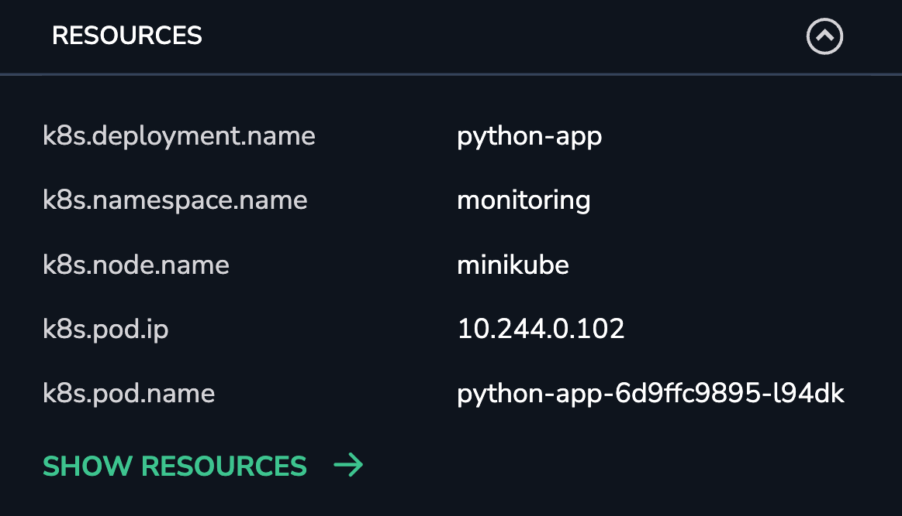
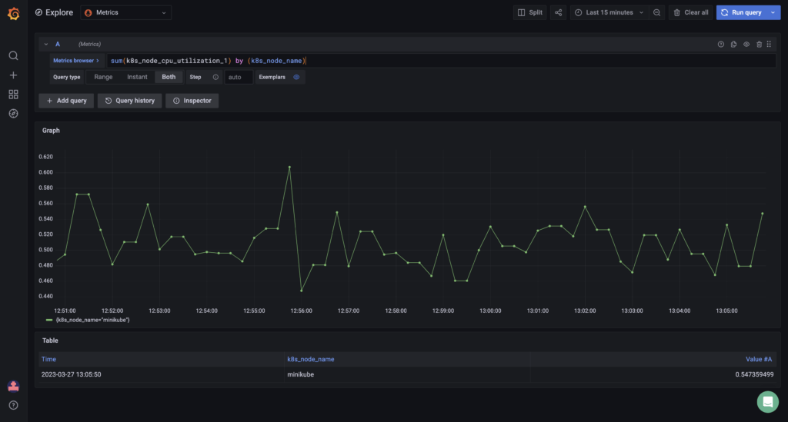
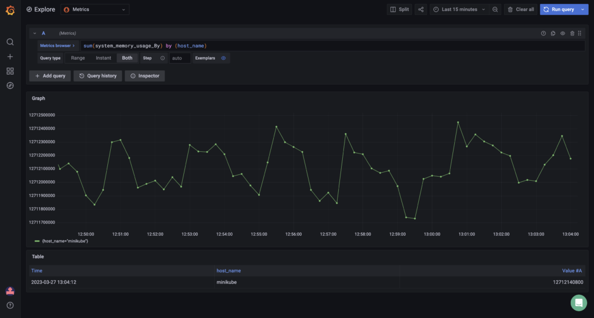

When we refer to OpenTelemetry as a Unified Shipper, we are describing architecture where by OpenTelemetry is leveraged to collect all the required data (logs, metrics & traces) to facilitate [application performance monitoring (APM)](https://coralogixstg.wpengine.com/blog/application-performance-monitoring-visibility/) functionality.

## Prerequisites

1. Sign up for a Coralogix account. Set up your account on the Coralogix domain corresponding to the region within which you would like your data stored.  
    

3. Access your Coralogix [Send Your Data - API Key](https://coralogixstg.wpengine.com/docs/send-your-data-api-key/).  
    

5. Install Kubernetes. This should include installation of the command-line tool kubectl, designed to operate on your Kubernetes cluster.  
    

7. Install and configure Helm. We suggest you use this guide to familiarize yourself with the basics of using Helm to manage packages on your Kubernetes cluster.  
    

## Installation & Configuration

As mentioned above, we will be using Helm to install the Coralogix OpenTelemetry Collector which will be used to collect all the required data (logs, metrics & traces).

1. Configure and Install OpenTelemetry using the [Coralogix OpenTelemetry Helm Chart](https://coralogixstg.wpengine.com/docs/opentelemetry-using-kubernetes/).  
    

The following `values.yaml` override file can be used as a starting point. Additional configuration values can be added as required:

```
global:
  traces:
    endpoint: "ingress.coralogix.<domain>:443"
  metrics:
    endpoint: "ingress.coralogix.<domain>:443"
  logs:
    endpoint: "ingress.coralogix.<domain>:443"

opentelemetry-collector:
  mode: "daemonset"
  presets:
    logsCollection:
      enabled: true
    kubernetesAttributes:
      enabled: true
    hostMetrics:
      enabled: true
    kubeletMetrics:
      enabled: true

```

Once installed, logs, metrics and any available trace data will be sent to Coralogix and will be visible via the Console.

## Validation & Troubleshooting

Once OpenTelemetry is installed and sending data, there are some steps we can take to verify that the we are receiving all the data required for APM to function.  

### K8s Resource Attributes

In order to correlate OpenTelemetry metrics with trace spans, we need to have valid values in the k8s Resource Attributes being shipped from OpenTelemetry. Here is a screenshot of expected K8s Resource Attributes associated with a Span from the Coralogix Tracing UI.



#### Otel Metrics

- Check that the OpenTelemetry K8s node metrics are being received correctly.  
      
    In the Coralogix Grafana view, execute the following query to validate that both **_k8s\_node\_cpu\_utilization_** and the associated label _**k8s\_node\_name**_ are present and can be queried.

```
sum(k8s_node_cpu_utilization_1) by (k8s_node_name)
```



- Check that the OpenTelemetry system metrics are being received correctly.  
      
    In the Coralogix Grafana view, execute the following query to validate that both **_system\_memory\_usage\_By_** and the associated label _**host\_name**_ are present and can be queried.

```
sum(system_memory_usage_By) by (host_name)
```



These are some steps that can be taken to verify that Coralogix has everything it requires for APM. If any of the queries above return empty or invalid results, there may be an issue with the data being sent.

## Support

**Need help?**

Our world-class customer success team is available 24/7 to walk you through your setup and answer any questions that may come up.

Feel free to reach out to us via our in-app chat or by sending us an email at [support@coralogixstg.wpengine.com](https://coralogixstg.wpengine.com/docs/apm-kubernetes/#:~:text=support%40coralogixstg.wpengine.com).
