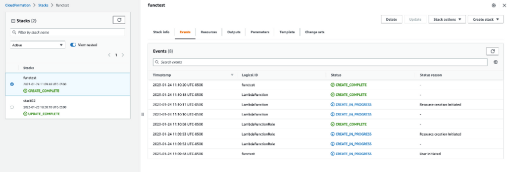
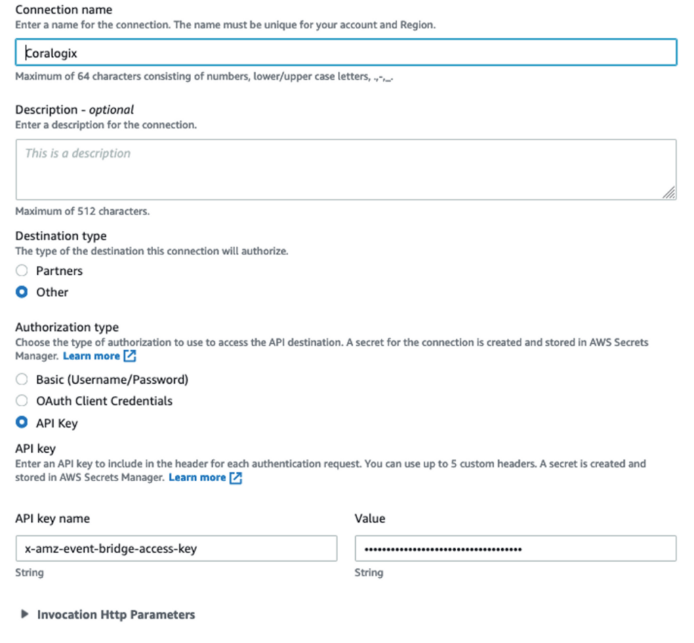
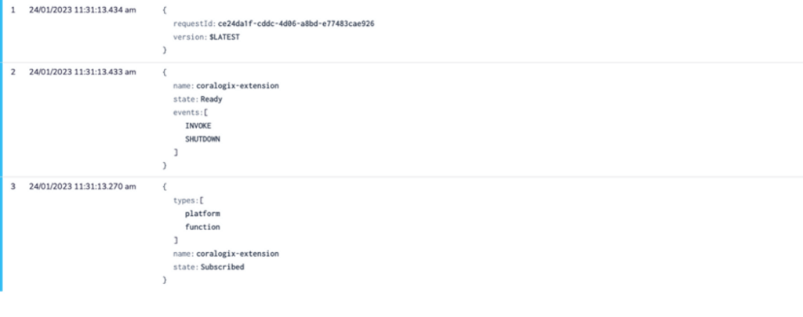

Send your logs to Coralogix using [AWS CloudFormation](https://aws.amazon.com/cloudformation/), granting you observability into your CloudFormation events.

The following tutorial demonstrates how to configure an AWS CloudFormation template using a Lambda function to send your telemetry data to Coralogix.

## Prerequisites

1\. [Sign up](https://signup.coralogixstg.wpengine.com/#/) for a Coralogix account. Set up your account on the Coralogix [domain](https://coralogixstg.wpengine.com/docs/coralogix-domain/) corresponding to the region within which you would like your data stored.

2\. Access your Coralogix [Send Your Data - API Key](https://coralogixstg.wpengine.com/docs/send-your-data-api-key/).

3\. [Create an active AWS account](https://docs.aws.amazon.com/accounts/latest/reference/manage-acct-creating.html) with permissions to manage Lambda functions. Log in to your account as administrator.

4\. Save the script for the AWS CloudFormation template on your desktop or in an S3 bucket.

## Configuration

### Create a Stack

Navigate to CloudFormation Page and click **Create Stack** (with new resources).

> **Note**! AWS CloudFormation may create IAM resources.

2\. Under the Stack option tab, select **Template is ready**. Upload a .yaml file from your S3 bucket or desktop, as in the example below.

```
Resources:
LambdaFunction:
Type: 'AWS::Lambda::Function'
Properties:
FunctionName: AwsLambdaExample
Handler: index.handler
Runtime: nodejs14.x
Role: !GetAtt LambdaFunctionRole.Arn
MemorySize: 1024
Code:
ZipFile: |
exports.handler = async (event) => {
return "Hello World!";
}
LambdaFunctionRole:
Type: AWS::IAM::Role
Properties:
AssumeRolePolicyDocument:
Version: '2012-10-17'
Statement:
- Effect: Allow
Principal:
Service:
- [lambda.amazonaws.com](<http://lambda.amazonaws.com/>)
Action:
- sts:AssumeRole
Path: "/"
Policies:
- PolicyName: AppendToLogsPolicy
PolicyDocument:
Version: '2012-10-17'
Statement:
- Effect: Allow
Action:
- logs:CreateLogGroup
- logs:CreateLogStream
- logs:PutLogEvents
Resource: "*"

```

3\. Click **Next** and define your stack name.

4\. No other changes are required. Click **Next** and submit the stack.



### API Destination

1\. Navigate to [Amazon EventBridge](https://aws.amazon.com/eventbridge/) and click **Create API destination** in the API Destination section.

2\. Define the name.

3\. Define the API destination associated with your Coralogix [domain](https://coralogixstg.wpengine.com/docs/coralogix-domain/).

<table><tbody><tr><td><strong>Coralogix Domain</strong></td><td><strong>Endpoint</strong></td></tr><tr><td>coralogixstg.wpengine.com</td><td>https://aws-events.coralogixstg.wpengine.com/aws/event</td></tr><tr><td>coralogix.us</td><td>https://aws-events.coralogix.us/aws/event</td></tr><tr><td>eu2.coralogixstg.wpengine.com</td><td>https://aws-events.eu2.coralogixstg.wpengine.com/aws/event</td></tr><tr><td>coralogix.in</td><td>https://aws-events.coralogix.in/aws/event</td></tr><tr><td>coralogixsg.com</td><td>https://aws-events.coralogix.in/aws/event</td></tr></tbody></table>

- HTTP Method: POST

- Invocation rate limit per second – 300 sec

- Select API Key as your **Authorization type**.

- Name your API key **x-amz-event-bridge-access-key**.

- The value of your API key will be your Coralogix [Send Your Data - API Key](https://coralogixstg.wpengine.com/docs/send-your-data-api-key/).



### Create a Rule in Amazon EventBridge

1\. Name your Rule CoralogixRule. Leave all other settings as is. Click **Next**.

2\. Select **All Events**.

> Note! This may affect customer AWS billing.

3\. Click **Next**.

4\. In the Target, select **EventBridge API destination** and input the destination previously configured.

5\. Click **Next** to the create the rule.

## Validation

View your logs, together with the Lambda execution, in your Coralogix dashboard.




## Support

**Need help?**

Our world-class customer success team is available 24/7 to walk you through your setup and answer any questions that may come up.

Feel free to reach out to us **via our in-app chat** or by sending us an email at [support@coralogixstg.wpengine.com](mailto:support@coralogixstg.wpengine.com).
