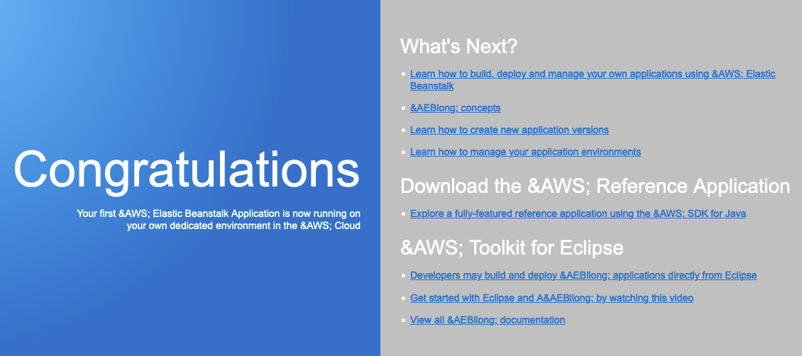
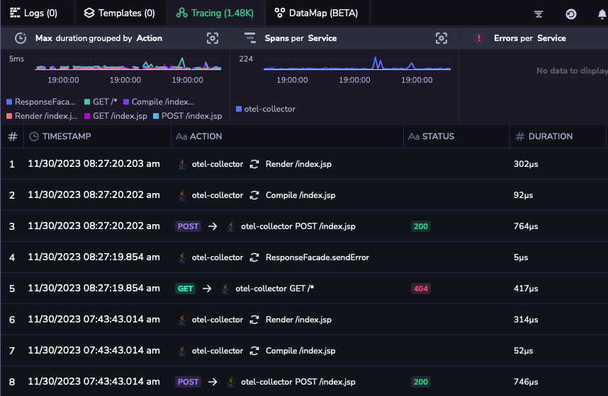
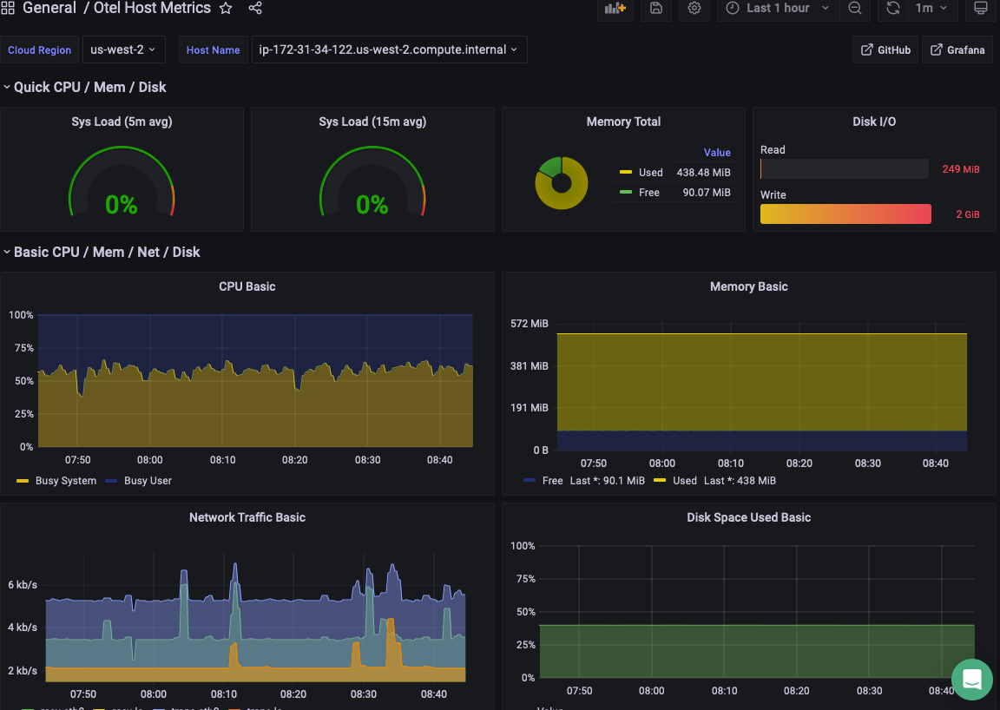
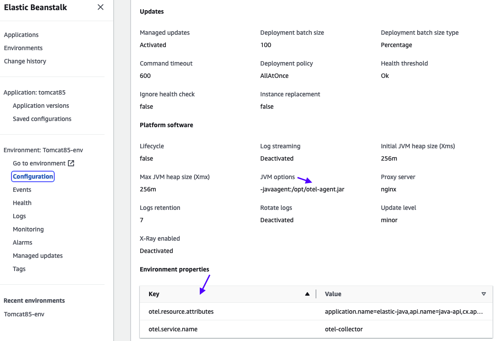

## Overview

In the realm of cloud computing, AWS offers **Elastic Beanstalk**, a robust Platform-as-a-Service (PaaS) solution. Seamlessly aligning with this, Coralogix stands out by facilitating the effortless transportation of application traces and host metrics. This is achieved through adept utilization of the OpenTelemetry Collector and language-specific implementations of OpenTelemetry agents.

This tutorial demonstrates how to instrument a Java application running on the Tomcat platform within an Elastic Beanstalk environment.

## Prerequisites

### Elastic Beanstalk Environment

[Create a Beanstalk environment](https://docs.aws.amazon.com/elasticbeanstalk/latest/dg/GettingStarted.CreateApp.html) for a [supported platform](https://docs.aws.amazon.com/elasticbeanstalk/latest/dg/concepts.platforms.html) of your choice.

### Sample App

Download and unzip a [sample Java application tomcat.zip](https://docs.aws.amazon.com/elasticbeanstalk/latest/dg/GettingStarted.DeployApp.html).

## Instrument Java App

Elastic Beanstalk offers multiple ways to configure your environment's behavior and the resources that it contains. We recommend creating the configuration files in the `.ebextensions` folder when setting up the OpenTelemetry Collector and Java Agent configurations.

**STEP 1.** Open the unzipped Java application folder in Visual Studio Code.

**STEP 2.** Create a folder named `.ebextensions` at the root of the application source bundle and add the config and config.yaml files listed below.

**STEP 3.** Create the `01_collector.config` file with the following content.

**Notes:**

- All configuration files must end with `.config`.

- The number prefix of a file indicates the execution sequence. `Script 01_` is executed first, then `02_` and `03_`. This script does two things:
    - Downloads an OTEL collector v0.89 into Amazon Linux 2 node (the default EC2 instance used by Beanstalk).
    
    - Installs `otelcol-contrib`. The service will automatically start with a default `config.yaml` under the folder `/etc/otelcol-contrib`.

```
---
commands:
  download_otel_contrib_collector:
    command: sudo wget -O /opt/otelcol-contrib.rpm <https://github.com/open-telemetry/opentelemetry-collector-releases/releases/download/v0.89.0/otelcol-contrib_0.89.0_linux_amd64.rpm>

  install_otel_contrib_collector:
    command: sudo rpm -U /opt/otelcol-contrib.rpm
    ignoreErrors: true

```

**STEP 4.** Create a `config.yaml` file with the following content. Substitute `private_key` with your [Send-Your-Data API key](https://coralogixstg.wpengine.com/docs/send-your-data-api-key/) and `domain` with your Coralogix [domain](https://coralogixstg.wpengine.com/docs/coralogix-domain/).

```
receivers:
  otlp:
    protocols:
      grpc:
        endpoint: 0.0.0.0:4317
      http:
        endpoint: 0.0.0.0:4318
  hostmetrics:
    collection_interval: 30s
    scrapers:
      cpu:
      disk:
      load:
      filesystem:
      memory:
      network:
        
processors:
  resource:
    attributes:
    - key: cx.application.name
      value: otel-collector
      action: upsert
    - key: cx.subsystem.name
      value: collector-java
      action: upsert
  resourcedetection:
    detectors: [env, ec2]
    timeout: 5s
    override: true
  tail_sampling:
    decision_wait: 10s 
    expected_new_traces_per_sec: 1000
    policies:
      [
        {
            name: percent-sample-policy,
            type: probabilistic,
            probabilistic: {sampling_percentage: 100}
        },
        {
          name: errors-policy,
          type: status_code,
          status_code: { status_codes: [ERROR] }
        }
      ]
  batch:
    timeout: 5s
    send_batch_size: 256

exporters:
  coralogix:
    timeout: "30s"
    private_key: <your-send-your-data-api-key>
    domain: <your-cx-domain>
    application_name: elastic-java
    subsystem_name: java-api
    #application_name_attributes:
    #  - "cloud.region"
    #subsystem_name_attributes:
    #  - "host.name"

service:
  pipelines:
    logs/otlp:
      receivers: [otlp]
      processors: [resourcedetection, resource, batch]
      exporters: [coralogix]
    traces/otlp:
      receivers: [otlp]
      processors: [resourcedetection, resource, tail_sampling, batch]
      exporters: [coralogix]
    metrics/otlp:
      receivers: [otlp, hostmetrics]
      processors: [resourcedetection, resource, batch]
      exporters: [coralogix]

```

**STEP 5.** Create a file called `02_agent.config` with the following content.

This script:

- Replaces the `config.yaml` file in the `/etc/otelcol-contrib` with the file in the `.ebextensions` folder.

- Downloads the OTEL Java agent and places it in the `/opt` folder.

- Changes permission of the JAR file.

- Sets the JVM options.

- Sets the `otel.resource.attributes` and `otel.service.name` environment variables.

```
---
container_commands: 
  copy_config_yaml: 
    command: "yes | cp .ebextensions/config.yaml /etc/otelcol-contrib/config.yaml"
    
commands:
  download_opentelemetry_javaagent:
    command: sudo wget -O /opt/otel-agent.jar <https://github.com/open-telemetry/opentelemetry-java-instrumentation/releases/latest/download/opentelemetry-javaagent.jar>

  give_permissions_all_to_otel: 
    command: sudo chmod a+rwx /opt/otel-agent.jar

option_settings:
  - namespace: aws:elasticbeanstalk:container:tomcat:jvmoptions
    option_name: 'JVM Options'
    value: -javaagent:/opt/otel-agent.jar 

  - namespace: aws:elasticbeanstalk:application:environment
    option_name: otel.resource.attributes
    value: application.name=elastic-java,api.name=java-api,cx.application.name=elastic-java,cx.subsystem.name=java-api
  
  - namespace: aws:elasticbeanstalk:application:environment
    option_name: otel.service.name
    value: otel-collector

```

**STEP 6.** Create a file called `03_restart.config` with the following content.

This script restarts the `otelcol-contrib` service using a new `config.yaml` file.

```
---
commands:
  restart_otel_service: 
    command: sudo systemctl restart otelcol-contrib

```

**STEP 7.** When all the configurations required are completed, open a terminal and zip your application code at the root of the source bundle.

This command will create a `tomcat-v1.zip` and exclude any MACOS specific files.

**Note**: Do **not** use compress to zip from the Finder/Explore.

```
zip -r tomcat-v1.zip . -x '**/.*' -x '**/__MACOSX'

```

**STEP 8.** [Deploy](https://docs.aws.amazon.com/elasticbeanstalk/latest/dg/GettingStarted.DeployApp.html) a new version of an application onto your Elastic Beanstalk environment.

**Notes**:

- The attached **zip** file contains all of the relevant changes under the **Instrument Java App** section.

- Download the zip file, extract, and specify the correct Coralogix `private_key` and the `domain` in the `config.yaml` file, zip it again, and deploy.

[tomcat-with-post-deploy-script.zip](https://prod-files-secure.s3.us-west-2.amazonaws.com/ac0d9928-e884-4929-acc6-80700cba02a8/2537f7dd-456e-4023-b48a-028b4d5f93b2/tomcat-with-post-deploy-script.zip)

## Validation & Testing

**STEP 1.** Log in to the AWS console and navigate to your Elastic Beanstalk environment. Click on **Domain** link to validate the Java application you deployed is running.


**STEP 2.** A **Congratulations** message should appear on the screen. Refresh the screen a few times to generate traces. Elastic Beanstalk runs a health check by periodically hitting this endpoint, so you will see additional traces.



**STEP 3.** Log in to your Coralogix account. Navigate to **Explore** > **Tracing** to view the traces.



**STEP 4.** Deploy the Grafana dashboard for the host metrics to validate that the metrics are flowing into Coralogix. Go to the [Grafana dashboard repo](https://github.com/coralogix/grafana-dashboards) and copy the contents of the [host\_otel\_metrics.json](https://github.com/coralogix/grafana-dashboards/blob/master/k8s-opentelemetry/metrics/host_otel_metrics.json) file.

**STEP 5.** Navigate to **Grafana** > **Dashboard** > **Manage.** Click the **Import** button, paste the JSON file content, and then hit **Load and Import**. This will create a host metrics dashboard.



## Troubleshooting

**STEP 1.** Navigate to **Elastic Beanstalk** > **Environments** > **Your-Environment-Name** > **Configuration** in your AWS console. From the main panel, navigate to the **Updates, monitoring, and logging** section. You should see the JVM options and the OTEL environment variables that were set in the `02_agent.config` script.



**STEP 2.** If the configuration looks good but you are not seeing the data, then SSH into an EC2 instance where OTEL Collector and Java agent are installed and validate that:

- The Java agent is installed in the `/opt/otel-agent.jar`

- The OTEL collector is installed in `/etc/otelcol-contrib`

- `config.yaml` is correctly copied into `/etc/otelcol-contrib` and the `private_key` and `domain` are set correctly.

- The `otelcol-contrib` service is running by issuing the following command:

```
sudo systemctl status otelcol-contrib

```

- If `otelcol-contrib` is not running, issue the following command to check the log to identify an issue and fix it, and then restart the service.

```
journalctl -n 100 | grep otelcol

```

## Additional Resources

- [OTel Java Instrumentation](https://opentelemetry.io/docs/instrumentation/java/getting-started/#instrumentation)

- [Beanstalk Tomcat Platform](https://docs.aws.amazon.com/elasticbeanstalk/latest/dg/java-tomcat-platform.html#java-tomcat-options)

- [Beanstalk Customization with .ebextensions](https://docs.aws.amazon.com/elasticbeanstalk/latest/dg/ebextensions.html)

- [Commands for .ebextensions](https://docs.aws.amazon.com/elasticbeanstalk/latest/dg/customize-containers-ec2.html#linux-commands)

- [Option Settings for .ebextensions](https://docs.aws.amazon.com/elasticbeanstalk/latest/dg/ebextensions-optionsettings.html)

## Support

**Need help?**

Our world-class customer success team is available 24/7 to walk you through your setup and answer any questions that may come up.

Feel free to contact us **via our in-app chat** or by emailing [support@coralogixstg.wpengine.com](mailto:support@coralogixstg.wpengine.com).
