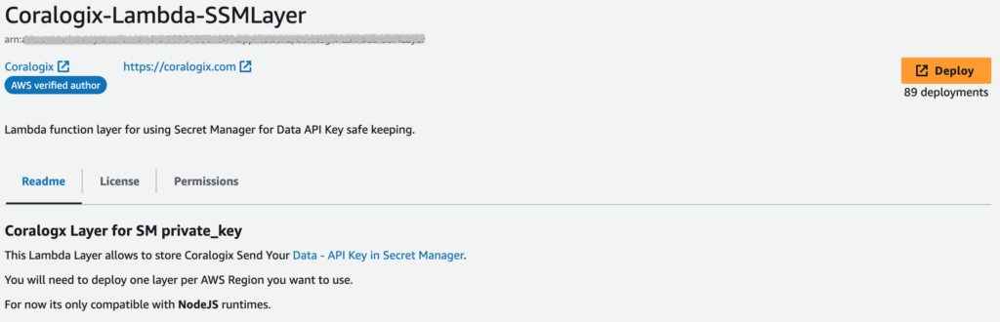
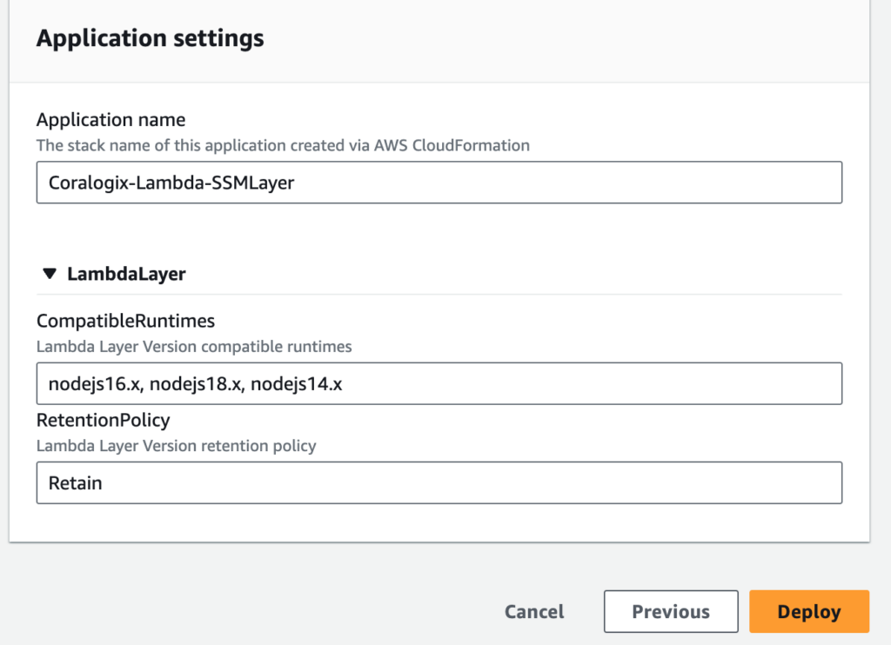
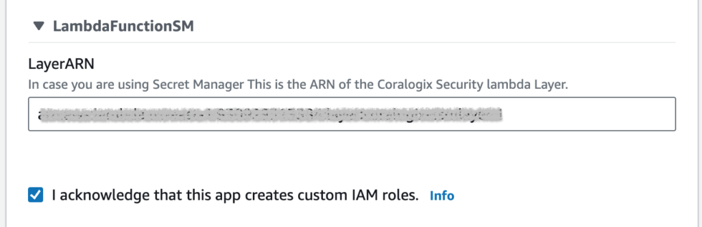

Deploy the **AWS Secrets Manager Lambda layer** to be used in any of our AWS integrations. Doing so ensures the security of your `ApiKey`, which is presented in the Lambda as a secret rather than an environment variable.

## Overview

[AWS Secrets Manager](https://docs.aws.amazon.com/secretsmanager/) helps you to securely encrypt, store, and retrieve credentials for your databases and other services. Instead of hardcoding credentials in your apps, you can make calls to Secrets Manager to retrieve your credentials whenever needed. Secrets Manager helps you protect access to your IT resources and data by enabling you to rotate and manage access to your secrets.

Use the AWS Lambda Secrets Manager layer in any of our AWS integrations. Deploy the layer with **Terraform** or as a **serverless application**.

## Serverless

Deploy the AWS Secrets Manager Lambda layer to be used in our serverless AWS integrations.

**STEP 1**. Deploy the layer. Click **Deploy** [here](https://serverlessrepo.aws.amazon.com/applications/eu-central-1/597078901540/Coralogix-Lambda-SSMLayer).



**STEP 2**. Scroll down. Click **Deploy**.



**STEP 3**. Once the layer is created, copy and paste the ARN into the `LayerARN` field of the relevant integration.



## Terraform

Deploy the AWS Secrets Manager Lambda layer to be used with our Terraform AWS integrations.

**STEP 1**. Run this code.

```
provider "aws" {
}

module "lambda-secretLayer" {
  source = "coralogix/aws/coralogix//modules/lambda-secretLayer"

}

output "layer_arn" {
  value = module.lambda-secretLayer.lambda_layer_version_arn
}

```

**STEP 2**. Once the layer is created, copy and paste the ARN as the `layer_arn` variable in the relevant integration, as in the example below.

Once the layer is created, copy and paste the ARN as the layer\_arn variable in the relevant integration, as in the example below. Set `secret_manager_enabled` to true.

```
provider "aws" {
}

module "lambda-secretLayer" {
  source = "coralogix/aws/coralogix//modules/lambda-secretLayer"

}

module "coralogix-shipper-s3" {
  source = "coralogix/aws/coralogix//modules/s3"
  depends_on = [ module.lambda-secretLayer ]

  coralogix_region   = "Europe"
  private_key        = "XXXXXXXX-XXXX-XXXX-XXXX-XXXXXXX"
  secret_manager_enabled    = true 
  layer_arn          = module.lambda-secretLayer.lambda_layer_version_arn
  application_name   = "s3"
  subsystem_name     = "logs"
  s3_bucket_name     = "test-bucket-name"
  integration_type   = "s3"
}

```

In the event you want to use AWS Secrets Manager with a predefined secret that contains your Coralogix [Send-Your-Data API key](https://coralogixstg.wpengine.com/docs/send-your-data-api-key/):

- Set the variable `create_secret` to False

- Input the name of the secret that contains your Coralogix [Send-Your-Data API key](https://coralogixstg.wpengine.com/docs/send-your-data-api-key/) as `private_key`

```
provider "aws" {
}

module "lambda-secretLayer" {
  source = "coralogix/aws/coralogix//modules/lambda-secretLayer"

}

module "coralogix-shipper-s3" {
  source = "coralogix/aws/coralogix//modules/s3"
  depends_on = [ module.lambda-secretLayer ]

  coralogix_region   = "Europe"
  private_key        = "the name of the secret that contains the Coralogix send your data key"
  layer_arn          = module.lambda-secretLayer.lambda_layer_version_arn
  application_name   = "s3"
  subsystem_name     = "logs"
  s3_bucket_name     = "test-bucket-name"
  integration_type   = "s3"
  create_secret      = "False"
}

```

## Additional Resources

<table><tbody><tr><td>Integrations</td><td><strong><a href="https://coralogixstg.wpengine.com/docs/amazon-s3-data-collection-options/">Amazon S3: Data Collection Options</a></strong><br><strong><a href="https://coralogixstg.wpengine.com/docs/aws-cloudtrail-data-collection-options/">AWS CloudTrail: Data Collection Options</a></strong><br><strong><a href="https://coralogixstg.wpengine.com/docs/aws-cloudwatch-integration-options/">AWS CloudWatch: Data Collection Options</a></strong></td></tr></tbody></table>

## Support

**Need help?**

Our world-class customer success team is available 24/7 to walk you through your setup and answer any questions that may come up.

Feel free to reach out to us **via our in-app chat** or by sending us an email at [support@coralogixstg.wpengine.com](mailto:support@coralogixstg.wpengine.com).
