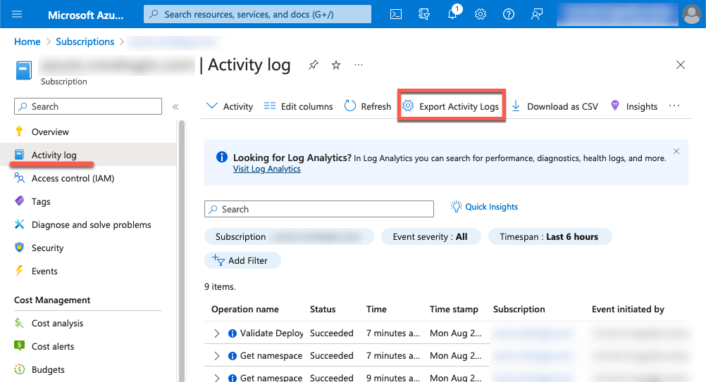
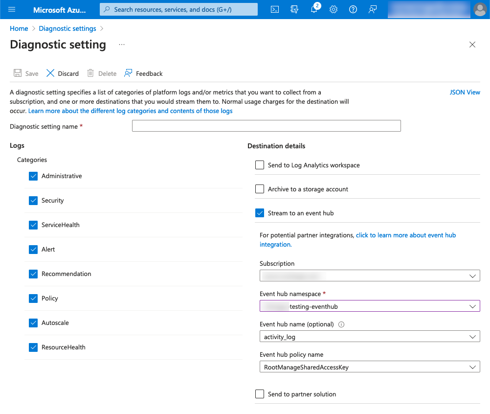

Collect Azure Activity logs and submit them to Coralogix for seamless integration.

## Overview

[Activity logs](https://learn.microsoft.com/en-us/azure/azure-monitor/essentials/activity-log) are a form of audit log that provide insight into the operations performed on each Azure resource in the subscription from the outside, known as the management plane. This can include the creation or deletion of resources, as well as updates to existing services.

This tutorial explains how to collect Azure Activity logs and send them to Coralogix. To do so, you will need to configure an Activity log export and use our [Event Hub integration](https://coralogixstg.wpengine.com/docs/azure-eventhub-trigger-function/) to collect and submit the logs to the Coralogix platform.

## Prerequisites

- Azure account with an active subscription

- EventHub Namespace \[**Note**: If your EventHub has restricted public access you will need to enable VNet support using these [optional configuration steps](https://coralogixstg.wpengine.com/docs/optional-configurations-microsoft-azure/).\]

## Activity Log Export

**STEP 1**. To configure Activity Log exports, navigate to your **Subscription > Activity log**.

**STEP 2**. Click **Export Activity Logs.**

**STEP 3**. In the next window, click **\+ Add Diagnostic Setting**.

**STEP 4**. In the **Diagnostic Setting**, select your desired **Categories** and configure the **Destination details** to submit entries to your existing Event Hub.

## Process Event Hub

Now that we have your Activity Log entries being exported to your Event Hub, you’ll need to deploy the Azure Event Hub integration to collect and submit the messages to the Coralogix platform.

To do so, you can deploy via ARM template or Terraform:

- ARM
    - [Azure Event Hub ARM](https://coralogixstg.wpengine.com/docs/azure-eventhub-trigger-function/)
    
    - [ARM Event Hub Integration Package](https://coralogixstg.wpengine.com/docs/azure-resource-manager-arm-integration-packages/)

- Terraform
    - [Azure Event Hub Terraform](https://coralogixstg.wpengine.com/docs/terraform-modules-for-azure-eventhub/)

## Additional Resources

<table><tbody><tr><td>Documentation</td><td><a href="https://www.notion.so/microsoft-azure-functions-a4ced743a96d4b79be76e271fbf368e9?pvs=21"><strong>Introduction to Microsoft Azure</strong></a></td></tr></tbody></table>

## Support

**Need help?**

Our world-class customer success team is available 24/7 to walk you through your setup and answer any questions that may come up.

Feel free to reach out to us **via our in-app chat** or by sending us an email at [support@coralogixstg.wpengine.com](mailto:support@coralogixstg.wpengine.com).
