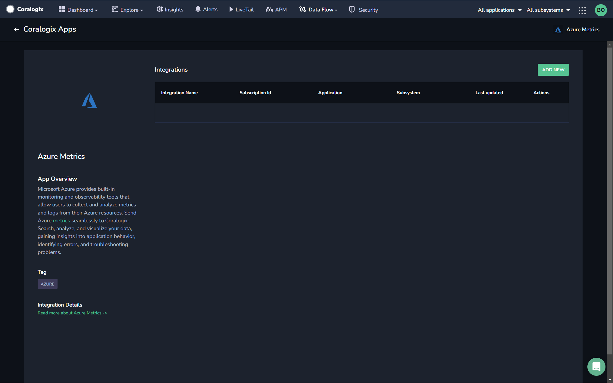
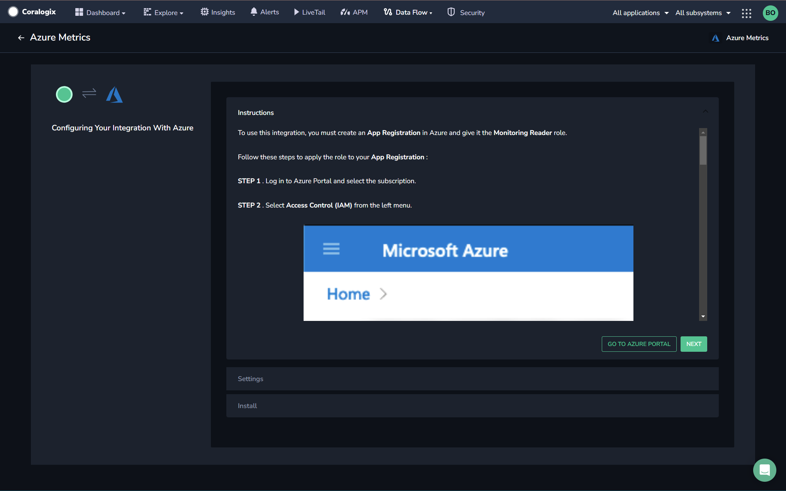
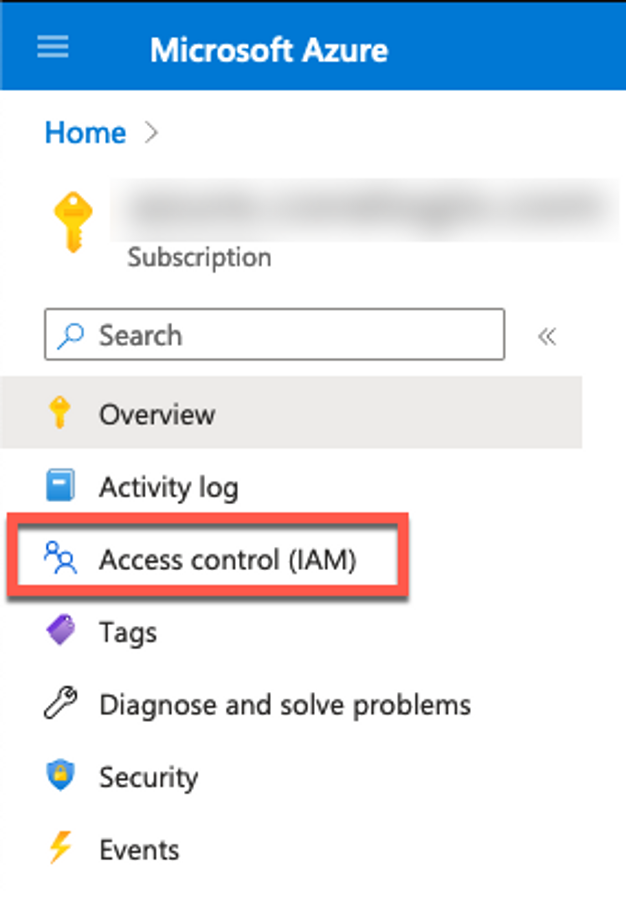
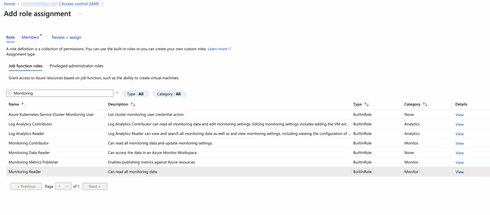
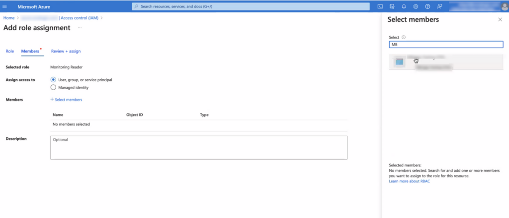
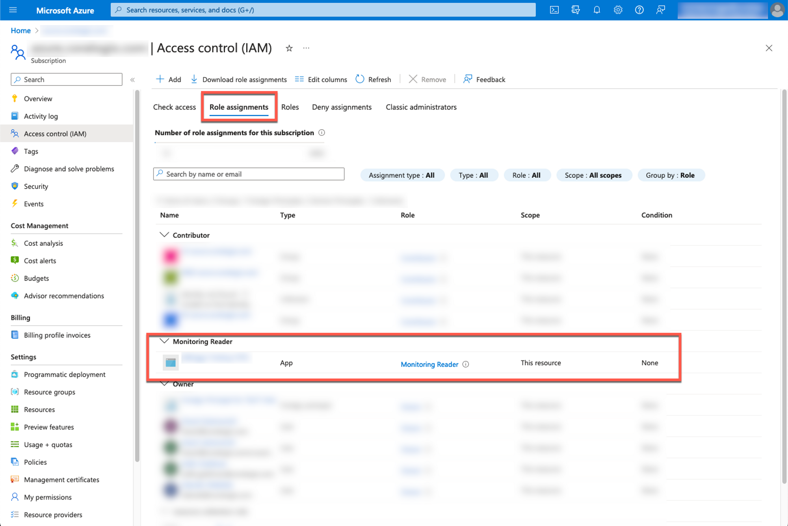
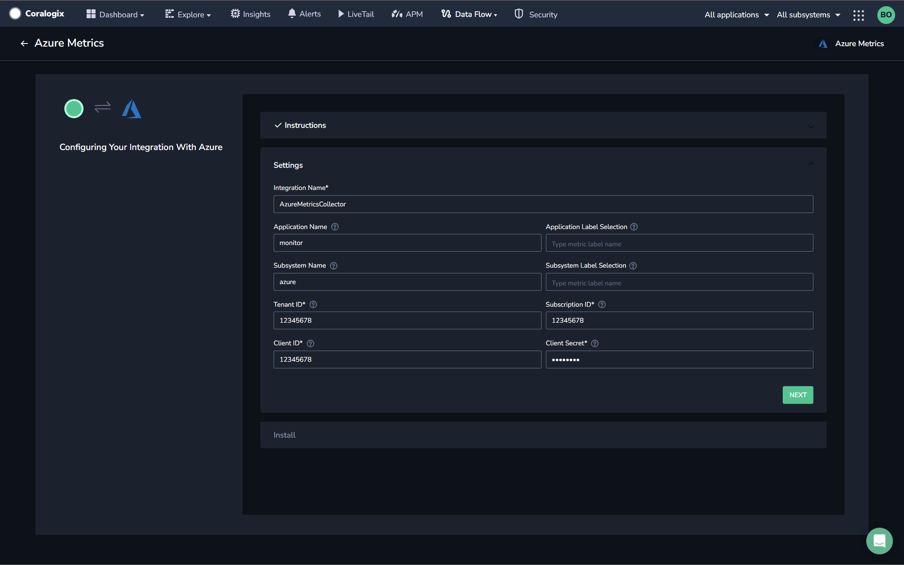
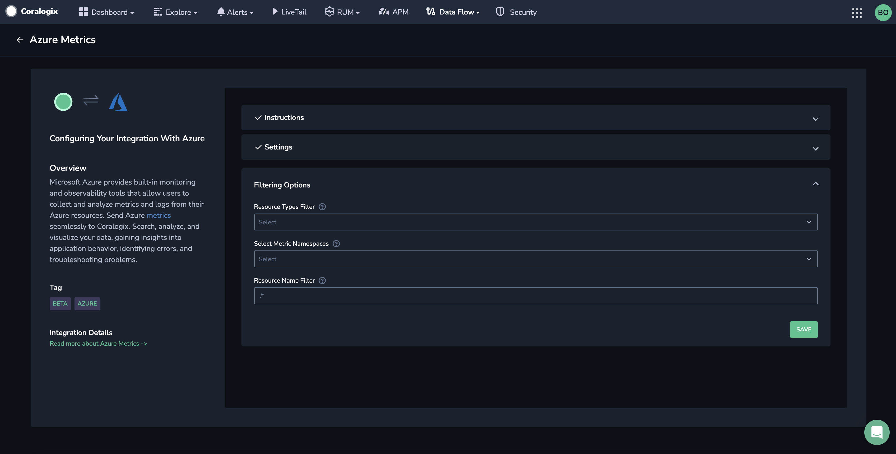
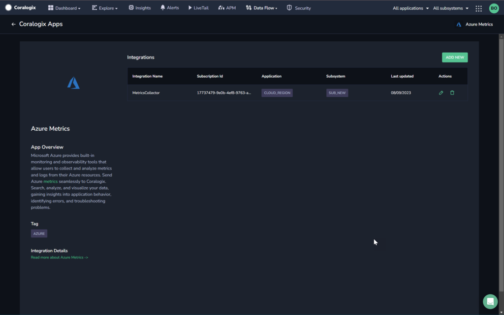

The Coralogix Azure Metrics integration offers a simple and easy way to ingest Azure metrics into Coralogix.

## Overview

Azure Monitor serves as the observability core within the Azure Cloud ecosystem. It plays a pivotal role by aggregating data from diverse origins, encompassing **logs and metrics derived from Azure infrastructure and resources**, **custom applications**, and **agents running on virtual machines**.

Azure metrics are retrieved from Azure using the [Azure Monitor REST API](https://learn.microsoft.com/en-us/azure/azure-monitor/essentials/data-platform-metrics), which is a widely used API service in Azure that allows customers to gain insights into Azure resources.

A valid Azure "Application Registration" featuring the "Monitoring Reader" role is required to collect metrics. This can be created before or during the integration process.

## Prerequisites

- Azure Monitor must be enabled on your instance

## Azure Metrics Integration Deployment

**STEP 1.** From your Coralogix toolbar, go to **Data Flow** \> **Integrations**.

**STEP 2.** From the **Integrations** section, select **Azure Metrics**.

**STEP 3.** Click **ADD NEW**.

**STEP 4.** If you don’t have an App Registration set up in your Azure account, click **GO TO AZURE PORTA**L, then follow the steps below to apply the **Monitoring Reader** role to your **App Registration**:

**STEP 4a.** Log in to Azure Portal and select the subscription.

**STEP 4b.** Select **Access Control (IAM)** from the left menu.

**STEP 4c**. Select **Add role assignment** from the top left + **Add** button from the Access Control panel.

**STEP 4d.** In the Add role assignment panel, search for **Monitoring Reader** and select it.

**STEP 4e.** Under Members, select **User, group, or service principal** and then click the **\+ Select members** link.

**STEP 4f.** Search for your App Registration in the right-hand panel and add this user to the list.

After review and assignment, you should see your **App** with **Monitoring Reader** permissions under the **Role Assignments** tab.

**STEP 5.** Go back to the Coralogix Azure Metrics integration tab and click **NEXT**.

**STEP 6.** Define your **Settings**.

- **Integration Name.** A name for your integration (auto-filled with the default name).

- **Application Name.** \[Optional\] Application name, if present, will be the value of the “application name” label of every collected metric (auto-filled with the default name).

- **Application Label Selection.** \[Optional\] select labels that will be used to create the application name. The first label value which matches a metric label will be used as the application name. For example, given three application labels, if the first does not match any metric labels, the value of the second label will be used as the application name.

- **Subsystem Name.** \[Optional\] The name of the subsystem for your application (auto-filled with the default name).

- **Subsystem Label Selection.** \[Optional\] select labels that will be used to create the subsystem name. The first label value which matches a metric label will be used as the subsystem name. For example, given three subsystem labels, if the first does not match any metric labels, the value of the second label will be used as the subsystem name.

- **Tenant ID.** Copy and paste from the Azure Application Registration.

- **Subscription ID.** Copy and paste from the Azure Application Registration.

- **Client ID.** Copy and paste from the Azure Application Registration.

- **Client Secret.** Copy and paste from the **Certificates & Secrets** section of the Azure Application Registration.

**STEP 7.** Click **NEXT**.

**STEP 8.** Define **Filtering Options**.

- **Resource Types Filter** / **Select Metric Namespace**. Select resource types from the dropdown list to filter the list of metric namespaces to show in the next step. If none are selected, all metric namespaces will be available.

- **Resource Name Filter**. Specify a Regular Expression (RegEx) to serve as a filter based on the name of the Azure resource being monitored. Doing so sets a rule that specifies the pattern the resource names should follow. This enables you to selectively include or exclude resources based on the defined pattern, helping you focus on the specific subset of resources that meet your monitoring criteria.

**STEP 9.** Select from the dropdown list which Metric Namespaces to bring into Coralogix. If none are selected, all metric namespaces will be brought in.

**STEP 10.** Click **NEXT**.

## Support

**Need help?**

Our world-class customer success team is available 24/7 to walk you through your setup and answer any questions that may come up.

Feel free to contact us **via our in-app chat** or by emailing [support@coralogixstg.wpengine.com](mailto:support@coralogixstg.wpengine.com).
