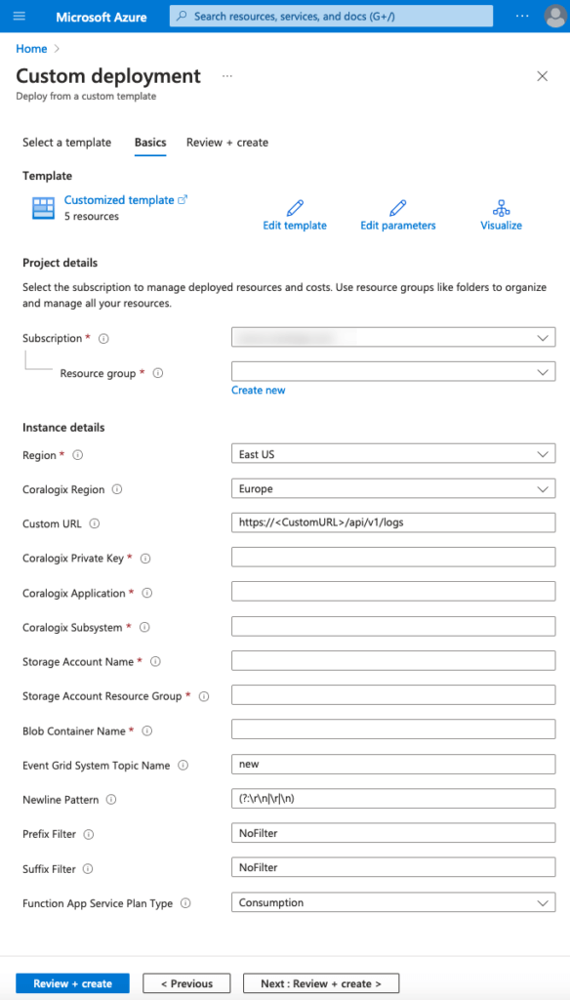

Coralogix provides a seamless integration with Azure cloud, allowing you to send your logs from anywhere and parse them according to your needs.

The Azure Blob Storage via Event Grid integration allows parsing of Azure Blobs, triggered by an EventGrid subscription notification.

**Notes**:

- This integration only supports whole log processing. It does **not** support tail functionality.

- It does **not** monitor for changes to log files.

## Prerequisites

- Azure account with an active subscription

- \[Optional\] Pre-existing Event Grid system topic aligned with Storage v2 /General Purpose v2 storage topic type

## Azure Resource Manager Template Deployment

Sign into your Azure account and deploy the Blob Storage via Event Grid trigger integration by clicking [here](https://portal.azure.com/#create/Microsoft.Template/uri/https%3A%2F%2Fraw.githubusercontent.com%2Fcoralogix%2Fcoralogix-azure-serverless%2Fmaster%2FBlobViaEventGrid%2FARM%2FBlobViaEventGrid.json).

### Fields

<table><tbody><tr><td><strong>Field</strong></td><td><strong>Description</strong></td></tr><tr><td><strong>Subscription</strong></td><td>Azure subscription for which you wish to deploy the integration. Must be the same as the monitored storage account.</td></tr><tr><td><strong>Resource Group</strong></td><td>Resource group into which you wish to deploy the integration</td></tr><tr><td><strong>Coralogix Region</strong></td><td>Region associated with your <a href="https://coralogixstg.wpengine.com/docs/coralogix-domain/"><strong>Coralogix</strong> <strong>domain</strong></a></td></tr><tr><td><strong>Custom URL</strong></td><td>Custom URL associated with your Coralogix account. Ignore if you do not have a custom URL.</td></tr><tr><td><strong>Coralogix Private Key</strong></td><td>Coralogix <strong><a href="https://coralogixstg.wpengine.com/docs/send-your-data-api-key/">Send-Your-Data API key</a></strong></td></tr><tr><td><strong>Coralogix Application</strong></td><td>Mandatory <a href="https://coralogixstg.wpengine.com/docs/application-and-subsystem-names/"><strong>metadata field</strong></a> sent with each log and helps to classify it</td></tr><tr><td><strong>Coralogix Subsystem</strong></td><td>Mandatory <a href="https://coralogixstg.wpengine.com/docs/application-and-subsystem-names/"><strong>metadata field</strong></a> sent with each log and helps to classify it</td></tr><tr><td><strong>Storage Account Name</strong></td><td>Name of the storage account containing the Blob container. Must be Storagev2 (general purpose v2) type.</td></tr><tr><td><strong>Storage Account Resource Group</strong></td><td>Resource Group name of the storage account containing the Blob container to be monitored</td></tr><tr><td><strong>Blob Container Name</strong></td><td>Name of the Blob container to be monitored</td></tr><tr><td><strong>Event Grid System Topic Name</strong></td><td>Name of a pre-existing Event Grid system topic for the storage account containing the Blob container. Leave as 'New' to create one.</td></tr><tr><td><strong>Newline Pattern</strong></td><td>Newline pattern expected within the Blob storage documents</td></tr><tr><td><strong>Prefix Filter</strong></td><td>Prefix filter to apply to the Blob container. Use 'NoFilter' to refrain from filtering by prefix. Wildcards are not allowed. Use the following format: <code>/subfolder1/subfolder2/</code>.</td></tr><tr><td><strong>Suffix Filter</strong></td><td>Suffix filter to apply to the Blob container. Use 'NoFilter' to refrain from filtering by suffix. Wildcards are not allowed. Use the following format: <code>.log</code>.</td></tr><tr><td><strong>Function App Service Plan Type</strong></td><td>Type of service plan for the function app. Choose 'Premium' if you need vNet support.</td></tr></tbody></table>

## Optional Configuration Options

If your Blob container belongs to a restricted storage account, review this [optional configuration documentation](https://coralogixstg.wpengine.com/docs/optional-configurations-microsoft-azure/) to learn about VNet support options.

## Additional Resources

<table><tbody><tr><td><strong>Github</strong></td><td><a href="https://github.com/coralogix/coralogix-azure-serverless/blob/master/BlobStorage"><strong>Blob Storage Documentation</strong></a></td></tr><tr><td><strong>Microsoft Azure Functions</strong> <strong>Manual Integrations</strong></td><td><strong><a href="https://coralogixstg.wpengine.com/docs/azure-eventhub-trigger-function/">Event Hub</a> <a href="https://coralogixstg.wpengine.com/docs/queue-storage-microsoft-azure-functions/">Queue Storage</a></strong></td></tr></tbody></table>

## **Support**

**Need help?**

Our world-class customer success team is available 24/7 to walk you through your setup and answer any questions that may come up.

Feel free to reach out to us **via our in-app chat** or by sending us an email at **[support@coralogixstg.wpengine.com](mailto:support@coralogixstg.wpengine.com)**.
