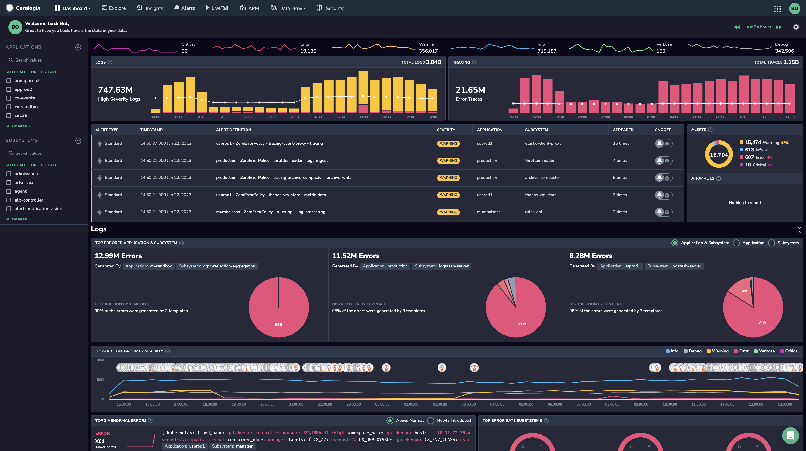

The Coralogix monitoring platform ingests data from any digital source and transforms it using our **core features**, unleashed with our out-of-the-box [extension packages](https://coralogixstg.wpengine.com/docs/extension-packages/). Take advantage of these evolving features to fully understand your system, analyze changes in its behavior, and respond to incidents before they become problems.

## Core Features

Here is a list of our core features.

- **Data Collection and Centralized Storage.** Coralogix provides integrations with popular logging frameworks and libraries, enabling you to easily transfer your data to Coralogix for centralized storage and analysis. With our unique [Streama© technology](https://coralogixstg.wpengine.com/how-it-works/), you can analyze your data without needing to index it, thereby avoiding costly storage expenses.

- **Data transformation and parsing**. Coralogix automatically parses and structures your telemetry data.
    - [Parse](https://coralogixstg.wpengine.com/docs/log-parsing-rules/) your data to make it easier to search, filter, and analyze. Get started with our [Parsing Rules Cheat Sheet](https://coralogixstg.wpengine.com/docs/rules-cheat-sheet/).
    
    - [Enrich](https://coralogixstg.wpengine.com/docs/custom-log-enrichment/) your data with business, operations, or security information, including [IP-based geographical information](https://coralogixstg.wpengine.com/docs/geo-queries-using-ip-based-geo-enrichment/), that may not be available at runtime. AWS customers can enrich their logs with tags [from their AWS EC2 instances](https://coralogixstg.wpengine.com/docs/aws-resource-enrichment/) to connect their business and operation metadata, and gain greater insight into their data.
    
    - [Record new metric time series](https://coralogixstg.wpengine.com/docs/recordingrules/) to produce leaner and more quickly queried metrics.

- **Data query**. Extract specific information or insights from your collected logs, metrics, and traces using Lucene, SQL, or our advanced [DataPrime](https://coralogixstg.wpengine.com/docs/dataprime-query-language/) query language. We make it possible for you to [directly query](https://coralogixstg.wpengine.com/docs/direct-query-http-api/) your archived data at a speed 5x faster than Athena.

- **Alerting**. By querying logs and metrics, you can set up [alerts](https://coralogixstg.wpengine.com/docs/getting-started-with-coralogix-alerts/) and notifications based on specific conditions or thresholds. These alerts can notify you when predefined events occur or when metrics deviate from normal behavior.

- **Monitoring**. Monitor your data using our advanced [Explore screen](https://coralogixstg.wpengine.com/docs/explore-screen/), where you can drill down into your [logs](https://coralogixstg.wpengine.com/docs/logs-screen/) and [traces](https://coralogixstg.wpengine.com/docs/distributed-tracing/). Engage with our [Events2Metrics](https://coralogixstg.wpengine.com/docs/event2metrics/) functionality to generate metrics from your spans and logs to optimize storage without sacrificing important data. What’s more, we offer [application performance monitoring (APM)](https://coralogixstg.wpengine.com/docs/apm/) which decorates our standard observability options with additional information.

- **Visualizations**. Create unlimited, personalized [custom dashboards](https://coralogixstg.wpengine.com/docs/custom-dashboards/) catered to your specific observability needs, or take advantage of our pre-built dashboards to help you analyze and visualize log data. We also offer [Grafana](https://coralogixstg.wpengine.com/docs/hosted-grafana-view/) and [Kubernetes](https://coralogixstg.wpengine.com/docs/kubernetes-dashboard/) dashboards.

- **Compliance and security.** Coralogix prioritizes data security and compliance. It offers encryption at rest and in transit, access controls, and adheres to industry-standard security practices. The platform helps businesses meet compliance requirements, such as GDPR and HIPAA, by providing features like data anonymization and audit logs.

Our features, along with unparalleled customer support and excellent [cost optimization](https://coralogixstg.wpengine.com/solutions/cost-optimization/), make us one of the few observability providers that can help you grow, optimize, and save money at the same time. To get started, click [here](https://coralogixstg.wpengine.com/docs/guide-first-steps-coralogix/).
