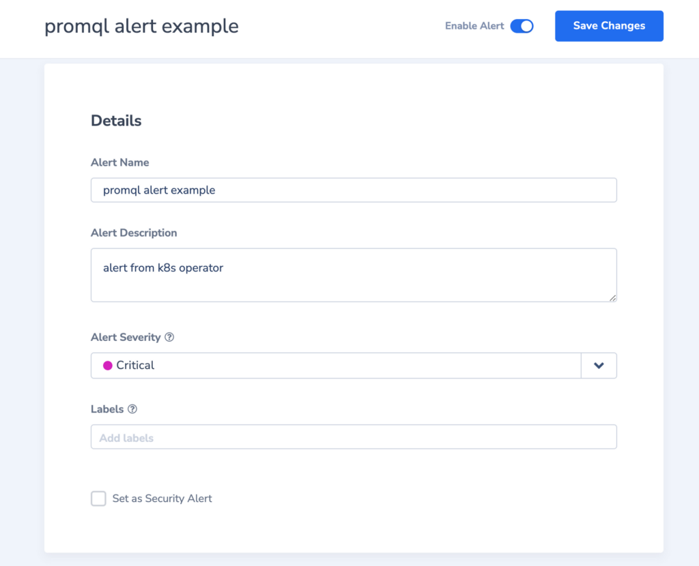
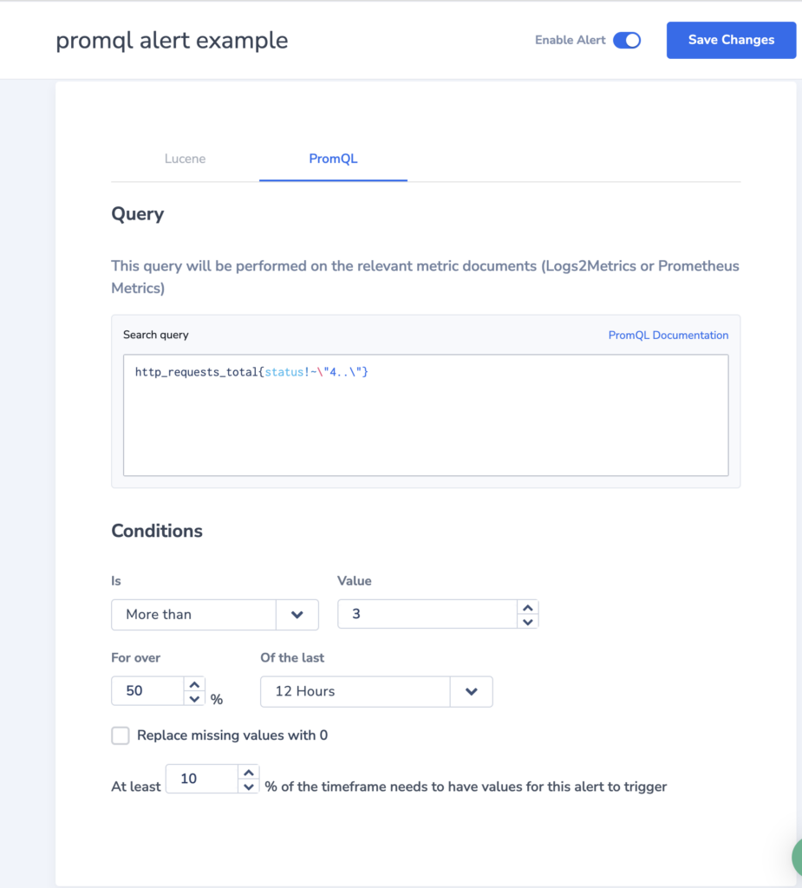

The **Coralogix Operator** is an open-source [Kubernetes Operator](https://kubernetes.io/docs/concepts/extend-kubernetes/operator/) that automates configuration and management of Coralogix APIs in a Kubernetes environment.

## Overview

The Coralogix Operator is built upon a [Kubernetes Operator](https://kubernetes.io/docs/concepts/extend-kubernetes/operator/) pattern, enabling you to define the desired state of your Coralogix account using declarative configuration files named custom resource definitions (CRDs). It leverages the Kubernetes reconcile loop to ensure this desired state.

**Note**: The Coralogix Operator is in **alpha**, with the current version being unstable.

### Management of Functionalities

The Operator manages the following Coralogix functionalities:

- [alerting](https://github.com/coralogix/coralogix-operator/tree/master/config/samples/alerts)

- [parsing rules](https://github.com/coralogix/coralogix-operator/tree/master/config/samples/rulegroups)

- [recording rules](https://github.com/coralogix/coralogix-operator/tree/master/config/samples/recordingrulegroupset)

A full list of rule configuration samples can be found [here](https://github.com/coralogix/coralogix-operator/tree/master/config/samples).

### **Leveraging PrometheusRules**

For those customers using [Prometheus Operator](https://coralogixstg.wpengine.com/docs/prometheus-operator/), the Operator can also be used to manage the CRD [PrometheusRules](https://github.com/prometheus-operator/prometheus-operator/blob/main/Documentation/api.md#prometheusrule). The Operator leverages existing PrometheusRules to manage Coralogix [recording](https://github.com/coralogix/coralogix-operator/tree/master/config/samples/recordingrulegroupset) and [alerting](https://github.com/coralogix/coralogix-operator/tree/master/config/samples/alerts) rules, ensuring the smoothest possible integration.

## Prerequisites

- A Kubernetes cluster

## Installation

The following steps demonstrate how to get started. Full instructions can be found [here](https://github.com/coralogix/coralogix-operator/tree/master).

**STEP 1.** Add our Helm charts repository to the local repos list. This command will create a repository named `coralogix`.

```
helm repo add coralogix https://cgx.jfrog.io/artifactory/coralogix-charts-virtual
helm repo update

```

**STEP 2**. Update the Helm values with your **Alerts, Rules and Tags API Key** and the region associated with your Coralogix [domain](https://coralogixstg.wpengine.com/docs/coralogix-domain/), as in the example configuration below:

```
coralogixOperator:
  region: "EUROPE1"
  prometheusRules:
    enabled: false

secret:
  data:
    apiKey: <YOUR API KEY HERE>
```

**Notes**:

- `apiKey`: Access your **Alerts, Rules and Tags API Key** by navigating to **Data Flow** > **API Keys** in your Coralogix toolbar.

- `region`: Should be formatted as follows - APAC1, APAC2, EUROPE1, EUROPE2, USA1, USA2, STG.

- `prometheusRules`: Must be set to false.

**STEP 3**. Run the following command to install the helm chart on your cluster:

```
helm install <my-release> coralogix/coralogix-operator

```

**STEP 3**. To uninstall the helm chart, run the following:

```
helm delete <my-release>

```

## Manage Your Coralogix Account Using CRDs

Once the Coralogix Operator is installed and running on your cluster, manage your Coralogix account using CRDs. The following section provides samples of available features.

### Alerting Management

The Coralogix Operator provides a feature to manage alerts using the Alert CRD. Here is a sample CRD definition using PromQL.

```
apiVersion: coralogixstg.wpengine.com/v1alpha1
kind: Alert
metadata:
  name: promql-alert-example
spec:
  name: promql alert example
  description: alert from k8s operator
  severity: Critical
  notificationGroups:
    - notifications:
        - notifyOn: TriggeredOnly
          integrationName: WebhookAlerts
          retriggeringPeriodMinutes: 1
        - notifyOn: TriggeredAndResolved
          emailRecipients: [ "example@coralogixstg.wpengine.com" ]
          retriggeringPeriodMinutes: 1440
    - groupByFields: [ "coralogix.metadata.sdkId" ]
      notifications:
        - notifyOn: TriggeredOnly
          integrationID: 2235
          retriggeringPeriodMinutes: 1
        - notifyOn: TriggeredAndResolved
          emailRecipients: [ "example@coralogixstg.wpengine.com" ]
          retriggeringPeriodMinutes: 1440
  scheduling:
    daysEnabled: ["Wednesday", "Thursday"]
    timeZone: UTC+02
    startTime: 08:30
    endTime: 20:30
  alertType:
    metric:
      promql:
        searchQuery: http_requests_total{status!~\\"4..\\"}
        conditions:
          alertWhen: More
          threshold: 3
          sampleThresholdPercentage: 50
          timeWindow: TwelveHours
          minNonNullValuesPercentage: 10

```

Save this file as `prometheusalert.yaml` and then apply the following alert:

```
 kubectl apply -f prometheusalert.yaml

```

Once Coralogix Operator syncs the alert, you will be able to view it by navigating to **Alerts** in your Coralogix UI.





Find more information about the Alert CRD API definition in our [Coralogix Operator API documentation](https://github.com/coralogix/coralogix-operator/blob/master/docs/api.md#alert).

### Recording Rules Management

The Coralogix Operator provides a feature to manage recording rules using the RecordingRuleGroupSet CRD. Here is a sample CRD definition using PromQL.

```
apiVersion: coralogixstg.wpengine.com/v1alpha1
kind: RecordingRuleGroupSet
metadata:
  name: kube-state-metrics
spec:
  groups:
    - name: kube-state-metrics
      intervalSeconds: 60
      rules:
        - expr: kube_pod_info * on(pod, node) group_left(resource) sum by (pod, node, resource)(kube_pod_container_resource_requests{resource="memory"})
          record: workload_pod_resources_memory:kube_pod_container_resource_requests:join

```

Find more information about the Alert CRD API definition in our [Coralogix Operator API documentation](https://github.com/coralogix/coralogix-operator/blob/master/docs/api.md#alert).

### Parsing Rules Management

The Coralogix Operator provides a feature to manage parsing rules using the RuleGroup CRD. Here is a sample CRD definition using parsing log fields.

```
apiVersion: coralogixstg.wpengine.com/v1alpha1
kind: RuleGroup
metadata:
  name: parsing-rule
spec:
  name: parsing-rule
  description: rule-group from k8s operator
  applications: ["application-name"]
  subsystems: ["subsystems-name"]
  severities: ["Warning", "Info"]
  subgroups:
    - rules:
        - name: HttpRequestParser2
          description: Parse the fields of the HTTP request - will be applied after HttpRequestParser1
          parse:
            sourceField: text
            destinationField: text
            regex: (?P<remote_addr>\\\\d{1,3}.\\\\d{1,3}.\\\\d{1,3}.\\\\d{1,3})\\\\s*-\\\\s*(?P<user>[^ ]+)\\\\s*\\\\[(?P<timestemp>\\\\d{4}-\\\\d{2}\\\\-\\\\d{2}T\\\\d{2}\\\\:\\\\d{2}\\\\:\\\\d{2}\\\\.\\\\d{1,6}Z)\\\\]\\\\s*\\\\\\\\\\\\\\"(?P<method>[A-z]+)\\\\s[\\\\/\\\\\\\\]+(?P<request>[^\\\\s]+)\\\\s*(?P<protocol>[A-z0-9\\\\/\\\\.]+)\\\\\\\\\\\\\\"\\\\s*(?P<status>\\\\d+)\\\\s*(?P<body_bytes_sent>\\\\d+)?\\\\s*?\\\\\\\\\\\\\\"(?P<http_referer>[^\\"]+)\\\\\\"\\\\s*\\\\\\\\\\\\\\"(?P<http_user_agent>[^\\"]+)\\\\\\"\\\\s(?P<request_time>\\\\d{1,6})\\\\s*(?P<response_time>\\\\d{1,6})

```

## Leveraging PrometheusRules

For those customers using [Prometheus Operator](https://coralogixstg.wpengine.com/docs/prometheus-operator/), the Operator can also be used to manage the CRD [PrometheusRules](https://github.com/prometheus-operator/prometheus-operator/blob/main/Documentation/api.md#prometheusrule). Samples of available features can be found below.

### Recording Rules Management with PrometheusRules

Leverage existing PrometheusRules to manage Coralogix recording rules with the addition of the label `app.coralogixstg.wpengine.com/track-recording-rules: "true"` to PrometheusRules, as in the example below.

```
apiVersion: monitoring.coreos.com/v1
kind: PrometheusRule
metadata:
  labels:
    ## Coralogix label to indicate to the Coralogix Operator
    ## Create Recording Rules on Coralogix using this PrometheusRule
    app.coralogixstg.wpengine.com/track-recording-rules: "true"
  name: kube-state-metrics
  namespace: observability
spec:
  groups:
    - name: kube-state-metrics
      rules:
        - expr: kube_pod_info * on(pod, node) group_left(resource) sum by (pod, node, resource)(kube_pod_container_resource_requests{resource="memory"})
          labels:
            namespace: observability
          record: workload_pod_resources_memory:kube_pod_container_resource_requests:join

```

### Alerting Management with PrometheusRules

Leverage existing PrometheusRules to manage Coralogix alerts with the addition of the label `app.coralogixstg.wpengine.com/track-alerting-rules: "true"` to PrometheusRules, as in the example below.

```
apiVersion: monitoring.coreos.com/v1
kind: PrometheusRule
metadata:
  labels:
    ## Coralogix label to indicate to the Coralogix Operator
    ## Create Recording Rules on Coralogix using this PrometheusRule
    app.coralogixstg.wpengine.com/track-alerting-rules: "true"
  name: kube-state-metrics
  namespace: observability
spec:
  groups:
    - name: kube-state-metrics
      rules:
        - alert: PodFrequentlyRestarting
          annotations:
            description: >-
              Pod {{$labels.pod}} in namespace: observability was restarted more
              than 3 times
            summary: Pod is restarting frequently
          expr: >-
            sum(increase(kube_pod_container_status_restarts_total{container=~"kube-state-metrics",
            job="kube-state-metrics", pod=~"kube-state-metrics-.*"}[5m])) by
            (pod, namespace) > 3
          labels:
            namespace: observability
            severity: critical

```

## Additional Resources

<table><tbody><tr><td>GitHub</td><td><strong><a href="https://github.com/coralogix/coralogix-operator">Coralogix Operator GitHub Repository</a><br><a href="https://github.com/coralogix/coralogix-operator/blob/master/docs/api.md#alert">Coralogix Operator API</a></strong></td></tr><tr><td>External</td><td><a href="https://book.kubebuilder.io/introduction.html"><strong>Kubebuilder</strong></a></td></tr><tr><td>Blob</td><td><a href="https://coralogixstg.wpengine.com/blog/introduction-kubernetes-observability/"><strong>Introduction to Kubernetes Observability</strong></a></td></tr></tbody></table>

## Support

**Need help?**

Our world-class customer success team is available 24/7 to walk you through your setup and answer any questions that may come up.

Feel free to reach out to us **via our in-app chat** or by sending us an email at [support@coralogixstg.wpengine.com](mailto:support@coralogixstg.wpengine.com).
