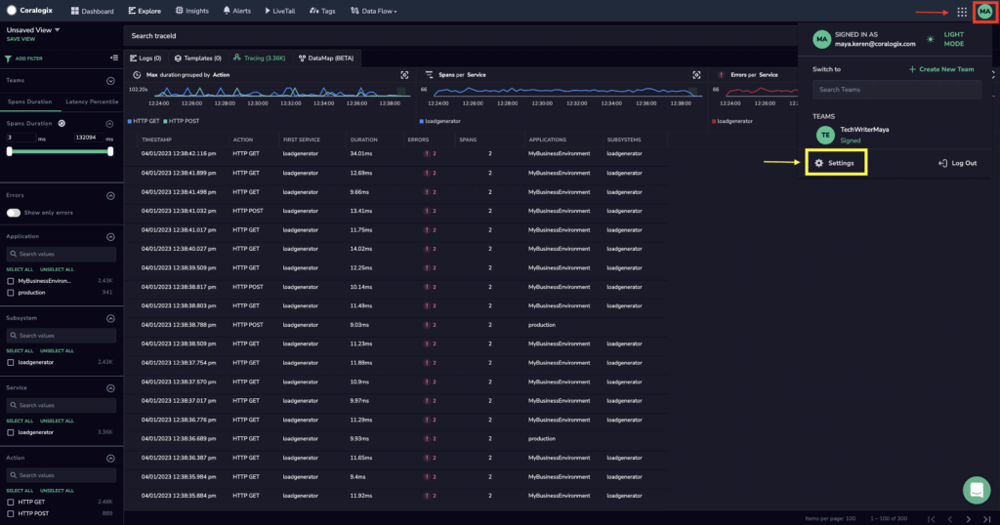
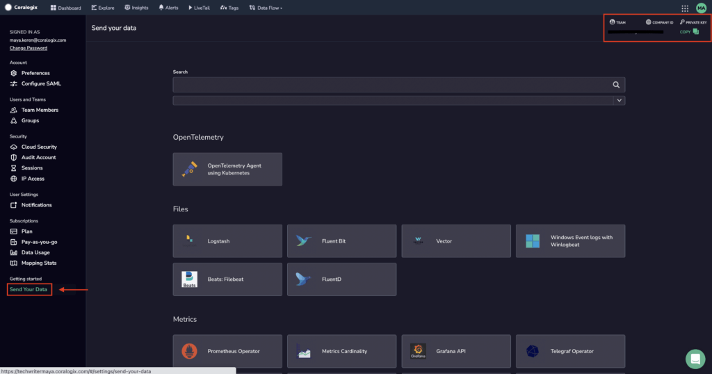

This section shows how to access your Coralogix Team ID, also referred to as your Coralogix Company ID.

## Accessing your Coralogix Team ID

1\. In your Coralogix dashboard, click on your personal account settings in the upper right-hand corner of the toolbar > **Settings**.

2\. In the left-hand sidebar, select **Send Your Data**. Your Team Name and Company ID (also known as Team ID) will appear in the upper right-hand corner of your dashboard.

