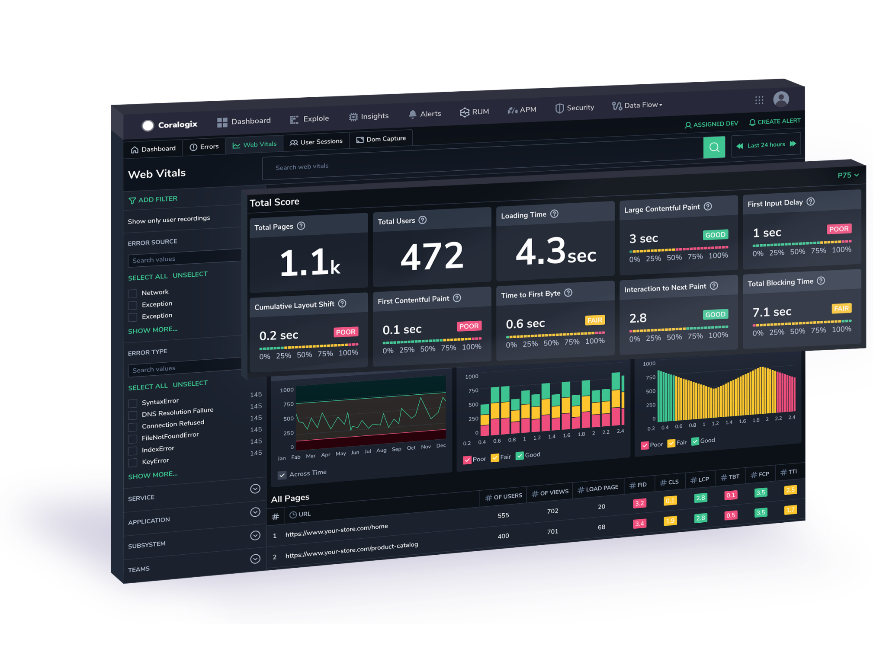
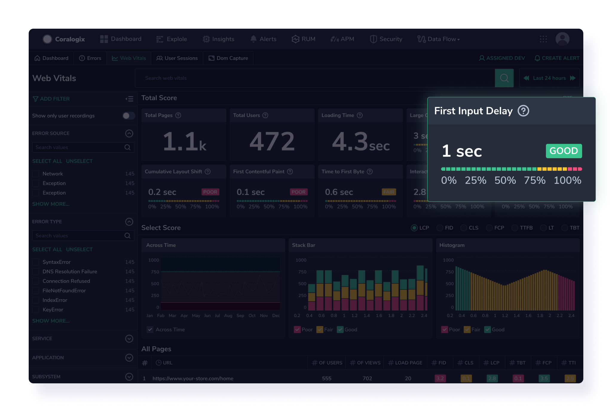
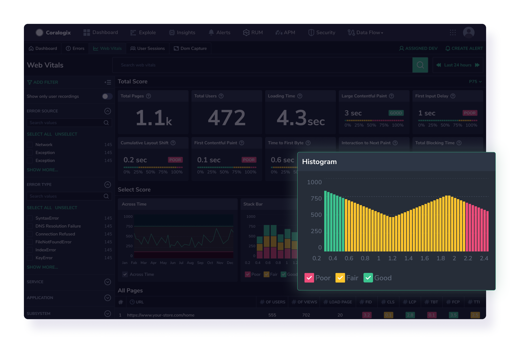
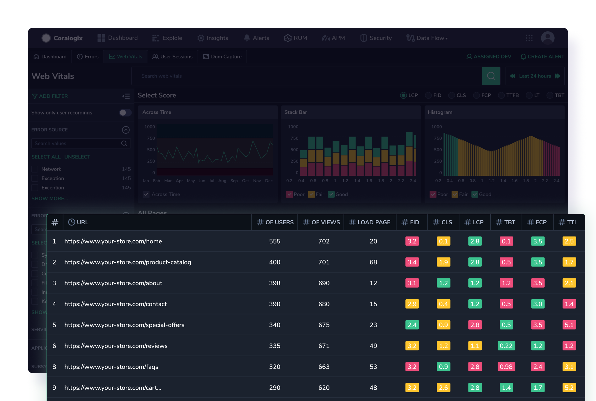
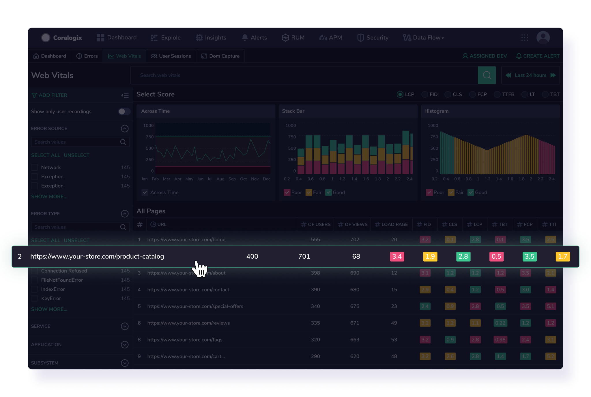
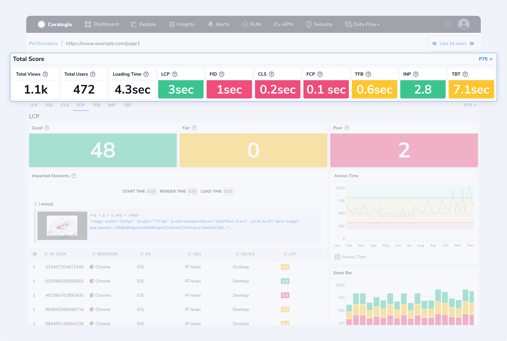
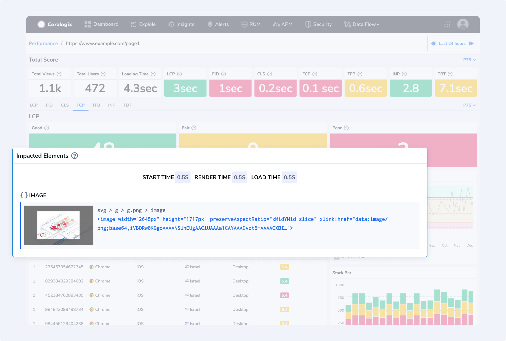
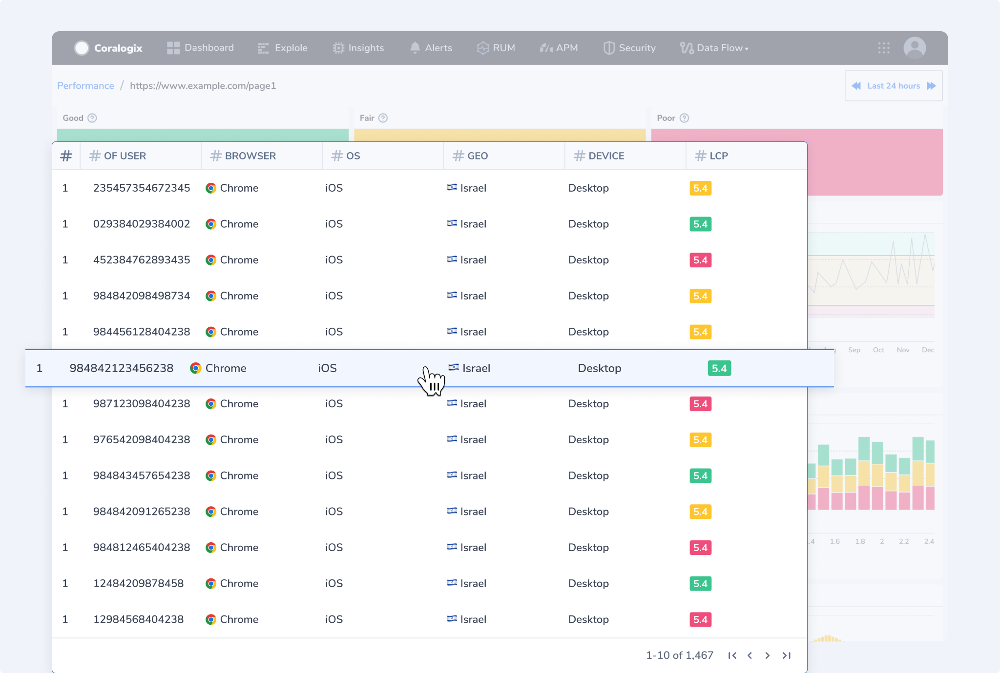

Explore the transformative world of **Core Web Vitals** — a pivotal Coralogix feature designed to elevate your web pages' performance and user experience. Discover how these essential metrics, including loading speed, interactivity, and visual stability, can be optimized to ensure your audience's seamless and responsive online environment.

## Overview

Google's [Core Web Vitals](https://web.dev/vitals/#core-web-vitals) is a set of metrics that measure real-world user experience for loading performance, interactivity, and visual stability of the page. We highly recommend that site owners achieve good Core Web Vitals to ensure a great user experience. This and other [Real User Monitoring](https://coralogixstg.wpengine.com/docs/real-user-monitoring/) features provide unparalleled visibility into your application's frontend performance.

## Core Web Vitals Metrics

### Metric Definitions

- **Largest Contentful Paint (LCP)**. Measures how quickly the main content of a web page is loaded. In other words, it measures the time from when the user initiates loading the page until the largest image or text block is rendered within the viewport. To provide a good user experience, strive to have LCP occur within the first 2.5 seconds of the page starting to load.

- **First Input Delay (FID)**. Measures the time from when a user first interacts with your page to when the browser responds to that interaction. This measurement is taken from whatever interactive element that the user first clicks. To provide a good user experience, strive for an FID of less than 100 milliseconds. Starting March 2024, Interaction to Next Paint (INP) will replace FID as a Core Web Vital.

- **Interaction to Next Paint (INP)**. Measures a page's responsiveness to user interactions by observing the time it takes for the page to respond to all click, tap, and keyboard interactions that occur throughout a user's visit to a page. To provide a good user experience, strive for an INP of up to 200 milliseconds.

- **Cumulative Layout Shift (CLS).** Measures the total of all individual layout shift scores for every unexpected layout shift that occurs during the entire lifespan of the page. The score is zero to any positive number, where zero means no shifting, and the larger the number, the more layout shifts on the page. To provide a good user experience, strive for a CLS score of less than 0.1.

- **First Contentful Paint (FCP)**. Measures the time it takes for the first piece of content to be rendered on the screen. To provide a good user experience, strive for an FCP score of less than 1.8 seconds.

- **Time to First Byte (TTFB)**. Measures the time it takes for a browser to receive the first byte of a response from the server. To provide a good user experience, strive for an FCP score of less than 800 milliseconds.

- **Total Blocking Time (TBT)**. Measures the total amount of time between the FCP and the TTI, where the browser's main thread is blocked and unable to respond to user input. To provide a good user experience, strive for a TBT score of under 200 milliseconds.

### **Status Definitions**

Each metric has a performance range that may operate as good, needs improvement, or poor. Coralogix provides these default values. Performance ranges can be adjusted in your UI to conform to your specific needs.

Here are the performance ranges for each status:

| Metric | Good | Needs Improvement | Poor |
| --- | --- | --- | --- |
| LCP | <=2.5s | <=4s | \>4s |
| FID | <=100ms | <=300ms | \>300ms |
| INP | <=200ms | <=500ms | \>500ms |
| CLS | <=0.1s | <=0.25 | \>0.25 |
| FCP | <=1.8s | <=3 | \>3s |
| TTFB | <=800ms | <=1800 | \>1800ms |
| TBT | <=200ms | <=600ms | \>600ms |

## Get Started

Once you have [configured and installed our browser SDK](https://coralogixstg.wpengine.com/docs/browser-sdk-installation-guide/), in your Coralogix toolbar, navigate to **RUM** > **Web Vitals** to access the Core Web Vitals screen.

## **Core Web Vitals Screen**

### Score

View all of your Core Web Vitals metrics and general key performance indicators: total pages, total users, and loading time.

### Visuals

Enjoy a visual representation of various components contributing to the overall performance of a website using a line chart, stack bar chart, and histogram.

- A **line chart** illustrates a Core Web Vitals metric, such as "First Input Delay" (FID), which depicts the metric's performance levels as it evolves over a specified timeframe. The x-axis represents time intervals, while the y-axis indicates the values of the chosen metric.

- A **stacked bar** **chart** representing a Core Web Vitals metric, such as "Largest Contentful Paint" (LCP), categorizes each bar into segments representing different performance levels: poor, moderate, and good. The x-axis typically represents individual pages or categories, while the y-axis denotes the cumulative measure of the chosen metric.

- A **histogram** representing a Core Web Vitals metric, like "Cumulative Layout Shift" (CLS), organizes data into intervals or "buckets" to display the distribution of metric values. Unlike line charts, histograms don't show trends over time; instead, they provide a snapshot of how often certain ranges of values occur. The x-axis represents different ranges or intervals of the Core Web Vitals metric, such as CLS values. At the same time, the y-axis indicates the frequency or count of occurrences within each range.

### Core Web Vitals Across URLs

View Core Web Vital metrics for each page within your application.

Adjust the grid to present URL performance in ascending or descending order, to allow for efficient inspection and monitoring.

## URL Vitals Screen

If you want insight into a critical page — such as a landing page, you can see a breakdown of what's contributing to its Core Web Vitals metrics. Use this information to understand how your end users are experiencing those areas of your site. For example, if you observe a consistent trend of suboptimal performance on a particular browser, you can tailor any forthcoming enhancements to serve that user segment better.

For the URL of interest, view the following:

- **General KPIs**, including page views, total users, and loading time

- **Core Web Vitals Metrics** presented numerically

Select a Core Web Vitals metric to investigate further.

- **Metric Tab**. For each metric, you are presented with the number of instances per metric distributed by performance score: Good, Fair, and Poor

- **Impacted** **Elements**. View the code underlying the element or object affecting the metric performance for the page.

- **Metric Visualizations**. View each Core Web Vitals metric as a **line chart** or **stacked bar** **chart**, with scores distributed by day. This allows you to identify problematic days or hours for metric performance immediately. A **histogram** representing a Core Web Vitals metric organizes data into intervals or "buckets" to display the distribution of metric values, providing a snapshot of how often certain ranges of values occur.

- **Grid**. View performance metrics for each instance, allowing you to understand how diverse users encountered a specific metric and identify the object that most affected it. Information for each instance encompasses user ID, email, browser, operating system, device, country, and metric score.

## Support

**Need help?**

Our world-class customer success team is available 24/7 to walk you through your setup and answer any questions that may come up.

Contact us **via our in-app chat** or by emailing [support@coralogixstg.wpengine.com](mailto:support@coralogixstg.wpengine.com).
