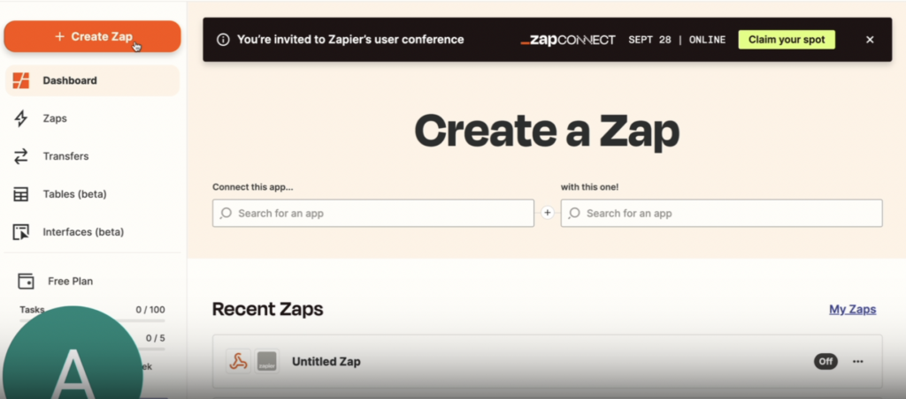
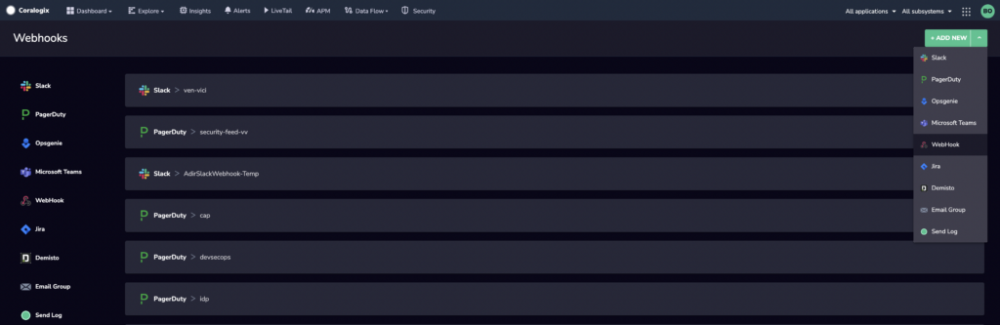
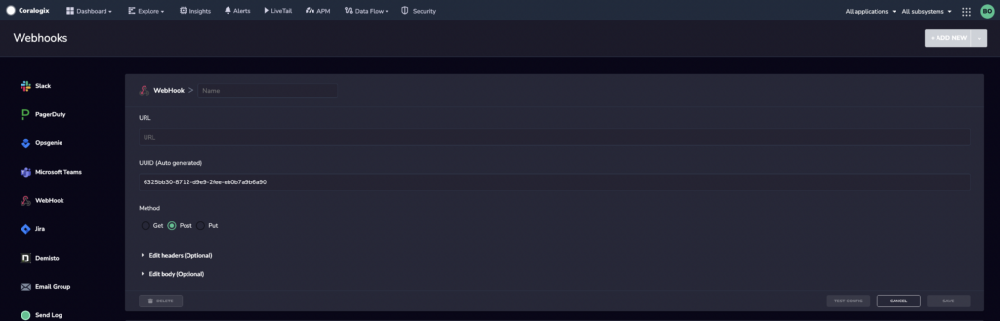
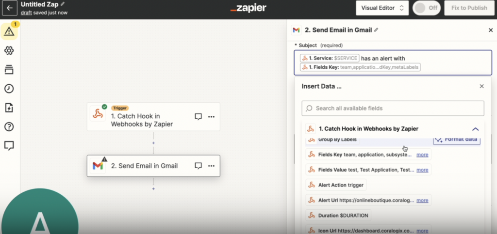
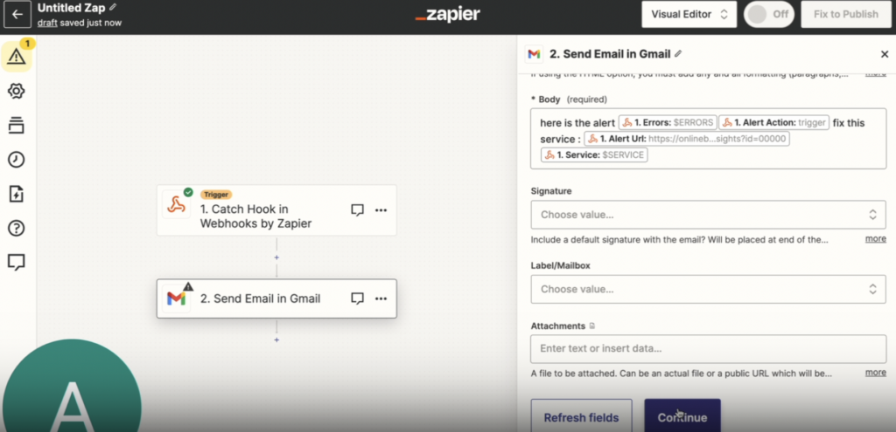

With Coralogix, you can easily create [alerting](https://coralogixstg.wpengine.com/docs/getting-started-with-coralogix-alerts/) email templates using our [custom alert webhooks](https://coralogixstg.wpengine.com/docs/alert-webhooks/). These templates allow you to embed details from a log, metric, trace, or security event that triggered an event into your email subject or body, resulting in easier and more informative email notifications.

## Overview

This tutorial provides step-by-step instructions on how to set up an alerting email template with Coralogix, using [Zapier](https://zapier.com/) as a use case. It walks you through the process of setting up a Zapier account, creating a Zap with a trigger and an action, and configuring the webhook as a trigger. It then demonstrates how to catch a webhook from Coralogix and send an email as a response.

## Set Up an Alerting Email Template

### Create a Zap

**STEP 1**. Set up a [Zapier](https://zapier.com/) Premium account.

**STEP 3**. From your Zapier dashboard, click **+** **Create a Zap** in the upper right-hand corner.

You will be asked to configure your **Trigger** and **Action**.

### Configure the Trigger

**STEP 1**. Configure the Coralogix webhook as a **Trigger**.

- Click Trigger.

- Select Webhook in the bottom right-hand corner.

- Choose an event. Select **Catch Hook** from the drop-down menu.

- Click **Continue**.

**STEP 2**. Click **Test** to test the trigger.

**STEP 3.** You will be presented with a custom webhook URL. Click **Copy** to copy it to your clipboard.

### Configure the Custom Webhook

**STEP 1**. In your Coralogix toolbar, navigate to **DataFlow > Webhooks**.

**STEP 2**. In the upper right hand corner, click **\+ ADD NEW.** In the dropdown menu, select **Webhook** (generic).

**STEP 3**. Define the webhook settings. Paste the webhook URL in the URL field.

**STEP 4**. Click **SAVE**.

### Configure the Action

**STEP 1**. Return to your Zapier account to define the **Action**. The action in this case is sending an email.

- Click **Action**.

- Select the **Action** of choice. In this example, the user has chosen Gmail.

- In the dropdown event menu, select **Send an Email**.

- Click **Continue**.

**STEP 2**. Validate that the selected email is correct. Click **Continue**.

**STEP 3**. Define the **Action** settings.

- In order for the Data fields to appear, revert back to your Coralogix webhook and click **TEST CONFIG**. Then, in your Zapier account, click **TEST TRIGGER**. Within seconds, you should receive confirmation of the webhook catch with all of the data from your customized alert.

- Click **Send Email in Gmail**. Fill in the fields.
    - **To**. Enter text or data. Use a parameter from the webhook or input a fixed addressee for the webhook.
    
    - **From**. Select the email that you are using in this configuration.
    
    - **Subject** (required). Input the parameters of your webhook. In the example below, service name has an alert with field keys, including team / application / subsystem / severity, etc. Note that you have the option of formatting the data.
    
    - **Body type**. Select **plain**.
    
    - **Body** (required). In the example below, error, trigger, alert URL, and service name are used. Text has been added as well.
    
    - **Attachment**. If relevant, attach a Runbook, for example.

- Click **Continue**.

**STEP 4**. Click **Test Step**.

**STEP 5**. Revert back to your saved Coralogix webhook. Click **TEST CONFIG**. Verify whether that webhook addressee has received an email.

## Additional Resources

<table><tbody><tr><td>Documentation</td><td><strong><a href="https://coralogixstg.wpengine.com/docs/getting-started-with-coralogix-alerts/">Get Started with Coralogix Alerts</a> <a href="https://coralogixstg.wpengine.com/docs/alert-webhooks/">Custom Alert Webhooks</a></strong></td></tr></tbody></table>

## Support

**Need help?**

Our world-class customer success team is available 24/7 to walk you through your setup and answer any questions that may come up.

Feel free to reach out to us **via our in-app chat** or by sending us an email at [support@coralogixstg.wpengine.com](mailto:support@coralogixstg.wpengine.com).
