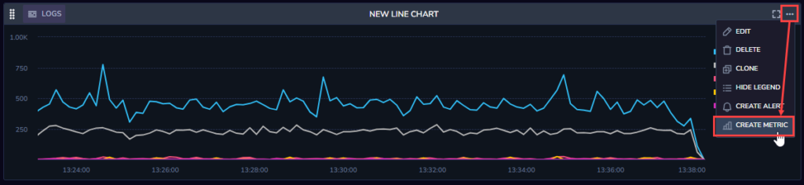
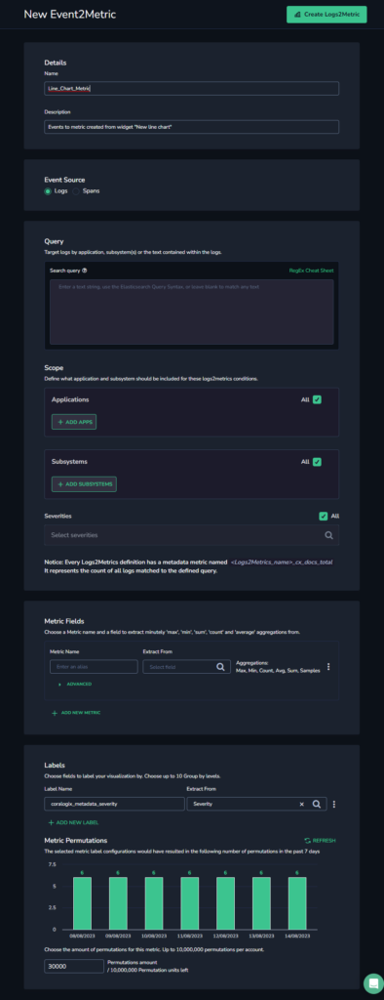
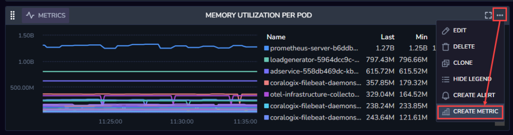
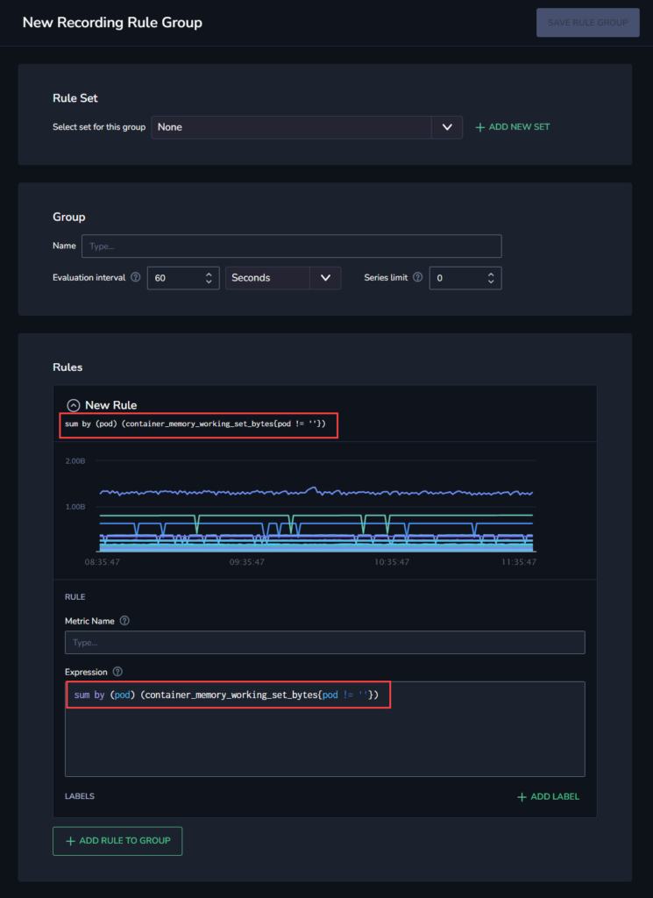

When you first create a dashboard, the data you’re using may be raw data. However, creating visualizations often helps you refine the information you seek from those logs or metrics. To enable you to take advantage of this refined data, Coralogix supports creating metrics from custom dashboard widgets.

When creating a metric from a custom dashboard widget, the process depends on whether you are creating a metric from a metric, in which case you will create the new metric using a recording rule, or a log or span, in which case you will create the new metric using Events2Metric.

## Prerequisites

- Create one or more [Custom Dashboard](https://coralogixstg.wpengine.com/docs/custom-dashboards/) widgets.

## Creating a New Metric from a Logs or Spans Widget

**STEP 1.** From your Coralogix toolbar, go to **Dashboards** > **Custom Dashboards**.

**STEP 2.** Open an existing custom dashboard or create a new one [create a new one](https://coralogixstg.wpengine.com/docs/custom-dashboards/).

**STEP 3.** Click the three-dot menu in the top right-hand corner of the widget from which you want to create a metric.

**STEP 4.** Click **CREATE METRIC**.

The New Event2Metric pane opens with the fields already populated according to the widget data.

**STEP 5.** Enter a name for your metric.

**STEP 6.** \[Optional\] Fill out any other fields you want to customize in the Event2Metric pane, as described in the [Events2Metrics](https://coralogixstg.wpengine.com/docs/event2metrics/) documentation.

**STEP 7.** Click **Create Logs2Metric** or **Create Spans2Metric** (the button changes depending on whether your selected metric came from a log widget or a spans widget).

## Creating a New Metric from a Metric Widget

**STEP 1.** From your Coralogix toolbar, go to **Dashboards** > **Custom Dashboards**.

**STEP 2.** Open an existing custom dashboard or create a new one ([learn more about creating Custom Dashboards](https://coralogixstg.wpengine.com/docs/custom-dashboards/)).

**STEP 3.** Click the three dot menu in the top right hand corner of the widget from which you want to create a metric.

**STEP 4.** Click **CREATE METRIC**.

The New Recording Rule pane opens with the New Rule and Expression fields already populated according to the widget data.

**STEP 5.** Select a rule set from the existing rule sets or click **+ADD NEW SET** to create a new rule set.

**STEP 6.** Enter a name for your recording rule.

**STEP 7.** Enter a name for your metric.

**STEP 8.** \[Optional\] Edit any other fields you want to customize in the New Recording Rule pane as described in the [Recording Rules](https://coralogixstg.wpengine.com/docs/recordingrules/) documentation.

**STEP 9.** Click **Save Rule Group**.

## Additional Resources

<table><tbody><tr><td>Documentation</td><td><strong><a href="https://coralogixstg.wpengine.com/docs/custom-dashboards/">Custom Dashboards</a></strong> <strong><a href="http://www.coralogixstg.wpengine.com/docs/custom-dashboards-line-charts">Line Charts</a> <a href="http://www.coralogixstg.wpengine.com/docs/custom-dashboards-data-tables">Data Tables</a> <a href="http://www.coralogixstg.wpengine.com/docs/custom-dashboards-gauges">Gauges</a> <a href="http://www.coralogixstg.wpengine.com/docs/custom-dashboards-pie-charts">Pie Charts</a> <a href="http://www.coralogixstg.wpengine.com/docs/custom-dashboards-bar-charts">Vertical Bar Charts</a></strong> <a href="https://coralogixstg.wpengine.com/docs/horizontal-bar-charts/"><strong>Horizontal Bar Charts</strong></a></td></tr></tbody></table>

## Support

**Need help?**

Our world-class customer success team is available 24/7 to walk you through your setup and answer any questions that may come up.

Feel free to reach out to us **via our in-app chat** or by sending us an email at [support@coralogixstg.wpengine.com](mailto:support@coralogixstg.wpengine.com).
