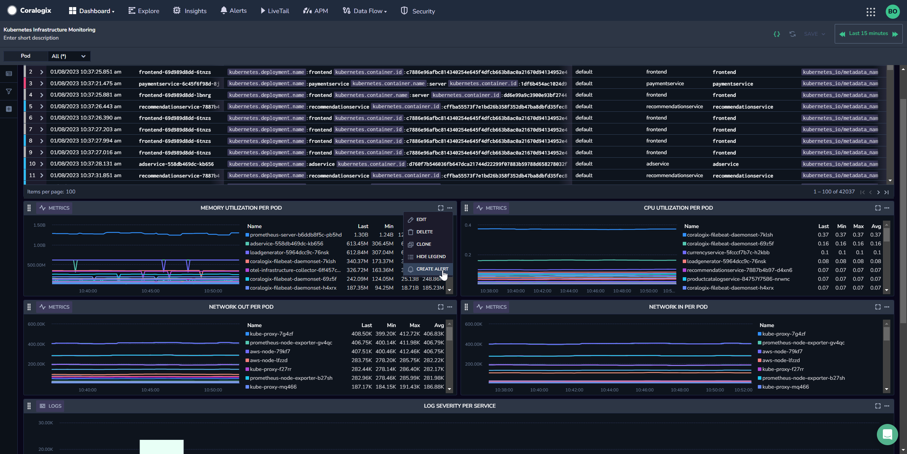
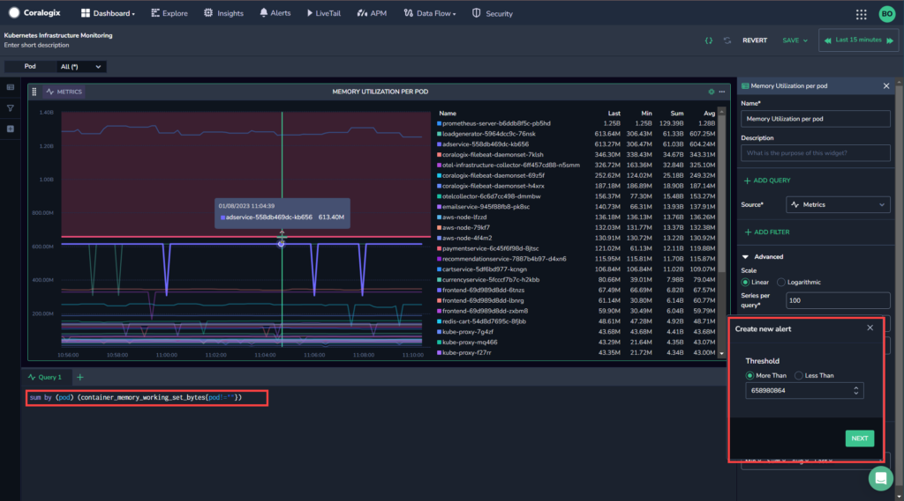
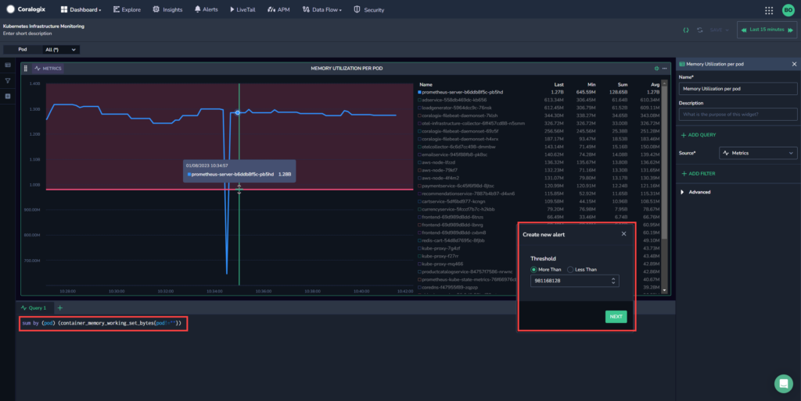
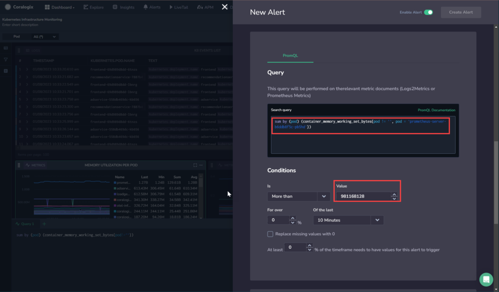

Streamline your work process by creating alerts directly from your [Custom Dashboard](https://coralogixstg.wpengine.com/docs/custom-dashboards/) [line chart](https://coralogixstg.wpengine.com/docs/custom-dashboards-line-charts/) widgets. Use the thresholds, variables, and filters embedded in your widget to create alerts easily without ever leaving your custom dashboard.

## Overview

Once you’ve created a [line chart](https://coralogixstg.wpengine.com/docs/custom-dashboards-line-charts/) to display the data related to the system or application being monitored, Coralogix allows you to create an alert directly from your [custom dashboard](https://coralogixstg.wpengine.com/docs/custom-dashboards/). Define it using the **thresholds**, **variables**, and **filters** you’ve used to build your visualization.

### Thresholds

Observing Custom Dashboard visualizations over time allows users to establish patterns and normal behavior for the system or application. This normal behavior serves as a baseline for comparison. Users can then create thresholds - predetermined limits based on desirable performance levels for specific metrics - to determine when abnormal events occur, such as sudden spikes or drops in performance, deviations from established patterns, or any unexpected behavior. For example, you might set a threshold for CPU usage at 80%, indicating that if the CPU usage exceeds this value, it is considered high and needs attention.

### Alerts

You can create [standard alerts](https://coralogixstg.wpengine.com/docs/coralogix-user-defined-alerts/) for logs and [metric alerts](https://coralogixstg.wpengine.com/docs/metric-alerts-promql/) for metrics, with your line chart parameters.

## Use-Case

A DevOps engineer has a line chart widget with many spikes, but one spike is significantly higher than the others. By creating an alert directly from the dashboard, the engineer can easily put the alert threshold at a point that is above the normal spikes, but below the unusually high one, helping avoid alert fatigue. Once the threshold is defined, the query is brought into the alert along with any variables and filters used, and the DevOps engineer can create the rest of the alert simply and easily.

## Configuration

There are two ways to create alerts from your Custom Dashboard line chart.

- Create an alert using all the data in the widget.

- Create an alert using a single time series from the legend.

### Create an Alert From the Entire Widget

**STEP 1.** From your Coralogix toolbar, navigate to **Dashboards** > **Custom Dashboards**.

**STEP 2.** Select an existing custom dashboard or [create a new one](https://coralogixstg.wpengine.com/docs/custom-dashboards/#create-a-custom-dashboard).

**STEP 3.** Right-click on the three dots on the upper right-hand side of the line chart widget for which you want to create an alert. Click **CREATE ALERT,** causing the widget to be expanded and a **Create new alert** popup box to appear.

**STEP 4.** Select the threshold for your new alert. You can do this either by using the mouse to adjust the threshold on the widget, or by entering a numeric value in the threshold field in the popup box.

**STEP 5.** Select whether the trigger should be More Than or Less Than the threshold in the **Create New Alert** box.

**STEP 6.** Click **NEXT**, causing the **New Alert** overlay to appear.

The **Query** parameter will be automatically populated with the widget’s query, including filters and variables. The **Conditions** parameter will be automatically populated with the widget’s threshold, appearing as **Value**.

**STEP 7.** Fill out the rest of the alert details and notification group info as described in [Standard User-Defined Alerts](https://coralogixstg.wpengine.com/docs/coralogix-user-defined-alerts/) (for Log queries) or [Metric Alerts](https://coralogixstg.wpengine.com/docs/metric-alerts-promql/) (for Metric queries).

**STEP 8.** Toggle **Enable Alert.** Click **Create Alert**.

### Create an Alert for a Single Time Series From the Widget Legend

**STEP 1.** From your Coralogix toolbar, navigate to **Dashboards** > **Custom Dashboards**.

**STEP 2.** Select an existing custom dashboard or [create a new one](https://coralogixstg.wpengine.com/docs/custom-dashboards/#create-a-custom-dashboard).

**STEP 3.** Right-click on the time series for which you want to create an alert. Click **CREATE ALERT**.

This will cause the widget to be expanded, displaying only the time series selected. A **Create new alert** popup box will appear.

**STEP 4.** Select the threshold for your new alert. You can do this either by using the mouse to adjust the threshold on the widget, or by entering in a numeric value in the threshold field in the popup box.

**STEP 5.** Select whether the trigger should be More Than or Less Than the threshold in the Create New Alert box.

**STEP 6.** Click **NEXT**, causing the New Alert overlay to appear.

The **Query** parameter will be automatically populated with the widget’s query, including filters and variables. The **Conditions** parameter will be automatically populated with the widget’s threshold, appearing as **Value**.

**STEP 7.** Fill out the rest of the alert details and notification group info as described in [Standard User-Defined Alerts](https://coralogixstg.wpengine.com/docs/coralogix-user-defined-alerts/) (for Log queries) or [Metric Alerts](https://coralogixstg.wpengine.com/docs/metric-alerts-promql/) (for Metric queries).

**STEP 8.** Toggle **Enable Rule**. Click **Create Alert**.

## Additional Resources

<table><tbody><tr><td>Documentation</td><td><a href="https://coralogixstg.wpengine.com/docs/custom-dashboards/"><strong>Custom Dashboards</strong></a> <strong><a href="http://www.coralogixstg.wpengine.com/docs/custom-dashboards-line-charts">Line Charts</a> <a href="http://www.coralogixstg.wpengine.com/docs/custom-dashboards-data-tables">Data Tables</a> <a href="http://www.coralogixstg.wpengine.com/docs/custom-dashboards-gauges">Gauges</a> <a href="http://www.coralogixstg.wpengine.com/docs/custom-dashboards-pie-charts">Pie Charts</a> <a href="http://www.coralogixstg.wpengine.com/docs/custom-dashboards-bar-charts">Bar Charts</a></strong></td></tr></tbody></table>

## Support

**Need help?**

Our world-class customer success team is available 24/7 to walk you through your setup and answer any questions that may come up.

Feel free to reach out to us **via our in-app chat** or by sending us an email at [support@coralogixstg.wpengine.com](mailto:support@coralogixstg.wpengine.com).
