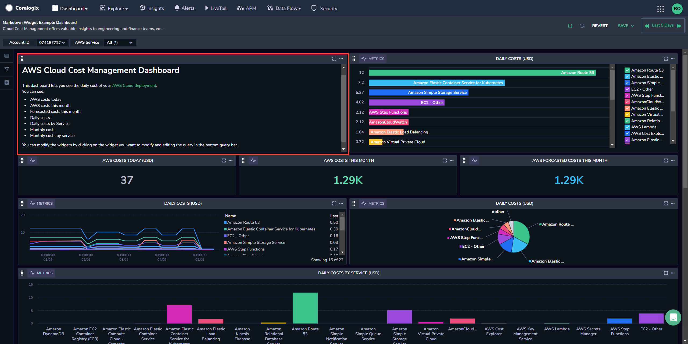
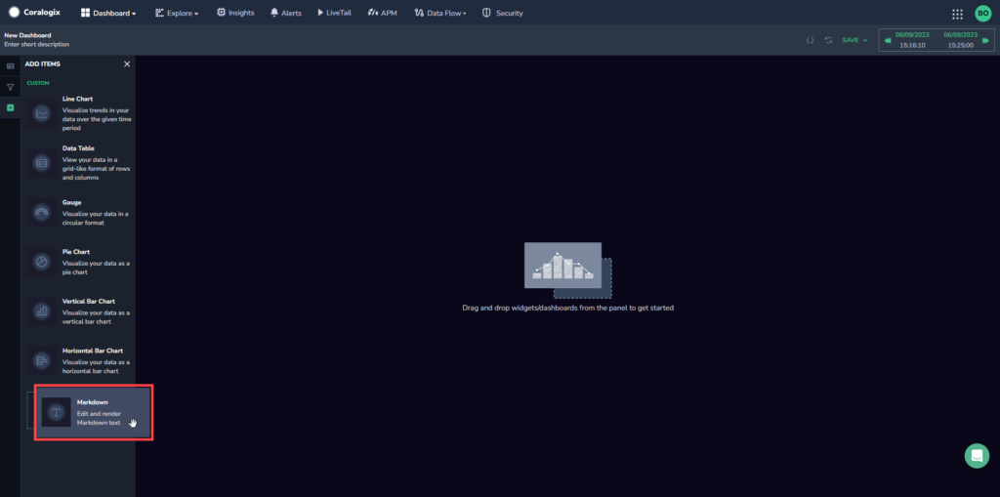
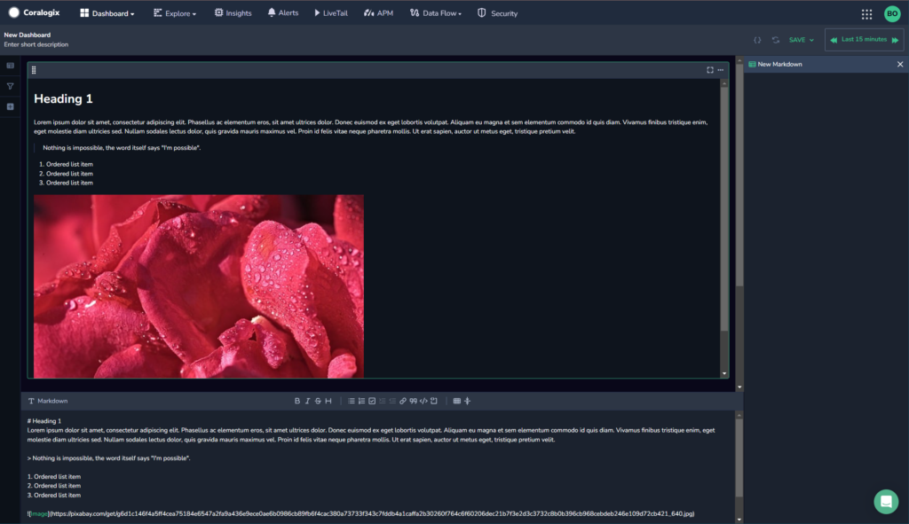
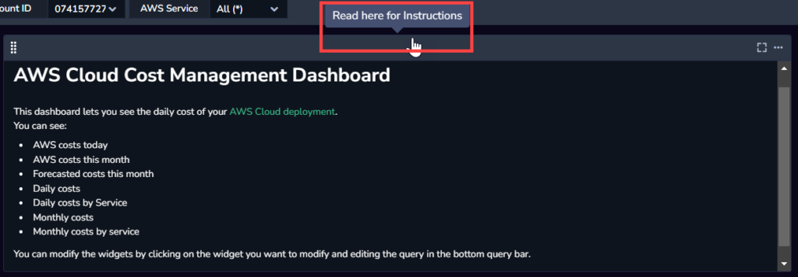

As part of our [Custom Dashboard](https://coralogixstg.wpengine.com/docs/custom-dashboards/) capabilities, Coralogix offers a **Markdown Widget**. Add tables, lists, reference guides, links, code snippets, images, and more to customize, contextualize, and optimize your dashboards using Markdown syntax.

## Overview

Markdown is a lightweight markup language that allows users to format and structure plain text documents using a simple and intuitive syntax. By adding the **Markdown Widget** to your custom dashboards, you can easily add personalized context to your dashboards using straightforward symbols and conventions.

- Bookmark Coralogix features to drill deeper and find more insights.

- Add tables, lists, reference guides, links, code-snippets, images and more.

- Explain complicated syntax queries.

No prior knowledge of Markdown is required. You have the option to edit in Markdown or take advantage of the simplified WYSIWYG editor that converts your input to Markdown.

## Create a Markdown Widget

**STEP 1**. In a [custom dashboard](https://coralogixstg.wpengine.com/docs/custom-dashboards/), drag and drop the **Markdown** **Widget** from your left-hand side bar to get started.

**STEP 2.** Enter your Markdown content in the Markdown Widget.

The widget has two sections. The lower section allows you to edit in Markdown and contains a simplified WYSIWYG editor that is converted to Markdown.

The WYSIWYG editor includes the following options for editing Markdown:

- Bold

- Italics

- Strikethrough

- Heading/Normal text

- Bulleted list

- Numbered list

- Checkbox list

- Add Link

- Quote

- Code

- Code Block

- Add table

- Add divider

**STEP 3.** \[Optional\] Add any text to the tooltip to be shown when you hover over the widget title bar.

**STEP 4**. \[Optional\] If you want to save your dashboard with the new widget, click **SAVE** in the upper right hand corner.

## Additional Resources

<table><tbody><tr><td>Documentation</td><td><strong><a href="https://coralogixstg.wpengine.com/docs/custom-dashboards/">Custom Dashboards</a></strong> <strong><a href="http://www.coralogixstg.wpengine.com/docs/custom-dashboards-line-charts">Line Charts</a> <a href="http://www.coralogixstg.wpengine.com/docs/custom-dashboards-data-tables">Data Tables</a> <a href="http://www.coralogixstg.wpengine.com/docs/custom-dashboards-gauges">Gauges</a> <a href="http://www.coralogixstg.wpengine.com/docs/custom-dashboards-pie-charts">Pie Charts</a> <a href="http://www.coralogixstg.wpengine.com/docs/custom-dashboards-bar-charts">Vertical Bar Charts</a></strong> <a href="https://coralogixstg.wpengine.com/docs/horizontal-bar-charts/"><strong>Horizontal Bar Charts</strong></a></td></tr></tbody></table>

## Support

**Need help?**

Our world-class customer success team is available 24/7 to walk you through your setup and answer any questions that may come up.

Feel free to reach out to us **via our in-app chat** or by sending us an email at [support@coralogixstg.wpengine.com](mailto:support@coralogixstg.wpengine.com).
