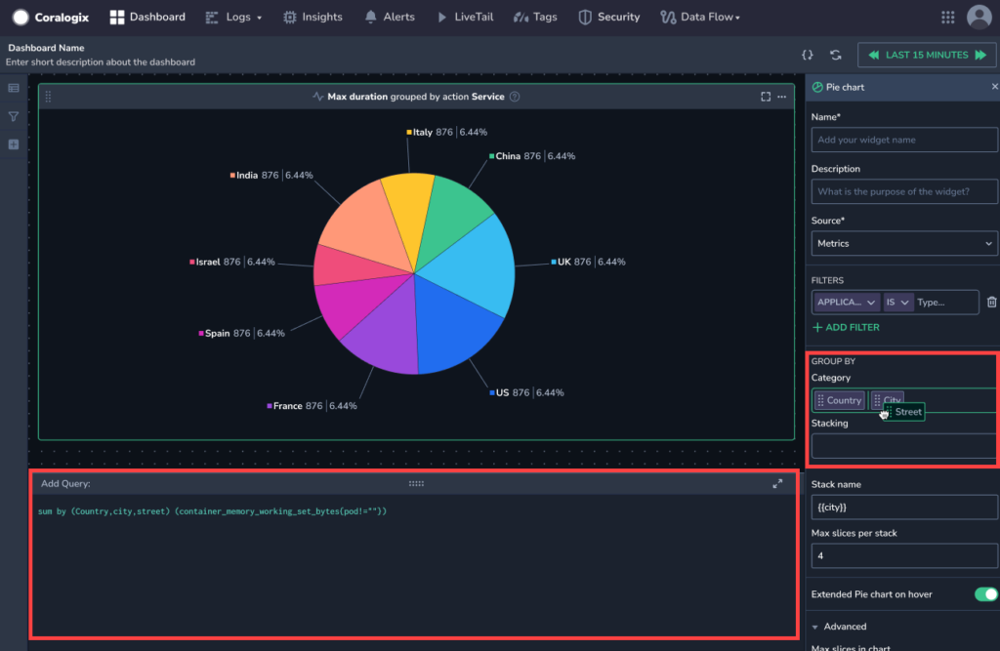
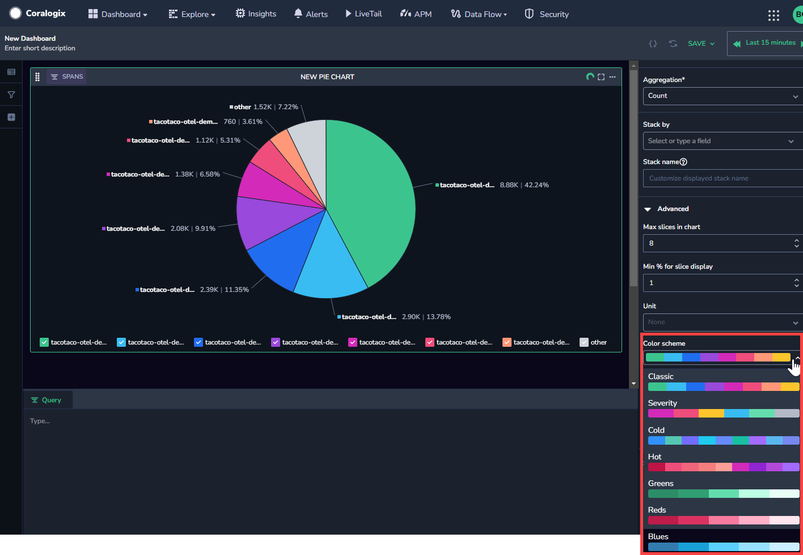
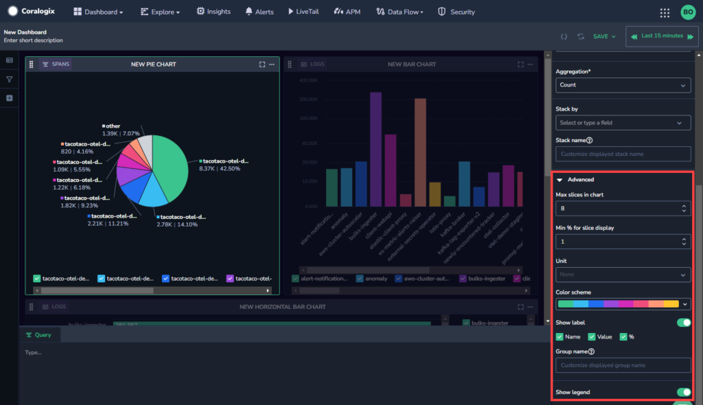

Create a customized pie chart visualization in [Custom Dashboards](https://coralogixstg.wpengine.com/docs/custom-dashboards/).

## Create a Pie Chart

**STEP 1**. Drag and drop the **Pie Chart** widget from the left-hand sidebar to get started.

**STEP 2**. Set the definitions for your Pie Chart in the right-hand sidebar.

- **Name & Description**. Create a name and description.

- **Load data from.** Select whether to load data from [Frequent Search](https://coralogixstg.wpengine.com/docs/optimize-log-management-costs/#frequent-search-data-high-priority) or [Monitoring](https://coralogixstg.wpengine.com/docs/optimize-log-management-costs/#monitoring-data-medium-priority).

- **Source**. Select a data type.
    - If the data type chosen is metrics, specify the metric or desired PromQL in the **Query** field. Use free text to search for a metric of your choice. As you do so, all relevant metrics will appear. Hover over any metric to view its system-generated metadata labels. Hover over a label to see its values.
        - When creating a pie chart with metrics as the data type, the categories specified in the PromQL query appear automatically in the Group By field. Within the Group By field, it is possible to reorder the categories by dragging and dropping.
        
        - Drag and drop categories from the **Category** field into the **Stacking** field, to stack by a particular category.
    
    - If the data type chosen is logs or spans, you will be directed to select an **Aggregation.**

- **\+ ADD FILTER.** \[Optional\] Add a filter to your pie chart.
    - As opposed to the dashboard filter in the left-hand sidebar which affects the entire dashboard, this filter only affects the widget.
    
    - The widget and dashboard filters operate in parallel to one another and intersect. If they negate one another, dashboard filters override widget filters.

- **Group By.** Select up to two fields from the dropdown menu.

- **Stack By.** Optionally select a field to stack the chart by. This shows you a second layer of data on the table.

- **Advanced.** Select from the following advanced options:
    - **Max slices in the chart.** Select the maximum number of slices to show in the pie chart.
    
    - **Minimum % for size display.** Set the minimum percentage required to display a slice
    
    - **Unit.** Select the units to display in the pie chart.
    
    - **Color Scheme.** Select the color scheme for your chart. You can choose between seven different color schemes.
    
    - 
    
    - **Show Label.** Select whether or not to show labels and which labels to show
    
    - **Group name.** Customize the group name
    
    - **Show legend.** Select whether or not to show the legend.

**STEP 3.** \[**Optional**\] If you want to save your dashboard for future use, click **SAVE** in the upper right-hand corner.

## Additional Resources

<table><tbody><tr><td>Documentation</td><td><strong><a href="https://coralogixstg.wpengine.com/docs/custom-dashboards/">Custom Dashboards</a></strong> <strong><a href="http://www.coralogixstg.wpengine.com/docs/custom-dashboards-line-charts">Line Charts</a> <a href="http://www.coralogixstg.wpengine.com/docs/custom-dashboards-data-tables">Data Tables</a> <a href="http://www.coralogixstg.wpengine.com/docs/custom-dashboards-gauges">Gauges</a></strong> <strong><a href="http://www.coralogixstg.wpengine.com/docs/custom-dashboards-bar-charts">Bar Charts</a></strong></td></tr></tbody></table>

## Support

**Need help?**

Our world-class customer success team is available 24/7 to walk you through your setup and answer any questions that may come up.

Feel free to reach out to us **via our in-app chat** or by sending us an email at [support@coralogixstg.wpengine.com](mailto:support@coralogixstg.wpengine.com).
