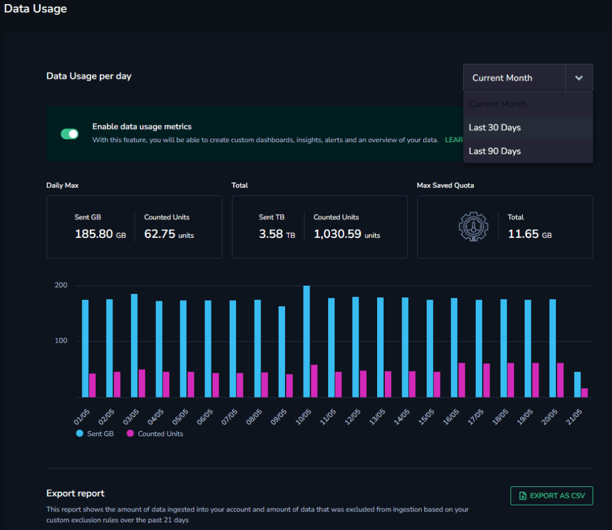
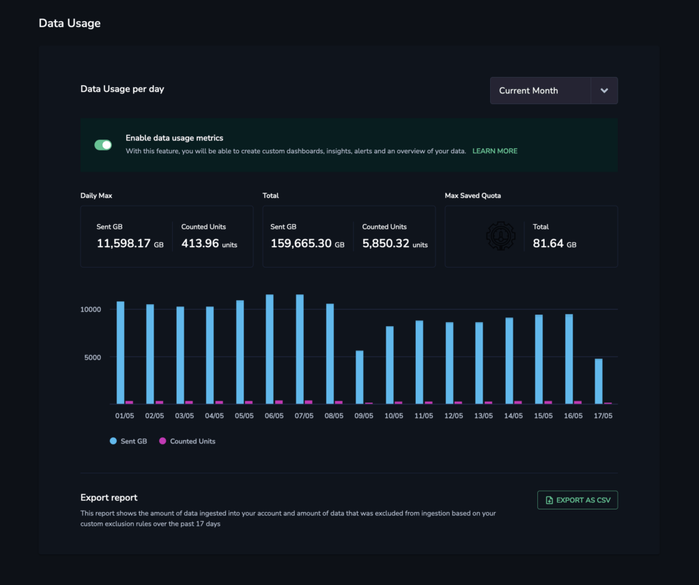

Enable **Data Usage Metrics** for an added layer of granularity in your [data usage](http://coralogixstg.wpengine.com/docs/data-usage/) overview. Use this feature to create custom dashboards, insights, alerts, and useful summaries of your data.

## Overview

The Data Usage Metrics feature creates three new metrics: GB Sent, Counted Units, and Daily Quota. These metrics are counted towards your team’s daily metrics quota. With these new metrics, you will be able to create custom dashboards, insights, alerts, and an overview of your data.

## Enabling Data Usage Metrics

Enable the data usage metrics feature after having [configured your s3 metrics bucket](https://coralogixstg.wpengine.com/docs/archive-s3-bucket-forever/).

Once enabled, Coralogix begins an auto-populate process to provide data for the past 24 hours. This process may take up to two hours.

**STEP 1.** In the navigation bar, click **Settings** > **Data Usage**.

**STEP 2.** On the Data Usage page, toggle **Enable data usage metrics**.

- If you do not have a required S3 metrics bucket configured, the toggle will be disabled.

**STEP 3.** View your new data usage metrics using our [custom dashboards](https://coralogixstg.wpengine.com/docs/custom-dashboards/). Metric names will appear as:

- `cx_data_usage_units` 

- `cx_data_usage_bytes_total`

- `cx_data_plan_units_per_day`

**Step 4.** Use the data usage metrics to define useful alerts to monitor your data consumption and quota.

## Labels

The information gathered on the new metrics includes the following labels:

<table><tbody><tr><td><strong>Label</strong></td><td><strong>Description</strong></td></tr><tr><td><code>pillar</code></td><td>Type of traffic (logs, spans, metrics) in each data point</td></tr><tr><td><code>subsystem_name</code></td><td>Subsystem that generated the traffic (used by the logs and spans pillars)</td></tr><tr><td><code>application_name</code></td><td>Application that generated the traffic (used by the logs and spans pillars)</td></tr><tr><td><code>priority</code></td><td>TCO priority (high, medium, low, blocked)</td></tr><tr><td><code>severity</code></td><td>Log severity (critical, error, warn, info, debug, trace) used by the logs pillar</td></tr><tr><td><code>blocking_reason</code>_type</td><td>The reason why traffic was blocked. The value can be either <code>tco_policy</code>&nbsp;or <code>parsing_rule</code>.</td></tr><tr><td><code>blocking_reason_name</code></td><td>The name of the TCO policy or parsing rule which is blocking traffic.</td></tr></tbody></table>

## Additional Resources

<table><tbody><tr><td><strong>API</strong></td><td><a href="https://coralogixstg.wpengine.com/docs/data-usage/">Data Usage</a> <a href="https://coralogixstg.wpengine.com/docs/data-usage-service-api/">Data Usage Service API</a></td></tr></tbody></table>

## **Support**

**Need help?**

Our world-class customer success team is available 24/7 to walk you through your setup and answer any questions that may come up.

Feel free to reach out to us **via our in-app chat** or by sending us an email at [support@coralogixstg.wpengine.com](mailto:support@coralogixstg.wpengine.com).
