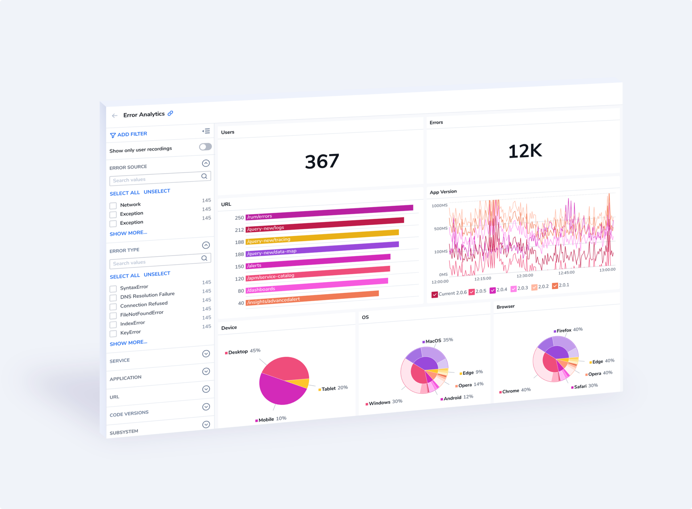
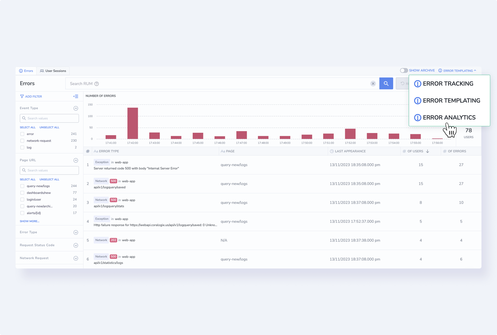
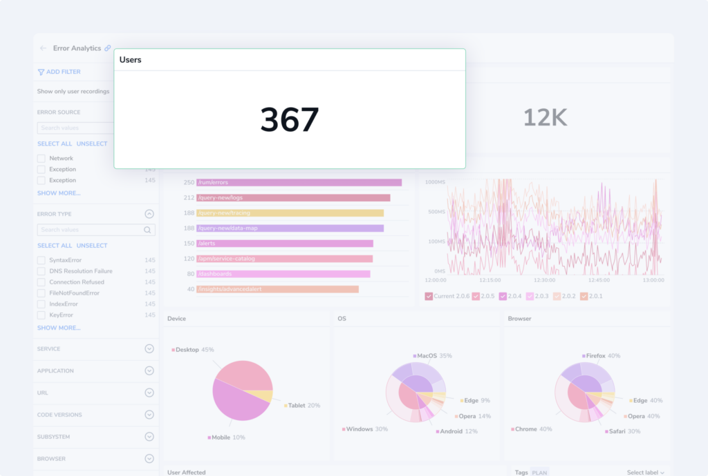
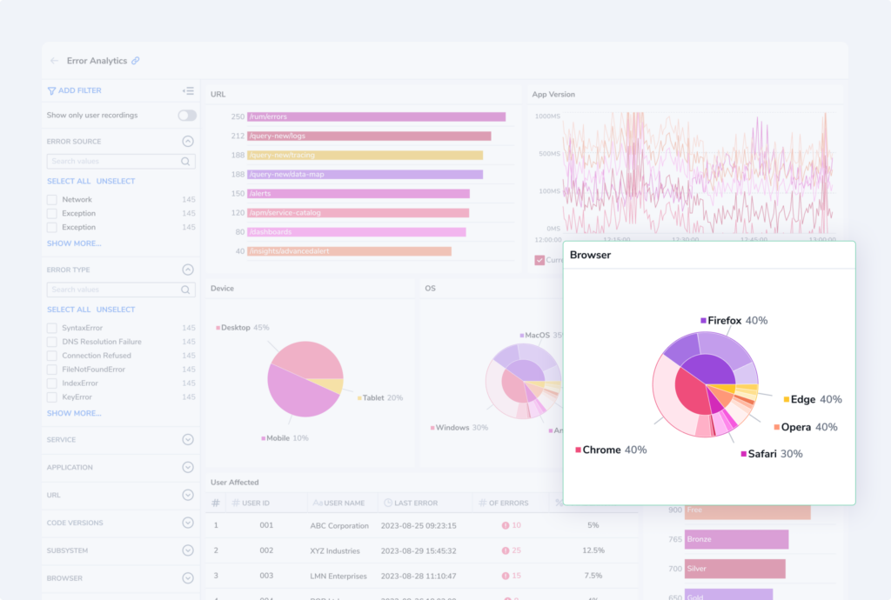
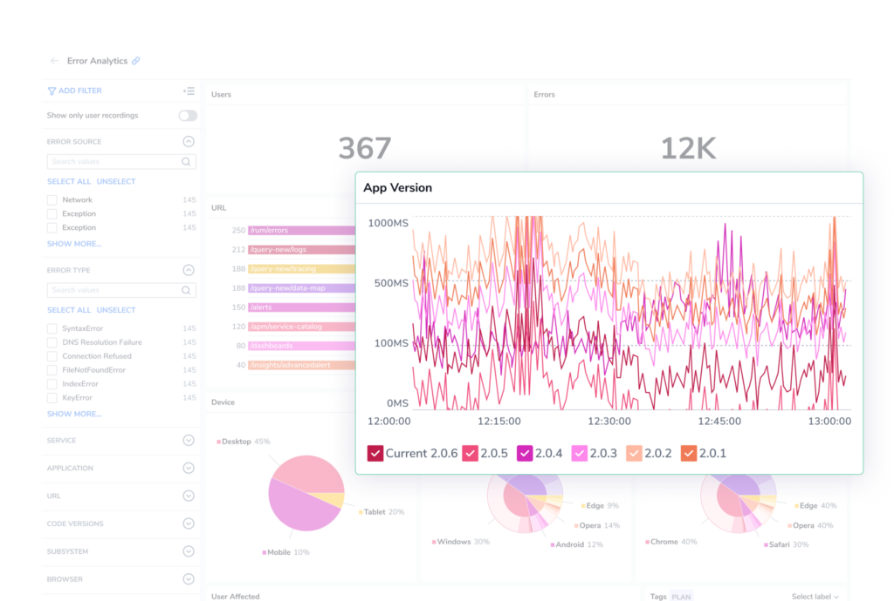
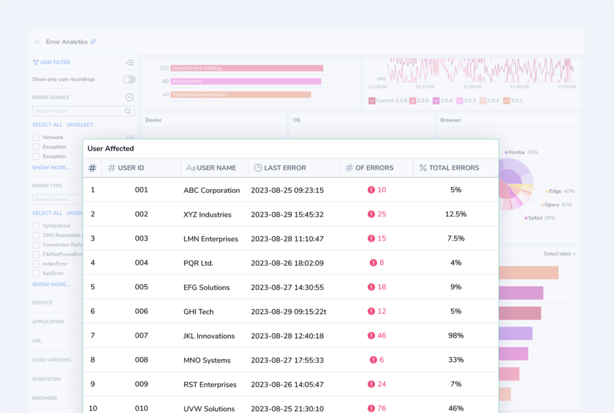

**Error Analytics** in [Real User Monitoring](https://coralogixstg.wpengine.com/docs/real-user-monitoring/) (RUM) offers a powerful, at-a-glance [view of error data](https://coralogixstg.wpengine.com/docs/error-tracking/), providing users with comprehensive insights into error occurrences within their web applications. By breaking down error data into different dimensions such as device, operating system, browser, URL, users affected, app version, and custom log labels, Error Analytics allows you to quickly identify the sources of issues and effectively prioritize your efforts. These visualizations not only streamline the troubleshooting process but also enable you to improve user experience, make data-driven decisions, and take proactive measures to minimize errors.

## Benefits

Use Error Analytics to enjoy these benefits:

- **Granular Error Insights**. Error Analytics provides detailed visualizations that break down error data into various dimensions, such as device, OS, browser, URL, users affected, app version, and log labels. This granular level of insight allows users to pinpoint the specific factors contributing to errors.

- **Faster Troubleshooting**. By categorizing errors based on these dimensions, users can quickly identify the common denominators associated with errors. This accelerates the troubleshooting process, making it easier to isolate the root causes and resolve issues promptly.

- **Optimized User Experience**. Understanding which devices, browsers, or OS versions are most susceptible to errors helps in optimizing the user experience. Users can prioritize development efforts to ensure compatibility with the most commonly used platforms.

- **User-Centric Insights**. Error data broken down by users affected provides a user-centric perspective. This enables teams to focus on issues impacting a larger number of users, enhancing user satisfaction and loyalty.

## Get Started

**STEP 1**. Once you have [installed our Browser SDK](https://www.notion.so/RUM-Browser-SDK-Installation-Guide-10fb53e3d7f84e42af89e356027aaf89?pvs=21), in your Coralogix toolbar, navigate to **RUM** > **Browser Error Tracking**.

**STEP 2**. Access Error Analytics by clicking on **ANALYTICS** on the top of your Error Screen.

Alternatively, view analytics in [Error Template View](https://coralogixstg.wpengine.com/docs/error-template-view/), where similar errors with shared attributes are grouped into a single template for swift and easy analysis. Here you will find analytics only for a particular template.

## Error Analytics Screen

Error Analytics presents detailed visualizations that break down error data into various dimensions, such as device, OS, browser, URL, users affected, app version, and log labels. These visualizations are presented for all front-end errors or those from a particular [error template](https://coralogixstg.wpengine.com/docs/error-template-view/).

The Error Analytics screen includes:

- **KPIs.** Key performance indicators, including number of errors and users affected.

- **Device Pie Chart**. View a break down of errors per device by hovering over the inner part of the pie chart. Hover over the outer section to view errors per device version.

- **OS Pie Chart**. View a break down of errors per operating system by hovering over the inner part of the pie chart. Hover over the outer section to view errors per OS version.

- **Browser Pie Chart**. View a break down of errors per browser by hovering over the inner part of the pie chart. Hover over the outer section to view errors per browser version.

- **URL Grid.** View a break down of errors per URL.

- **App Version Line Chart**. View a break down of errors per app version.

- **Users Affected Grid**. This grid presents you with comprehensive data of the users affected by errors, including user ID and email, last error encountered, number of errors, and percentage of total errors encountered by the user.

- **Labels Bar Graph**. Customize your analytics by selecting up to six log labels by which to organize errors. Labels may include [application and subsystem labels](https://coralogixstg.wpengine.com/docs/application-and-subsystem-names/), for example.

## Additional Resources

<table><tbody><tr><td>Documentation</td><td><strong><a href="https://coralogixstg.wpengine.com/docs/error-tracking/">Error Tracking</a></strong></td></tr></tbody></table>

## Support

**Need help?**

Our world-class customer success team is available 24/7 to walk you through your setup and answer any questions that may come up.

Feel free to reach out to us **via our in-app chat** or by sending us an email at [support@coralogixstg.wpengine.com](mailto:support@coralogixstg.wpengine.com).
