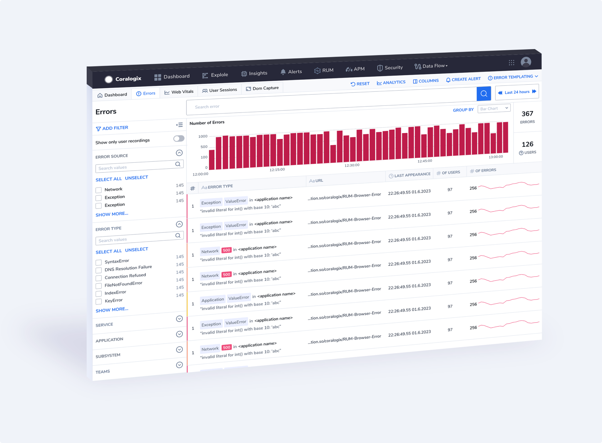
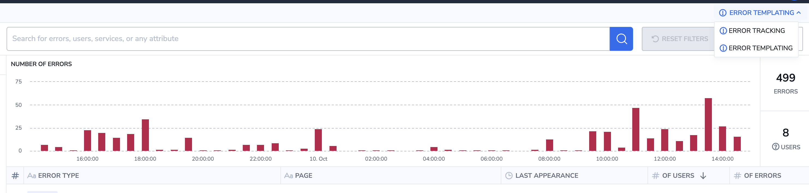
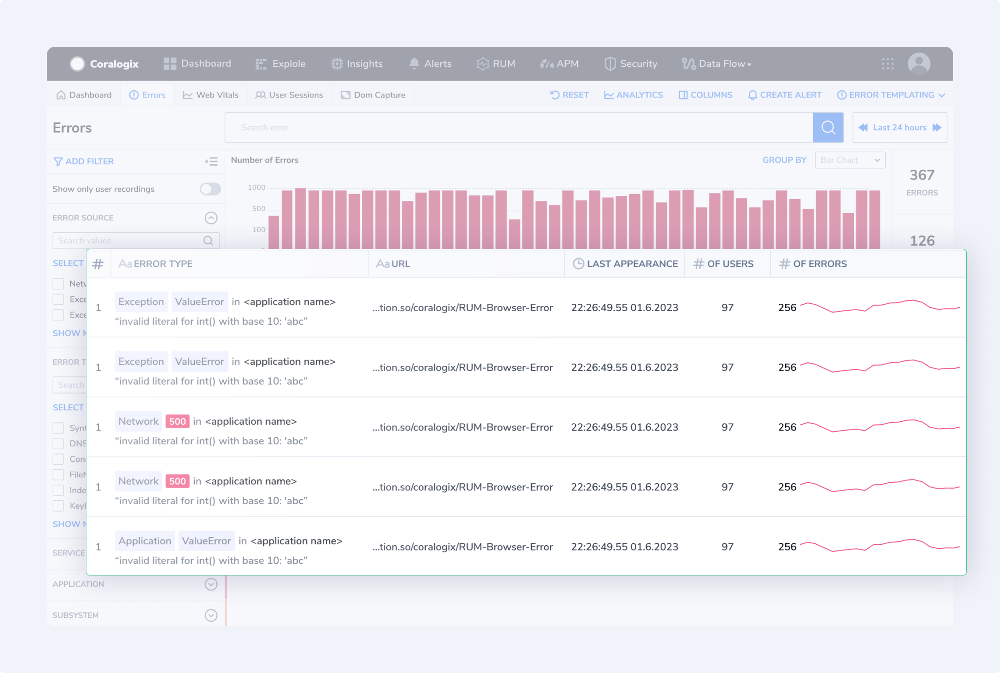

As part of our multi-faceted [Error Tracking](https://coralogixstg.wpengine.com/docs/error-tracking/), take advantage of the **Error Template View**, where similar errors with shared attributes are grouped into a single template for swift and easy analysis.

## Overview

Grouping errors as part of [Real User Monitoring](https://coralogixstg.wpengine.com/docs/real-user-monitoring/) is a strategic approach to managing and improving the quality of your digital services. It enhances your ability to diagnose issues, prioritize fixes, optimize performance, and ultimately deliver a better user experience. By understanding the nature and impact of errors, you can make informed decisions to enhance the reliability and performance of your website or application.

Error Template View provides you with an overview of all the errors generated from your browser, grouped by templates on the basis of the error source. View the error type, URL, last appearance, number of users the error affects, and the number of times the error occurred. Filter according to your needs.

## Access Error Template View

Access Error Template View by clicking on the drop-down menu in the upper-right corner of your [Error Tracking UI](https://coralogixstg.wpengine.com/docs/error-tracking-user-manual/). Move between between ERROR TEMPLATING (grouped errors) and ERROR TRACKING (individual errors).

## Error Template View Components

Error Template View includes:

- **Error Overall Graph and KPIs.** This graph presents the error trend in the application, in addition to the overall number of errors and users affected.

- **Template Grid.** Use the error template grid to view error template information, row by row. Modify columns and the information presented based on your specific interests. Clicking on a specific template will take you to the analytics view, where you can see the distribution of the error.

- **Filters.** Refine your view by filtering templates according to particular error attributes.

- **Alerts**. Create alerts directly from this screen by clicking **CREATE ALERT** in the upper right-hand corner.

## Error Attributes

Front-end errors are collected in groups on the basis of their source. For each source, particular attributes are displayed.

| SOURCE TYPE ERROR | ATTRIBUTES |
| --- | --- |
| `Exception` | • Error Type  
• Error Message (log message)  
• Page URL (fragment)  
• Application |
| `Custom` | • Error Message (log message)  
• Page URL (fragment)  
• Application |
| `Network` | • Network Request  
• Status Code  
• Page URL (fragment)  
• Application |

Source type error attributes are explained below.

| ATTRIBUTES | DESCRIPTION |
| --- | --- |
| Error Type | Describes the general category or class of the error, helping to group similar errors together, e.g., database connection error, file not found, etc. |
| Error Message | A concise description of the specific error instance, often including details like error codes or messages that provide context for the issue. |
| Page URL | This is a portion of the URL associated with the web page or application where the error occurred, helping to pinpoint the location of the problem. |
| Network Request | Pertains to the type of network request (e.g., HTTP GET, POST) that triggered the error, aiding in identifying the source of network-related issues. |
| Status Code | Indicates the HTTP status code associated with the network error (e.g., 404 for “Not Found” or 500 for “Internal Server Error”). |
| Application | Specifies the particular application or component within your system that generated the error, helping to isolate the source of the issue in a multi-application environment. |

For example, you might have a template where all the errors have **`TypeError`**, with **message r.match is not a function**, in **URL example.com/yourproduct/**. Resolving this template would enable you to remove the entire group of errors from the system.

## Additional Resources

<table><tbody><tr><td>Documentation</td><td><strong><a href="https://coralogixstg.wpengine.com/docs/error-tracking-user-manual/">Error Tracking: User Manual</a></strong></td></tr></tbody></table>

## Support

**Need help?**

Our world-class customer success team is available 24/7 to walk you through your setup and answer any questions that may come up.

Feel free to reach out to us **via our in-app chat** or by sending us an email at [support@coralogixstg.wpengine.com](mailto:support@coralogixstg.wpengine.com).
